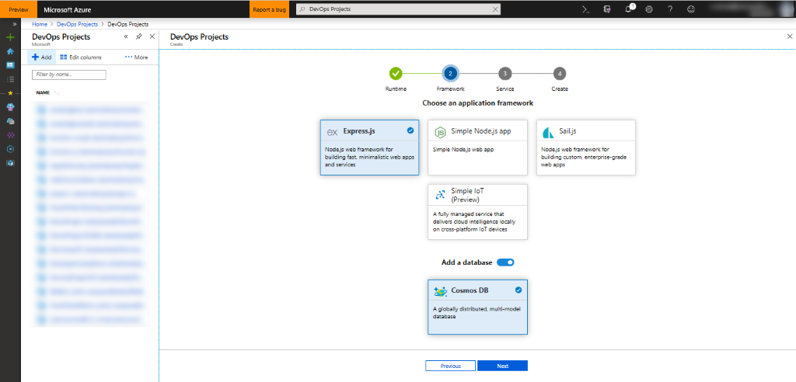
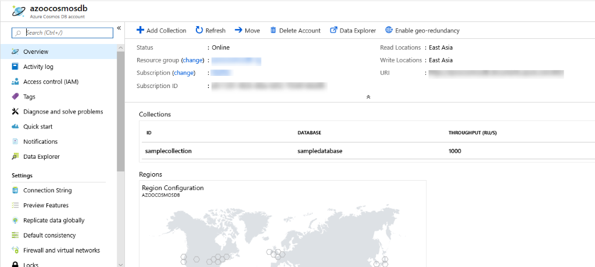
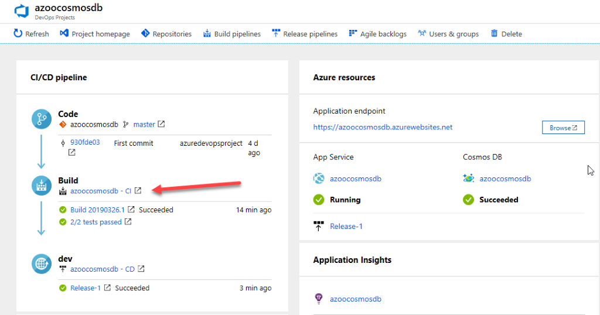

# Quickly get started with Azure Cosmos DB using Azure DevOps Projects

[Azure Cosmos DB](https://docs.microsoft.com/en-us/azure/cosmos-db/) is a globally distributed database service that's designed to provide low latency, elastic scalability of throughput, well-defined semantics for data consistency, and high availability. It provides five APIs to suit the needs of your application:  

- SQL

- Gremlin

- MongoDB

- Azure Table

- Cassandra

[Azure DevOps Projects](https://azure.microsoft.com/en-in/features/devops-projects/) makes it easy for you to set up a fully functional DevOps pipeline tailored to the language of development and application platform that you want to use.  

In this workshop, a two-tier Node.js application backed by Azure Cosmos DB will be created in just a few clicks.  

Azure DevOps Projects creates:

- Azure resources, such as Azure Cosmos DB, Application Insights, App Service and App Service plan

- And configures a release pipeline in Azure DevOps for CI/CD

## Prerequisites

- An Azure subscription. You can get one free through [Visual Studio Dev Essentials](https://visualstudio.microsoft.com/dev-essentials/)

## Lab Guides

It is recommended to complete the labs in the order specified below-

1. Create DevOps Projects for Node.js app powered by Azure Cosmos DB

1. Configure Azure DevOps and an Azure subscription

1. Examine the Azure Cosmos DB

1. Examine the CI pipeline

1. Examine the CD pipeline

1. Commit the changes to Git and automatically deploy them to Azure

1. Clean up the resources

## Creating DevOps Projects for Node.js app powered by Azure Cosmos DB

In this lab, you will create a 2-tier app - front end in Node.js and backend in CosmosDB plugged and configured in your Azure DevOps project.

DevOps Projects creates Azure resources, such as Azure Cosmos DB, Application Insights, App Service and App Service plan, in the Azure subscription of your choice. DevOps Projects also creates a CI/CD pipeline in [Azure Pipelines](https://docs.microsoft.com/en-us/azure/devops/pipelines/index?view=azure-devops). You can create a new Azure DevOps organization or use an existing organization.

**Exercise 1:** Log in to the Azure Portal

1. Sign in to the [Azure Portal](https://portal.azure.com/) in a new window.

1. You may be prompted to start a tour of the Azure portal once you've logged in. This step can be safely skipped.

**Exercise 2:** Create DevOps Projects

1. Select the **Create a resource** section in the left pane.

1. Type **DevOps Projects** in the search box and then select **Add**.

   

1. Choose **Node.js** as the runtime, then choose **Next**. Select **Express.js** under **Choose an application framework**.

1. Activate the **Add a Cosmos DB** database section and select Next.

   

   Cosmos DB supports various application frameworks like **Express.js**, **Sample Node.js app**, and **Sail.js**. In this tutorial, let’s consider **Express.js**.

1. To deploy the application, select an Azure service. You have various services like Windows Web App, Kubernetes Service and Web App for Containers. We're going to use **Windows Web App** for this tutorial.  Select on **Next**.

## Configure Azure DevOps and an Azure subscription

1. Enter the name of your Azure DevOps project.

1. Create a new Azure DevOps organization, or select an existing organization.

1. Select your Azure subscription.

1. To view additional Azure configuration settings and to identify the pricing tier and location, select on Additional settings. This pane shows different options for configuring the pricing tier and location of Azure services.

1. Exit the Azure configuration area, and then select **Done**.

1. The process is finished after a few minutes. A sample Node.js app is set up in your Azure DevOps organization’s Git repo, Azure Cosmos DB, App Service, App Service plan and Application Insights are created, a CI/CD pipeline is executed, and your app is deployed to Azure.

   The Azure DevOps Project dashboard will be displayed in the Azure portal after all this is completed. You can also go directly from **All resources** on the Azure portal to the DevOps Projects dashboard.

   This dashboard gives visibility to your Azure DevOps code repository, your CI/CD pipeline, and your Azure Cosmos DB. In your Azure DevOps pipeline, you can configure additional CI/CD options. Select **Azure Cosmos DB** for viewing on the right.

## Examine the Azure Cosmos DB

Azure DevOps Projects creates and configures Azure Cosmos DB automatically that you can explore and customize.  

In this module,  

- An Azure Cosmos DB account will be created when the release is initiated

- Initial throughput volume (1000 RU/s) for your database will be set using request units

- Creates a sample database and collection in Azure Cosmos DB for MongoDB API

To familiarize yourself with the Cosmos DB, do the following:

1. Go to the DevOps Projects dashboard.

   

1. At the right, select the Cosmos DB. A pane opens for the Cosmos DB. From this view you can perform various actions such as operations monitoring and searching logs.

   

## Examine the CI pipeline

DevOps Projects automatically configures a CI/CD pipeline in your Azure DevOps organization. You can explore and customize the pipeline. To familiarize yourself with it, do the following:

1. Go to the DevOps Projects dashboard.

1. Select on the hyperlink under **Build**. A browser tab displays your new project's build pipeline.

   

1. Select **Edit**. You can examine the different tasks for your build pipeline in this pane. The build performs various tasks, such as obtaining source code from the Git repo, building the application, running unit tests, and publishing outputs that are used for deployments.

1. Select **Triggers**. DevOps Projects automatically creates a CI trigger, and every commit to the repo starts a new build. Optionally, branches can be included or excluded from the CI process.

1. Select **Retention**. You can specify policies to keep or remove a certain number of builds depending on your scenario.

1. At the top of the build pipeline, select the build pipeline name.

1. Change your build pipeline name to something more descriptive, then select **Save** from the **Save & queue** dropdown.

1. Select **History** under the name of your build pipeline. This pane shows an audit trail of your recent build changes. Azure DevOps monitors any changes made to the build pipeline, and allows you to compare versions.

## Examine the CD pipeline

DevOps Projects automatically creates and configures the necessary steps to deploy from your Azure DevOps organization to your Azure subscription. These steps include configuring an Azure service connection to authenticate Azure DevOps to your Azure subscription. The automation also creates a release pipeline, which provides the CD to Azure. To learn more about the release pipeline, do the following:

1. Navigate to the **Pipelines | Releases**.

1. Select on **Edit**.

1. Under **Artifacts**, select **Drop**. The build pipeline you examined in the previous steps produces the output that's used for the artifact.

1. At the right of the **Drop** icon, select **Continuous deployment trigger**. This release pipeline has enabled CD trigger, which executes a deployment every time a new build artifact is available. Optionally, you can disable the trigger so that your deployments require manual execution.

1. At the right, select the section **View releases** to display a history of releases.

1. Select on the release, which will display the pipeline. Select on any environment to check the release **Summary, Commits**, associated **Work Items**.

1. Select **Commits**. This view shows code commits that are associated with this deployment. Compare releases to view the commit differences between deployments.

1. Select **View Logs**. The logs contain useful information about the deployment process. You can view them both during and after deployments.

## Commit the changes to Git and automatically deploy them to Azure

**Note:** The following procedure tests the CI/CD pipeline by making a simple text change.

You're now ready to collaborate with a team on your app by using a CI/CD process that automatically deploys your latest work to your Azure Web App or Azure Cosmos DB. Each change to the Git repo starts a build in Azure DevOps, and a CD pipeline executes a deployment to Azure. Follow the procedure in this section or use another technique to commit changes to your repo. For example, you can clone the Git repo in your favourite tool or IDE, and then push changes to this repo.

1. In the Azure DevOps menu, select **Repos | Files**, and then go to your repo.

1. The repository already contains code based on the application language that you chose in the creation process. Open the **Application/views/index.pug** file.

1. Select **Edit**, and then make a change to **line number 15**. For example, you can update it to **My First deployment to Azure App Service powered by Azure Cosmos DB**

1. At the top right, select **Commit**, and then select **Commit** again to push your change.

1. Open the **Application/connectionData.json** file. Select **Edit** to provide the values for the **collectionName** and **databaseName.**

1. At the top right, select **Commit**, and then select **Commit** again to push your change.

1. After a few moments, a build starts in Azure DevOps and a release executes to deploy the changes. Monitor the build status on the DevOps Projects dashboard or in the browser with your Azure DevOps organization.

## Clean up resources

You can delete the related resources that you created when you don't need them anymore. Use the Delete functionality on the DevOps Projects dashboard.
