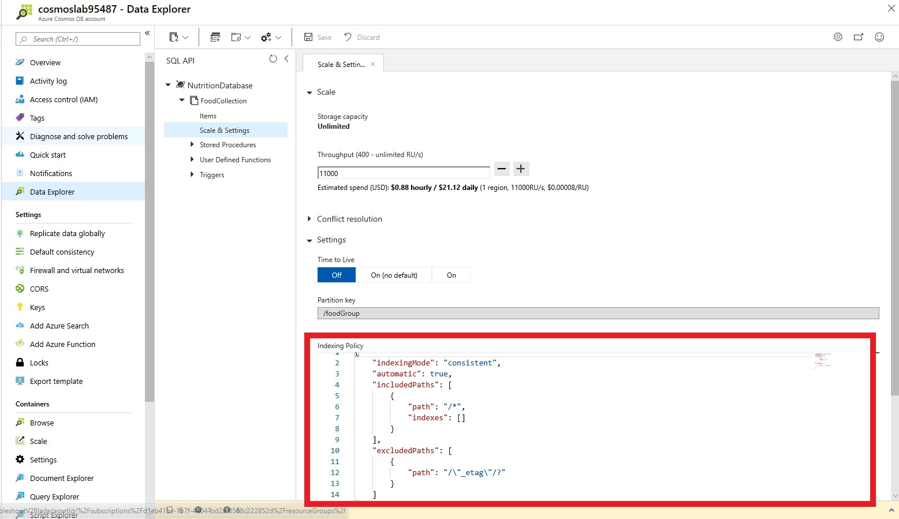
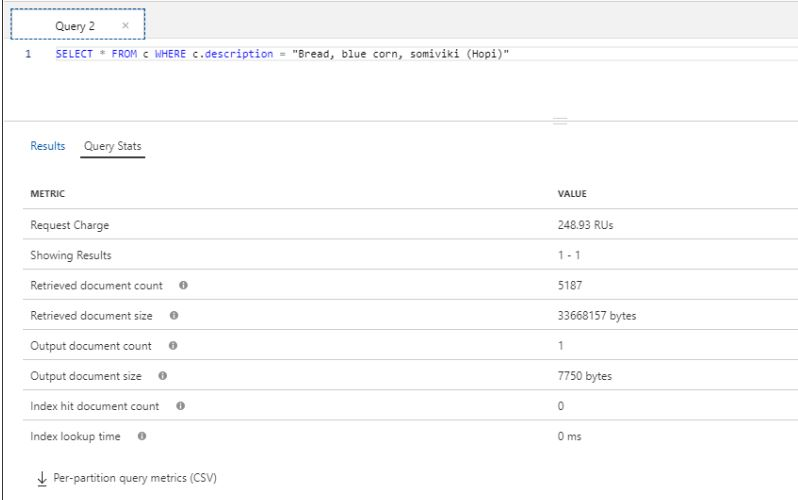

# Indexing in Azure Cosmos DB

In this lab, you will modify the indexing policy of an Azure Cosmos DB container. You will explore how you can optimize indexing policy for write or read heavy workloads as well as understand the indexing requirements for different SQL API query features.

> If this is your first lab and you have not already completed the setup for the lab content see the instructions for [Account Setup](00-account_setup.md) before starting this lab.

## Indexing Overview

Azure Cosmos DB is a schema-agnostic database that allows you to iterate on your application without having to deal with schema or index management. By default, Azure Cosmos DB automatically indexes every property for all items in your container without the need to define any schema or configure secondary indexes. If you chose to leave indexing policy at the default settings, you can run most queries with optimal performance and never have to explicitly consider indexing. However, if you want control over adding or removing properties from the index, modification is possible through the Azure Portal or any SQL API SDK.

Azure Cosmos DB uses an inverted index, representing your data in a tree form. For a brief introduction on how this works, read our [indexing overview](https://docs.microsoft.com/en-us/azure/cosmos-db/index-overview) before continuing with the lab.

## Customizing the indexing policy

In this lab section, you will view and modify the indexing policy for your **FoodCollection**.

### Open Data Explorer

1. On the left side of the portal, click the **Resource groups** link.

2. In the **Resource groups** blade, locate and select the **cosmoslabs** *Resource Group*.

3. In the **cosmoslabs** blade, select your **Azure Cosmos DB** account.

4. In the **Azure Cosmos DB** blade, locate and click the **Data Explorer** link on the left side of the blade.

5. In the **Data Explorer** section, expand the **NutritionDatabase** database node and then expand the **FoodCollection** container node.

6. Within the **FoodCollection** node, click the **Items** link.

7. View the items within the container. Observe how these documents have many properties, including arrays. If we do not use a particular property in the WHERE clause, ORDER BY clause, or a JOIN, indexing the property does not provide any performance benefit.

8. Still within the **FoodCollection** node, click the **Scale & Settings** link. In the **Indexing Policy** section, you can edit the JSON file that defines your container's index. Indexing policy can also be modified through any Azure Cosmos DB SDK, but during this lab we will modify the indexing policy through the Azure Portal.

   

### Including and excluding Range Indexes

Instead of including a range index on every property by default, you can chose to either include or exclude specific paths from the index. Let's go through some simple examples (no need to enter these into the Azure Portal, we can just review them here).

Within the **FoodCollection**, documents have this schema (some properties were removed for simplicity):

```json
{
    "id": "36000",
    "_rid": "LYwNAKzLG9ADAAAAAAAAAA==",
    "_self": "dbs/LYwNAA==/colls/LYwNAKzLG9A=/docs/LYwNAKzLG9ADAAAAAAAAAA==/",
    "_etag": "\"0b008d85-0000-0700-0000-5d1a47e60000\"",
    "description": "APPLEBEE'S, 9 oz house sirloin steak",
    "tags": [
        {
            "name": "applebee's"
        },
        {
            "name": "9 oz house sirloin steak"
        }
    ],

    "manufacturerName": "Applebee's",
    "foodGroup": "Restaurant Foods",
    "nutrients": [
        {
            "id": "301",
            "description": "Calcium, Ca",
            "nutritionValue": 16,
            "units": "mg"
        },
        {
            "id": "312",
            "description": "Copper, Cu",
            "nutritionValue": 0.076,
            "units": "mg"
        },
    ]
}
```

If you want to only index the manufacturerName, foodGroup, and nutrients array with a range index, you should define the following index policy:

```json
{
        "indexingMode": "consistent",
        "includedPaths": [
            {
                "path": "/manufacturerName/*"         
            },
            {
                "path": "/foodGroup/*"
            },
            {
                "path": "/nutrients/[]/*"
            }
        ],
        "excludedPaths": [
            {
                "path": "/*"
            }
        ]
    }
```

In this example, we use the wildcard character '*' to indicate that we would like to index all paths within the nutrients array. However, it's possible we may just want to index the nutritionValue of each array element.

In this next example, the indexing policy would explicitly specify that the nutritionValue path in the nutrition array should be indexed. Since we don't use the wildcard character '*', no additional paths in the array are indexed.

```json
{
        "indexingMode": "consistent",
        "includedPaths": [
            {
                "path": "/manufacturerName/*"
            },
            {
                "path": "/foodGroup/*"
            },
            {
                "path": "/nutrients/[]/nutritionValue/*"
            }
        ],
        "excludedPaths": [
            {
                "path": "/*"
            }
        ]
    }
```

Finally, it's important to understand the difference between the '*' and '?' characters. The '*' character indicates that Azure Cosmos DB should index every path beyond that specific node. The '?' character indicates that Azure Cosmos DB should index no further paths beyond this node. In the above example, there are no additional paths under nutritionValue. If we were to modify the document and add a path here, having the wildcard character '*'  in the above example would ensure that the property is indexed without explicitly mentioning the name.


### Understand query requirements

Before modifying indexing policy, it's important to understand how the data is used the collection. If your workload is write-heavy or your documents are large, you should only index necessary paths. This will significantly decrease the amount of RU's required for inserts, updates, and deletes.

Let's imagine that the following queries are the only read operations that are executed on the **FoodCollection** container.

**Query #1**

```sql
SELECT * FROM c WHERE c.manufacturerName = <manufacturerName>
```

**Query #2**

```sql
SELECT * FROM c WHERE c.foodGroup = <foodGroup>
```

These queries only require that a range index be defined on manufacturerName and foodGroup, respectively. We can modify the indexing policy to index only these properties.

### Edit the Indexing Policy

1. Navigate back to the **FoodCollection** in the Azure Portal and click the **Scale & Settings** link. In the **Indexing Policy** section, replace the existing json file with the following:

```json
{
        "indexingMode": "consistent",
        "includedPaths": [
            {
                "path": "/manufacturerName/*"
            },
            {
                "path": "/foodGroup/*"
            }
        ],
        "excludedPaths": [
            {
                "path": "/*"
            }
        ]
    }
```

This new indexing policy will create a range index on only the manufacturerName and foodGroup properties. It will remove range indexes on all other properties. Click **Save**. Azure Cosmos DB will update the index in the container, using your excess provisioned throughput to make the updates.

During the container re-indexing, write performance is unaffected. However, queries may return inconsistent results.

1. After defining the new indexing policy, navigate to your **FoodCollection** and select the **Add New SQL Query** icon. Paste the following SQL query and select **Execute Query**:

```sql
SELECT * FROM c WHERE c.manufacturerName = "Kellogg, Co."
```

Navigate to the **Query Stats** tab. You should observe that this query still has a low RU charge, even after removing some properties from the index. Because the manufacturerName was the only property used as a filter in the query, it was the only index that was required.

Now, replace the query text with the following and select **Execute Query**:

```sql
SELECT * FROM c WHERE c.description = "Bread, blue corn, somiviki (Hopi)"
```

You should observe that this query has a very high RU charge even though only a single document is returned. This is because no range index is currently defined for the `description` property.

Also observe the **Query Metrics** below:



If a query does not use the index, the **Index hit document count** will be 0. We can see above that the query needed to retrieve 5,187 documents and ultimately ended up only returning 1 document.

<h3> Obsolete Indexing Policy attributes</h3>

When working with indexing policies, you may encounter the following attributes that are now obsolete:

- `automatic` is a boolean defined at the root of an indexing policy. It is now ignored and can be set to `true`, when the tool you are using requires it.
- `precision` is a number defined at the index level for included paths. It is now ignored and can be set to `-1`, when the tool you are using requires it.
- `hash` is an index kind that is now replaced by the range kind.


## Adding a Composite Index

For ORDER BY queries that order by multiple properties, a composite index is required. A composite index is defined on multiple properties and must be manually created.

1. In the **Azure Cosmos DB** blade, locate and click the **Data Explorer** link on the left side of the blade.
2. In the **Data Explorer** section, expand the **NutritionDatabase** database node and then expand the **FoodCollection** container node.
3. Select the icon to add a **New SQL Query**. Paste the following SQL query and select **Execute Query**

```sql
    SELECT * FROM c ORDER BY c.foodGroup asc, c.manufacturerName asc
```

This query will fail with the following error:

```
"The order by query does not have a corresponding composite index that it can be served from."
```

In order to run a query that has an ORDER BY clause with one property, the default range index is sufficient. Queries with multiple properties in the ORDER BY clause require a composite index.

1. Still within the **FoodCollection** node, click the **Scale & Settings** link. In the **Indexing Policy** section, you will add a composite index.

Replace the **Indexing Policy** with the following text:

```json
{
    "indexingMode": "consistent",
    "automatic": true,
    "includedPaths": [
        {
            "path": "/manufacturerName/*"
        },
        {
            "path": "/foodGroup/*"
        }
    ],
    "excludedPaths": [
        {
            "path": "/*"
        },
        {
            "path": "/\"_etag\"/?"
        }
    ],
    "compositeIndexes": [
        [
            {
                "path": "/foodGroup",
                "order": "ascending"
            },
            {
                "path": "/manufacturerName",
                "order": "ascending"
            }
        ]
    ]
}
```

1. **Save** this new indexing policy. The update should take approximately 10-15 seconds to apply to your container.

This indexing policy defines a composite index that allows for the following ORDER BY queries. Test each of these by running them in your existing open query tab in the **Data Explorer**.

```sql
    SELECT * FROM c ORDER BY c.foodGroup asc, c.manufacturerName asc
    SELECT * FROM c ORDER BY c.foodGroup desc, c.manufacturerName desc
```

Now, try to run the following query, which the current composite index does not support.

```sql
    SELECT * FROM c ORDER BY c.foodGroup desc, c.manufacturerName asc
```

This query will not run without an additional composite index. You can modify the indexing policy to include an additional composite index.

```json
{
    "indexingMode": "consistent",
    "automatic": true,
    "includedPaths": [
        {
            "path": "/manufacturerName/*"
        },
        {
            "path": "/foodGroup/*"
        }
    ],
    "excludedPaths": [
        {
            "path": "/*"
        },
        {
            "path": "/\"_etag\"/?"
        }
    ],
    "compositeIndexes": [
        [
            {
                "path": "/foodGroup",
                "order": "ascending"
            },
            {
                "path": "/manufacturerName",
                "order": "ascending"
            }
        ],
        [
            {
                "path": "/foodGroup",
                "order": "descending"
            },
            {
                "path": "/manufacturerName",
                "order": "ascending"
            }
        ]
    ]
}
```

You should now be able to run the query. After completing the lab, you can [learn more about defining composite indexes](https://docs.microsoft.com/en-us/azure/cosmos-db/how-to-manage-indexing-policy#composite-indexing-policy-examples).

## Adding a spatial index

### Create a new container with volcano data

First, you will create a new Cosmos container named volcanoes inside a new database. Azure Cosmos DB supports querying of data in the GeoJSON format. During this lab, you will upload sample data to this container that is specified in this format. This volcano.json sample data is a better fit for geo-spatial queries than our existing nutrition dataset. The dataset contains the coordinates and basic information for many volcanoes around the world.

For this lab, we will only need to upload a few sample documents.

1. In the **Azure Cosmos DB** blade, locate and click the **Data Explorer** link on the left side of the blade.

2. Select the icon to add a **New Container**

3. In the **Add Container** popup, perform the following actions:

   1. In the **Database id** field, select the **Create new** option and enter the value **VolcanoDatabase**.

   2. Ensure the **Provision database throughput** option is not selected.

      > Provisioning throughput for a database allows you to share the throughput among all the containers that belong to that database. Within an Azure Cosmos DB database, you can have a set of containers which shares the throughput as well as containers, which have dedicated throughput.

   3. In the **Container Id** field, enter the value **VolcanoContainer**.

   4. In the **Partition key** field, enter the value ``/Country``.

   5. In the **Throughput** field, enter the value ``5000``.

   6. Click the **OK** button.

### Upload Sample Data

When you upload sample data, Azure Cosmos DB will automatically create a geo-spatial index for any GeoJSON data with the types "Point", "Polygon", or "LineString".

1. Navigate back to the **VolcanoesContainer** in the Azure Portal and click the **Items** section.
2. Select **Upload Item**
3. In the popup, navigate to the volcano.json file. This file is available [here](../setup/VolcanoData.json). If you followed the prelab steps, you already downloaded this file in your **setup** folder.

### Create geo-spatial indexes in the **Volcanoes** container

1. Navigate back to the **VolcanoesContainer** in the Azure Portal and click the **Scale & Settings** link. In the **Indexing Policy** section, replace the existing json file with the following:

```json
{
    "indexingMode": "consistent",
    "automatic": true,
    "includedPaths": [
        {
            "path": "/*"
        }
    ],
    "excludedPaths": [
        {
            "path": "/\"_etag\"/?"
        }
    ],
    "spatialIndexes": [
        {
            "path": "/*",
            "types": [
                "Point",
                "Polygon",
                "LineString"
            ]
        }
    ]
}
```

Geo-spatial indexing is by default, disabled. This indexing policy will turn on geo-spatial indexing for all possible GeoJSON types which include Points, Polygons, and LineStrings. Similar to range indexes and composite indexes, there are no precision settings for geo-spatial indexes.

[Learn more about querying geo-spatial data in Azure Cosmos DB](https://docs.microsoft.com/en-us/azure/cosmos-db/geospatial#introduction-to-spatial-data).

### Query the Volcano Data

1. Navigate back to the **VolcanoesContainer** in the Azure Portal and click the **New SQL Query**. Paste the following SQL query and select **Execute Query**.

```sql
SELECT *
FROM volcanoes v
WHERE ST_DISTANCE(v.Location, { 
	"type": "Point", 
	"coordinates": [-122.19, 47.36] 
	}) < 100 * 1000
AND v.Type = "Stratovolcano"
AND v["Last Known Eruption"] = "Last known eruption from 1800-1899, inclusive"
```

1. Observe the **Query Stats** for this operation. Because the container has a geo-spatial index for Points, this query consumed a small amount of RU's.

> This query returns all the Stratovolcanoes that last erupted between 1800 and 1899 that are within 100 km of the coordinates (122.19, 47.36). These are the coordinates of Redmond, WA.

### Query sample polygon data

If you specify points within a Polygon in a counter-clockwise order, you will define the area within the coordinates as the polygon area. A Polygon specified in clockwise order represents the inverse of the region within it.

We can explore this concept through sample queries.

1. Navigate back to the **VolcanoesContainer** in the Azure Portal and click the **New SQL Query**. Paste the following SQL query and select **Execute Query**. 

```sql
SELECT *
FROM volcanoes v
WHERE ST_WITHIN(v.Location, {
    "type":"Polygon",
    "coordinates":[[
        [-123.8, 48.8],
        [-123.8, 44.8],
        [-119.8, 44.8],
        [-119.8, 48.8],
        [-123.8, 48.8]
    ]]
    })
```

1. In this case, there are 8 volcanoes located within this rectangle.
2. In the *Query Editor* replace the text with the following query:

```sql
SELECT *
FROM volcanoes v
WHERE ST_WITHIN(v.Location, {
    "type":"Polygon",
    "coordinates":[[
        [-123.8, 48.8],
        [-119.8, 48.8],
        [-119.8, 44.8],
        [-123.8, 44.8],
        [-123.8, 48.8]
    ]]
    })
```

1. You should now see many items returned. There are thousands of volcanoes located outside our small rectangle region.

When creating a GeoJSON polygon, whether it be inside a query or item, the order of the coordinates specified matters. Azure Cosmos DB will not reject coordinates that indicate the inverse of a polygon's shape. In addition, GeoJSON requires that you specify coordinates in the format: (latitude, longitude).

## Lab Cleanup

### Restoring the **FoodCollection** Indexing Policy

You should restore the **FoodCollection** indexing policy to the default setting where all paths are indexed. 

1. In the **Azure Cosmos DB** blade, locate and click the **Data Explorer** link on the left side of the blade.
2. In the **Data Explorer** section, expand the **NutritionDatabase** database node and then expand the **FoodCollection** container node.
3. Within the **FoodCollection** node, click the **Scale & Settings** link. In the **Indexing Policy** section, replace the existing JSON file with the following:

```json
{
    "indexingMode": "consistent",
    "automatic": true,
    "includedPaths": [
        {
            "path": "/*"
        }
    ],
    "excludedPaths": [
        {
            "path": "/\"_etag\"/?"
        }
    ]
}
```

1. Select **Save** to apply these changes. This Indexing Policy is the same Indexing Policy as when we began the lab. It is required for subsequent labs.

### Delete the **VolcanoContainer**

You will not need the **VolcanoContainer** during additional lab sections. You should delete this container now.

1. Navigate to the **Data Explorer**
2. Select the three dots near your **VolcanoContainer**. From the menu, select **Delete Container**. 
3. Confirm the container's name and delete the container.
4. Close your browser window. You have now completed the indexing lab section.
