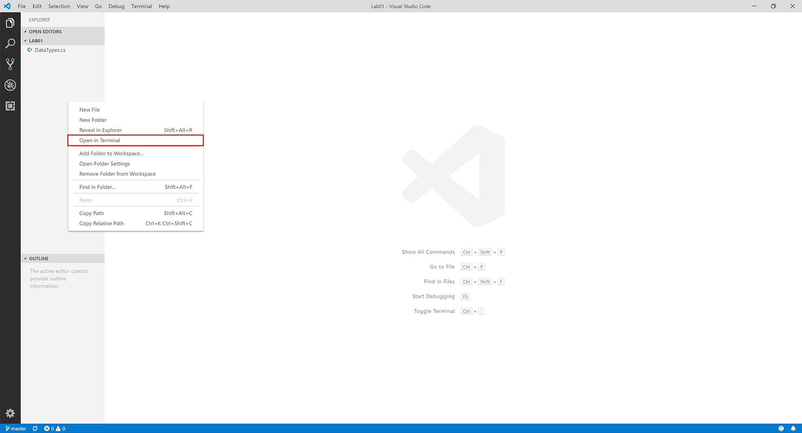
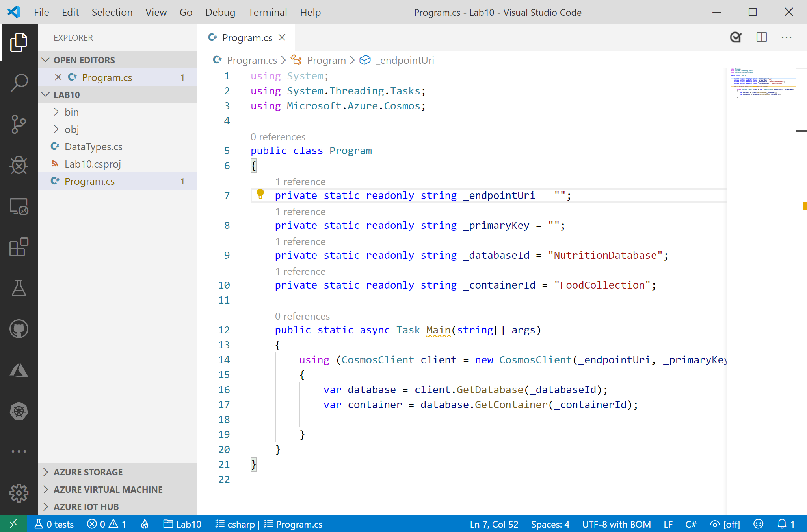

# Optimistic Concurrency Control

## Viewing the ETag Property of a Requested Resource

The SQL API supports optimistic concurrency control (OCC) through HTTP entity tags, or ETags. Every SQL API resource has an ETag, and the ETag is set on the server every time an item is updated. In this exercise, we will view the ETag property of a resource that is requested using the SDK.

> If this is your first lab and you have not already completed the setup for the lab content see the instructions for [Account Setup](00-account_setup.md) before starting this lab.

### Create a .NET Core Project

1. On your local machine, locate the CosmosLabs folder in your Documents folder and open the `Lab10` folder that will be used to contain the content of your .NET Core project. If you are completing this lab through Microsoft Hands-on Labs, the CosmosLabs folder will be located at the path: **C:\labs\CosmosLabs**

1. In the `Lab10` folder, right-click the folder and select the **Open with Code** menu option.

   > Alternatively, you can run a terminal in your current directory and execute the `code .` command.

1. In the Visual Studio Code window that appears, right-click the **Explorer** pane and select the **Open in Terminal** menu option.

   

1. In the terminal pane, enter and execute the following command:

   ```sh
   dotnet restore
   ```

   > This command will restore all packages specified as dependencies in the project.

1. In the terminal pane, enter and execute the following command:

   ```sh
   dotnet build
   ```

   > This command will build the project.

1. In the **Explorer** pane verify that you have a **DataTypes.cs** file in your project folder. This file contains the data classes you will be working with in the following steps.

1. Select the **Program.cs** link in the **Explorer** pane to open the file in the editor.

   

1. For the `_endpointUri` variable, replace the placeholder value with the **URI** value and for the `_primaryKey` variable, replace the placeholder value with the **PRIMARY KEY** value from your Azure Cosmos DB account. Use [these instructions](00-account_setup.md) to get these values if you do not already have them:

   - For example, if your **uri** is `https://cosmosacct.documents.azure.com:443/`, your new variable assignment will look like this: `private static readonly string _endpointUri = "https://cosmosacct.documents.azure.com:443/";`.

   - For example, if your **primary key** is `elzirrKCnXlacvh1CRAnQdYVbVLspmYHQyYrhx0PltHi8wn5lHVHFnd1Xm3ad5cn4TUcH4U0MSeHsVykkFPHpQ==`, your new variable assignment will look like this: `private static readonly string _primaryKey = "elzirrKCnXlacvh1CRAnQdYVbVLspmYHQyYrhx0PltHi8wn5lHVHFnd1Xm3ad5cn4TUcH4U0MSeHsVykkFPHpQ==";`.

1. Save all of your open editor tabs.

1. In the open terminal pane, enter and execute the following command:

   ```sh
   dotnet build
   ```

### Observe the ETag Property

1. Select the **Program.cs** link in the **Explorer** pane to open the file in the editor.

1. Locate the `using` block within the `Main` method:

   ```csharp
   using (CosmosClient client = new CosmosClient(_endpointUri, _primaryKey))
   {

   }
   ```

1. Add the following code to asynchronously read a single item from the container, identified by its partition key and id:

   ```csharp
   ItemResponse<Food> response = await container.ReadItemAsync<Food>("21083", new PartitionKey("Fast Foods"));
   ```

1. Add the following line of code to show the current ETag value of the item:

   ```csharp
   await Console.Out.WriteLineAsync($"ETag: {response.ETag}");
   ```

   > The ETag header and the current value are included in all response messages.

1. Save all of your open editor tabs.

1. In the open terminal pane, enter and execute the following command:

   ```sh
   dotnet run
   ```

1. Observe the output of the console application. You should see an ETag for the item.

1. Enter and execute the following command:

   ```sh
   dotnet run
   ```

1. Observe the output of the console application.

   > The ETag should remain unchanged since the item has not been changed.

1. Locate the `using` block within the `Main` method:

   ```csharp
   using (CosmosClient client = new CosmosClient(_endpointUri, _primaryKey))
   {
   }
   ```

1. Within the `Main` method, locate the following line of code:

   ```csharp
   await Console.Out.WriteLineAsync($"ETag:\t{response.ETag}");
   ```

   Replace that line of code with the following code:

   ```csharp
   await Console.Out.WriteLineAsync($"Existing ETag:\t{response.ETag}");
   ```

1. Within the `using` block, add a new line of code to create an **ItemRequestOptions** instance that will use the **ETag** from the item and specify an **If-Match** header:

   ```csharp
   ItemRequestOptions requestOptions = new ItemRequestOptions { IfMatchEtag = response.ETag };
   ```

1. Add a new line of code to update a property of the retrieved item:

   ```csharp
   response.Resource.tags.Add(new Tag { name = "Demo" });
   ```

   > This line of code will modify a property of the item. Here we are modifying the **tags** collection property by adding a new **Tag** object.

1. Add a new line of code to invoke the **UpsertItemAsync** method passing in both the item and the options:

   ```csharp
   response = await container.UpsertItemAsync(response.Resource, requestOptions: requestOptions);
   ```

1. Add a new line of code to print out the **ETag** of the newly updated item:

   ```csharp
   await Console.Out.WriteLineAsync($"New ETag:\t{response.ETag}");
   ```

1. Your `Main` method should now look like this:

   ```csharp
   public static async Task Main(string[] args)
   {
       using (CosmosClient client = new CosmosClient(_endpointUri, _primaryKey))
       {
           var database = client.GetDatabase(_databaseId);
           var container = database.GetContainer(_containerId);

           ItemResponse<Food> response = await container.ReadItemAsync<Food>("21083", new PartitionKey("Fast Foods"));
           await Console.Out.WriteLineAsync($"Existing ETag:\t{response.ETag}");

           ItemRequestOptions requestOptions = new ItemRequestOptions { IfMatchEtag = response.ETag };
           response.Resource.tags.Add(new Tag { name = "Demo" });
           response = await container.UpsertItemAsync(response.Resource, requestOptions: requestOptions);
           await Console.Out.WriteLineAsync($"New ETag:\t{response.ETag}");
       }
   }
   ```

1. Save all of your open editor tabs.

1. In the open terminal pane, enter and execute the following command:

   ```sh
   dotnet run
   ```

1. Observe the output of the console application.

   > You should see that the value of the ETag property has changed. The **ItemRequestOptions** class helped us implement optimistic concurrency by specifying that we wanted the SDK to use the If-Match header to allow the server to decide whether a resource should be updated. The If-Match value is the ETag value to be checked against. If the ETag value matches the server ETag value, the resource is updated. If the ETag is no longer current, the server rejects the operation with an "HTTP 412 Precondition failure" response code. The client then re-fetches the resource to acquire the current ETag value for the resource.

1. Locate the `using` block within the `Main` method:

   ```csharp
   using (CosmosClient client = new CosmosClient(_endpointUri, _primaryKey))
   {
   }
   ```

1. Within the `using` block, add a new line of code to again update a property of the item:

   ```csharp
   response.Resource.tags.Add(new Tag { name = "Failure" });
   ```

1. Add a new line of code to again invoke the **UpsertItemAsync** method passing in both the updated item and the same options as before:

   ```csharp
   response = await container.UpsertItemAsync(response.Resource, requestOptions: requestOptions);
   ```

   > The **ItemRequestOptions** instance has not been updated, so is still using the ETag value from the original object, which is now out of date so we should expect to now get an error.

1. Add error handling to the **UpsertItemAsync** call you just added by wrapping it with a try-catch and then output the resulting error message. The code should now look like this:

   ```csharp
   try
   {
       response = await container.UpsertItemAsync(response.Resource, requestOptions: requestOptions);
   }
   catch (Exception ex)
   {
       await Console.Out.WriteLineAsync($"Update error:\t{ex.Message}");
   }
   ```

1. Save all of your open editor tabs.

1. In the open terminal pane, enter and execute the following command:

   ```sh
   dotnet run
   ```

1. Observe the output of the console application.

   > You should see that the second update call fails because value of the ETag property has changed. The **ItemRequestOptions** class specifying the original ETag value as an If-Match header caused the server to decide to reject the update operation with an "HTTP 412 Precondition failure" response code.

1. Close all open editor tabs.

1. Close the Visual Studio Code application.

1. Close your browser application.

> If this is your final lab, follow the steps in [Removing Lab Assets](11-cleaning_up.md) to remove all lab resources.
