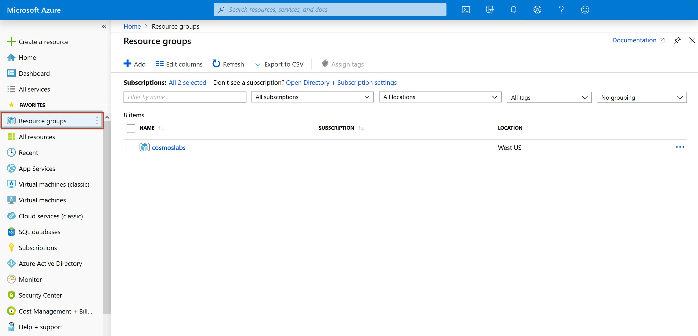

# Deploying Lab Environment

## Tools Version

Tested with Azure Powershell 2.2.0 on Powershell 5.1.2

``` powershell
Install-Module -Name Az -RequiredVersion 2.2.0
```

Assumes Azure Powershell login to appropriate subscription
``` powershell
Connect-AzAccount
```
or
``` powershell
Connect-AzAccount -subscription <subscription id>
```

## Setup

Run **labSetup.ps1** to create Azure resources, with optional parameters

- **location**: Azure region name for lab resources. *Default = 'West US'*
- **session**: Any unique characters to append to Azure resource names that are required to be globally unique. *Default = random 1-5 digit number*
- **resourceGroupName**: The name to use for the new Azure Resource Group that will be set up with lab resources. *Default = 'cosmoslabs'*

``` powershell
.\labSetup.ps1 -session 37haydf -location 'East US'
```

Run **labCodeSetup.ps1** to copy starter code, with optional parameters

- **codePath**: Folder path to populate with starter code for all labs. *Default = '$Home\Documents'*

``` powershell
.\labCodeSetup.ps1 -codePath 'c:\labs'
```

## Teardown

Run **labSetup.ps1** with **teardown** switch and required parameter

- **resourceGroupName**: The name of the Azure Resource Group containing only the resources used for labs. *if not included as a parameter, script will prompt for this value*

``` powershell
.\labSetup.ps1 -teardown
```

> If you don't know the name of your resource group, open the [Azure portal](http://portal.azure.com). On the left side of the portal, click the **Resource groups** link. The resource group created for lab content should contain a Cosmos account beginning with *cosmoslab*, an Azure Data Factory with a name beginning with *importNutritionData*, an Event Hub named *CartEventHub*, and a Stream Processor named *CartStreamProcessor*.


