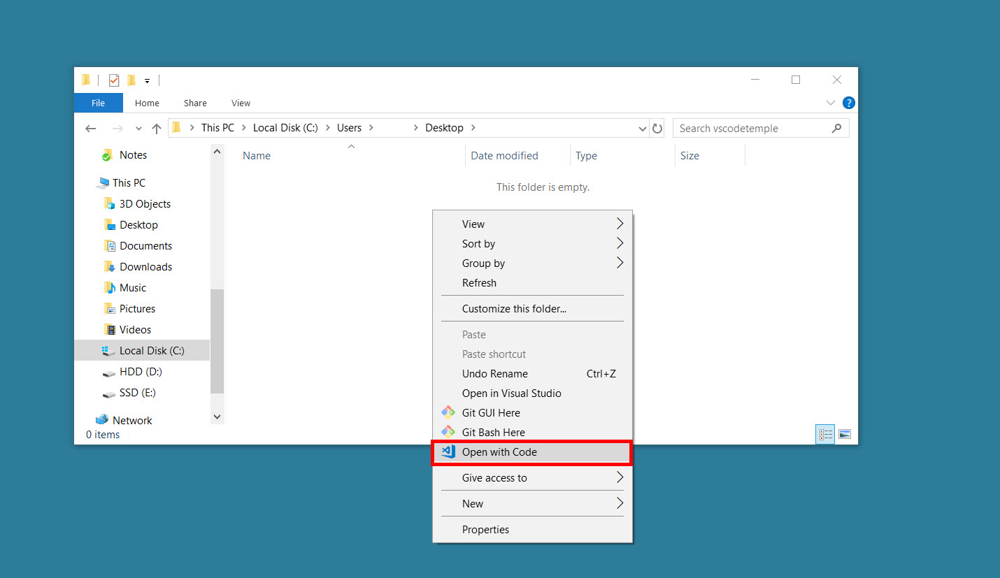

## Build A Simple .NET Console App

_After using the Azure Portal's **Data Explorer** to query an Azure Cosmos DB container. You are now going to use the .NET SDK to issue similar queries._

> If this is your first lab and you have not already completed the setup for the lab content see the instructions for [Account Setup](00-account_setup.md) before starting this lab.

### Create a .NET Core Project

1. On your local machine, locate the CosmosLabs folder in your Documents folder and open the Lab05 folder that will be used to contain the content of your .NET Core project.

1. In the Lab05 folder, right-click the folder and select the **Open with Code** menu option.

   

   > Alternatively, you can run a terminal in your current directory and execute the `code .` command.

1. In the Visual Studio Code window that appears, right-click the **Explorer** pane and select the **Open in Terminal** menu option.

   

1. In the terminal pane, enter and execute the following command:

   ```sh
   dotnet restore
   ```

   > This command will restore all packages specified as dependencies in the project.

1. In the terminal pane, enter and execute the following command:

   ```sh
   dotnet build
   ```

   > This command will build the project.

1. Click the **🗙** symbol to close the terminal pane.

1. In the **Explorer** pane verify that you have a **DataTypes.cs** file in your project folder.

   > This file contains the data classes you will be working with in the following steps.

1. Double-click the **Program.cs** link in the **Explorer** pane to open the file in the editor.

   

1. For the `_endpointUri` variable, replace the placeholder value with the **URI** value and for the `_primaryKey` variable, replace the placeholder value with the **PRIMARY KEY** value from your Azure Cosmos DB account. Use [these instructions](00-account_setup.md) to get these values if you do not already have them:

   > For example, if your **uri** is `https://cosmosacct.documents.azure.com:443/`, your new variable assignment will look like this: `private static readonly string _endpointUri = "https://cosmosacct.documents.azure.com:443/";`.

   > For example, if your **primary key** is `elzirrKCnXlacvh1CRAnQdYVbVLspmYHQyYrhx0PltHi8wn5lHVHFnd1Xm3ad5cn4TUcH4U0MSeHsVykkFPHpQ==`, your new variable assignment will look like this: `private static readonly string _primaryKey = "elzirrKCnXlacvh1CRAnQdYVbVLspmYHQyYrhx0PltHi8wn5lHVHFnd1Xm3ad5cn4TUcH4U0MSeHsVykkFPHpQ==";`.

   > We are now going to implement a sample query to make sure our client connection code works.

### Execute a Query against Cosmos DB Using ReadItemAsync

_ReadItemAsync allows a single item to be retrieved from Cosmos DB by its ID_

1. Locate the using block within the **Main** method:

   ```csharp
   using (CosmosClient client = new CosmosClient(_endpointUri, _primaryKey))
   {
       var database = client.GetDatabase(_databaseId);
       var container = database.GetContainer(_containerId);

   }
   ```

1. Add the following lines of code to use the **ReadItemAsync** function to retrieve a single item from your Cosmos DB by its `id` and write its description to the console.

   ```csharp
    ItemResponse<Food> candyResponse = await container.ReadItemAsync<Food>("19130", new PartitionKey("Sweets"));
    Food candy = candyResponse.Resource;
    Console.Out.WriteLine($"Read {candy.Description}");
   ```

1. Save all of your open tabs in Visual Studio Code

1. Return to your terminal pane

   > If you've closed the terminal right-click the **Explorer** pane and select the **Open in Terminal** menu option.

1. In the open terminal pane, enter and execute the following command:

   ```sh
   dotnet run
   ```

1. You should see the following line output in the console, indicating that **ReadItemAsync** completed successfully:

   ```sh
   Read Candies, HERSHEY''S POT OF GOLD Almond Bar
   ```

### Executing a Query Against a Single Cosmos DB Partition Using a SQL Item Query

1.  Return to Visual Studio Code

    > If you've closed Visual Studio code, re-open it from the command line with the following command:

        ```sh
        code .
        ```

1.  Find the last line of code you wrote:

    ```csharp
    Console.Out.WriteLine($"Read {candy.Description}");
    ```

1.  Create a SQL Query against your data, as follows:

    ```csharp
    string sqlA = "SELECT f.description, f.manufacturerName, f.servings FROM foods f WHERE f.foodGroup = 'Sweets'";
    ```

    > This query will select all food where the foodGroup is set to the value `Sweets`. You'll note that the syntax is very familiar if you've done work with SQL before. Also note that because this query has the partition key in the WHERE clause, this query can execute within a single partition.

1.  Add the following code to execute and read the results of this query

    ```csharp
    FeedIterator<Food> queryA = container.GetItemQueryIterator<Food>(new QueryDefinition(sqlA), requestOptions: new QueryRequestOptions{MaxConcurrency = 1, PartitionKey = new PartitionKey("Sweets")});
    foreach (Food food in await queryA.ReadNextAsync())
    {
        await Console.Out.WriteLineAsync($"{food.Description} by {food.ManufacturerName}");
        foreach (Serving serving in food.Servings)
        {
            await Console.Out.WriteLineAsync($"\t{serving.Amount} {serving.Description}");
        }
        await Console.Out.WriteLineAsync();
    }
    ```

    > Note that we have included the **PartitionKey** in the **QueryRequestOptions** to execute this query as a single-partition query. Omitting the partition key option will run all queries as cross-partition, which can have performance and cost impacts.

1.  Save all of your open tabs in Visual Studio Code

1.  Return to your terminal pane

    > If you've closed the terminal right-click the **Explorer** pane and select the **Open in Terminal** menu option.

1.  In the open terminal pane, enter and execute the following command:

    ```sh
    dotnet run
    ```

1.  The code will loop through each result of the SQL query and output a message to the console similar to the following:

    ```sh
    ...

    Puddings, coconut cream, dry mix, instant by
        1 package (3.5 oz)
        1 portion, amount to make 1/2 cup

    ...
    ```

### Executing a Query Against Multiple Cosmos DB Partitions Using a SQL Item Query With Paging

1.  Return to Visual Studio Code

    > If you've closed Visual Studio code, re-open it from the command line with the following command:

        ```sh
        code .
        ```

1.  Following your `foreach` loop, create a SQL Query against your data, as follows:

    ```csharp
    string sqlB = @"SELECT f.id, f.description, f.manufacturerName, f.servings FROM foods f WHERE f.manufacturerName != null";
    ```

1.  Add the following line of code after the definition of `sqlB` to create your next item query:

    ```csharp
    FeedIterator<Food> queryB = container.GetItemQueryIterator<Food>(sqlB, requestOptions: new QueryRequestOptions{MaxConcurrency = 5, MaxItemCount = 100});
    ```

    > Take note of the differences in this call to **GetItemQueryIterator** as compared to the previous section. **maxConcurrency** is set to `5` and we are limited the **MaxItemCount** to 100 items. This will result in paging if there are more than 100 items that match the query.

1.  Add the following lines of code to page through the results of this query using a while loop.

    ```csharp
    int pageCount = 0;
    while (queryB.HasMoreResults)
    {
        Console.Out.WriteLine($"---Page #{++pageCount:0000}---");
        foreach (var food in await queryB.ReadNextAsync())
        {
            Console.Out.WriteLine($"\t[{food.Id}]\t{food.Description,-20}\t{food.ManufacturerName,-40}");
        }
    }
    ```

1.  Save all of your open tabs in Visual Studio Code

1.  Return to your terminal pane

    > If you've closed the terminal right-click the **Explorer** pane and select the **Open in Terminal** menu option.

1.  In the open terminal pane, enter and execute the following command:

    ```sh
    dotnet run
    ```

1.  You should see a number of new results, each separated by the a line indicating the page, as follows:

    ```
        [19067] Candies, TWIZZLERS CHERRY BITES Hershey Food Corp.
    ---Page #0016---
        [19065] Candies, ALMOND JOY Candy Bar   Hershey Food Corp.
    ```

    > Note that the results are coming form multiple partitions.
