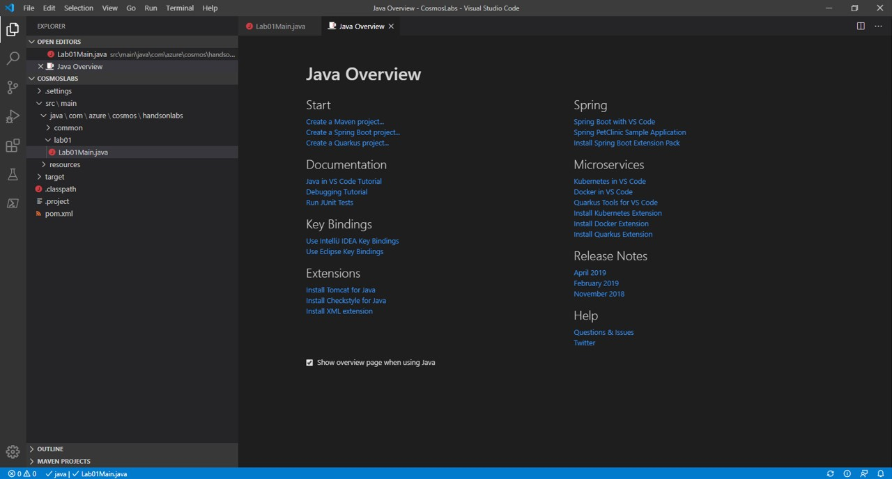
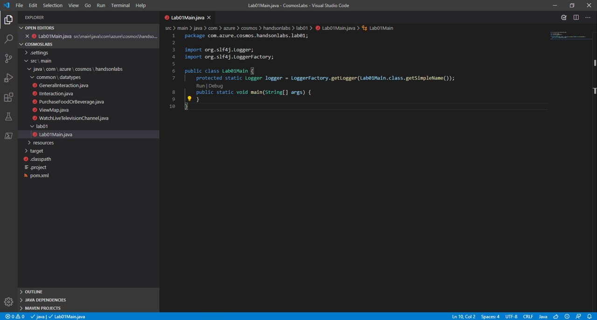
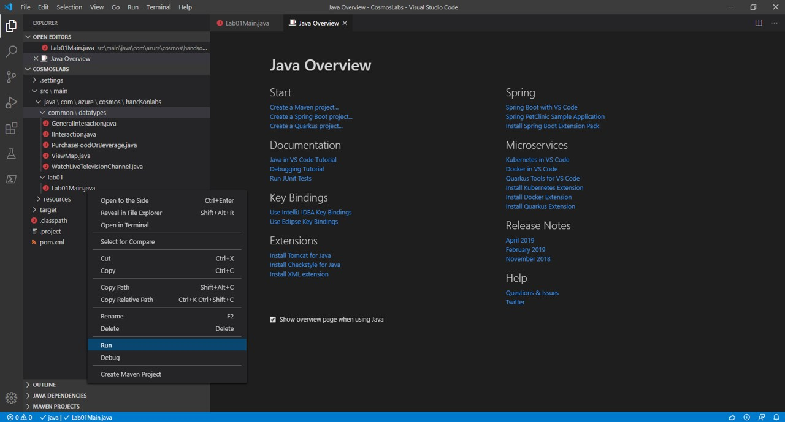

# Creating a Partitioned Container with Java SDK

In this lab, you will create multiple Azure Cosmos DB containers using different partition keys and settings. In later labs, you will then use the SQL API and Java SDK to query specific containers using a single partition key or across multiple partition keys.

> If you have not already completed setup for the lab content see the instructions for [Account Setup](00-account_setup.md) before starting this lab.

## Create Containers using the Java SDK

> You will start by using the Java SDK to create containers to use in the lab.

### Open the CosmosLabs Maven Project Template

1. Open Visual Studio Code.

1. If you are completing this lab through Microsoft Hands-on Labs, the CosmosLabs folder will be located at the path: **<Windows home directory>\Documents\CosmosLabs**. In Visual Studio Code, go to **File > Open Folder >** to get an Open Folder dialog and and use the dialog to open the CosmosLabs folder. 

    

Visual Studio Code will automatically detect the Maven Project (**pom.xml** file). If you have installed the Maven plugin, Visual Studio Code should automatically generate **.classpath** and **target\\** in the directory.

    

1. To see where Java source for the Labs is located, go to Visual Studio Code and click the **Explorer** pane. Expand the contents of the CosmosLabs folder in Visual Studio Code; expand down to **src\main\java\com\azure\cosmos\handsonlabs**. Each Lab which involves Java coding will have its own template subdirectory here, **lab*****XX***. The **common\\** subdirectory holds Java classes for use by any of the labs.

1. Expand down to **common\\datatypes\\**. You should see a number of Java classes; these are a handful of predefined datatypes for use in the Labs.

    

1. Looking now two directories above, expand the **handsonlabs\\lab01\\** folder. This directory is where you will develop code for this Lab. You should see only a **Lab01Main.java** file - this is the main class for the project.

1. Open **Lab01Main.java** in the editor by clicking on it in the **Explorer** pane.

    

### Create CosmosAsyncClient Instance

The **CosmosAsyncClient** class is the main "entry point" to using the SQL API in Azure Cosmos DB. We are going to create an instance of the **CosmosAsyncClient** class by passing in connection metadata as parameters of the class' constructor. We will then use this class instance throughout the lab.

1. Within the **Lab01Main.java** editor tab, add the following imports at the top of the file:

    ```java
    import com.azure.cosmos.ConnectionPolicy;
    import com.azure.cosmos.ConsistencyLevel;
    import com.azure.cosmos.CosmosAsyncClient;
    import com.azure.cosmos.CosmosAsyncDatabase;
    import com.azure.cosmos.CosmosAsyncContainer;
    import com.azure.cosmos.CosmosClientBuilder;
    import com.azure.cosmos.handsonlabs.common.datatypes.PurchaseFoodOrBeverage;
    import com.azure.cosmos.handsonlabs.common.datatypes.ViewMap;
    import com.azure.cosmos.handsonlabs.common.datatypes.WatchLiveTelevisionChannel;
    import com.azure.cosmos.models.CosmosAsyncItemResponse;
    import com.azure.cosmos.models.CosmosContainerProperties;
    import com.azure.cosmos.models.CosmosItemResponse;
    import com.azure.cosmos.models.IndexingMode;
    import com.azure.cosmos.models.IndexingPolicy;
    import com.azure.cosmos.models.IncludedPath;

    import reactor.core.publisher.Flux;
    import reactor.core.publisher.Mono;

    import java.util.ArrayList;
    import java.util.List;
    import java.util.UUID;
    import java.util.concurrent.atomic.AtomicBoolean;
    import com.google.common.collect.Lists;
    ```

1. Within the **Lab01Main.java** class, add the following lines of code to create variables for your connection information:

    ```java
    private static String endpointUri = "<your uri>";
    private static String primaryKey = "<your key>";
    ```

1. For the ``endpointUri`` variable, replace the placeholder value with the **URI** value and for the ``primaryKey`` variable, replace the placeholder value with the **PRIMARY KEY** value from your Azure Cosmos DB account. Use [these instructions](00-account_setup.md) to get these values if you do not already have them:

    > For example, if your **uri** is ``https://cosmosacct.documents.azure.com:443/``, your new variable assignment will look like this: ``private static String endpointUri = "https://cosmosacct.documents.azure.com:443/";``.

    > For example, if your **primary key** is ``elzirrKCnXlacvh1CRAnQdYVbVLspmYHQyYrhx0PltHi8wn5lHVHFnd1Xm3ad5cn4TUcH4U0MSeHsVykkFPHpQ==``, your new variable assignment will look like this: ``private static String primaryKey = "elzirrKCnXlacvh1CRAnQdYVbVLspmYHQyYrhx0PltHi8wn5lHVHFnd1Xm3ad5cn4TUcH4U0MSeHsVykkFPHpQ==";``.

    > Keep the **URI** and **PRIMARY KEY** values recorded, you will use them again later in this lab.

1. Locate the **main** method:

    ```java
    public static void main(String[] args) {
    }
    ```

1. Within the **main** method, add the following lines of code to create a **CosmosAsyncClient** instance, replacing the ***Azure Cosmos DB Account Location*** placeholder with the location setting of your Azure Cosmos DB account:

    ```java
    ConnectionPolicy defaultPolicy = ConnectionPolicy.getDefaultPolicy();
    defaultPolicy.setPreferredLocations(Lists.newArrayList("<your azure cosmos db account location>"));

    CosmosAsyncClient client = new CosmosClientBuilder()
            .setEndpoint(endpointUri)
            .setKey(primaryKey)
            .setConnectionPolicy(defaultPolicy)
            .setConsistencyLevel(ConsistencyLevel.EVENTUAL)
            .buildAsyncClient();
    ```

1. Now add a line at the end of the main method which closes the client:

    ```java
    client.close();
    ```

1. Your ``Lab01Main`` class definition should now look like this:

    ```java
    public class Lab01Main {
        protected static Logger logger = LoggerFactory.getLogger(Lab01Main.class.getSimpleName());
        private static String endpointUri = "<your uri>";
        private static String primaryKey = "<your key>";    
        public static void main(String[] args) {
            ConnectionPolicy defaultPolicy = ConnectionPolicy.getDefaultPolicy();
            defaultPolicy.setPreferredLocations(Lists.newArrayList("<your azure cosmos db account location>"));
        
            CosmosAsyncClient client = new CosmosClientBuilder()
                    .setEndpoint(endpointUri)
                    .setKey(primaryKey)
                    .setConnectionPolicy(defaultPolicy)
                    .setConsistencyLevel(ConsistencyLevel.EVENTUAL)
                    .buildAsyncClient();

            client.close();        
        }
    }
    ```

    > We will now execute a build of the application to make sure our code compiles successfully.

1. Save all of your open editor tabs.

1. In the Visual Studio Code window, in the **Explorer** pane, right-click the empty space in pane and choose the **Open in Terminal** menu option.

    

1. In the open terminal pane, enter and execute the following command:

    ```sh
    mvn clean package
    ```

    > This command will build the console project.

1. Click the **🗙** symbol to close the terminal pane.

1. Except for **Lab01Main.java**, close all open editor tabs.

### Create a Database and a Partitioned Container using the SDK

*To create a container, you must specify a name and a partition key path. You will specify those values when creating a container in this task. A partition key is a logical hint for distributing data onto a scaled out underlying set of physical partitions and for efficiently routing queries to the appropriate underlying partition. To learn more, refer to [/docs.microsoft.com/azure/cosmos-db/partition-data](../media/https://docs.microsoft.com/en-us/azure/cosmos-db/partition-data).*

1. At the top of the **Lab01Main** class definition, add two more static class variables for the database and container instances:

    ```java
    private static CosmosAsyncDatabase targetDatabase;
    private static CosmosAsyncContainer customContainer;
    private static AtomicBoolean resourcesCreated = new AtomicBoolean(false);
    ```

All code added in subsequent steps should be placed between the build-client call and the close-client call in the **main** method:

    ```java
    CosmosAsyncClient client = new CosmosClientBuilder()
            .setEndpoint(endpointUri)
            .setKey(primaryKey)
            .setConnectionPolicy(defaultPolicy)
            .setConsistencyLevel(ConsistencyLevel.EVENTUAL)
            .buildAsyncClient();
    // <= Add code here
    client.close();   
    ```

1. Add the following code to the method to create new ``CosmosAsyncDatabase`` and ``CosmosAsyncContainer``instances if they do not already exist:

    ```java
    client.createDatabaseIfNotExists("EntertainmentDatabase").flatMap(databaseResponse -> {
        targetDatabase = databaseResponse.getDatabase();
        CosmosContainerProperties containerProperties = 
            new CosmosContainerProperties("CustomCollection", "/type");
        return targetDatabase.createContainerIfNotExists(containerProperties, 400);
    }).flatMap(containerResponse -> {
        customContainer = containerResponse.getContainer();
        return Mono.empty();
    }).subscribe(voidItem -> {}, err -> {}, () -> {
        resourcesCreated.set(true);
    });

    while (!resourcesCreated.get());
    ```

    > This code will check to see if a database and a container already exist in your Azure Cosmos DB account with the specified configuration parameters. If a database or container that matches does not exist, it will be created.

1. After the while loop, add the following code to print out the ID of the database:

    ```java
    logger.info("Database Id:\t{}",targetDatabase.getId());
    logger.info("Container Id:\t{}",customContainer.getId()); 
    ```

    > The ``targetDatabase`` and ``customContainer`` variables will have accurate metadata even if either resource already existed.

1. Save all of your open editor tabs.

1. In the **Explorer** pane, right-click **Lab01Main.java** and choose the **Run** menu option.

    

    > This command will build and execute the console project.

1. Observe the output of the running command.

    > In the console window, you will see the ID string for the database resource in your Azure Cosmos DB account.

1. Right-click **Lab01Main.java** and choose **Run** once again.

    > This command will build and execute the console project a second time.

1. Again, observe the output of the running command.

    > Since the database already exists, the SDK detected that the database already exists and used the existing database instance instead of creating a new instance of the database.

1. Click the **🗙** symbol to close the terminal pane.


### Customizing the partitioned container

1. Now we will review the code we have written and add custom throughput provisioning and indexing. Take a look at the create-container-if-not-exists call:

    ```java
    CosmosContainerProperties containerProperties = 
        new CosmosContainerProperties("CustomCollection", "/type");
    return targetDatabase.createContainerIfNotExists(containerProperties, 400);
    ```

    > This code will check to see if a container exists in your database with the specified name ("CustomCollection"), partition key ("/type"), and provisioned throughput (400 RU/s). If a container that matches does not exist, it will create a new container. Here is where we can specify the RU/s allocated for a newly created container. If this is not specified, the SDK has a default value for RU/s assigned to a container.

    > Note that the partition key is case-sensitive. This is especially important when you consider JSON property casing in the context of .NET CLR object to JSON object serialization.

In general, you will customize the container's dedicated throughput for your application. Here let's modify the last line above to provision 10000 RU/s for this container as shown below:

    ```java
    CosmosContainerProperties containerProperties = 
        new CosmosContainerProperties("CustomCollection", "/type");
    return targetDatabase.createContainerIfNotExists(containerProperties, 10000);
    ```

1. Above these lines of code, create a new ``IndexingPolicy`` instance with a custom indexing policy configured:

    ```java
    IndexingPolicy indexingPolicy = new IndexingPolicy();
    indexingPolicy.setIndexingMode(IndexingMode.CONSISTENT);
    indexingPolicy.setAutomatic(true);
    List<IncludedPath> includedPaths = new ArrayList<>();
    IncludedPath includedPath = new IncludedPath();
    includedPath.setPath("/*");
    includedPaths.add(includedPath);
    indexingPolicy.setIncludedPaths(includedPaths);  

    CosmosContainerProperties containerProperties = 
        new CosmosContainerProperties("CustomCollection", "/type");
    return targetDatabase.createContainerIfNotExists(containerProperties, 10000);    
    ```

    > By default, all Azure Cosmos DB data is indexed. Although many customers are happy to let Azure Cosmos DB automatically handle all aspects of indexing, you can specify a custom indexing policy for containers. This indexing policy is very similar to the default indexing policy created by the SDK.

1. In order to apply this indexing policy container, modify the **CosmosContainerProperties** indexing policy as shown below:

    ```java
    IndexingPolicy indexingPolicy = new IndexingPolicy();
    indexingPolicy.setIndexingMode(IndexingMode.CONSISTENT);
    indexingPolicy.setAutomatic(true);
    List<IncludedPath> includedPaths = new ArrayList<>();
    IncludedPath includedPath = new IncludedPath();
    includedPath.setPath("/*");
    includedPaths.add(includedPath);
    indexingPolicy.setIncludedPaths(includedPaths);  

    CosmosContainerProperties containerProperties = 
        new CosmosContainerProperties("CustomCollection", "/type");
    containerProperties.setIndexingPolicy(indexingPolicy);
    return targetDatabase.createContainerIfNotExists(containerProperties, 10000);    
    ```

1. Save all of your open editor tabs.

1. Confirm that you can build and run with these changes. In the Visual Studio Code window **Explorer** pane right-click **Lab01Main.java** and choose **Run**.

1. Observe the output of the running command.

1. Click the **🗙** symbol to close the terminal pane.

1. You **Lab01Main.java** file should look something like this:

    ```java
    package com.azure.cosmos.handsonlabs.lab01;

    import org.slf4j.Logger;
    import org.slf4j.LoggerFactory;
    import com.github.javafaker.Faker;
    import java.math.BigDecimal;
    import java.text.DecimalFormat;

    import com.azure.cosmos.ConnectionPolicy;
    import com.azure.cosmos.ConsistencyLevel;
    import com.azure.cosmos.CosmosAsyncClient;
    import com.azure.cosmos.CosmosAsyncDatabase;
    import com.azure.cosmos.CosmosAsyncContainer;
    import com.azure.cosmos.CosmosClientBuilder;
    import com.azure.cosmos.models.CosmosContainerProperties;
    import com.azure.cosmos.models.IndexingMode;
    import com.azure.cosmos.models.IndexingPolicy;
    import com.azure.cosmos.models.IncludedPath;

    import reactor.core.publisher.Mono;

    import java.util.ArrayList;
    import java.util.List;
    import java.util.concurrent.atomic.AtomicBoolean;
    import com.google.common.collect.Lists;

    public class Lab01Main {
        protected static Logger logger = LoggerFactory.getLogger(Lab01Main.class.getSimpleName());
        private static String endpointUri = "<your uri>";
        private static String primaryKey = "<your key>";   
        private static CosmosAsyncDatabase targetDatabase;
        private static CosmosAsyncContainer customContainer;
        private static AtomicBoolean resourcesCreated = new AtomicBoolean(false);     
        public static void main(String[] args) {
            ConnectionPolicy defaultPolicy = ConnectionPolicy.getDefaultPolicy();
            defaultPolicy.setPreferredLocations(Lists.newArrayList("<your azure cosmos db account location>"));
        
            CosmosAsyncClient client = new CosmosClientBuilder()
                    .setEndpoint(endpointUri)
                    .setKey(primaryKey)
                    .setConnectionPolicy(defaultPolicy)
                    .setConsistencyLevel(ConsistencyLevel.EVENTUAL)
                    .buildAsyncClient();

            client.createDatabaseIfNotExists("EntertainmentDatabase").flatMap(databaseResponse -> {
                targetDatabase = databaseResponse.getDatabase();

                IndexingPolicy indexingPolicy = new IndexingPolicy();
                indexingPolicy.setIndexingMode(IndexingMode.CONSISTENT);
                indexingPolicy.setAutomatic(true);
                List<IncludedPath> includedPaths = new ArrayList<>();
                IncludedPath includedPath = new IncludedPath();
                includedPath.setPath("/*");
                includedPaths.add(includedPath);
                indexingPolicy.setIncludedPaths(includedPaths);            

                CosmosContainerProperties containerProperties = 
                    new CosmosContainerProperties("CustomCollection", "/type");
                containerProperties.setIndexingPolicy(indexingPolicy);
                return targetDatabase.createContainerIfNotExists(containerProperties, 10000);
            }).flatMap(containerResponse -> {
                customContainer = containerResponse.getContainer();
                return Mono.empty();
            }).subscribe(voidItem -> {}, err -> {}, () -> {
                resourcesCreated.set(true);
            });

            while (!resourcesCreated.get());

            logger.info("Database Id:\t{}",targetDatabase.getId());
            logger.info("Container Id:\t{}",customContainer.getId());        

            client.close();        
        }
    }
    ```

## Populate a Container with Items using the SDK

> You will now use the Java SDK to populate your container with various items of varying schemas. These items will be serialized instances of multiple Java classes in your project.

### Populate Container with Data

1. Double-click the **Lab01Main.java** link in the **Explorer** pane to open the file in the editor, if it is not opened already.

1. Locate the block of code starting with client creation and ending with client closure within the **Main** method. Delete any existing code except for client creation and closure:

    ```java
    CosmosAsyncClient client = new CosmosClientBuilder()
            .setEndpoint(endpointUri)
            .setKey(primaryKey)
            .setConnectionPolicy(defaultPolicy)
            .setConsistencyLevel(ConsistencyLevel.EVENTUAL)
            .buildAsyncClient();      

    client.close();  
    ```

1. Add the following code to the method to create a reference to an existing container:

    ```java
    targetDatabase = client.getDatabase("EntertainmentDatabase");
    customContainer = targetDatabase.getContainer("CustomCollection");
    ```

1. Observe the code in the **Main** method.

    > For the next few instructions, we will use the [Java Faker](http://github.com/DiUS/java-faker) library to create test data. This library allows you to create a collection of objects with fake data set on each object's property. For this lab, our intent is to **focus on Azure Cosmos DB** instead of this library. With that intent in mind, the next set of instructions will expedite the process of creating test data.

1. Add the following code to create a collection of ``PurchaseFoodOrBeverage`` instances:

    ```java
    ArrayList<PurchaseFoodOrBeverage> foodInteractions = new ArrayList<PurchaseFoodOrBeverage>();
    Faker faker = new Faker();    
    
    for (int i= 0; i < 500;i++){  
        PurchaseFoodOrBeverage doc = new PurchaseFoodOrBeverage(); 
        DecimalFormat df = new DecimalFormat("###.###");      
        doc.setType("PurchaseFoodOrBeverage");            
        doc.setQuantity(faker.random().nextInt(1, 5));            
        String unitPrice = df.format(Double.valueOf((Double)faker.random().nextDouble()));
        doc.setUnitPrice(new BigDecimal(unitPrice));
        int quantity = Integer.valueOf((Integer)doc.getQuantity());        
        String totalPrice = df.format(Double.valueOf(unitPrice) * quantity);
        doc.setTotalPrice(new BigDecimal(totalPrice));
        doc.setId(UUID.randomUUID().toString());
        foodInteractions.add(doc);
    }
    ```

    > As a reminder, the Faker library generates a set of test data. In this example, you are creating 500 items using the Faker library following the pattern described above.
    
1. Add the following foreach block to iterate over the ``PurchaseFoodOrBeverage`` instances and asynchronously insert them into the container as JSON documents. The output is a list of request responses for the inserts:

    ```java
    Flux<PurchaseFoodOrBeverage> foodInteractionsFlux = Flux.fromIterable(foodInteractions);
    List<CosmosAsyncItemResponse<PurchaseFoodOrBeverage>> results = 
        foodInteractionsFlux.flatMap(interaction -> customContainer.createItem(interaction)).collectList().block();
    ```

    > The ``createItem`` method of the ``CosmosAsyncContainer`` class takes in an object that you would like to serialize into JSON and store as a document within the specified container. The ``id`` property, which here we've assigned to a unique UUID on each object, is a special required value in Cosmos DB that is used for indexing and must be unique for every item in a container.

1. Add a second foreach block that writes the value of the newly created resource ``id`` properties to the console:

    ```java
    results.forEach(result -> logger.info("Item Created\t{}",result.getItem().getId()));
    ```

    > Notice that these prints are accomplished using a **log4j** logger instance. For best performance it is recommended to use an asynchronous logger such as **log4j** during high-throughput request operations, so that Cosmos DB requests are not blocked waiting for the print statements to complete. 

    > The ``CosmosAsyncItemResponse`` type has a ``getItem`` method that returns an object representing the item as well as other properties to give you access to interesting data about an item such as its ETag.

1. Your **Main** method should look like this:

    ```java
    public static void main(String[] args) {
        ConnectionPolicy defaultPolicy = ConnectionPolicy.getDefaultPolicy();
        defaultPolicy.setPreferredLocations(Lists.newArrayList("West US"));
    
        CosmosAsyncClient client = new CosmosClientBuilder()
                .setEndpoint(endpointUri)
                .setKey(primaryKey)
                .setConnectionPolicy(defaultPolicy)
                .setConsistencyLevel(ConsistencyLevel.EVENTUAL)
                .buildAsyncClient();

        targetDatabase = client.getDatabase("EntertainmentDatabase");
        customContainer = targetDatabase.getContainer("CustomCollection");

        ArrayList<PurchaseFoodOrBeverage> foodInteractions = new ArrayList<PurchaseFoodOrBeverage>();
        Faker faker = new Faker();

        for (int i= 0; i < 500;i++){  
            PurchaseFoodOrBeverage doc = new PurchaseFoodOrBeverage(); 
            DecimalFormat df = new DecimalFormat("###.###");      
            doc.setType("PurchaseFoodOrBeverage");            
            doc.setQuantity(faker.random().nextInt(1, 5));            
            String unitPrice = df.format(Double.valueOf((Double)faker.random().nextDouble()));
            doc.setUnitPrice(new BigDecimal(unitPrice));
            int quantity = Integer.valueOf((Integer)doc.getQuantity());        
            String totalPrice = df.format(Double.valueOf(unitPrice) * quantity);
            doc.setTotalPrice(new BigDecimal(totalPrice));
            doc.setId(UUID.randomUUID().toString());
            foodInteractions.add(doc);
        }

        Flux<PurchaseFoodOrBeverage> foodInteractionsFlux = Flux.fromIterable(foodInteractions);
        List<CosmosAsyncItemResponse<PurchaseFoodOrBeverage>> results = 
            foodInteractionsFlux.flatMap(interaction -> customContainer.createItem(interaction)).collectList().block();

        results.forEach(result -> logger.info("Item Created\t{}",result.getItem().getId()));

        client.close();        
    }
    ```

1. Save all of your open editor tabs.

1. In the Visual Studio Code window **Explorer** pane right-click **Lab01Main.java** and choose **Run**.

1. Observe the output of the running command.

    > You should see a list of item ids associated with new items that are being created by this tool.

1. Click the **🗙** symbol to close the terminal pane.

### Populate Container with Data of Different Types

1. Locate the **Main** method and delete the faker code block and the item-insert code, so that what you have left in **Main** looks like this:

    ```java
    public static void main(String[] args) {
        ConnectionPolicy defaultPolicy = ConnectionPolicy.getDefaultPolicy();
        defaultPolicy.setPreferredLocations(Lists.newArrayList("West US"));
    
        CosmosAsyncClient client = new CosmosClientBuilder()
                .setEndpoint(endpointUri)
                .setKey(primaryKey)
                .setConnectionPolicy(defaultPolicy)
                .setConsistencyLevel(ConsistencyLevel.EVENTUAL)
                .buildAsyncClient();

        targetDatabase = client.getDatabase("EntertainmentDatabase");
        customContainer = targetDatabase.getContainer("CustomCollection");

        client.close();        
    }
    ```

1. Paste in the following new code so that **Main** appears as shown below:

    ```java
    public static void main(String[] args) {
        ConnectionPolicy defaultPolicy = ConnectionPolicy.getDefaultPolicy();
        defaultPolicy.setPreferredLocations(Lists.newArrayList("West US"));
    
        CosmosAsyncClient client = new CosmosClientBuilder()
                .setEndpoint(endpointUri)
                .setKey(primaryKey)
                .setConnectionPolicy(defaultPolicy)
                .setConsistencyLevel(ConsistencyLevel.EVENTUAL)
                .buildAsyncClient();

        targetDatabase = client.getDatabase("EntertainmentDatabase");
        customContainer = targetDatabase.getContainer("CustomCollection");

        ArrayList<WatchLiveTelevisionChannel> tvInteractions = new ArrayList<WatchLiveTelevisionChannel>();
        Faker faker = new Faker();

        for (int i= 0; i < 500;i++){  
            WatchLiveTelevisionChannel doc = new WatchLiveTelevisionChannel(); 

            doc.setChannelName(faker.funnyName().toString());
            doc.setMinutesViewed(faker.random().nextInt(1, 60));
            doc.setType("WatchLiveTelevisionChannel");
            doc.setId(UUID.randomUUID().toString());
            tvInteractions.add(doc);
        }

        Flux<WatchLiveTelevisionChannel> tvInteractionsFlux = Flux.fromIterable(tvInteractions);
        List<CosmosAsyncItemResponse<WatchLiveTelevisionChannel>> results = 
            tvInteractionsFlux.flatMap(interaction -> customContainer.createItem(interaction)).collectList().block();

        results.forEach(result -> logger.info("Item Created\t{}",result.getItem().getId()));

        client.close();        
    }
    ```

    > As a reminder, the **faker** library generates a set of test data. In this example, you are creating 500 items using the **faker** library and the rules listed above. 

1. Save all of your open editor tabs.

1. In the Visual Studio Code window **Explorer** pane right-click **Lab01Main.java** and choose **Run**.

1. Observe the output of the running command.

    > You should see a list of item ids associated with new items that are being created by this tool.

1. Click the **🗙** symbol to close the terminal pane.

1. Once again, locate the **Main** method and delete the faker code block and the item-insert code, so that what you have left in **Main** looks like this:

    ```java
    public static void main(String[] args) {
        ConnectionPolicy defaultPolicy = ConnectionPolicy.getDefaultPolicy();
        defaultPolicy.setPreferredLocations(Lists.newArrayList("West US"));
    
        CosmosAsyncClient client = new CosmosClientBuilder()
                .setEndpoint(endpointUri)
                .setKey(primaryKey)
                .setConnectionPolicy(defaultPolicy)
                .setConsistencyLevel(ConsistencyLevel.EVENTUAL)
                .buildAsyncClient();

        targetDatabase = client.getDatabase("EntertainmentDatabase");
        customContainer = targetDatabase.getContainer("CustomCollection");

        client.close();        
    }
    ```

1. Paste in the following new code so that **Main** appears as shown below:

    ```java
    public static void main(String[] args) {
        ConnectionPolicy defaultPolicy = ConnectionPolicy.getDefaultPolicy();
        defaultPolicy.setPreferredLocations(Lists.newArrayList("West US"));
    
        CosmosAsyncClient client = new CosmosClientBuilder()
                .setEndpoint(endpointUri)
                .setKey(primaryKey)
                .setConnectionPolicy(defaultPolicy)
                .setConsistencyLevel(ConsistencyLevel.EVENTUAL)
                .buildAsyncClient();

        targetDatabase = client.getDatabase("EntertainmentDatabase");
        customContainer = targetDatabase.getContainer("CustomCollection");

        ArrayList<ViewMap> mapInteractions = new ArrayList<ViewMap>();
        Faker faker = new Faker();

        for (int i= 0; i < 500;i++){  
            ViewMap doc = new ViewMap(); 

            doc.setMinutesViewed(faker.random().nextInt(1, 60));
            doc.setType("WatchLiveTelevisionChannel");
            doc.setId(UUID.randomUUID().toString());
            mapInteractions.add(doc);
        }

        Flux<ViewMap> mapInteractionsFlux = Flux.fromIterable(mapInteractions);
        List<CosmosAsyncItemResponse<ViewMap>> results = 
            mapInteractionsFlux.flatMap(interaction -> customContainer.createItem(interaction)).collectList().block();

        results.forEach(result -> logger.info("Item Created\t{}",result.getItem().getId()));

        client.close();        
    }
    ```

1. Save all of your open editor tabs.

1. In the Visual Studio Code window **Explorer** pane right-click **Lab01Main.java** and choose **Run**.

1. Observe the output of the running command.

    > You should see a list of item ids associated with new items that are being created by this tool.

1. Click the **🗙** symbol to close the terminal pane.

1. Close all open editor tabs.

1. Close the Visual Studio Code application.

> If this is your final lab, follow the steps in [Removing Lab Assets](11-cleaning_up.md) to remove all lab resources. 
