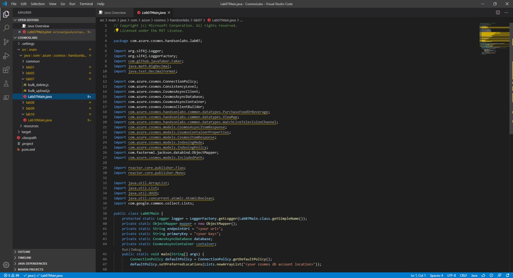
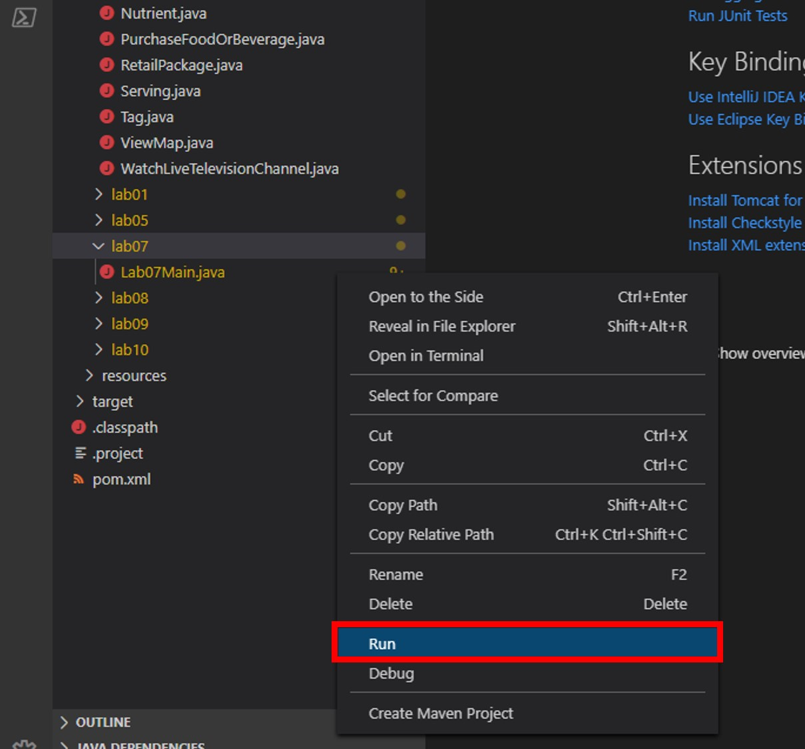

# Authoring Azure Cosmos DB Stored Procedures with Continuation Tokens

In this lab, you will author and execute multiple stored procedures within your Azure Cosmos DB instance. You will explore features unique to JavaScript stored procedures such as throwing errors for transaction rollback, logging using the JavaScript console and implementing a continuation model within a bounded execution environment.

> If this is your first lab and you have not already completed the setup for the lab content see the instructions for [Account Setup](00-account_setup.md) before starting this lab.

## Author Stored Procedures using the Continuation Model

_You will now implement stored procedures that may execute longer than the bounded execution limits on the server. You will implement the continuation model so that the stored procedures can "pick up where they left off" after they ran out of time in a previous execution._

### Create Bulk Upload and Bulk Delete Stored Procedures

1. From within the **Cosmos DB** resource blade, click on the **Data Explorer** link on the left

1. Expand the **NutritionDatabase** and then click to select the **FoodCollection**.

1. Click the **New Stored Procedure** button at the top of the **Data Explorer** section.

1. In the stored procedure tab, locate the **Stored Procedure Id** field and enter the value: **bulkUpload**.

1. Replace the contents of the _stored procedure editor_ with the following JavaScript code:

   ```js
   function bulkUpload(docs) {
     var container = getContext().getCollection();
     var containerLink = container.getSelfLink();
     var count = 0;
     if (!docs) throw new Error("The array is undefined or null.");
     var docsLength = docs.length;
     if (docsLength == 0) {
       getContext()
         .getResponse()
         .setBody(0);
       return;
     }
     tryCreate(docs[count], callback);
     function tryCreate(doc, callback) {
       var isAccepted = container.createDocument(containerLink, doc, callback);
       if (!isAccepted)
         getContext()
           .getResponse()
           .setBody(count);
     }
     function callback(err, doc, options) {
       if (err) throw err;
       count++;
       if (count >= docsLength) {
         getContext()
           .getResponse()
           .setBody(count);
       } else {
         tryCreate(docs[count], callback);
       }
     }
   }
   ```

   > This stored procedure uploads an array of documents in one batch. If the entire batch is not completed, the stored procedure will set the response body to the number of documents that were imported. Your client-side code is expected to call this stored procedure multiple times until all documents are imported.

   If you are having trouble copying the stored procedure above, the full source code for this stored procedure is located here: [bulk_upload.js](../solutions/src/main/java/com/azure/cosmos/handsonlabs/lab07/bulk_upload.js)

1. Click the **Save** button at the top of the tab.

1. Click the **New Stored Procedure** button at the top of the **Data Explorer** section.

1. In the stored procedure tab, locate the **Stored Procedure Id** field and enter the value: **bulkDelete**.

1. Replace the contents of the _stored procedure editor_ with the following JavaScript code:

   ```js
   function bulkDelete(query) {
     var container = getContext().getCollection();
     var containerLink = container.getSelfLink();
     var response = getContext().getResponse();
     var responseBody = {
       deleted: 0,
       continuation: true
     };
     if (!query) throw new Error("The query is undefined or null.");
     tryQueryAndDelete();
     function tryQueryAndDelete(continuation) {
       var requestOptions = { continuation: continuation };
       var isAccepted = container.queryDocuments(
         containerLink,
         query,
         requestOptions,
         function(err, retrievedDocs, responseOptions) {
           if (err) throw err;
           if (retrievedDocs.length > 0) {
             tryDelete(retrievedDocs);
           } else if (responseOptions.continuation) {
             tryQueryAndDelete(responseOptions.continuation);
           } else {
             responseBody.continuation = false;
             response.setBody(responseBody);
           }
         }
       );
       if (!isAccepted) {
         response.setBody(responseBody);
       }
     }
     function tryDelete(documents) {
       if (documents.length > 0) {
         var isAccepted = container.deleteDocument(
           documents[0]._self,
           {},
           function(err, responseOptions) {
             if (err) throw err;
             responseBody.deleted++;
             documents.shift();
             tryDelete(documents);
           }
         );
         if (!isAccepted) {
           response.setBody(responseBody);
         }
       } else {
         tryQueryAndDelete();
       }
     }
   }
   ```

   > This stored procedure iterates through all documents that match a specific query and deletes the documents. If the stored procedure is unable to delete all documents, it will return a continuation token. Your client-side code is expected to repeatedly call the stored procedure passing in a continuation token until the stored procedure does not return a continuation token.

   If you are having trouble copying the stored procedure above, the full source code for this stored procedure is located here: [bulk_delete.js](../solutions/src/main/java/com/azure/cosmos/handsonlabs/lab07/bulk_delete.js)

1. Click the **Save** button at the top of the tab.

### Open the CosmosLabs Maven Project Template

1. Open Visual Studio Code.

1. If you are completing this lab through Microsoft Hands-on Labs, the CosmosLabs folder will be located at the path: **your\home\directory\Documents\CosmosLabs**. In Visual Studio Code, go to **File > Open Folder >** to get an Open Folder dialog and and use the dialog to open the CosmosLabs folder. 

    

1. Expand the directory tree to **src\main\java\com\azure\cosmos\handsonlabs\\lab07\\** folder. This directory is where you will develop code for this Lab. You should see only a **Lab07Main.java** file - this is the **main** class for the project.

1. Open **Lab07Main.java** in the editor by clicking on it in the **Explorer** pane.

    

1. In the Visual Studio Code window, in the **Explorer** pane, right-click the empty space in pane and choose the **Open in Terminal** menu option.

    

1. Let's start by building the template code. In the open terminal pane, enter and execute the following command:

    ```sh
    mvn clean package
    ```

    > This command will build the console project.

1. Click the **🗙** symbol to close the terminal pane.

1. For the `endpointUri` variable, replace the placeholder value with the **URI** value and for the `primaryKey` variable, replace the placeholder value with the **PRIMARY KEY** value from your Azure Cosmos DB account. Use [these instructions](00-account_setup.md) to get these values if you do not already have them:

   > For example, if your **uri** is `https://cosmosacct.documents.azure.com:443/`, your new variable assignment will look like this: `private static String endpointUri = "https://cosmosacct.documents.azure.com:443/";`.

   > For example, if your **primary key** is `elzirrKCnXlacvh1CRAnQdYVbVLspmYHQyYrhx0PltHi8wn5lHVHFnd1Xm3ad5cn4TUcH4U0MSeHsVykkFPHpQ==`, your new variable assignment will look like this: `private static String primaryKey = "elzirrKCnXlacvh1CRAnQdYVbVLspmYHQyYrhx0PltHi8wn5lHVHFnd1Xm3ad5cn4TUcH4U0MSeHsVykkFPHpQ==";`.

   > We are now going to implement a sample query to make sure our client connection code works.

### Execute Bulk Upload Stored Procedure from Java SDK

1. In the Visual Studio Code window, double click to open the **Lab07Main.java** file

1. Locate the point in the **main** method within the **Lab07Main** class where the Azure Cosmos DB client is created:

   ```java
    public static void main(String[] args) {
        ConnectionPolicy defaultPolicy = ConnectionPolicy.getDefaultPolicy();
        defaultPolicy.setPreferredLocations(Lists.newArrayList("<your cosmos db account location>"));
    
        CosmosAsyncClient client = new CosmosClientBuilder()
                .setEndpoint(endpointUri)
                .setKey(primaryKey)
                .setConnectionPolicy(defaultPolicy)
                .setConsistencyLevel(ConsistencyLevel.EVENTUAL)
                .buildAsyncClient();

         // <== Start adding code here
   ```

   ```java
   List<Food> foods = new ArrayList<Food>();
   Faker faker = new Faker();

   for (int i= 0; i < 1000;i++){  
      Food food = new Food(); 

      food.setId(UUID.randomUUID().toString());
      food.setDescription(faker.food().dish());
      food.setManufacturerName(faker.company().name());
      food.setFoodGroup("Energy Bars");
      food.addTag(new Tag("Food"));
      food.addNutrient(new Nutrient());
      food.addServing(new Serving());
      foods.add(food);
   }
   ```   

   > As a reminder, the Faker library generates a set of test data. In this example, you are creating 1,000 items using the Faker library and the rules listed. Then these items are collected in a ```List<Food>```.

1. Next, find the very beginning of the ```Lab07Main``` class definition. Add the following line of code to create a variable named ```pointer``` with a default value of **zero**.

   ```java
   private static int pointer = 0;
   ```

   > We are going to use this variable to determine how many documents were uploaded by our stored procedure.

1. Next, add the following **while** block to continue to iterate code as long as the value of the **pointer** field is _less than_ the amount of items in the **foods** collection:

   ```js
   while (pointer < foods.size()) {
      // <== Add code here
   }
   ```

   > We are going to create a while loop that will keep uploading documents until the pointer's value greater than or equal to the amount of food objects in our object set.

1. Within the **while** block, add the following lines of code to execute the stored procedure:

   ```java
   CosmosStoredProcedureRequestOptions options = new CosmosStoredProcedureRequestOptions();
   options.setPartitionKey(new PartitionKey("Energy Bars"));

   Object sprocArgs[] = new Object[] {foods.subList(pointer,foods.size())};

   container.getScripts()
            .getStoredProcedure("bulkUpload")
            .execute(sprocArgs,options)
            .flatMap(executeResponse -> {
               int delta_items = Integer.parseInt(executeResponse.getResponseAsString());
               pointer += delta_items;

               logger.info("{} Total Items {} Items Uploaded in this Iteration",pointer,delta_items);

               return Mono.empty();
   }).block();
   ```

   > This section of code will execute the stored procedure using three parameters; the partition key for the data set you are executing against, the name of the stored procedure, and a list of **food** objects to send to the stored procedure.

   > Note that the last stage of this reactive stream retrieves the number of items processed by the stored procedure (```delta_items```), increments ```pointer``` by this amount to obtain the total progress, and then logs the progress of the stored procedure in operating on these items.

1. Your ```Lab07Main``` class should now look like this:

   ```java
   public class Lab07Main {
      protected static Logger logger = LoggerFactory.getLogger(Lab07Main.class.getSimpleName());
      private static ObjectMapper mapper = new ObjectMapper();
      private static String endpointUri = "<your uri>";
      private static String primaryKey = "<your key>";    
      private static CosmosAsyncDatabase database;
      private static CosmosAsyncContainer container;  
      private static int pointer = 0;
      public static void main(String[] args) {
         ConnectionPolicy defaultPolicy = ConnectionPolicy.getDefaultPolicy();
         defaultPolicy.setPreferredLocations(Lists.newArrayList("<your cosmos db account location>"));
      
         CosmosAsyncClient client = new CosmosClientBuilder()
                  .setEndpoint(endpointUri)
                  .setKey(primaryKey)
                  .setConnectionPolicy(defaultPolicy)
                  .setConsistencyLevel(ConsistencyLevel.EVENTUAL)
                  .buildAsyncClient();

         database = client.getDatabase("NutritionDatabase");
         container = database.getContainer("FoodCollection");

         List<Food> foods = new ArrayList<Food>();
         Faker faker = new Faker();

         for (int i= 0; i < 1000;i++){  
               Food food = new Food(); 

               food.setId(UUID.randomUUID().toString());
               food.setDescription(faker.food().dish());
               food.setManufacturerName(faker.company().name());
               food.setFoodGroup("Energy Bars");
               food.addTag(new Tag("Food"));
               food.addNutrient(new Nutrient());
               food.addServing(new Serving());
               foods.add(food);
         }

         while (pointer < foods.size()) {
         
               CosmosStoredProcedureRequestOptions options = new CosmosStoredProcedureRequestOptions();
               options.setPartitionKey(new PartitionKey("Energy Bars"));
      
               Object sprocArgs[] = new Object[] {foods.subList(pointer,foods.size())};

               container.getScripts()
                     .getStoredProcedure("bulkUpload")
                     .execute(sprocArgs,options)
                     .flatMap(executeResponse -> {
                           int delta_items = Integer.parseInt(executeResponse.getResponseAsString());
                           pointer += delta_items;

                           logger.info("{} Total Items {} Items Uploaded in this Iteration",pointer,delta_items);

                           return Mono.empty();
               }).block();
         }

         client.close();        
      }
   }
   ```

   > On the first execution of the while loop, we will skip **0** documents and attempt to upload all documents. When the stored procedure has finished executing, we will get a response indicating how many documents were uploaded. As an example, let's say **500** documents were uploaded. The pointer will now be incremented to a value of **500**. On the next check of the while loop's condition, **500** will be evaluated to be less than **1000** causing another execution of the code in the while loop. The program will now skip **500** documents and send the remaining **500** documents to the stored procedure to upload. This loop will continue until all documents are uploaded. Also keep in mind that as of this writing, Cosmos DB has a 2 MB request limit on all calls. If your data is bigger than this test data, consider sending smaller chunks of the payload with each request.

1. Save all of your open editor tabs.

1. In the **Explorer** pane, right-click **Lab07Main.java** and choose the **Run** menu option.

    

    > This command will build and execute the console project.

1. Observe the results of the console project.

   > This stored procedure will batch upload 1,000 documents to your collection within the specified partition key.

1. Click the **🗙** symbol to close the terminal pane.

### Observe the Uploaded Documents in the Azure Portal

1. Return to the **Azure Portal** (<http://portal.azure.com>).

1. On the left side of the portal, click the **Resource groups** link.

1. In the **Resource groups** blade, locate and select the **cosmoslab** _Resource Group_.

1. In the **cosmoslab** blade, select the **Azure Cosmos DB** account you recently created.

1. In the **Azure Cosmos DB** blade, locate and click the **Data Explorer** link on the left side of the blade.

1. In the **Data Explorer** section, expand the **NutritionDatabase** database node and then observe select the **FoodCollection** node.

1. Click the **New SQL Query** button at the top of the **Data Explorer** section.

1. In the query tab, replace the contents of the _query editor_ with the following SQL query:

   ```sql
   SELECT * FROM foods f WHERE f.foodGroup = "Energy Bars"
   ```

   > To validate that our documents were uploaded, we will issue a query to select all documents with the partition key we used earlier for the stored procedure's execution.

1. Click the **Execute Query** button in the query tab to run the query.

1. In the **Results** pane, observe the results of your query.

1. In the query tab, replace the contents of the _query editor_ with the following SQL query:

   ```sql
   SELECT COUNT(1) FROM foods f WHERE f.foodGroup = "Energy Bars"
   ```

   > This query will return a count of the documents that are in the **Energy Bars** partition key.

1. Click the **Execute Query** button in the query tab to run the query.

1. In the **Results** pane, observe the results of your query.

### Execute Bulk Delete Stored Procedure from Java SDK

1. In the Visual Studio Code pane, double click the **Lab07Main.java** file to open it in the editor.

1. Locate the point in the **main** method within the **Lab07Main** class where the Azure Cosmos DB client is created and delete any code you added.

   ```java
    public static void main(String[] args) {
        ConnectionPolicy defaultPolicy = ConnectionPolicy.getDefaultPolicy();
        defaultPolicy.setPreferredLocations(Lists.newArrayList("<your cosmos db account location>"));
    
        CosmosAsyncClient client = new CosmosClientBuilder()
                .setEndpoint(endpointUri)
                .setKey(primaryKey)
                .setConnectionPolicy(defaultPolicy)
                .setConsistencyLevel(ConsistencyLevel.EVENTUAL)
                .buildAsyncClient();

         // <== Delete and then start adding code here
   ```

   > The next stored procedure returns a complex JSON object instead of a simple typed value. We use a custom `DeleteStatus` java class to deserialize the JSON object so we can use its data in our java code.

1. Next, find the very beginning of the ```Lab07Main``` class definition. Add the following line of code to create a variable named ```resume``` with a default value of **false** along with

   ```java
   private static boolean resume = false;
   ```

1. Returning to the ```main``` method, add the following implementation:

   ```java
   resume = true;
   do
   {
      String query = "SELECT * FROM foods f WHERE f.foodGroup = 'Energy Bars'";

      CosmosStoredProcedureRequestOptions options = new CosmosStoredProcedureRequestOptions();
      options.setPartitionKey(new PartitionKey("Energy Bars"));

      Object sprocArgs[] = new Object[] {query};

      container.getScripts()
               .getStoredProcedure("bulkDelete")
               .execute(sprocArgs,options)
               .flatMap(executeResponse -> {

                  DeleteStatus result = null;
                  
                  try {
                        result = mapper.readValue(executeResponse.getResponseAsString(),DeleteStatus.class);
                  } catch (Exception ex) {
                        logger.error("Failed to parse bulkDelete response.",ex);
                  }

                  logger.info("Batch Delete Completed. Deleted: {} Continue: {} Items Uploaded in this Iteration",
                        result.getDeleted(),
                        result.isContinuation());

                  resume = result.isContinuation();

                  return Mono.empty();
      }).block();
   }
   while (resume);
   ```

   > This code will execute the stored procedure that deletes documents as long as the **resume** variable is set to true. The stored procedure itself always returns an object, serialized as **DeleteStatus**, that has a boolean indicating whether we should continue deleting documents and a number indicating how many documents were deleted as part of this execution. Within the do-while loop, we simply store the value of the boolean returned from the stored procedure in our **resume** variable and continue executing the stored procedure until it returns a false value indicating that all documents were deleted.

1. Save all of your open editor tabs.

1. Build and execute the project as you did earlier.

1. Observe the results of the console project.

   > This stored procedure will delete all of the documents associated with the specified partition key. In this demo, this means we will delete the documents we batch uploaded earlier.

1. Click the **🗙** symbol to close the terminal pane.

1. Close all open editor tabs.

1. Close the Visual Studio Code application.

### Query for Documents Within a Partition Key in the Azure Portal

1. Return to the **Azure Portal** (<http://portal.azure.com>).

1. On the left side of the portal, click the **Resource groups** link.

1. In the **Resource groups** blade, locate and select the **cosmoslab** _Resource Group_.

1. In the **cosmoslab** blade, select the **Azure Cosmos DB** account you recently created.

1. In the **Azure Cosmos DB** blade, locate and click the **Data Explorer** link on the left side of the blade.

1. In the **Data Explorer** section, expand the **NutritionDatabase** database node and then observe select the **FoodCollection** node.

1. Click the **New SQL Query** button at the top of the **Data Explorer** section.

1. In the query tab, replace the contents of the _query editor_ with the following SQL query:

   ```sql
   SELECT COUNT(1) FROM foods f WHERE f.foodGroup = "Energy Bars"
   ```

   > This query will return a count of the documents that are in the **Energy Bars** partition key. This count should verify that all documents were deleted.

1. Click the **Execute Query** button in the query tab to run the query.

1. In the **Results** pane, observe the results of your query.

1. Close your browser application.
