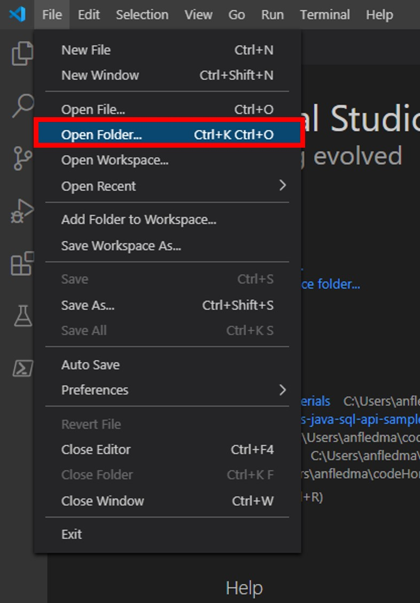
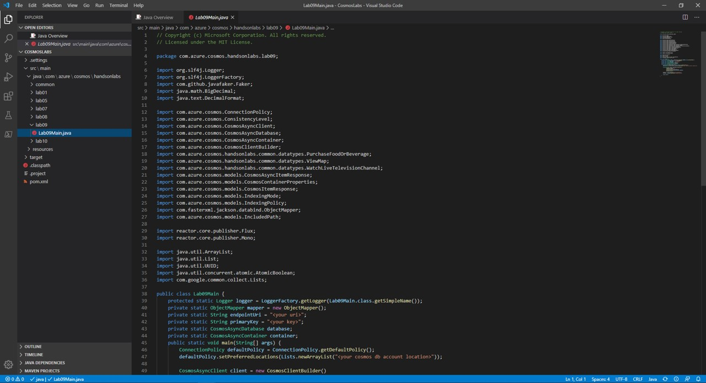
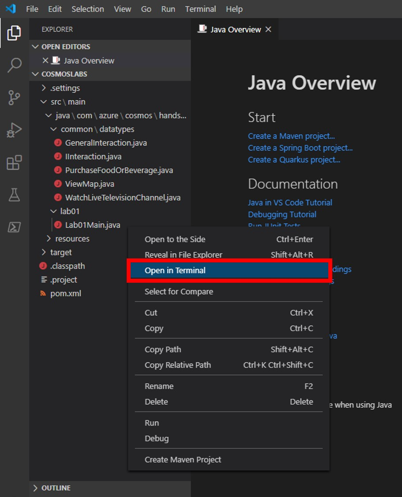
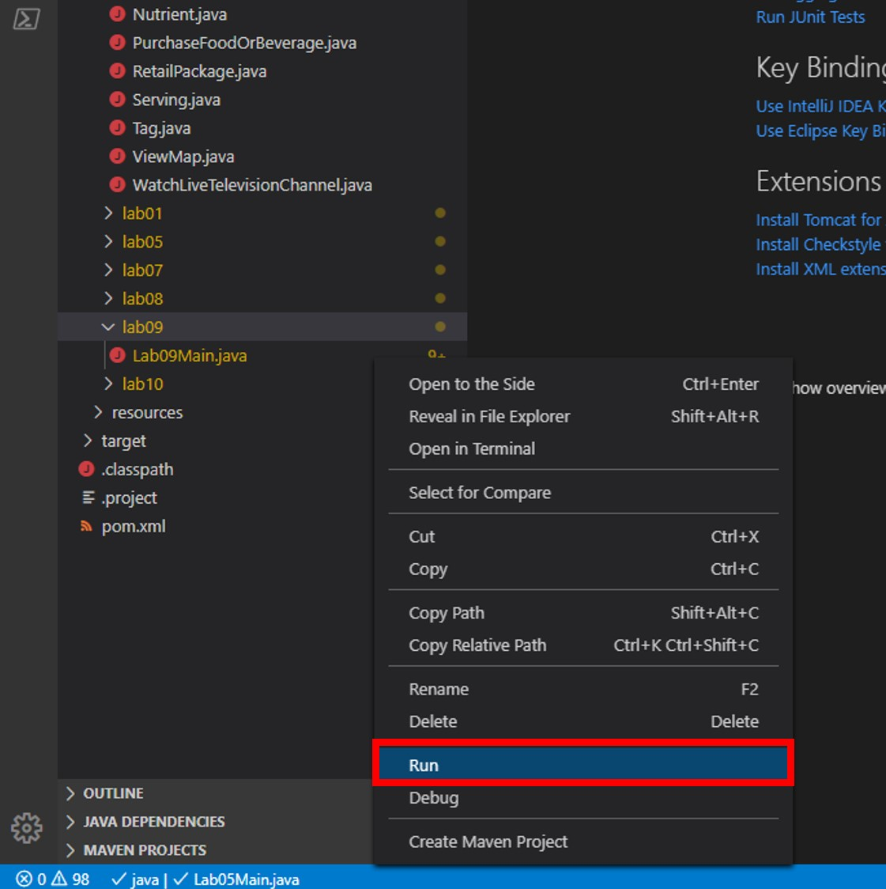

# Troubleshooting Azure Cosmos DB Performance

In this lab, you will use the Java SDK to tune Azure Cosmos DB requests to optimize the performance and cost of your application.

> If this is your first lab and you have not already completed the setup for the lab content see the instructions for [Account Setup](00-account_setup.md) before starting this lab.

## Open the CosmosLabs Maven Project Template

1. Open Visual Studio Code.

1. If you are completing this lab through Microsoft Hands-on Labs, the CosmosLabs folder will be located at the path: **your\home\directory\Documents\CosmosLabs**. In Visual Studio Code, go to **File > Open Folder >** to get an Open Folder dialog and and use the dialog to open the CosmosLabs folder. 

    

1. Expand the directory tree to **src\main\java\com\azure\cosmos\handsonlabs\\lab09\\** folder. This directory is where you will develop code for this Lab. You should see only a **Lab09Main.java** file - this is the ``main`` class for the project.

1. Open **Lab09Main.java** in the editor by clicking on it in the **Explorer** pane.

    

1. In the Visual Studio Code window, in the **Explorer** pane, right-click the empty space in pane and choose the **Open in Terminal** menu option.

    

1. Let's start by building the template code. In the open terminal pane, enter and execute the following command:

    ```sh
    mvn clean package
    ```

    > This command will build the console project.

1. Click the **🗙** symbol to close the terminal pane.

1. For the `endpointUri` variable, replace the placeholder value with the **URI** value and for the `primaryKey` variable, replace the placeholder value with the **PRIMARY KEY** value from your Azure Cosmos DB account. Use [these instructions](00-account_setup.md) to get these values if you do not already have them:

   > For example, if your **uri** is `https://cosmosacct.documents.azure.com:443/`, your new variable assignment will look like this: `private static String endpointUri = "https://cosmosacct.documents.azure.com:443/";`.

   > For example, if your **primary key** is `elzirrKCnXlacvh1CRAnQdYVbVLspmYHQyYrhx0PltHi8wn5lHVHFnd1Xm3ad5cn4TUcH4U0MSeHsVykkFPHpQ==`, your new variable assignment will look like this: `private static String primaryKey = "elzirrKCnXlacvh1CRAnQdYVbVLspmYHQyYrhx0PltHi8wn5lHVHFnd1Xm3ad5cn4TUcH4U0MSeHsVykkFPHpQ==";`.

   > We are now going to implement a sample query to make sure our client connection code works.


## Examining Response Headers

*Azure Cosmos DB returns various response headers that can give you more metadata about your request and what operations occurred on the server-side. The Java SDK exposes many of these headers to you as properties of the ``ResourceResponse<>`` class.*

### Observe RU Charge for Large Item

1. Locate the client-create/client-close block within the ``main`` method:

    ```java
    CosmosAsyncClient client = new CosmosClientBuilder()
            .setEndpoint(endpointUri)
            .setKey(primaryKey)
            .setConnectionPolicy(defaultPolicy)
            .setConsistencyLevel(ConsistencyLevel.EVENTUAL)
            .buildAsyncClient();

    database = client.getDatabase("FinancialDatabase");
    peopleContainer = database.getContainer("PeopleCollection");
    transactionContainer = database.getContainer("TransactionCollection");         

    client.close();
    ```
    
1. After the last line of code in the using block, add a new line of code to create a new object and store it in a variable named ``person``:

    ```java
    Person person = new Person(); 
    ```

    > The ``Person`` class uses the **Faker** library to generate a fictional person with randomized properties. Here's an example of a fictional person JSON document:
    
    ```json
    {
        "website":"boehm.com",
        "gender":"female",
        "firstName":"Aurea",
        "lastName":"Schmeler",
        "userName":"rhoda.price",
        "avatar":"Rocky Mountain",
        "email":"porter.abbott@gmail.com",
        "dateOfBirth":-85629219547,
        "address":{
            "street":"Daron",
            "suite":"9578",
            "city":"Schoenhaven",
            "state":"Massachusetts",
            "zipCode":"97232",
            "geo":{
                "lat":-3.74887,
                "lng":128.71832
            }
        },
        "phone":"755-113-3899 x227",
        "company":{
            "name":"Thompson LLC",
            "catchPhrase":"Visionary dynamic strategy",
            "bs":"embrace proactive infrastructures"
        }
    }
    ```

1. Add a new line of code to invoke the ``createItem`` method of the ``CosmosAsyncContainer`` instance using the ``person`` variable as a parameter:

    ```java
    CosmosAsyncItemResponse<Person> response = peopleContainer.createItem(person).block();
    ```

1. After the last line of code in the using block, add a new line of code to print out the value of the **RequestCharge** property of the **ItemResponse<>** instance:

    ```java
    logger.info("{} RUs", response.getRequestCharge());
    ```

1. Your ``main`` method should now look like this:

    ```java
    public static void main(String[] args) {
        ConnectionPolicy defaultPolicy = ConnectionPolicy.getDefaultPolicy();
        defaultPolicy.setPreferredLocations(Lists.newArrayList("<your cosmos db account location>"));
    
        CosmosAsyncClient client = new CosmosClientBuilder()
                .setEndpoint(endpointUri)
                .setKey(primaryKey)
                .setConnectionPolicy(defaultPolicy)
                .setConsistencyLevel(ConsistencyLevel.EVENTUAL)
                .buildAsyncClient();

        database = client.getDatabase("FinancialDatabase");
        peopleContainer = database.getContainer("PeopleCollection");
        transactionContainer = database.getContainer("TransactionCollection");


        Person person = new Person(); 
        CosmosAsyncItemResponse<Person> response = peopleContainer.createItem(person).block();

        logger.info("{} RUs", response.getRequestCharge());

        client.close();        
    }
    ```

1. Save all of your open editor tabs.

1. In the **Explorer** pane, right-click **Lab09Main.java** and choose the **Run** menu option.

    

    > This command will build and execute the console project.

1. Observe the results of the console project.

    > You should see the document creation operation use between 10 and 20 RUs.

1. Click the **🗙** symbol to close the terminal pane.

1. Return to the **Azure Portal** (<http://portal.azure.com>).

1. On the left side of the portal, click the **Resource groups** link.

1. In the **Resource groups** blade, locate and select the **cosmoslab** *Resource Group*.

1. In the **cosmoslab** blade, select the **Azure Cosmos DB** account you recently created.

1. In the **Azure Cosmos DB** blade, locate and click the **Data Explorer** link on the left side of the blade.

1. In the **Data Explorer** section, expand the **FinancialDatabase** database node and then select the **PeopleCollection** node.

1. Click the **New SQL Query** button at the top of the **Data Explorer** section.

1. In the query tab, replace the contents of the *query editor* with the following SQL query:

    ```sql
    SELECT TOP 2 * FROM coll ORDER BY coll._ts DESC
    ```

    > This query will return the latest two items added to your container.

1. Click the **Execute Query** button in the query tab to run the query. 

1. In the **Results** pane, observe the results of your query.

1. Return to the currently open **Visual Studio Code** editor containing your Java project.

1. In the Visual Studio Code window, double-click the **Lab09Main.java** file to open an editor tab for the file.

1. To view the RU charge for inserting a very large document, we will create a ``Family`` instance. The ``Family`` class uses the **Faker** library to create a fictional family on our ``Member`` object. To create a fictional family, we will generate a spouse and an array of 4 fictional children:

    ```json
    {
        "accountHolder":  { ... }, 
        "relatives": {
            "spouse": { ... }, 
            "children": [
                { ... }, 
                { ... }, 
                { ... }, 
                { ... }
            ]
        }
    }
    ```

    Each property will have a **Faker**-generated fictional person. This should create a large JSON document that we can use to observe RU charges.

1. Within the **Lab09Main.java** editor tab, locate the ``main`` method.

1. Within the ``main`` method, locate the following line of code: 

    ```java
    Person person = new Person(); 
    CosmosAsyncItemResponse<Person> response = peopleContainer.createItem(person).block();

    logger.info("First item insert: {} RUs", response.getRequestCharge());
    ```

    Replace that line of code with the following code:

    ```java
    List<Person> children = new ArrayList<Person>();
    for (int i=0; i<4; i++) children.add(new Person());
    Member member = new Member(UUID.randomUUID().toString(),
                                new Person(), // accountHolder
                                new Family(new Person(), // spouse
                                            children)); // children

    CosmosAsyncItemResponse<Member> response = peopleContainer.createItem(member).block();

    logger.info("Second item insert: {} RUs", response.getRequestCharge());                                            
    ```

    > This new block of code will create the large JSON object discussed above.

1. Save all of your open editor tabs.

1. Right-click and run the project as you did previously.

1. Observe the results of the console project.

    > You should see this new operation require far more RUs than the simple JSON document.

1. Click the **🗙** symbol to close the terminal pane.

1. Return to the **Azure Portal** (<http://portal.azure.com>).

1. On the left side of the portal, click the **Resource groups** link.

1. In the **Resource groups** blade, locate and select the **cosmoslab** *Resource Group*.

1. In the **cosmoslab** blade, select the **Azure Cosmos DB** account you recently created.

1. In the **Azure Cosmos DB** blade, locate and click the **Data Explorer** link on the left side of the blade.

1. In the **Data Explorer** section, expand the **FinancialDatabase** database node and then select the **PeopleCollection** node.

1. Click the **New SQL Query** button at the top of the **Data Explorer** section.

1. In the query tab, replace the contents of the *query editor* with the following SQL query:

    ```sql
    SELECT * FROM coll WHERE IS_DEFINED(coll.relatives)
    ```

    > This query will return the only item in your container with a property named **Children**.

1. Click the **Execute Query** button in the query tab to run the query. 

1. In the **Results** pane, observe the results of your query.

### Tune Index Policy

1. In the **Azure Cosmos DB** blade, locate and click the **Data Explorer** link on the left side of the blade.

1. In the **Data Explorer** section, expand the **FinancialDatabase** database node, expand the **PeopleCollection** node, and then select the **Scale & Settings** option.

1. In the **Settings** section, locate the **Indexing Policy** field and observe the current default indexing policy:

    ```js
    {
        "indexingMode": "consistent",
        "automatic": true,
        "includedPaths": [
            {
                "path": "/*",
                "indexes": [
                    {
                        "kind": "Range",
                        "dataType": "Number",
                        "precision": -1
                    },
                    {
                        "kind": "Range",
                        "dataType": "String",
                        "precision": -1
                    },
                    {
                        "kind": "Spatial",
                        "dataType": "Point"
                    }
                ]
            }
        ],
        "excludedPaths": [
            {
                "path":"/\"_etag\"/?"
            }
        ]
    }
    ```

    > This policy will index all paths in your JSON document. This policy implements maximum precision (-1) for both numbers (max 8) and strings (max 100) paths. This policy will also index spatial data.

1. Replace the indexing policy with a new policy that removes the ``/relatives/*`` path from the index:

    ```js
    {
        "indexingMode": "consistent",
        "automatic": true,
        "includedPaths": [
            {
                "path":"/*",
                "indexes":[
                    {
                        "kind": "Range",
                        "dataType": "String",
                        "precision": -1
                    },
                    {
                        "kind": "Range",
                        "dataType": "Number",
                        "precision": -1
                    }
                ]
            }
        ],
        "excludedPaths": [
            {
                "path":"/\"_etag\"/?"
            },
            {
                "path":"/relatives/*"
            }
        ]
    }
    ```

    > This new policy will exclude the ``/relatives/*`` path from indexing effectively removing the **Children** property of your large JSON document from the index.

1. Click the **Save** button at the top of the section to persist your new indexing policy and "kick off" a transformation of the container's index.

1. Click the **New SQL Query** button at the top of the **Data Explorer** section.

1. In the query tab, replace the contents of the *query editor* with the following SQL query:

    ```sql
    SELECT * FROM coll WHERE IS_DEFINED(coll.relatives)
    ```

1. Click the **Execute Query** button in the query tab to run the query. 

    > You will see immediately that you can still determine if the **/relatives** path is defined.

1. In the query tab, replace the contents of the *query editor* with the following SQL query:

    ```sql
    SELECT * FROM coll WHERE IS_DEFINED(coll.relatives) ORDER BY coll.relatives.Spouse.FirstName
    ```

1. Click the **Execute Query** button in the query tab to run the query. 

    > This query will fail immediately since this property is not indexed. Keep in mind when defining indexes that only indexed properties can be used in query conditions. 

1. Now, return to Visual Studio code and run the project.

1. Observe the results of the console project.

    > You should see a difference in the number of RUs required to create this item. This is due to the indexer skipping the paths you excluded.

1. Click the **🗙** symbol to close the terminal pane.

## Troubleshooting Requests

*First, you will use the Java SDK to issue a request beyond the assigned capacity for a container. Request unit consumption is evaluated at a per-second rate. For applications that exceed the provisioned request unit rate, requests are rate-limited until the rate drops below the provisioned throughput level. When a request is rate-limited, the server preemptively ends the request with an HTTP status code of ``429 RequestRateTooLargeException`` and returns the ``x-ms-retry-after-ms`` header. The header indicates the amount of time, in milliseconds, that the client must wait before retrying the request. You will observe the rate-limiting of your requests in an example application.*

### Reducing RU Throughput for a Container

1. Return to the **Azure Portal** (<http://portal.azure.com>).

1. On the left side of the portal, click the **Resource groups** link.

1. In the **Resource groups** blade, locate and select the **cosmoslab** *Resource Group*.

1. In the **cosmoslab** blade, select the **Azure Cosmos DB** account you recently created.

1. In the **Azure Cosmos DB** blade, locate and click the **Data Explorer** link on the left side of the blade.

1. In the **Data Explorer** section, expand the **FinancialDatabase** database node, expand the **TransactionCollection** node, and then select the **Scale & Settings** option.

1. In the **Settings** section, locate the **Throughput** field and update it's value to **400**.

    > This is the minimum throughput that you can allocate to a container.

1. Click the **Save** button at the top of the section to persist your new throughput allocation.

### Observing Throttling (HTTP 429)

1. Return to the currently open **Visual Studio Code** editor containing your Java project.

1. Double-click the **Lab09Main.java** link in the **Explorer** pane to open the file in the editor.

1. Delete the code you added in ```main``` so that ```main``` once again looks like this:

    ```java
    public static void main(String[] args) {
        CosmosAsyncClient client = new CosmosClientBuilder()
                .setEndpoint(endpointUri)
                .setKey(primaryKey)
                .setConnectionPolicy(defaultPolicy)
                .setConsistencyLevel(ConsistencyLevel.EVENTUAL)
                .buildAsyncClient();

        database = client.getDatabase("FinancialDatabase");
        peopleContainer = database.getContainer("PeopleCollection");
        transactionContainer = database.getContainer("TransactionCollection");         

        client.close();
    }
    ```

    > For the next few instructions, we will generate test data by creating 100 ```Transaction``` instances. Internally the empty ```Transaction``` constructor uses the **Faker** library to populate the object fields. For this lab, our intent is to **focus on Azure Cosmos DB** instead of this library; therefore we will introduce the code that creates the dataset but not spend too much time discussing how it works internally.

1. Add the following code to create a collection of ``Transaction`` instances:

    ```java
    List<Transaction> transactions = new ArrayList<Transaction>();
    for (int i=0; i<100; i++) transactions.add(new Transaction());
    ```
    
1. Add the following foreach block to iterate over the ``Transaction`` instances:

    ```java
    for (Transaction transaction : transactions) {

    }
    ```

1. Within the foreach block, add the following line of code to asynchronously create an item and save the result of the creation task to a variable:

    ```java
    CosmosAsyncItemResponse<Transaction> result = transactionContainer.createItem(transaction).block();
    ```

    > The ``createItem`` method of the ``CosmosAsyncContainer`` class takes in an object that you would like to serialize into JSON and store as an item within the specified collection.

1. Still within the foreach block, add the following line of code to write the value of the newly created resource's ``id`` property to the console:

    ```java
    logger.info("Item Created {}", result.getItem().getId());
    ```

    > The ``CosmosAsyncItemResponse`` type has an access method named ``getItem`` that can give you access to the item instance resulting from the operation.

1. Your ```main``` method should look like this:

    ```java
    public static void main(String[] args) {
        ConnectionPolicy defaultPolicy = ConnectionPolicy.getDefaultPolicy();
        defaultPolicy.setPreferredLocations(Lists.newArrayList("your-cosmosdb-account-location"));
    
        CosmosAsyncClient client = new CosmosClientBuilder()
                .setEndpoint(endpointUri)
                .setKey(primaryKey)
                .setConnectionPolicy(defaultPolicy)
                .setConsistencyLevel(ConsistencyLevel.EVENTUAL)
                .buildAsyncClient();

        database = client.getDatabase("FinancialDatabase");
        peopleContainer = database.getContainer("PeopleCollection");
        transactionContainer = database.getContainer("TransactionCollection");

        List<Transaction> transactions = new ArrayList<Transaction>();
        for (int i=0; i<100; i++) transactions.add(new Transaction());

        for (Transaction transaction : transactions) {
            CosmosAsyncItemResponse<Transaction> result = transactionContainer.createItem(transaction).block();
            logger.info("Item Created {}", result.getItem().getId());
        }

        client.close();        
    }
    ```

    > As a reminder, under the hood the **Faker** library generates a set of test data inside of the ``Transaction`` constructor. 

1. Save all of your open editor tabs.

1. Run the project.

1. Observe the output of the console application.

    > You should see a list of item ids associated with new items that are being created by this tool.

1. Click the **🗙** symbol to close the terminal pane.

1. Although this code uses the Async API to insert documents into an Azure Cosmos DB container, we are using the API in a synchronous manner by blocking on each ``createItem`` call. A sync implementation on one thread probably can't saturate the container provisioned throughput. Now let's rewrite these ``createItem`` calls in an async Reactive Programming fashion and see what happens when we saturate the full 400 RU/s provisioned for the container. Back in the code editor tab, locate the following lines of code:

    ```java
    for (Transaction transaction : transactions) {
        CosmosAsyncItemResponse<Transaction> result = transactionContainer.createItem(transaction).block();
        logger.info("Item Created {}", result.getItem().getId());
    }
    ```

    Replace those lines of code with the following code:

    ```java
    Flux<Transaction> interactionsFlux = Flux.fromIterable(transactions);
    List<CosmosAsyncItemResponse<Transaction>> results = 
        interactionsFlux.flatMap(interaction -> {
            return transactionContainer.createItem(interaction);
    })
    .collectList()
    .block();

    results.forEach(result -> logger.info("Item Created\t{}",result.getItem().getId()));
    ```

    > We are going to attempt to run as many of these creation tasks in parallel as possible. Remember, our container is configured at 400 RU/s.

1. Your ```main``` method should look like this:

    ```java
    public static void main(String[] args) {
        ConnectionPolicy defaultPolicy = ConnectionPolicy.getDefaultPolicy();
        defaultPolicy.setPreferredLocations(Lists.newArrayList("your-cosmosdb-account-location"));
    
        CosmosAsyncClient client = new CosmosClientBuilder()
                .setEndpoint(endpointUri)
                .setKey(primaryKey)
                .setConnectionPolicy(defaultPolicy)
                .setConsistencyLevel(ConsistencyLevel.EVENTUAL)
                .buildAsyncClient();

        database = client.getDatabase("FinancialDatabase");
        peopleContainer = database.getContainer("PeopleCollection");
        transactionContainer = database.getContainer("TransactionCollection");

        List<Transaction> transactions = new ArrayList<Transaction>();
        for (int i=0; i<100; i++) transactions.add(new Transaction());

        Flux<Transaction> interactionsFlux = Flux.fromIterable(transactions);
        List<CosmosAsyncItemResponse<Transaction>> results = 
            interactionsFlux.flatMap(interaction -> {
                return transactionContainer.createItem(interaction);
        })
        .collectList()
        .block();

        results.forEach(result -> logger.info("Item Created\t{}",result.getItem().getId()));

        client.close();        
    }
    ```

    > In this implementation we use a **Reactor factory method** ``Flux.fromIterable`` to create a Reactive Flux ``interactionsFlux`` from our ``Transaction`` list. We then use ``interactionsFlux`` as the ``Publisher`` in a Reactive Streams pipeline which issues successive ``createItem`` requests without waiting for the previous request to complete. Thus this is an Async implementation. The **for-each** loop at the end of this code block iterates over the request results and prints a notification for each. Since these requests are issued nearly in parallel, increasing the number of documents should quickly cause an exceptional scenario since your Azure Cosmos DB container does not have enough assigned throughput to handle the volume of requests.

1. Save all of your open editor tabs.

1. In the Visual Studio Code window, right-click the **Explorer** pane and select the **Open in Terminal** menu option.

1. Run the project.

1. Observe the output of the console application.

    > This query should execute successfully. We are only creating 100 items and we most likely will not run into any throughput issues here.

1. Click the **🗙** symbol to close the terminal pane.

1. Back in the code editor tab, locate the following line of code:

    ```java
    for (int i=0; i<100; i++) transactions.add(new Transaction());
    ```

    Replace that line of code with the following code:

    ```java
    for (int i=0; i<5000; i++) transactions.add(new Transaction());
    ```

    > We are going to try and create 5000 items in parallel to see if we can hit the container throughput limit. The numbers will depend highly on your PC hardware specs so you may need to tweak the document count.

1. Save all of your open editor tabs.

1. Run the project.

1. Observe that the application will begin issuing error messages and possibly crash during this time.

    > This query will most likely hit our throughput limit. You will see multiple error messages indicating that specific requests have failed.

1. Click the **🗙** symbol to close the terminal pane.

### Increasing R/U Throughput to Reduce Throttling

1. Return to the **Azure Portal** (<http://portal.azure.com>).

1. On the left side of the portal, click the **Resource groups** link.

1. In the **Resource groups** blade, locate and select the **cosmoslab** *Resource Group*.

1. In the **cosmoslab** blade, select the **Azure Cosmos DB** account you recently created.

1. In the **Azure Cosmos DB** blade, locate and click the **Data Explorer** link on the left side of the blade.

1. In the **Data Explorer** section, expand the **FinancialDatabase** database node, expand the **TransactionCollection** node, and then select the **Scale & Settings** option.

1. In the **Settings** section, locate the **Throughput** field and update it's value to **10000**.

1. Click the **Save** button at the top of the section to persist your new throughput allocation.

1. Back in the code editor tab, locate the following line of code:

    ```csharp
    for (int i=0; i<5000; i++) transactions.add(new Transaction());
    ```

    Replace that line of code with the following code:

    ```csharp
    for (int i=0; i<10000; i++) transactions.add(new Transaction());
    ```

    > We are going to try creating 10000 items in parallel against the new higher throughput limit.

1. Save all of your open editor tabs.

1. Run the project.

1. Observe that the application will complete after some time.

1. Click the **🗙** symbol to close the terminal pane.

1. Return to the **Settings** section in the **Azure Portal** and change the **Throughput** value back to **400**.

1. Click the **Save** button at the top of the section to persist your new throughput allocation.

## Tuning Queries and Reads

*You will now tune your requests to Azure Cosmos DB by manipulating the SQL query and properties of the **RequestOptions** class in the Java SDK.*

### Measuring RU Charge

1. Locate the *using* block within the ```main``` method and delete the code added for the previous section so it again looks like this:

1. Delete the code you added in ```main``` so that ```main``` once again looks like this:

    ```java
    public static void main(String[] args) {
        CosmosAsyncClient client = new CosmosClientBuilder()
                .setEndpoint(endpointUri)
                .setKey(primaryKey)
                .setConnectionPolicy(defaultPolicy)
                .setConsistencyLevel(ConsistencyLevel.EVENTUAL)
                .buildAsyncClient();

        database = client.getDatabase("FinancialDatabase");
        peopleContainer = database.getContainer("PeopleCollection");
        transactionContainer = database.getContainer("TransactionCollection");         

        client.close();
    }
    ```

1. Add the following line of code that will store a SQL query in a string variable:

    ```java
    String sql = "SELECT TOP 1000 * FROM c WHERE c.processed = true ORDER BY c.amount DESC";
    ```

    > This query will perform a cross-partition ORDER BY and only return the top 1000 out of 50000 items.

1. Add the following Reactive Stream code which creates an item query instance. Let's take only the first "page" of results. We'll include a line which prints out the Request Charge metric for the query to the console:

    > We will not enumerate the full result set. We are only interested in the metrics for the first page of results.

    ```java
    FeedOptions options = new FeedOptions();
    //optionsA.setMaxDegreeOfParallelism(1);
    transactionContainer.queryItems(sql, options, Transaction.class)
            .byPage()
            .next() // Take only the first page
            .flatMap(page -> {
            logger.info("Request Charge: {} RUs",page.getRequestCharge());
            return Mono.empty();
    }).block();
    ```

1. Save all of your open editor tabs.

1. Run the project.

1. Observe the output of the console application.

    > You should see the **Request Charge** metric printed out in your console window.

1. Click the **🗙** symbol to close the terminal pane.

1. Back in the code editor tab, locate the following line of code:

    ```java
    String sql = "SELECT TOP 1000 * FROM c WHERE c.processed = true ORDER BY c.amount DESC";
    ```

    Replace that line of code with the following code:

    ```java
    String sql = "SELECT * FROM c WHERE c.processed = true";
    ```

    > This new query does not perform a cross-partition ORDER BY.

1. Save all of your open editor tabs.

1. Run the project.

1. Observe the output of the console application.

    > You should see a reduction in the **Request Charge** value.

1. Back in the code editor tab, locate the following line of code:

    ```java
    String sql = "SELECT * FROM c WHERE c.processed = true";
    ```

    Replace that line of code with the following code:

    ```java
    String sql = "SELECT * FROM c";
    ```

    > This new query does not filter the result set.

1. Save all of your open editor tabs.

1. Run the project.

1. Observe the output of the console application.

    > The **Request Charge** should be even lower.

1. Back in the code editor tab, locate the following line of code:

     ```java
     string sql = "SELECT * FROM c";
     ```

     Replace that line of code with the following code:

     ```java
     string sql = "SELECT c.id FROM c";
     ```

     > This new query does not filter the result set.

1. Save all of your open editor tabs.

1. Run the project.

1. Observe the output of the console application.

    > Observe the slight differences in the **Request Charge** value.

### Managing SDK Query Options

1. Delete the code you added in ```main``` so that ```main``` once again looks like this:

    ```java
    public static void main(String[] args) {
        CosmosAsyncClient client = new CosmosClientBuilder()
                .setEndpoint(endpointUri)
                .setKey(primaryKey)
                .setConnectionPolicy(defaultPolicy)
                .setConsistencyLevel(ConsistencyLevel.EVENTUAL)
                .buildAsyncClient();

        database = client.getDatabase("FinancialDatabase");
        peopleContainer = database.getContainer("PeopleCollection");
        transactionContainer = database.getContainer("TransactionCollection");         

        client.close();
    }
    ```

1. Add the following lines of code to create variables to configure query options:

    ```java
    int maxItemCount = 100;
    int maxDegreeOfParallelism = 1;
    int maxBufferedItemCount = 0;
    ```

1. Add the following lines of code to configure options for a query from the variables:

    ```java
    FeedOptions options = new FeedOptions();
    options.setMaxItemCount(maxItemCount);
    options.setMaxBufferedItemCount(maxBufferedItemCount);
    options.setMaxDegreeOfParallelism(maxDegreeOfParallelism);
    ```

1. Add the following code to write various values to the console window:

    ```java
    logger.info("\n\n" +
                "MaxItemCount:\t{}\n" +
                "MaxDegreeOfParallelism:\t{}\n" +
                "MaxBufferedItemCount:\t{}" + 
                "\n\n",
                maxItemCount, maxDegreeOfParallelism, maxBufferedItemCount);
    ```

1. Add the following line of code that will store a SQL query in a string variable:

    ```java
    String sql = "SELECT * FROM c WHERE c.processed = true ORDER BY c.amount DESC";
    ```

    > This query will perform a cross-partition ORDER BY on a filtered result set.

1. Add the following line of code to create and start new a high-precision timer:

    ```java
    StopWatch timer = StopWatch.createStarted();
    ```

1. Add the following line of code to create a item query instance and enumerate the result set:

    ```java
    transactionContainer.queryItems(sql, options, Transaction.class)
            .byPage()
            .flatMap(page -> {
            //Don't do anything with the query page results
            return Mono.empty();
    }).blockLast();
    ```

    > Since the results are paged and the pages are exposed a ```Flux```, we will use ```flatMap``` to service each page.

1. Add the following line of code stop the timer:

    ```java
    timer.stop();
    ```

1. Add the following line of code to write the timer's results to the console window:

    ```java
    logger.info("\n\nElapsed Time:\t{}s\n\n", ((double)timer.getTime(TimeUnit.MILLISECONDS))/1000.0);
    ```

1. Save all of your open editor tabs.

1. Run the project.

1. Observe the output of the console application.

    > This initial query should take an unexpectedly long amount of time. This will require us to optimize our SDK options.

1. Back in the code editor tab, locate the following line of code:

    ```java
    int maxDegreeOfParallelism = 1;
    ```

    Replace that line of code with the following:

    ```java
    int maxDegreeOfParallelism = 5;
    ```

    > Setting the ``maxConcurrency`` query parameter to a value of ``1`` effectively eliminates parallelism. Here we "bump up" the parallelism to a value of ``5``.

1. Save all of your open editor tabs.

1. Run the project.

1. Observe the output of the console application.

    > You should see a slight difference considering you now have some form of parallelism.

1. Back in the code editor tab, locate the following line of code:

    ```java
    int maxBufferedItemCount = 0;
    ```

    Replace that line of code with the following code:

    ```java
    int maxBufferedItemCount = -1;
    ```

    > Setting the ``MaxBufferedItemCount`` property to a value of ``-1`` effectively tells the SDK to manage this setting.

1. Save all of your open editor tabs.

1. Run the project.

1. Observe the output of the console application.

    > Again, this should have a slight impact on your performance time.
1. Back in the code editor tab, locate the following line of code:

    ```java
    int maxDegreeOfParallelism = 5;
    ```

    Replace that line of code with the following code:

    ```java
    int maxDegreeOfParallelism = -1;
    ```

    > Parallel query works by querying multiple partitions in parallel. However, data from an individual partitioned container is fetched serially with respect to the query setting the ``maxConcurrency`` property to a value of ``-1`` effectively tells the SDK to manage this setting. Setting the **MaxDegreeOfParallelism** to the number of partitions has the maximum chance of achieving the most performant query, provided all other system conditions remain the same.

1. Save all of your open editor tabs.

1. Run the project.

1. Observe the output of the console application.

    > Again, this should have a slight impact on your performance time.

1. Back in the code editor tab, locate the following line of code:

    ```java
    int maxItemCount = 100;
    ```

    Replace that line of code with the following code:

    ```java
    int maxItemCount = 500;
    ```

    > We are increasing the amount of items returned per "page" in an attempt to improve the performance of the query.

1. Save all of your open editor tabs.

1. Run the project.

1. Observe the output of the console application.

    > You will notice that the query performance improved dramatically. This may be an indicator that our query was bottlenecked by the client computer.

1. Back in the code editor tab, locate the following line of code:

    ```java
    int maxItemCount = 500;
    ```

    Replace that line of code with the following code:

    ```java
    int maxItemCount = 1000;
    ```

    > For large queries, it is recommended that you increase the page size up to a value of 1000.

1. Save all of your open editor tabs.

1. Run the project.

1. Observe the output of the console application.

    > By increasing the page size, you have sped up the query even more.

1. Back in the code editor tab, locate the following line of code:

    ```java
    int maxBufferedItemCount = -1;
    ```

    Replace that line of code with the following code:

    ```java
    int maxBufferedItemCount = 50000;
    ```

    > Parallel query is designed to pre-fetch results while the current batch of results is being processed by the client. The pre-fetching helps in overall latency improvement of a query. **MaxBufferedItemCount** is the parameter to limit the number of pre-fetched results. Setting MaxBufferedItemCount to the expected number of results returned (or a higher number) allows the query to receive maximum benefit from pre-fetching.

1. Save all of your open editor tabs.

1. Run the project.

1. Observe the output of the console application.

    > This change should have decreased your query time by a small amount.

1. Click the **🗙** symbol to close the terminal pane.

### Reading and Querying Items

1. Return to the **Azure Portal** (<http://portal.azure.com>).

1. On the left side of the portal, click the **Resource groups** link.

1. In the **Resource groups** blade, locate and select the **cosmoslab** *Resource Group*.

1. In the **cosmoslab** blade, select the **Azure Cosmos DB** account you recently created.

1. In the **Azure Cosmos DB** blade, locate and click the **Data Explorer** link on the left side of the blade.

1. In the **Data Explorer** section, expand the **FinancialDatabase** database node, expand the **PeopleCollection** node, and then select the **Items** option.

1. Take note of the **id** property value of any document as well as that document's **partition key**.

1. Delete the code you added in ```main``` so that ```main``` once again looks like this:

    ```java
    public static void main(String[] args) {
        CosmosAsyncClient client = new CosmosClientBuilder()
                .setEndpoint(endpointUri)
                .setKey(primaryKey)
                .setConnectionPolicy(defaultPolicy)
                .setConsistencyLevel(ConsistencyLevel.EVENTUAL)
                .buildAsyncClient();

        database = client.getDatabase("FinancialDatabase");
        peopleContainer = database.getContainer("PeopleCollection");
        transactionContainer = database.getContainer("TransactionCollection");         

        client.close();
    }
    ```

1. Add the following line of code that will store a SQL query in a string variable (replacing **example.document** with the **id ** value that you noted earlier):

    ```java
    String sql = "SELECT TOP 1 * FROM c WHERE c.id = 'example.document'";
    ```

    > This query will find a single item matching the specified unique id.

1. Add the following line of code to create an item query instance and get the first page of results. We'll also print out the value of the **RequestCharge** property for the page and then the content of the retrieved item:

    ```java
    FeedOptions options = new FeedOptions();

    peopleContainer.queryItems(sql, options, Member.class)
            .byPage()
            .next()
            .flatMap(page -> {
            logger.info("\n\n" +
                        "{} RUs for\n" +
                        "{}" + 
                        "\n\n",
                        page.getRequestCharge(),
                        page.getElements().iterator().next());
            return Mono.empty();
    }).block();
    ```

1. Save all of your open editor tabs.

1. Run the project.

1. Observe the output of the console application.

    > You should see the amount of RUs used to query for the item. Make note of the **LastName** object property value as you will use it in the next step.

1. Click the **🗙** symbol to close the terminal pane.

1. Delete the code you added in ```main``` so that ```main``` once again looks like this:

    ```java
    public static void main(String[] args) {
        CosmosAsyncClient client = new CosmosClientBuilder()
                .setEndpoint(endpointUri)
                .setKey(primaryKey)
                .setConnectionPolicy(defaultPolicy)
                .setConsistencyLevel(ConsistencyLevel.EVENTUAL)
                .buildAsyncClient();

        database = client.getDatabase("FinancialDatabase");
        peopleContainer = database.getContainer("PeopleCollection");
        transactionContainer = database.getContainer("TransactionCollection");         

        client.close();
    }
    ```

1. Add the following code to use the ```readItem``` method of the ```CosmosAsyncContainer``` class to retrieve an item using the unique id and the partition key set to the last name from the previous step. Add a line to print out the value of the **RequestCharge** property:

    ```java
    peopleContainer.readItem("example.document", new PartitionKey("<LastName>"), Member.class)
    .flatMap(response -> {
        logger.info("\n\n{} RUs\n\n",response.getRequestCharge());
        return Mono.empty();
    }).block();
    ```
   
1. Save all of your open editor tabs.

1. Run the project.

1. Observe the output of the console application.

    > You should see that it took fewer RUs to obtain the item directly if you have it's unique id.

1. Click the **🗙** symbol to close the terminal pane.

## Setting Throughput for Expected Workloads

*Using appropriate RU settings for container or database throughput can allow you to meet desired performance at minimal cost. Deciding on a good baseline and varying settings based on expected usage patterns are both strategies that can help.*

### Estimating Throughput Needs

1. We'll start out by looking at actual usage of your Cosmos account for these labs. Return to the **Azure Portal** (<http://portal.azure.com>).

1. On the left side of the portal, click the **Resource groups** link.

1. In the **Resource groups** blade, locate and select the **cosmoslab** *Resource Group*.

1. In the **cosmoslab** blade, select the **Azure Cosmos DB** account you recently created.

1. In the **Azure Cosmos DB** blade, locate and click the **Metrics** link on the left side of the blade under the **Monitoring** section. Observe the values in the *Number of requests* graph to see the volume of requests your lab work has been making to your Cosmos containers.

    

    > Various parameters can be changed to adjust the data shown in the graphs and there is also an option to export data to csv for further analysis. For an existing application this can be helpful in determining your query volume.

1. Return to the Visual Studio Code window and locate the *WriteLineAsync* line within the ```main``` method in **Lab09Main.java**:

    ```java
    logger.info("\n\n{} RUs\n\n",pointReadResponse.getRequestCharge());
    ```

1. Following that line, add the following code to use the ```createItem``` method of the ```CosmosAsyncContainer``` class to add a new item and print out the value of the **RequestCharge** property:

    ```java
    Member member = new Member();
    CosmosAsyncItemResponse<Member> createResponse = peopleContainer.createItem(member).block();
    logger.info("{} RUs", createResponse.getRequestCharge());
    ```

1. Now, find the following line inside the ```readItem``` Reactive Stream

    ```java
    logger.info("\n\n{} RUs\n\n",response.getRequestCharge());
    ```
   Above this line add the following lines of code to create variables to represent the estimated workload for our application:

    ```java
    int expectedWritesPerSec = 200;
    int expectedReadsPerSec = 800;
    ```

    > These types of numbers could come from planning a new application or tracking actual usage of an existing one. Details of determining workload are outside the scope of this lab.   

   Below this line add the following line of code to print out the estimated throughput needs of our application based on our test queries:

    ```java
    logger.info("\n\nEstimated load: {} RU per sec\n\n",
                    response.getRequestCharge() * expectedReadsPerSec + response.getRequestCharge() * expectedWritesPerSec);
    ```

1. Save all of your open editor tabs.

1. Run the project.

1. Observe the output of the console application.

    > You should see the total throughput needed for our application based on our estimates, which can then be used to guide our provisioned throughput setting.

1. Click the **🗙** symbol to close the terminal pane.

### Adjusting for Usage Patterns

*Many applications have workloads that vary over time in a predictable way. For example, business applications that have a heavy workload during a 9-5 business day but minimal usage outside of those hours. Cosmos throughput settings can also be varied to match this type of usage pattern.*

1. Locate the *using* block within the ```main``` method and delete the code added for the previous section:

1. Delete the code you added in ```main``` so that ```main``` once again looks like this:

    ```java
    public static void main(String[] args) {
        CosmosAsyncClient client = new CosmosClientBuilder()
                .setEndpoint(endpointUri)
                .setKey(primaryKey)
                .setConnectionPolicy(defaultPolicy)
                .setConsistencyLevel(ConsistencyLevel.EVENTUAL)
                .buildAsyncClient();

        database = client.getDatabase("FinancialDatabase");
        peopleContainer = database.getContainer("PeopleCollection");
        transactionContainer = database.getContainer("TransactionCollection");         

        client.close();
    }
    ```

1. Add the following code to retrieve the current RU/sec setting for the container:

    ```java
    int throughput = peopleContainer.readProvisionedThroughput().block();
    ```

    > Note that the type of the **Throughput** property is a nullable value. Provisioned throughput can be set either at the container or database level. If set at the database level, this property read from the **Container** will return null. When set at the container level, the same method on **Database** will return null.

1. Add the following line of code to print out the provisioned throughput value:

    ```java
    logger.info("{} RU per sec", throughput);
    ```

1. Add the following code to update the RU/sec setting for the container:

    ```java
    peopleContainer.replaceProvisionedThroughput(1000).block();
    ```

    > Although the overall minimum throughput that can be set is 400 RU/s, specific containers or databases may have higher limits depending on size of stored data, previous maximum throughput settings, or number of containers in a database. Trying to set a value below the available minimum will cause an exception here. 

1. Save all of your open editor tabs.

1. Run the project.

1. Observe the output of the console application.

    > You should see the initial provisioned value before changing to **1000**.

1. Click the **🗙** symbol to close the terminal pane.

1. Return to the **Azure Portal** (<http://portal.azure.com>).

1. On the left side of the portal, click the **Resource groups** link.

1. In the **Resource groups** blade, locate and select the **cosmoslab** *Resource Group*.

1. In the **cosmoslab** blade, select the **Azure Cosmos DB** account you recently created.

1. In the **Azure Cosmos DB** blade, locate and click the **Data Explorer** link on the left side of the blade.

1. In the **Data Explorer** section, expand the **FinancialDatabase** database node, expand the **PeopleCollection** node, and then select the **Scale & Settings** option.

1. In the **Settings** section, locate the **Throughput** field and note that is is now set to **1000**.
