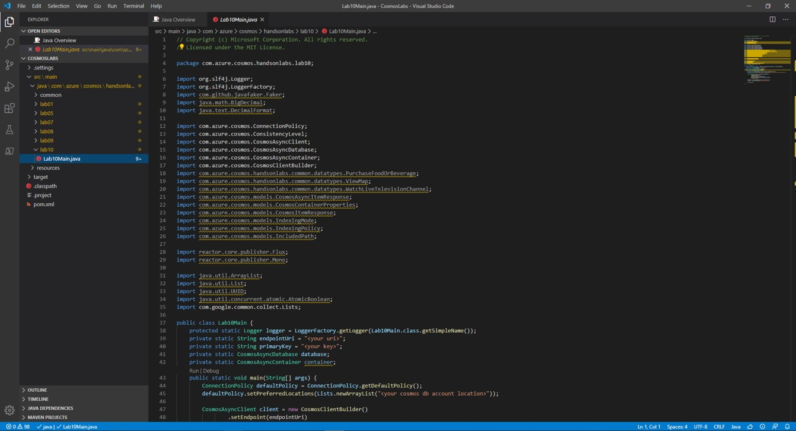

# Optimistic Concurrency Control

## Viewing the ETag Property of a Requested Resource

_The SQL API supports optimistic concurrency control (OCC) through HTTP entity tags, or ETags. Every SQL API resource has an ETag, and the ETag is set on the server every time an item is updated. In this exercise, we will view the ETag property of a resource that is requested using the SDK._

> If this is your first lab and you have not already completed the setup for the lab content see the instructions for [Account Setup](00-account_setup.md) before starting this lab.

### Open the CosmosLabs Maven Project Template

1. Open Visual Studio Code.

1. If you are completing this lab through Microsoft Hands-on Labs, the CosmosLabs folder will be located at the path: **your\home\directory\Documents\CosmosLabs**. In Visual Studio Code, go to **File > Open Folder >** to get an Open Folder dialog and and use the dialog to open the CosmosLabs folder. 

    

1. Expand the directory tree to **src\main\java\com\azure\cosmos\handsonlabs\\lab10\\** folder. This directory is where you will develop code for this Lab. You should see only a **Lab10Main.java** file - this is the **main** class for the project.

1. Open **Lab10Main.java** in the editor by clicking on it in the **Explorer** pane.

    

1. In the Visual Studio Code window, in the **Explorer** pane, right-click the empty space in pane and choose the **Open in Terminal** menu option.

    

1. Let's start by building the template code. In the open terminal pane, enter and execute the following command:

    ```sh
    mvn clean package
    ```

    > This command will build the console project.

1. Click the **🗙** symbol to close the terminal pane.

1. For the `endpointUri` variable, replace the placeholder value with the **URI** value and for the `primaryKey` variable, replace the placeholder value with the **PRIMARY KEY** value from your Azure Cosmos DB account. Use [these instructions](00-account_setup.md) to get these values if you do not already have them:

   > For example, if your **uri** is `https://cosmosacct.documents.azure.com:443/`, your new variable assignment will look like this: `private static String endpointUri = "https://cosmosacct.documents.azure.com:443/";`.

   > For example, if your **primary key** is `elzirrKCnXlacvh1CRAnQdYVbVLspmYHQyYrhx0PltHi8wn5lHVHFnd1Xm3ad5cn4TUcH4U0MSeHsVykkFPHpQ==`, your new variable assignment will look like this: `private static String primaryKey = "elzirrKCnXlacvh1CRAnQdYVbVLspmYHQyYrhx0PltHi8wn5lHVHFnd1Xm3ad5cn4TUcH4U0MSeHsVykkFPHpQ==";`.

   > We are now going to implement a sample query to make sure our client connection code works.


### Observe the ETag Property

1. Double-click the **Lab10Main.java** link in the **Explorer** pane to open the file in the editor.

1. Locate the client-create/client-close block within the **main** method:

    ```java
    CosmosAsyncClient client = new CosmosClientBuilder()
            .setEndpoint(endpointUri)
            .setKey(primaryKey)
            .setConnectionPolicy(defaultPolicy)
            .setConsistencyLevel(ConsistencyLevel.EVENTUAL)
            .buildAsyncClient();

    database = client.getDatabase("NutritionDatabase");
    container = database.getContainer("FoodCollection");            

    client.close();
    ```

1. Add the following code to asynchronously read a single item from the container, identified by its partition key and id:

   ```java
   ItemResponse<Food> response = await container.ReadItemAsync<Food>("21083", new PartitionKey("Fast Foods"));
   ```

1. Add the following line of code to show the current ETag value of the item:

   ```java
   await Console.Out.WriteLineAsync($"ETag: {response.ETag}");
   ```

   > The ETag header and the current value are included in all response messages.

1. Save all of your open editor tabs.

1. In the Visual Studio Code window, right-click the **Explorer** pane and select the **Open in Terminal** menu option.

1. In the open terminal pane, enter and execute the following command:

   ```sh
   dotnet run
   ```

   > This command will build and execute the console project.

1. Observe the output of the console application.

   > You should see an ETag for the item.

1. Enter and execute the following command:

   ```sh
   dotnet run
   ```

   > This command will build and execute the console project.

1. Observe the output of the console application.

   > The ETag should remain unchanged since the item has not been changed.

1. Click the **🗙** symbol to close the terminal pane.

1. Locate the _using_ block within the **Main** method:

   ```java
   using (CosmosClient client = new CosmosClient(_endpointUri, _primaryKey))
   {
   }
   ```

1. Within the **Main** method, locate the following line of code:

   ```java
   await Console.Out.WriteLineAsync($"ETag:\t{response.ETag}");
   ```

   Replace that line of code with the following code:

   ```java
   await Console.Out.WriteLineAsync($"Existing ETag:\t{response.ETag}");
   ```

1. Within the **using** block, add a new line of code to create an **ItemRequestOptions** instance that will use the **ETag** from the item and specify an **If-Match** header:

   ```java
   ItemRequestOptions requestOptions = new ItemRequestOptions { IfMatchEtag = response.ETag };
   ```

1. Add a new line of code to update a property of the retrieved item:

   ```java
   response.Resource.tags.Add(new Tag { name = "Demo" });
   ```

   > This line of code will modify a property of the item. Here we are modifying the **tags** collection property by adding a new **Tag** object.

1. Add a new line of code to invoke the **UpsertItemAsync** method passing in both the item and the options:

   ```java
   response = await container.UpsertItemAsync(response.Resource, requestOptions: requestOptions);
   ```

1. Add a new line of code to print out the **ETag** of the newly updated item:

   ```java
   await Console.Out.WriteLineAsync($"New ETag:\t{response.ETag}");
   ```

1. Your **Main** method should now look like this:

   ```java
   public static async Task Main(string[] args)
   {
       using (CosmosClient client = new CosmosClient(_endpointUri, _primaryKey))
       {
           var database = client.GetDatabase(_databaseId);
           var container = database.GetContainer(_containerId);

           ItemResponse<Food> response = await container.ReadItemAsync<Food>("21083", new PartitionKey("Fast Foods"));
           await Console.Out.WriteLineAsync($"Existing ETag:\t{response.ETag}");

           ItemRequestOptions requestOptions = new ItemRequestOptions { IfMatchEtag = response.ETag };
           response.Resource.tags.Add(new Tag { name = "Demo" });
           response = await container.UpsertItemAsync(response.Resource, requestOptions: requestOptions);
           await Console.Out.WriteLineAsync($"New ETag:\t{response.ETag}");
       }
   }
   ```

1. Save all of your open editor tabs.

1. In the Visual Studio Code window, right-click the **Explorer** pane and select the **Open in Terminal** menu option.

1. In the open terminal pane, enter and execute the following command:

   ```sh
   dotnet run
   ```

   > This command will build and execute the console project.

1. Observe the output of the console application.

   > You should see that the value of the ETag property has changed. The **ItemRequestOptions** class helped us implement optimistic concurrency by specifying that we wanted the SDK to use the If-Match header to allow the server to decide whether a resource should be updated. The If-Match value is the ETag value to be checked against. If the ETag value matches the server ETag value, the resource is updated. If the ETag is no longer current, the server rejects the operation with an "HTTP 412 Precondition failure" response code. The client then re-fetches the resource to acquire the current ETag value for the resource.

1. Click the **🗙** symbol to close the terminal pane.

1. Locate the _using_ block within the **Main** method:

   ```java
   using (CosmosClient client = new CosmosClient(_endpointUri, _primaryKey))
   {
   }
   ```

1. Within the **using** block, add a new line of code to again update a property of the item:

   ```java
   response.Resource.tags.Add(new Tag { name = "Failure" });
   ```

1. Add a new line of code to again invoke the **UpsertItemAsync** method passing in both the updated item and the same options as before:

   ```java
   response = await container.UpsertItemAsync(response.Resource, requestOptions: requestOptions);
   ```

   > The **ItemRequestOptions** instance has not been updated, so is still using the ETag value from the original object, which is now out of date so we should expect to now get an error.

1. Add error handling to the **UpsertItemAsync** call you just added by wrapping it with a try-catch and then output the resulting error message. The code should now look like this:

   ```java
   try
   {
       response = await container.UpsertItemAsync(response.Resource, requestOptions: requestOptions);
   }
   catch (Exception ex)
   {
       await Console.Out.WriteLineAsync($"Update error:\t{ex.Message}");
   }
   ```

1. Save all of your open editor tabs.

1. In the Visual Studio Code window, right-click the **Explorer** pane and select the **Open in Terminal** menu option.

1. In the open terminal pane, enter and execute the following command:

   ```sh
   dotnet run
   ```

   > This command will build and execute the console project.

1. Observe the output of the console application.

   > You should see that the second update call fails because value of the ETag property has changed. The **ItemRequestOptions** class specifying the original ETag value as an If-Match header caused the server to decide to reject the update operation with an "HTTP 412 Precondition failure" response code.

1. Click the **🗙** symbol to close the terminal pane.

1. Close all open editor tabs.

1. Close the Visual Studio Code application.

1. Close your browser application.
