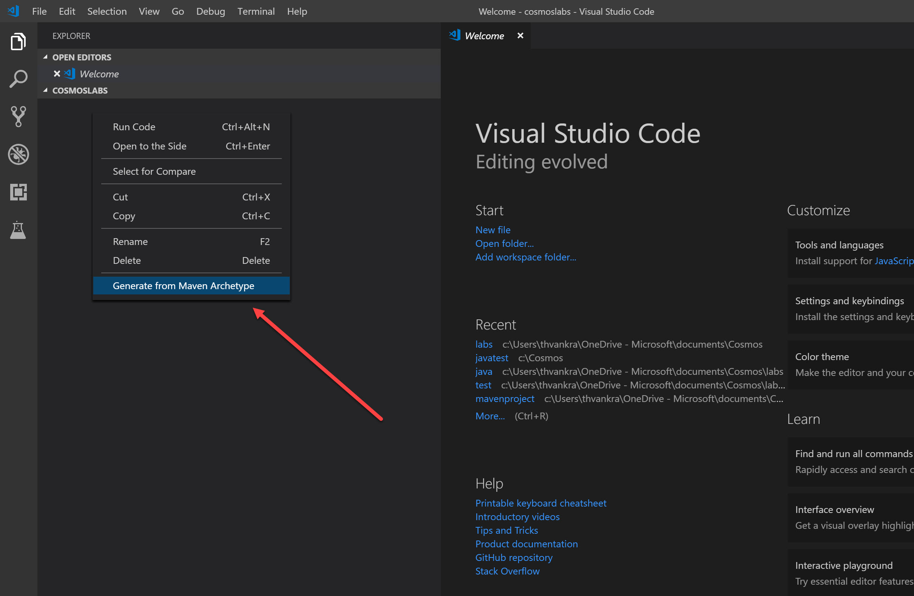
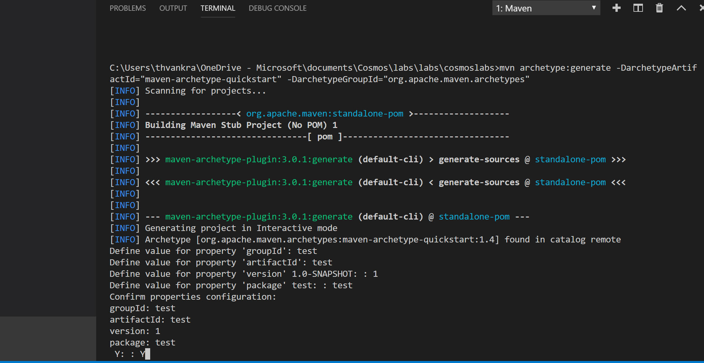
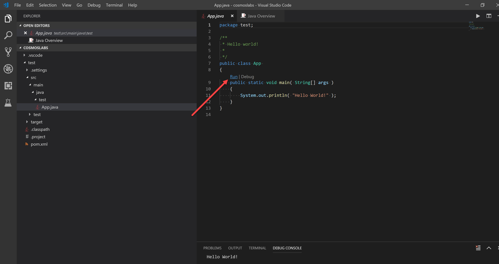
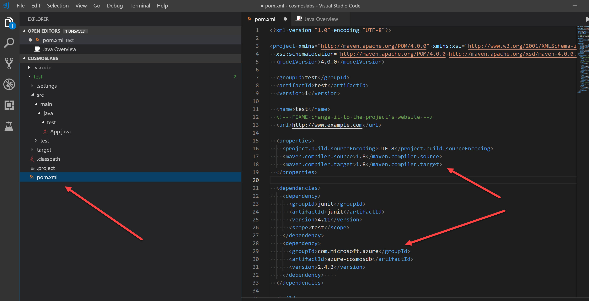
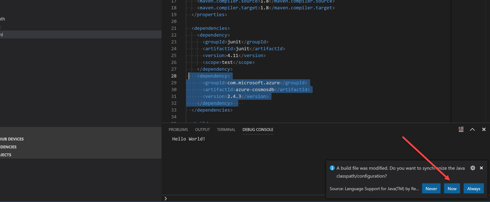
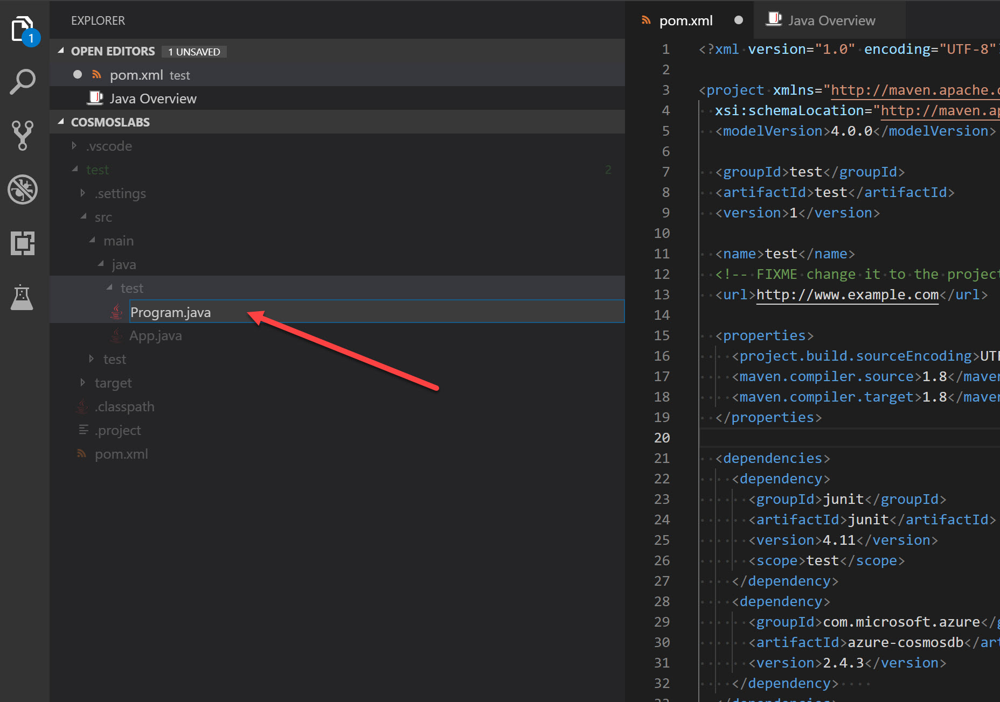
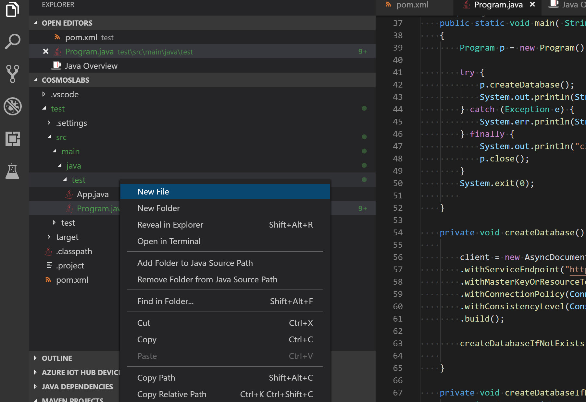
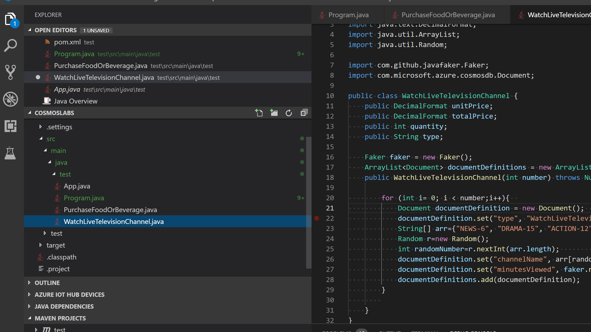

# Creating a Multi-Partition Solution using Azure Cosmos DB
In this lab, you will create multiple Azure Cosmos DB containers. Some of the containers will be unlimited and configured with a partition key, while others will be fixed-sized. You will then use the SQL API and Java Async SDK to query specific containers using a single partition key or across multiple partition keys.

## Log-in to the Azure Portal

1. In a new window, sign in to the **Azure Portal** (<http://portal.azure.com>).

1. Once you have logged in, you may be prompted to start a tour of the Azure portal. You can safely skip this step.

## Setup

> Before you start this lab, you will need to create an Azure Cosmos DB database and collection that you will use throughout the lab. The Java Async SDK requires credentials to connect to your Azure Cosmos DB account. You will collect and store these credentials for use throughout the lab.

### Retrieve Account Credentials

1. On the left side of the portal, click the **Resource groups** link.

    

1. In the **Resource groups** blade, locate and select the **cosmosgroup-lab** *Resource Group*.

    

1. In the **cosmosgroup-lab** blade, select the **Azure Cosmos DB** account you recently created.

    

1. In the **Azure Cosmos DB** blade, locate the **Settings** section and click the **Keys** link.

    

1. In the **Keys** pane, record the values in the **CONNECTION STRING**, **URI** and **PRIMARY KEY** fields. You will use these values later in this lab.

    

## Create Containers using the Java SDK

> You will start by using the Java SDK to create both fixed-size and unlimited containers to use in the lab. This lab is based on VS Code, but you may feel free to use the Java IDE of your choice. If using VS Code, ensure you install the Java Extension Pack from [here](https://marketplace.visualstudio.com/items?itemName=vscjava.vscode-java-pack). You should also install Apache Maven (see [here](https://maven.apache.org/) for maven downloads and instructions), and per the instructions, ensure that Maven is included in the PATH variable, within system variables.

### Create a Java Project

1. On your local machine, create a new folder that will be used to contain the content of your Java project.

1. In the new folder, right-click the folder and select the **Open with Code** menu option.

    

    > Alternatively, you can run a command prompt in your current directory and execute the ``code .`` command.

1. In the Visual Studio Code window that appears, right-click the **Explorer** under the folder you created, and select "Generate from Maven Archetype":

    

1. From the options that appear, select "maven-archetype-quickstart", and then select the directory you created for the project when prompted. Maven will then prompt you to provide values for group id, artifact id, version, package. Fill these in when prompted and then confirm:

    


1. Once confirmed, Maven will create the project, and provide a sample App.java. For any Java class created in the project, VS Code's Java Extension will provide "run" and "debug" links directly in the code. Clicking "run" will compile and run your Java code:

    


1. To add the Maven project dependancies required to work with Cosmos DB, you should add the following into the pom.xml file located at the bottom of your project, within the dependancies section:

    ```xml
   <dependency>
      <groupId>com.microsoft.azure</groupId>
      <artifactId>azure-cosmosdb</artifactId>
      <version>2.4.3</version>
    </dependency>
    ```

1. For this tutorial, you will also need to change the source and target compiler versions to Java 1.8, as we will use some lambda syntax which is only supported from Java 8 onwards. When finished, your pom.xml should look like the below:

    


1. Once the changes are applied, ensure you click file -> save all. At this point, VS Code will recognise that you modified the pom.xml build file. Ensure that you accept the prompt to sync the dependancies:

    

    > Once the dependencies are pulled down, you will be ready to start writing Java code for Cosmos DB.

### Create DocumentClient Instance and Database

*The AsyncDocumentClient class is the main "entry point" to using the SQL API in Azure Cosmos DB. We are going to create an instance of the **AsyncDocumentClient** class by passing in connection metadata as parameters of the class' constructor. We will then use this class instance throughout the lab.*

1. At the same level as the default "App.java" file that already exists, right click and create a new file called "Program.java":

    

1. Within the **Program.java** editor tab, Add the package declaration (which will need to match the path you created for your maven project, if not "test" as in the sample shown here) and the following imports to the top of the editor:

    ```java
    package test;
    import java.util.ArrayList;
    import java.util.Collection;
    import java.util.List;
    import java.util.concurrent.CountDownLatch;
    import java.util.concurrent.ExecutorService;
    import java.util.concurrent.Executors;
    import com.microsoft.azure.cosmosdb.ConnectionPolicy;
    import com.microsoft.azure.cosmosdb.ConsistencyLevel;
    import com.microsoft.azure.cosmosdb.DataType;
    import com.microsoft.azure.cosmosdb.Database;
    import com.microsoft.azure.cosmosdb.DocumentClientException;
    import com.microsoft.azure.cosmosdb.DocumentCollection;
    import com.microsoft.azure.cosmosdb.IncludedPath;
    import com.microsoft.azure.cosmosdb.Index;
    import com.microsoft.azure.cosmosdb.IndexingPolicy;
    import com.microsoft.azure.cosmosdb.PartitionKeyDefinition;
    import com.microsoft.azure.cosmosdb.RequestOptions;
    import com.microsoft.azure.cosmosdb.ResourceResponse;
    import com.microsoft.azure.cosmosdb.rx.AsyncDocumentClient;
    import rx.Observable;
    import rx.Scheduler;
    import rx.schedulers.Schedulers;
    ```

1. Create a **Program** class in the Program.java file as below, with the following class variables, a public constructor and main method:

    ```java
    public class Program 
    {
        private final ExecutorService executorService;
        private final Scheduler scheduler;
        private AsyncDocumentClient client;

        private final String databaseName = "EntertainmentDatabase";

        public Program() {
            //public constructor

        }
        public static void main( String[] args )
        {
 
        }
    }
    ```


1. Locate the **Program** class's constructor:

    ```java
        public Program() {
        //public constructor

        }
    ```

1. Within the constructor, add the following lines of code to create a scheduler (this is used for switching from a netty thread to a user app thread, which is required for async IO operations) and also the AsyncDocumentClient (replace "uri" and "key" with the values you recorded earlier in the lab) that we will use throughout this lab:

    ```java
        executorService = Executors.newFixedThreadPool(100);
        scheduler = Schedulers.from(executorService);
        client = new AsyncDocumentClient.Builder().withServiceEndpoint("uri")
        .withMasterKeyOrResourceToken("key")
        .withConnectionPolicy(ConnectionPolicy.GetDefault()).withConsistencyLevel(ConsistencyLevel.Eventual)
        .build();
    ```

1. Below the main method in the Program class, add the following methods for creating a database, and closing down the AsyncDocumentClient: 

    ```java
    private void createDatabase() throws Exception {
        String databaseLink = String.format("/dbs/%s", databaseName);
        Observable<ResourceResponse<Database>> databaseReadObs = client.readDatabase(databaseLink, null);
        Observable<ResourceResponse<Database>> databaseExistenceObs = databaseReadObs.doOnNext(x -> {
            System.out.println("database " + databaseName + " already exists.");
        }).onErrorResumeNext(e -> {
            if (e instanceof DocumentClientException) {
                DocumentClientException de = (DocumentClientException) e;
                if (de.getStatusCode() == 404) {
                    System.out.println("database " + databaseName + " doesn't exist," + " creating it...");
                    Database dbDefinition = new Database();
                    dbDefinition.setId(databaseName);
                    return client.createDatabase(dbDefinition, null);
                }
            }
            System.err.println("Reading database " + databaseName + " failed.");
            return Observable.error(e);
        });
        databaseExistenceObs.toCompletable().await();
        System.out.println("Checking database " + databaseName + " completed!\n");
    }

    public void close() {
        executorService.shutdown();
        client.close();
    }
    ```
    
1. Locate the **Main** method:

    ```java
        public static void main( String[] args )
        {
 
        }
    ```

1. Within the **Main** method, add the following lines of code to create and dispose of the **AsyncDocumentClient** instance:

    ```java
        Program p = new Program();

        try {
            p.createDatabase();
            System.out.println(String.format("Database created, please hold while resources are released"));
        } catch (Exception e) {
            System.err.println(String.format("DocumentDB GetStarted failed with %s", e));
        } finally {
            System.out.println("close the client");
            p.close();
        }
        System.exit(0);
    ```

1. Your ``Program`` class definition should now look like this:

    ```java
    public class Program 
    {
        private final ExecutorService executorService;
        private final Scheduler scheduler;
        private AsyncDocumentClient client;
        private final String databaseName = "EntertainmentDatabase";

        public Program() {
            executorService = Executors.newFixedThreadPool(100);
            scheduler = Schedulers.from(executorService);
            client = new AsyncDocumentClient.Builder().withServiceEndpoint("uri")
            .withMasterKeyOrResourceToken("key")
            .withConnectionPolicy(ConnectionPolicy.GetDefault()).withConsistencyLevel(ConsistencyLevel.Eventual)
            .build();
        }

        public static void main( String[] args )
        {
            Program p = new Program();

            try {
                p.createDatabase();
                System.out.println(String.format("Database created, please hold while resources are released"));
            } catch (Exception e) {
                System.err.println(String.format("DocumentDB GetStarted failed with %s", e));
            } finally {
                System.out.println("close the client");
                p.close();
            }
            System.exit(0);
            
        }

        private void createDatabase() throws Exception {
            String databaseLink = String.format("/dbs/%s", databaseName);
            Observable<ResourceResponse<Database>> databaseReadObs = client.readDatabase(databaseLink, null);
            Observable<ResourceResponse<Database>> databaseExistenceObs = databaseReadObs.doOnNext(x -> {
                System.out.println("database " + databaseName + " already exists.");
            }).onErrorResumeNext(e -> {
                if (e instanceof DocumentClientException) {
                    DocumentClientException de = (DocumentClientException) e;
                    if (de.getStatusCode() == 404) {
                        System.out.println("database " + databaseName + " doesn't exist," + " creating it...");
                        Database dbDefinition = new Database();
                        dbDefinition.setId(databaseName);
                        return client.createDatabase(dbDefinition, null);
                    }
                }
                System.err.println("Reading database " + databaseName + " failed.");
                return Observable.error(e);
            });
            databaseExistenceObs.toCompletable().await();
            System.out.println("Checking database " + databaseName + " completed!\n");
        }

        public void close() {
            executorService.shutdown();
            client.close();
        }
    }
    ```

1. Save all of your open editor tabs.

1. In the Visual Studio Code window, select the "run" option (from "run" and "debug") that should appear within your class file (or compile and run the code in your java IDE of choice). After the code has compiled and run, you should be able to view the database in Data Explorer from the Azure portal. 


### Create an Unlimited Collection using the SDK

*Unlimited containers have higher storage and throughput limits. To create a container as unlimited, you must specify a partition key and a minimum throughput of 1,000 RU/s. You will specify those values when creating a container in this task. A partition key is a logical hint for distributing data onto a scaled out underlying set of physical partitions and for efficiently routing queries to the appropriate underlying partition. To learn more, refer to [/docs.microsoft.com/azure/cosmos-db/partition-data](../media/https://docs.microsoft.com/en-us/azure/cosmos-db/partition-data).*


1. Go back to your Program class and add three new instance variables:

    ```java
    private final String collectionId = "CustomCollection";
    private final String partitionKeyPath = "/type";
    private final int throughPut = 400;

1. Now create another method within the class, below the createDatabaseIfNotExists() method, to define the multi-partition parameters. This will set indexing policy for your collection, and include the partition key (defined as "/type" in your instance variable) and collection id (the name of the collection defined in your instance variable):

    ```java
    private DocumentCollection getMultiPartitionCollectionDefinition() {
        DocumentCollection collectionDefinition = new DocumentCollection();
        collectionDefinition.setId(collectionId);

        PartitionKeyDefinition partitionKeyDefinition = new PartitionKeyDefinition();
        List<String> paths = new ArrayList<>();
        paths.add(partitionKeyPath);
        partitionKeyDefinition.setPaths(paths);
        collectionDefinition.setPartitionKey(partitionKeyDefinition);

        // Set indexing policy to be range range for string and number
        IndexingPolicy indexingPolicy = new IndexingPolicy();
        Collection<IncludedPath> includedPaths = new ArrayList<>();
        IncludedPath includedPath = new IncludedPath();
        includedPath.setPath("/*");
        Collection<Index> indexes = new ArrayList<>();
        Index stringIndex = Index.Range(DataType.String);
        stringIndex.set("precision", -1);
        indexes.add(stringIndex);

        Index numberIndex = Index.Range(DataType.Number);
        numberIndex.set("precision", -1);
        indexes.add(numberIndex);
        includedPath.setIndexes(indexes);
        includedPaths.add(includedPath);
        indexingPolicy.setIncludedPaths(includedPaths);
        collectionDefinition.setIndexingPolicy(indexingPolicy);

        return collectionDefinition;
    }
    ```
     > By default, all Azure Cosmos DB data is indexed. Although many customers are happy to let Azure Cosmos DB automatically handle all aspects of indexing, you can specify a custom indexing policy for collections. This indexing policy we created is very similar to the default indexing policy created by the SDK but it implements a **Range** index on string types instead of a **Hash** index.   

1. Now, below this method, add another method that will create the multi partition collection. This will also set the throughput value:

    ```java
    public void createMultiPartitionCollection() throws Exception {
        RequestOptions multiPartitionRequestOptions = new RequestOptions();
        multiPartitionRequestOptions.setOfferThroughput(throughPut);
        String databaseLink = String.format("/dbs/%s", databaseName);

        Observable<ResourceResponse<DocumentCollection>> createCollectionObservable = client.createCollection(
            databaseLink, getMultiPartitionCollectionDefinition(), multiPartitionRequestOptions);

        final CountDownLatch countDownLatch = new CountDownLatch(1);

        createCollectionObservable.single() // We know there is only single result
                .subscribe(collectionResourceResponse -> {
                    System.out.println(collectionResourceResponse.getActivityId());
                    countDownLatch.countDown();
                }, error -> {
                    System.err.println(
                            "an error occurred while creating the collection: actual cause: " + error.getMessage());
                    countDownLatch.countDown();
                });
        System.out.println("creating collection...");
        countDownLatch.await();
    }
    ```

1. Finally, add a call to the new createMultiPartitionCollection() nethod in the main method of your Program class:

    ```java
    public static void main(String[] args) {
        Program p = new Program();

        try {
            p.createDatabase();
            System.out.println(String.format("Database created, please hold while resources are released"));
 
            //create collection...
            p.createMultiPartitionCollection();
            
        } catch (Exception e) {
            System.err.println(String.format("DocumentDB GetStarted failed with %s", e));
        } finally {
            System.out.println("close the client");
            p.close();
        }
        System.exit(0);

    }
        

    }
    ```

1. Your Program class should now look like this:

    ```java
    public class Program {
        private final ExecutorService executorService;
        private final Scheduler scheduler;
        private AsyncDocumentClient client;

        private final String databaseName = "EntertainmentDatabase";
        private final String collectionId = "CustomCollection";
        private final String partitionKeyPath = "/type";
        private final int throughPut = 400;

        public Program() {
            executorService = Executors.newFixedThreadPool(100);
            scheduler = Schedulers.from(executorService);
            client = new AsyncDocumentClient.Builder().withServiceEndpoint("uri")
            .withMasterKeyOrResourceToken("key")
            .withConnectionPolicy(ConnectionPolicy.GetDefault()).withConsistencyLevel(ConsistencyLevel.Eventual)
            .build();
        }

        public static void main(String[] args) {
            Program p = new Program();

            try {
                p.createDatabase();
                System.out.println(String.format("Database created, please hold while resources are released"));
    
                //create collection...
                p.createMultiPartitionCollection();

            } catch (Exception e) {
                System.err.println(String.format("DocumentDB GetStarted failed with %s", e));
            } finally {
                System.out.println("close the client");
                p.close();
            }
            System.exit(0);

        }


        private void createDatabase() throws Exception {
            String databaseLink = String.format("/dbs/%s", databaseName);
            Observable<ResourceResponse<Database>> databaseReadObs = client.readDatabase(databaseLink, null);
            Observable<ResourceResponse<Database>> databaseExistenceObs = databaseReadObs.doOnNext(x -> {
                System.out.println("database " + databaseName + " already exists.");
            }).onErrorResumeNext(e -> {
                if (e instanceof DocumentClientException) {
                    DocumentClientException de = (DocumentClientException) e;
                    if (de.getStatusCode() == 404) {
                        System.out.println("database " + databaseName + " doesn't exist," + " creating it...");
                        Database dbDefinition = new Database();
                        dbDefinition.setId(databaseName);
                        return client.createDatabase(dbDefinition, null);
                    }
                }
                System.err.println("Reading database " + databaseName + " failed.");
                return Observable.error(e);
            });
            databaseExistenceObs.toCompletable().await();
            System.out.println("Checking database " + databaseName + " completed!\n");
        }

        

        private DocumentCollection getMultiPartitionCollectionDefinition() {
            DocumentCollection collectionDefinition = new DocumentCollection();
            collectionDefinition.setId(collectionId);

            PartitionKeyDefinition partitionKeyDefinition = new PartitionKeyDefinition();
            List<String> paths = new ArrayList<>();
            paths.add(partitionKeyPath);
            partitionKeyDefinition.setPaths(paths);
            collectionDefinition.setPartitionKey(partitionKeyDefinition);

            // Set indexing policy to be range range for string and number
            IndexingPolicy indexingPolicy = new IndexingPolicy();
            Collection<IncludedPath> includedPaths = new ArrayList<>();
            IncludedPath includedPath = new IncludedPath();
            includedPath.setPath("/*");
            Collection<Index> indexes = new ArrayList<>();
            Index stringIndex = Index.Range(DataType.String);
            stringIndex.set("precision", -1);
            indexes.add(stringIndex);

            Index numberIndex = Index.Range(DataType.Number);
            numberIndex.set("precision", -1);
            indexes.add(numberIndex);
            includedPath.setIndexes(indexes);
            includedPaths.add(includedPath);
            indexingPolicy.setIncludedPaths(includedPaths);
            collectionDefinition.setIndexingPolicy(indexingPolicy);

            return collectionDefinition;
        }
    
        public void createMultiPartitionCollection() throws Exception {
            RequestOptions multiPartitionRequestOptions = new RequestOptions();
            multiPartitionRequestOptions.setOfferThroughput(throughPut);
            String databaseLink = String.format("/dbs/%s", databaseName);

            Observable<ResourceResponse<DocumentCollection>> createCollectionObservable = client.createCollection(
                databaseLink, getMultiPartitionCollectionDefinition(), multiPartitionRequestOptions);

            final CountDownLatch countDownLatch = new CountDownLatch(1);

            createCollectionObservable.single() // We know there is only single result
                    .subscribe(collectionResourceResponse -> {
                        System.out.println(collectionResourceResponse.getActivityId());
                        countDownLatch.countDown();
                    }, error -> {
                        System.err.println(
                                "an error occurred while creating the collection: actual cause: " + error.getMessage());
                        countDownLatch.countDown();
                    });
            System.out.println("creating collection...");
            countDownLatch.await();
        }

        public void close() {
            executorService.shutdown();
            client.close();
        }
    }
    ```


### Observe Newly Created Database and Collections in the Portal

1. In a new window, sign in to the **Azure Portal** (<http://portal.azure.com>).

1. On the left side of the portal, click the **Resource groups** link.

    

1. In the **Resource groups** blade, locate and select the **cosmosgroup-lab** *Resource Group*.

    

1. In the **cosmosgroup-lab** blade, select the **Azure Cosmos DB** account you recently created.

    

1. In the **Azure Cosmos DB** blade, observe the new collections and database displayed in the middle of the blade.

    

1. Locate and click the **Data Explorer** link on the left side of the blade.

    

1. In the **Data Explorer** section, expand the **EntertainmentDatabase** database node and then observe the collection nodes. 

    

1. Expand the **DefaultCollection** node. Within the node, click the **Scale & Settings** link.

    

1. Observe the following properties of the collection:

    - Storage Capacity

    - Assigned Throughput

    - Indexing Policy

    

    > You will quickly notice that this is a fixed-size container that has a limited amount of RU/s. The indexing policy is also interesting as it implements a Hash index on string types and Range index on numeric types.

    ```js
    {
        "indexingMode": "consistent",
        "automatic": true,
        "includedPaths": [
            {
                "path": "/*",
                "indexes": [
                    {
                        "kind": "Range",
                        "dataType": "Number",
                        "precision": -1
                    },
                    {
                        "kind": "Hash",
                        "dataType": "String",
                        "precision": 3
                    }
                ]
            }
        ],
        "excludedPaths": []
    }
    ```

1. Back in the **Data Explorer** section, expand the **CustomCollection** node. Within the node, click the **Scale & Settings** link.

1. Observe the following properties of the collection and compare them to the last collection:

    - Storage Capacity

    - Assigned Throughput

    - Partition Key

    - Indexing Policy

    > You configured all of these values when you created this collection using the SDK. You should take time to look at the custom indexing policy you created using the SDK.

    ```js
    {
        "indexingMode": "consistent",
        "automatic": true,
        "includedPaths": [
            {
                "path": "/*",
                "indexes": [
                    {
                        "kind": "Range",
                        "dataType": "Number",
                        "precision": -1
                    },
                    {
                        "kind": "Range",
                        "dataType": "String",
                        "precision": -1
                    }
                ]
            }
        ],
        "excludedPaths": []
    }
    ```
    
1. Close your browser window displaying the Azure Portal.

## Populate a Collection with Documents using the SDK

> You will now use the Async Java SDK to populate your collection with various documents of varying schemas. These documents will be serialized instances of multiple Java classes that you will create in your project. To help generate random data in the documents, we are going to use a java library called "javafaker", so you will need to add the following to your pom.xml file, located at the bottom of your project, within the dependancies section (ensure you accept the "synchronize the Java classpath/configuration" warning if you have not accepted this permanently):

    ```xml
        <dependency>
            <groupId>com.github.javafaker</groupId>
            <artifactId>javafaker</artifactId>
            <version>0.17.2</version>
        </dependency>  
    ```

### Create Classes

1. In the Visual Studio Code window, at the "test" directory (or whatever you named the classpath when creating your maven project) right-click the **Explorer** pane and select the **New File** menu option.

    

1. Name the new file **PurchaseFoodOrBeverage.java** . The editor tab will automatically open for the new file. Paste in the following code for the ``PurchaseFoodOrBeverage`` class (ensure the package declaration matches the classpath for your project):

    ```java
    package test;

    import java.text.DecimalFormat;
    import java.util.ArrayList;
    import com.github.javafaker.Faker;
    import com.microsoft.azure.cosmosdb.Document;

    public class PurchaseFoodOrBeverage {
        Faker faker = new Faker();
        ArrayList<Document> documentDefinitions = new ArrayList<>();  
        public PurchaseFoodOrBeverage(int number) throws NumberFormatException {
            for (int i= 0; i < number;i++){  
                Document documentDefinition = new Document(); 
                DecimalFormat df = new DecimalFormat("###.###");      
                documentDefinition.set("type", "PurchaseFoodOrBeverage");            
                documentDefinition.set("quantity", faker.random().nextInt(1, 5));            
                String unitPrice = df.format(Double.valueOf((Double)faker.random().nextDouble()));
                documentDefinition.set("unitPrice", Double.valueOf(unitPrice));
                int quantity = Integer.valueOf((Integer)documentDefinition.get("quantity"));        
                String totalPrice = df.format(Double.valueOf(unitPrice) * quantity);
                documentDefinition.set("totalPrice", Double.valueOf(totalPrice));
                documentDefinitions.add(documentDefinition);
            }      
        }
    }
    ```

    
1. In the Visual Studio Code window, right-click the **Explorer** pane and select the **New File** menu option.

1. Name the new file **WatchLiveTelevisionChannel.java** . The editor tab will automatically open for the new file.

1. Paste in the following code for the ``WatchLiveTelevisionChannel`` class (ensure the package declaration matches the classpath for your project):

    ```java
    package test;

    import java.text.DecimalFormat;
    import java.util.ArrayList;
    import java.util.Random;

    import com.github.javafaker.Faker;
    import com.microsoft.azure.cosmosdb.Document;

    public class WatchLiveTelevisionChannel {
        Faker faker = new Faker();
        ArrayList<Document> documentDefinitions = new ArrayList<>();  
        public WatchLiveTelevisionChannel(int number) throws NumberFormatException {
            for (int i= 0; i < number;i++){  
                Document documentDefinition = new Document(); 
                DecimalFormat df = new DecimalFormat("###.###");      
                documentDefinition.set("type", "WatchLiveTelevisionChannel");   
                String[] arr={"NEWS-6", "DRAMA-15", "ACTION-12", "DOCUMENTARY-4", "SPORTS-8"};
                Random r=new Random();
                int randomNumber=r.nextInt(arr.length);        
                documentDefinition.set("channelName", arr[randomNumber]);            
                documentDefinition.set("minutesViewed", faker.random().nextInt(1, 45));
                documentDefinitions.add(documentDefinition);
            }    
        }
    }
    ```

1. Observe your newly created files in the **Explorer** pane.

    

1. Save all of your open editor tabs.

1. Close all open editor tabs.

### Populate Unlimited Collection with Data

1. Open **Program.java** in the **Explorer** pane to open the file in the editor. Remove all methods except the main() method, and remove the contents of the main method. When done your program class should look as below (with your uri and key):

    ```java
    public class Program {

        private final ExecutorService executorService;
        private final Scheduler scheduler;
        private AsyncDocumentClient client;

        private final String databaseName = "EntertainmentDatabase";
        private final String collectionId = "CustomCollection";
        private AsyncDocumentClient asyncClient;
        private final String partitionKeyPath = "/type";
        private final int throughPut = 400;


        public Program() {
            executorService = Executors.newFixedThreadPool(100);
            scheduler = Schedulers.from(executorService);
            ConnectionPolicy connectionPolicy = new ConnectionPolicy();
            connectionPolicy.setConnectionMode(ConnectionMode.Direct);
            asyncClient = new AsyncDocumentClient.Builder()
                    .withServiceEndpoint("uri")
                    .withMasterKeyOrResourceToken("key")
                    .withConnectionPolicy(connectionPolicy)
                    .withConsistencyLevel(ConsistencyLevel.Session)
                    .build();

            DocumentCollection collectionDefinition = new DocumentCollection();
            collectionDefinition.setId(UUID.randomUUID().toString());
        
        }

        public static void main(String[] args) {


        }        
    }
    ```

1. Below the main() method, add the following method to create 500 documents using the PurchaseFoodOrBeverage class:

    ```java
    public void createDocument() throws Exception {
        ArrayList<Document> documents = new PurchaseFoodOrBeverage(500).documentDefinitions;
        for (Document document: documents){
            // Create a document
            asyncClient.createDocument("dbs/" + databaseName + "/colls/" + collectionId, document, null, false)
            .toBlocking().single().getResource();
            System.out.println("inserting: "+document);
        }
    }
    ```

1. Locate the **Main** method:

    ```java
        public static void main( String[] args )
        {
 
        }
    ```

1. Add the following code within the main method:

    ```java
        Program p = new Program();

        try {
            p.createDocument();

        } catch (Exception e) {
            System.err.println(String.format("failed with %s", e));
        } 
        System.exit(0);
    ```

1. You **Program** class should now look like this:


    ```java
    public class Program {

        private final ExecutorService executorService;
        private final Scheduler scheduler;
        private AsyncDocumentClient client;

        private final String databaseName = "EntertainmentDatabase";
        private final String collectionId = "CustomCollection";
        private AsyncDocumentClient asyncClient;
        private final String partitionKeyPath = "/type";
        private final int throughPut = 400;


        public Program() {
            executorService = Executors.newFixedThreadPool(100);
            scheduler = Schedulers.from(executorService);
            // Sets up the requirements for each test
            ConnectionPolicy connectionPolicy = new ConnectionPolicy();
            connectionPolicy.setConnectionMode(ConnectionMode.Direct);
            asyncClient = new AsyncDocumentClient.Builder()
                    .withServiceEndpoint("uri")
                    .withMasterKeyOrResourceToken("key")
                    .withConnectionPolicy(connectionPolicy)
                    .withConsistencyLevel(ConsistencyLevel.Session)
                    .build();

            DocumentCollection collectionDefinition = new DocumentCollection();
            collectionDefinition.setId(UUID.randomUUID().toString());
        
        }

        public static void main(String[] args) {
            Program p = new Program();

            try {
                p.createDocument();

            } catch (Exception e) {
                System.err.println(String.format("failed with %s", e));
            } 
            System.exit(0);

        }     
        public void createDocument() throws Exception {
            ArrayList<Document> documents = new PurchaseFoodOrBeverage(500).documentDefinitions;
            for (Document document: documents){
                // Create a document
                asyncClient.createDocument("dbs/" + databaseName + "/colls/" + collectionId, document, null, false)
                .toBlocking().single().getResource();
                System.out.println("inserting: "+document);
            }
        }
    }
    ```

1. Save all of your open editor tabs.

1. Click "run" in your class file (or compile and run from chosen IDE).


1. Observe the output of the console application.

    > You should see a list of documents that are being created by this tool.

1. Click the **🗙** symbol to close the terminal pane.

### Populate Unlimited Collection with Data of Different Types

1. Locate the **createDocument** method and change the documents array to use the **WatchLiveTelevisionChannel** class. It should now look like the below:

    ```java
        public void createDocument() throws Exception {
            ArrayList<Document> documents = new WatchLiveTelevisionChannel(500).documentDefinitions;
            for (Document document: documents){
                // Create a document
                asyncClient.createDocument("dbs/" + databaseName + "/colls/" + collectionId, document, null, false)
                .toBlocking().single().getResource();
                System.out.println("inserting: "+document);
            }
        }
    ```


1. Save all of your open editor tabs.

1. Click "run" in your class file (or compile and run from chosen IDE).

1. Observe the output of the console application.

    > You should see a list of documents that are being created.

1. Click the **🗙** symbol to close the terminal pane.


## Benchmark A Simple Collection using a .NET Core Application

> In the next part of this lab, you will compare various partition key choices for a large dataset using a special benchmarking tool available on GitHub.com. First, you will learn how to use the benchmarking tool using a simple collection and partition key.

### Clone Existing .NET Core Project

1. On your local machine, create a new folder that will be used to contain the content of your new .NET Core project.

1. In the new folder, right-click the folder and select the **Open with Code** menu option.

    > Alternatively, you can run a command prompt in your current directory and execute the ``code .`` command.

1. In the Visual Studio Code window that appears, right-click the **Explorer** pane and select the **Open in Command Prompt** menu option.

1. In the open terminal pane, enter and execute the following command:

    ```sh
    git clone https://github.com/seesharprun/cosmos-benchmark.git .
    ```

    > This command will create a copy of a .NET Core project located on GitHub (<https://github.com/seesharprun/cosmos-benchmark>) in your local folder.

1. Visual Studio Code will most likely prompt you to install various extensions related to **.NET Core** or **Azure Cosmos DB** development. None of these extensions are required to complete the labs.

1. In the terminal pane, enter and execute the following command:

    ```sh
    dotnet restore
    ```

    > This command will restore all packages specified as dependencies in the project.

1. In the terminal pane, enter and execute the following command:

    ```sh
    dotnet build
    ```

    > This command will build the project.

1. Click the **🗙** symbol to close the terminal pane.

1. Observe the **Program.cs** and **benchmark.csproj** files created by the .NET Core CLI.

1. Double-click the **sample.json** link in the **Explorer** pane to open the file in the editor.

1. Observe the sample JSON file

    > This file will show you a sample of the types of JSON documents that will be uploaded to your collection. Pay close attention to the **Submit\*** fields, the **DeviceId** field and the **LocationId** field.

### Update the Application's Settings

1. Double-click the **appsettings.json** link in the **Explorer** pane to open the file in the editor.

1. Locate the **/cosmosSettings.endpointUri** JSON path:

    ```js
    "endpointUri": ""
    ```

    Update the **endPointUri** property by setting it's value to the **URI** value from your Azure Cosmos DB account that you recorded earlier in this lab: 

    > For example, if your **uri** is ``https://cosmosacct.documents.azure.com:443/``, your new property will look like this: ``"endpointUri": "https://cosmosacct.documents.azure.com:443/"``.

1. Locate the **/cosmosSettings.primaryKey** JSON path:

    ```js
    "primaryKey": ""
    ```

    Update the **primaryKey** property by setting it's value to the **PRIMARY KEY** value from your Azure Cosmos DB account that you recorded earlier in this lab: 

    > For example, if your **primary key** is ``elzirrKCnXlacvh1CRAnQdYVbVLspmYHQyYrhx0PltHi8wn5lHVHFnd1Xm3ad5cn4TUcH4U0MSeHsVykkFPHpQ==``, your new property will look like this: ``"primaryKey": "elzirrKCnXlacvh1CRAnQdYVbVLspmYHQyYrhx0PltHi8wn5lHVHFnd1Xm3ad5cn4TUcH4U0MSeHsVykkFPHpQ=="``.

### Configure a Simple Collection for Benchmarking

1. Double-click the **appsettings.json** link in the **Explorer** pane to open the file in the editor.

1. Locate the **/collectionSettings** JSON path:

    ```js
    "collectionSettings": [],
    ```

    Update the **collectionSettings** property by setting it's value to the following array of JSON objects:

    ```js
    "collectionSettings": [
        {
            "id": "CollectionWithHourKey",
            "throughput": 10000,
            "partitionKeys": [ "/SubmitHour" ]
        }
    ],
    ```

    > The object above will instruct the benchmark tool to create a single collection and set it's throughput and partition key to the specified values. For this simple demo, we will use the **hour** when an IoT device recording was submitted as our partition key.

    | Collection Name | Throughput | Partition Key |
    | --- | --- | --- |
    | CollectionWithHourKey | 10000 | /SubmitHour |

1. Save all of your open editor tabs.

### Run the Benchmark Application

1. In the Visual Studio Code window, right-click the **Explorer** pane and select the **Open in Command Prompt** menu option.

1. In the open terminal pane, enter and execute the following command:

    ```sh
    dotnet run
    ```

1. Observe the results of the application's execution. Your results should look very similar to the code sample below:

    ```sh
    DocumentDBBenchmark starting...
    Database Validated:     dbs/MOEFAA==/
    Collection Validated:   dbs/MOEFAA==/colls/MOEFAN6FoQU=/
    Summary:
    ---------------------------------------------------------------------
    Endpoint:               https://cosmosacct.documents.azure.com/
    Database                IoTDeviceData
    Collection              CollectionWithHourKey
    Partition Key:          /SubmitHour
    Throughput:             10000 Request Units per Second (RU/s)
    Insert Operation:       100 Tasks Inserting 1000 Documents Total
    ---------------------------------------------------------------------

    Starting Inserts with 100 tasks
    Inserted 1000 docs @ 997 writes/s, 7220 RU/s (19B max monthly 1KB reads)

    Summary:
    ---------------------------------------------------------------------
    Total Time Elapsed:     00:00:01.0047125
    Inserted 1000 docs @ 995 writes/s, 7209 RU/s (19B max monthly 1KB reads)
    ---------------------------------------------------------------------
    ```

    > The benchmark tool tells you how long it takes to write a specific number of documents to your collection. You also get useful metadata such as the amount of **RU/s** being used and the total execution time. We are not tuning our partition key choice quite yet, we are simply learning to use the tool.

1. Press the **ENTER** key to complete the execution of the console application.

### Update the Application's Settings

1. Double-click the **appsettings.json** link in the **Explorer** pane to open the file in the editor.

1. Locate the **/cosmosSettings.numberOfDocumentsToInsert** JSON path:

    ```js
    "numberOfDocumentsToInsert": 1000
    ```

    Update the **numberOfDocumentsToInsert** property by setting it's value to **50,000**:

    ```js
    "numberOfDocumentsToInsert": 50000
    ```

1. Save all of your open editor tabs.

### Run the Benchmark Application

1. In the Visual Studio Code window, right-click the **Explorer** pane and select the **Open in Command Prompt** menu option.

1. In the open terminal pane, enter and execute the following command:

    ```sh
    dotnet run
    ```

1. Observe the results of the application's execution. 

    > Observe the amount of time required to import multiple records.

1. Press the **ENTER** key to complete the execution of the console application.

## Benchmark Various Partition Key Choices using a .NET Core Application

> Now you will use multiple collections and partition key options to compare various strategies for partitioning a large dataset.

### Configure Multiple Collections for Benchmarking

1. Double-click the **appsettings.json** link in the **Explorer** pane to open the file in the editor.

1. Locate the **/collectionSettings** JSON path:

    ```js
    "collectionSettings": [],
    ```

    Update the **collectionSettings** property by setting it's value to the following array of JSON objects:

    ```js
    "collectionSettings": [
        {
            "id": "CollectionWithMinuteKey",
            "throughput": 10000,
            "partitionKeys": [ "/SubmitMinute" ]
        },
        {
            "id": "CollectionWithDeviceKey",
            "throughput": 10000,
            "partitionKeys": [ "/DeviceId" ]
        }
    ],
    ```

    > The object above will instruct the benchmark tool to create multiple collections and set their throughput and partition key to the specified values. For this demo, we will compare the results using each partition key.

    | Collection Name | Throughput | Partition Key |
    | --- | --- | --- |
    | CollectionWithMinuteKey | 10000 | /SubmitMinute |
    | CollectionWithDeviceKey | 10000 | /DeviceId |

1. Save all of your open editor tabs.

### Run the Benchmark Application

1. In the Visual Studio Code window, right-click the **Explorer** pane and select the **Open in Command Prompt** menu option.

1. In the open terminal pane, enter and execute the following command:

    ```sh
    dotnet run
    ```

1. Observe the results of the application's execution.

    > The timestamp on these IoT records is based on the time when the record was created. We submit the records as soon as they are created so there's very little latency between the client and server timestamp. Most of the records being submitted will be within the same minute so they share the same **SubmitMinute** partition key. This will cause a hot partition key and can constraint throughput. In this context, a hot partition key refers to when requests to the same partition key exceed the provisioned throughput and are rate-limited. A hot partition key causes high volumes of data to be stored within the same partition. Such uneven distribution is inefficient. In this demo, you should expect a total time of >20 seconds.

    ```sh
    ---------------------------------------------------------------------
    Collection              CollectionWithMinuteKey
    Partition Key:          /SubmitMinute
    Total Time Elapsed:     00:00:57.4233616
    Inserted 50000 docs @ 871 writes/s, 6304 RU/s (16B max monthly 1KB reads)
    ---------------------------------------------------------------------
    ```

    > The **SubmitMinute** partition key will most likely take longer to execute than the **DeviceId** partition key. Using the **DeviceId** partition key creates a more even distribution of requests across your various partition keys. Because of this behavior, you should notice drastically improved performance.

    ```sh
    ---------------------------------------------------------------------
    Collection              CollectionWithDeviceKey
    Partition Key:          /DeviceId
    Total Time Elapsed:     00:00:27.2769234
    Inserted 50000 docs @ 1833 writes/s, 13272 RU/s (34B max monthly 1KB reads)
    ---------------------------------------------------------------------
    ```

1. Compare the RU/s and total time for both collections.

1. Press the **ENTER** key to complete the execution of the console application.

### Observe the New Collections and Database in the Azure Portal

1. Return to the **Azure Portal** (<http://portal.azure.com>).

1. On the left side of the portal, click the **Resource groups** link.

1. In the **Resource groups** blade, locate and select the **cosmosgroup-lab** *Resource Group*.

1. In the **cosmosgroup-lab** blade, select the **Azure Cosmos DB** account you recently created.

1. In the **Azure Cosmos DB** blade, locate and click the **Data Explorer** link on the left side of the blade.

1. In the **Data Explorer** section, expand the **IoTDeviceData** database node and then observe the various collection nodes.

1. Expand the **CollectionWithDeviceKey** node. Within the node, click the **Scale & Settings** link.

1. Observe the following properties of the collection:

    - Storage Capacity

    - Assigned Throughput

    - Indexing Policy

1. Click the **New SQL Query** button at the top of the **Data Explorer** section.

1. In the query tab, replace the contents of the *query editor* with the following SQL query:

    ```sql
    SELECT VALUE COUNT(1) FROM recordings
    ```

1. Click the **Execute Query** button in the query tab to run the query. 

1. In the **Results** pane, observe the results of your query.

1. Back in the **Data Explorer** section, right-click the **IoTDeviceData** database node and select the **Delete Database** option.

    > Since you created multiple collections in this database with high throughput, it makes sense to dispose of the database immediately to minimize your Azure subscription consumption.

1. In the **Delete Database** popup enter the name of the database (**IoTDeviceData**) in the field and then press the **OK** button.

1. Close your browser application.
