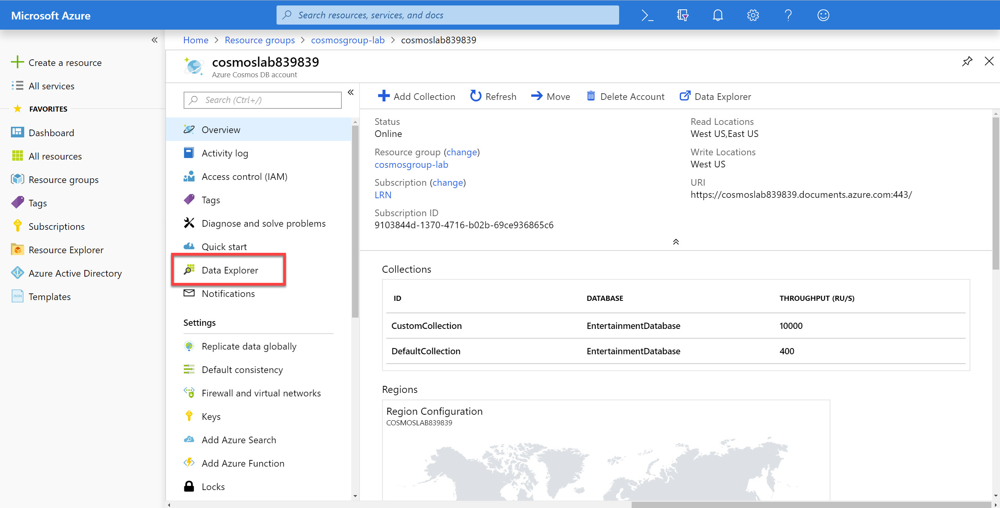
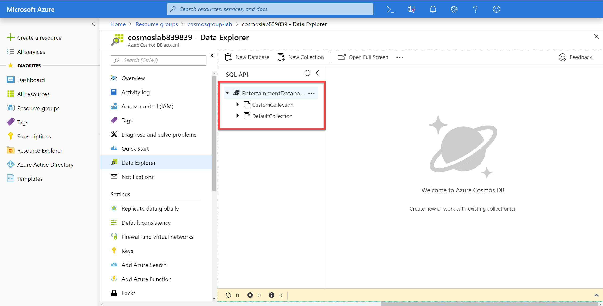
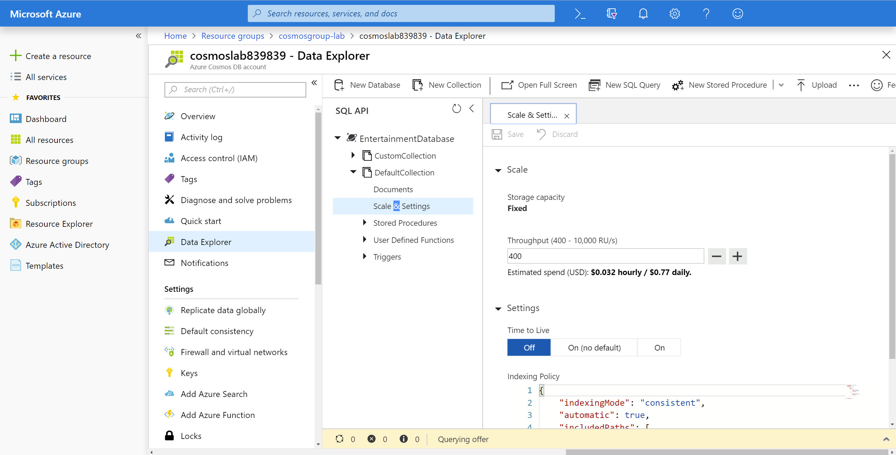

# Creating a Multi-Partition Solution using Azure Cosmos DB

In this lab, you will create multiple Azure Cosmos DB containers. Some of the containers will be unlimited and configured with a partition key, while others will be fixed-sized. You will then use the SQL API and .NET SDK to query specific containers using a single partition key or across multiple partition keys.

## Log-in to the Azure Portal

1. In a new window, sign in to the **Azure Portal** (<http://portal.azure.com>).

1. Once you have logged in, you may be prompted to start a tour of the Azure portal. You can safely skip this step.

## Setup

> Before you start this lab, you will need to create an Azure Cosmos DB database and collection that you will use throughout the lab. The .NET SDK requires credentials to connect to your Azure Cosmos DB account. You will collect and store these credentials for use throughout the lab.

### Retrieve Account Credentials

1. On the left side of the portal, click the **Resource groups** link.

    

1. In the **Resource groups** blade, locate and select the **cosmosgroup-lab** *Resource Group*.

    

1. In the **cosmosgroup-lab** blade, select the **Azure Cosmos DB** account you recently created.

    

1. In the **Azure Cosmos DB** blade, locate the **Settings** section and click the **Keys** link.

    

1. In the **Keys** pane, record the values in the **CONNECTION STRING**, **URI** and **PRIMARY KEY** fields. You will use these values later in this lab.

    

## Create Containers using the .NET SDK

> You will start by using the .NET SDK to create both fixed-size and unlimited containers to use in the lab.

### Create a .NET Core Project

1. On your local machine, create a new folder that will be used to contain the content of your .NET Core project.

1. In the new folder, right-click the folder and select the **Open with Code** menu option.

    

    > Alternatively, you can run a command prompt in your current directory and execute the ``code .`` command.

1. In the Visual Studio Code window that appears, right-click the **Explorer** pane and select the **Open in Command Prompt** menu option.

    

1. In the open terminal pane, enter and execute the following command:

    ```sh
    dotnet new console --output .
    ```

    > This command will create a new .NET Core 2.1 project. The project will be a **console** project and the project will be created in the current directly since you used the ``--output .`` option.

1. Visual Studio Code will most likely prompt you to install various extensions related to **.NET Core** or **Azure Cosmos DB** development. None of these extensions are required to complete the labs.

1. In the terminal pane, enter and execute the following command:

    ```sh
    dotnet add package Microsoft.Azure.DocumentDB.Core --version 1.9.1
    ```

    > This command will add the [Microsoft.Azure.DocumentDB.Core](../media/https://www.nuget.org/packages/Microsoft.Azure.DocumentDB.Core/) NuGet package as a project dependency. The lab instructions have been tested using the ``1.9.1`` version of this NuGet package.

1. In the terminal pane, enter and execute the following command:

    ```sh
    dotnet add package Bogus --version 22.0.8
    ```

    > This command will add the [Bogus](../media/https://www.nuget.org/packages/Bogus/) NuGet package as a project dependency. This library will allow us to quickly generate test data using a fluent syntax and minimal code. We will use this library to generate test documents to upload to our Azure Cosmos DB instance. The lab instructions have been tested using the ``22.0.8`` version of this NuGet package.

1. In the terminal pane, enter and execute the following command:

    ```sh
    dotnet restore
    ```

    > This command will restore all packages specified as dependencies in the project.

1. In the terminal pane, enter and execute the following command:

    ```sh
    dotnet build
    ```

    > This command will build the project.

1. Click the **🗙** symbol to close the terminal pane.

1. Observe the **Program.cs** and **[folder name].csproj** files created by the .NET Core CLI.

    

1. Double-click the **[folder name].csproj** link in the **Explorer** pane to open the file in the editor.

1. We will now add a new **PropertyGroup** XML element to the project configuration within the **Project** element. To add a new **PropertyGroup**, insert the following lines of code under the line that reads ``<Project Sdk="Microsoft.NET.Sdk">``:

    ```xml
    <PropertyGroup>
        <LangVersion>latest</LangVersion>
    </PropertyGroup>
    ```

1. Your new XML should look like this:

    ```xml
    <Project Sdk="Microsoft.NET.Sdk">        
        <PropertyGroup>
            <LangVersion>latest</LangVersion>
        </PropertyGroup>        
        <PropertyGroup>
            <OutputType>Exe</OutputType>
            <TargetFramework>netcoreapp2.0</TargetFramework>
        </PropertyGroup>        
        <ItemGroup>
            <PackageReference Include="Bogus" Version="22.0.7" />
            <PackageReference Include="Microsoft.Azure.DocumentDB.Core" Version="1.9.1" />
        </ItemGroup>        
    </Project>
    ```

1. Double-click the **Program.cs** link in the **Explorer** pane to open the file in the editor.

    

### Create DocumentClient Instance

*The DocumentClient class is the main "entry point" to using the SQL API in Azure Cosmos DB. We are going to create an instance of the **DocumentClient** class by passing in connection metadata as parameters of the class' constructor. We will then use this class instance throughout the lab.*

1. Within the **Program.cs** editor tab, Add the following using blocks to the top of the editor:

    ```csharp
    using System.Collections.Generic;
    using System.Collections.ObjectModel;
    using System.Linq;
    using System.Net;
    using System.Threading.Tasks;
    using Microsoft.Azure.Documents;
    using Microsoft.Azure.Documents.Client;
    using Microsoft.Azure.Documents.Linq;
    ```

1. Locate the **Program** class and replace it with the following class:

    ```csharp
    public class Program
    {
        public static async Task Main(string[] args)
        {         
        }
    }
    ```

1. Within the **Program** class, add the following lines of code to create variables for your connection information:

    ```csharp
    private static readonly Uri _endpointUri = new Uri("");
    private static readonly string _primaryKey = "";
    ```

1. For the ``_endpointUri`` variable, replace the placeholder value with the **URI** value from your Azure Cosmos DB account that you recorded earlier in this lab: 

    > For example, if your **uri** is ``https://cosmosacct.documents.azure.com:443/``, your new variable assignment will look like this: ``private static readonly Uri _endpointUri = new Uri("https://cosmosacct.documents.azure.com:443/");``.

    > Keep the **URI** value recorded, you will use it again later in this lab.

1. For the ``_primaryKey`` variable, replace the placeholder value with the **PRIMARY KEY** value from your Azure Cosmos DB account that you recorded earlier in this lab: 

    > For example, if your **primary key** is ``elzirrKCnXlacvh1CRAnQdYVbVLspmYHQyYrhx0PltHi8wn5lHVHFnd1Xm3ad5cn4TUcH4U0MSeHsVykkFPHpQ==``, your new variable assignment will look like this: ``private static readonly string _primaryKey = "elzirrKCnXlacvh1CRAnQdYVbVLspmYHQyYrhx0PltHi8wn5lHVHFnd1Xm3ad5cn4TUcH4U0MSeHsVykkFPHpQ==";``.

    > Keep the **PRIMARY KEY** value recorded, you will use it again later in this lab.
    
1. Locate the **Main** method:

    ```csharp
    public static async Task Main(string[] args)
    { 
    }
    ```

1. Within the **Main** method, add the following lines of code to author a using block that creates and disposes a **DocumentClient** instance:

    ```csharp
    using (DocumentClient client = new DocumentClient(_endpointUri, _primaryKey))
    {        
    }
    ```

1. Your ``Program`` class definition should now look like this:

    ```csharp
    public class Program
    { 
        private static readonly Uri _endpointUri = new Uri("<your uri>");
        private static readonly string _primaryKey = "<your key>";
        public static async Task Main(string[] args)
        {    
            using (DocumentClient client = new DocumentClient(_endpointUri, _primaryKey))
            {
            }     
        }
    }
    ```

    > We will now execute a build of the application to make sure our code compiles successfully.

1. Save all of your open editor tabs.

1. In the Visual Studio Code window, right-click the **Explorer** pane and select the **Open in Command Prompt** menu option.

1. In the open terminal pane, enter and execute the following command:

    ```sh
    dotnet build
    ```

    > This command will build the console project.

1. Click the **🗙** symbol to close the terminal pane.

1. Close all open editor tabs.

### Create Database using the SDK

1. Locate the using block within the **Main** method:

    ```csharp
    using (DocumentClient client = new DocumentClient(_endpointUri, _primaryKey))
    {                        
    }
    ```

1. Add the following code to the method to create a new ``Database`` instance:

    ```csharp
    Database targetDatabase = new Database { Id = "EntertainmentDatabase" };
    ```

1. Add the following code to create a new database instance if one does not already exist:

    ```csharp
    targetDatabase = await client.CreateDatabaseIfNotExistsAsync(targetDatabase);
    ```

    > This code will check to see if a database exists in your Azure Cosmos DB account that meets the specified parameters. If a database that matches does not exist, it will create a new database.

1. Add the following code to print out the self-link of the database:

    ```csharp
    await Console.Out.WriteLineAsync($"Database Self-Link:\t{targetDatabase.SelfLink}");
    ```

    > The ``targetDatabase`` variable will have metadata about the database whether a new database is created or an existing one is read.

1. Save all of your open editor tabs.

1. In the Visual Studio Code window, right-click the **Explorer** pane and select the **Open in Command Prompt** menu option.

1. In the open terminal pane, enter and execute the following command:

    ```sh
    dotnet run
    ```

    > This command will build and execute the console project.

1. Observe the output of the running command.

    > In the console window, you will see the self-link string for the database resource in your Azure Cosmos DB account.

1. In the open terminal pane, enter and execute the following command again:

    ```sh
    dotnet run
    ```

    > This command will build and execute the console project.

1. Again, observe the output of the running command.

    > Since the database already exists, you will see the same self-link on both executions of the console application. This simply means that the SDK detected that the database already exists and used the existing database instance instead of creating a new instance of the database.

1. Click the **🗙** symbol to close the terminal pane.

### Create a Fixed Collection using the SDK

*Azure Cosmos DB containers can be created as fixed or unlimited in the Azure portal. Fixed-size containers have a maximum limit of 10 GB and 10,000 RU/s throughput. Throughput is the rate at which the database takes in and processes data. A request unit is a normalized quantity that represents the amount of computation required to serve a request. In Cosmos DB, you reserve a guaranteed amount of throughput on a collection or across the database, measured in RU/s. To learn more, refer to [/docs.microsoft.com/azure/cosmos-db/request-units](https://docs.microsoft.com/en-us/azure/cosmos-db/request-units). You will create a fixed-size container in this task.*

1. Locate the using block within the **Main** method and delete any existing code:

    ```csharp
    using (DocumentClient client = new DocumentClient(_endpointUri, _primaryKey))
    {                        
    }
    ```

1. Add the following code to the method to open a connection asynchronously:

    ```csharp
    await client.OpenAsync();
    ```

1. Add the following code to the method to create a self-link to an existing database:

    ```csharp
    Uri databaseLink = UriFactory.CreateDatabaseUri("EntertainmentDatabase");
    ```

1. Add the following lines of code to create a new ``DocumentCollection`` instance where you only specify a value for the ``Id`` property:

    ```csharp
    DocumentCollection defaultCollection = new DocumentCollection 
    { 
        Id = "DefaultCollection" 
    };
    ```

    > We are going to rely on the default values set for a collection created using the .NET SDK.

1. Add the following code to create a new collection instance if one does not already exist within your database:

    ```csharp
    defaultCollection = await client.CreateDocumentCollectionIfNotExistsAsync(databaseLink, defaultCollection);
    ```

    > This code will check to see if a collection exists in your database that meets the specified parameters. If a collection that matches does not exist, it will create a new collection.

1. Add the following code to print out the self-link of the database:

    ```csharp
    await Console.Out.WriteLineAsync($"Default Collection Self-Link:\t{defaultCollection.SelfLink}"); 
    ```

    > The ``defaultCollection`` variable will have metadata about the collection whether a new collection is created or an existing one is read.

1. Save all of your open editor tabs.

1. In the Visual Studio Code window, right-click the **Explorer** pane and select the **Open in Command Prompt** menu option.

1. In the open terminal pane, enter and execute the following command:

    ```sh
    dotnet run
    ```

    > This command will build and execute the console project.

1. Observe the output of the running command.

1. Click the **🗙** symbol to close the terminal pane.

### Create an Unlimited Collection using the SDK

*Unlimited containers have higher storage and throughput limits. To create a container as unlimited, you must specify a partition key and a minimum throughput of 1,000 RU/s. You will specify those values when creating a container in this task. A partition key is a logical hint for distributing data onto a scaled out underlying set of physical partitions and for efficiently routing queries to the appropriate underlying partition. To learn more, refer to [/docs.microsoft.com/azure/cosmos-db/partition-data](../media/https://docs.microsoft.com/en-us/azure/cosmos-db/partition-data).*

1. Locate the using block within the **Main** method and delete any existing code:

    ```csharp
    using (DocumentClient client = new DocumentClient(_endpointUri, _primaryKey))
    {                        
    }
    ```

1. Add the following code to the method to open a connection to the database asynchronously:

    ```csharp
    await client.OpenAsync();
    ```

    > By default, the first request has a higher latency because it has to fetch the address routing table. To avoid this startup latency on the first request, you should call ``OpenAsync()`` once during initialization as follows.

1. Add the following code to the method to create a self-link to an existing database:

    ```csharp
    Uri databaseLink = UriFactory.CreateDatabaseUri("EntertainmentDatabase");
    ```

1. Add the following code to create a new ``IndexingPolicy`` instance with a custom indexing policy configured:

    ```csharp
    IndexingPolicy indexingPolicy = new IndexingPolicy
    {
        IndexingMode = IndexingMode.Consistent,
        Automatic = true,
        IncludedPaths = new Collection<IncludedPath>
        {
            new IncludedPath
            {
                Path = "/*",
                Indexes = new Collection<Index>
                {
                    new RangeIndex(DataType.Number, -1),
                    new RangeIndex(DataType.String, -1)                           
                }
            }
        }
    };
    ```

    > By default, all Azure Cosmos DB data is indexed. Although many customers are happy to let Azure Cosmos DB automatically handle all aspects of indexing, you can specify a custom indexing policy for collections. This indexing policy is very similar to the default indexing policy created by the SDK but it implements a **Range** index on string types instead of a **Hash** index.

1. Add the following code to create a new ``PartitionKeyDefinition`` instance with a single partition key of ``/type`` defined:

    ```csharp
    PartitionKeyDefinition partitionKeyDefinition = new PartitionKeyDefinition
    {
        Paths = new Collection<string> { "/type" }
    };
    ```

    > This definition will create a partition key on the ``/type`` path. Partition key paths are case sensitive. This is especially important when you consider JSON property casing in the context of .NET CLR object to JSON object serialization.

1. Add the following lines of code to create a new ``DocumentCollection`` instance where you specify values for multiple properties:

    ```csharp
    DocumentCollection customCollection = new DocumentCollection
    {
        Id = "CustomCollection",
        PartitionKey = partitionKeyDefinition,
        IndexingPolicy = indexingPolicy
    };   
    ```

    > We are going to explicitly specify various values for a collection created using the .NET SDK.

1. Add the following code to create a new ``RequestOptions`` instance seting the **throughput** for the collection:

    ```csharp
    RequestOptions requestOptions = new RequestOptions
    {
        OfferThroughput = 10000
    };
    ```

    > Here is where we can specify the RU/s allocated for the collection. If this is not specified, the SDK has a default value for RU/s assigned to a collection.

1. Add the following code to create a new collection instance if one does not already exist within your database:

    ```csharp
    customCollection = await client.CreateDocumentCollectionIfNotExistsAsync(databaseLink, customCollection, requestOptions);         
    ```

    > This code will check to see if a collection exists in your database that meets all of the specified parameters. If a collection that matches does not exist, it will create a new collection.

1. Add the following code to print out the self-link of the database:

    ```csharp
    await Console.Out.WriteLineAsync($"Custom Collection Self-Link:\t{customCollection.SelfLink}");  
    ```

    > The ``customCollection`` variable will have metadata about the collection whether a new collection is created or an existing one is read.

1. Save all of your open editor tabs.

1. In the Visual Studio Code window, right-click the **Explorer** pane and select the **Open in Command Prompt** menu option.

1. In the open terminal pane, enter and execute the following command:

    ```sh
    dotnet run
    ```

    > This command will build and execute the console project.

1. Observe the output of the running command.

1. Click the **🗙** symbol to close the terminal pane.

1. Close all open editor tabs.

### Observe Newly Created Database and Collections in the Portal

1. In a new window, sign in to the **Azure Portal** (<http://portal.azure.com>).

1. On the left side of the portal, click the **Resource groups** link.

    

1. In the **Resource groups** blade, locate and select the **cosmosgroup-lab** *Resource Group*.

    

1. In the **cosmosgroup-lab** blade, select the **Azure Cosmos DB** account you recently created.

    

1. In the **Azure Cosmos DB** blade, observe the new collections and database displayed in the middle of the blade.

    

1. Locate and click the **Data Explorer** link on the left side of the blade.

    

1. In the **Data Explorer** section, expand the **EntertainmentDatabase** database node and then observe the collection nodes. 

    

1. Expand the **DefaultCollection** node. Within the node, click the **Scale & Settings** link.

    

1. Observe the following properties of the collection:

    - Storage Capacity

    - Assigned Throughput

    - Indexing Policy

    

    > You will quickly notice that this is a fixed-size container that has a limited amount of RU/s. The indexing policy is also interesting as it implements a Hash index on string types and Range index on numeric types.

    ```js
    {
        "indexingMode": "consistent",
        "automatic": true,
        "includedPaths": [
            {
                "path": "/*",
                "indexes": [
                    {
                        "kind": "Range",
                        "dataType": "Number",
                        "precision": -1
                    },
                    {
                        "kind": "Hash",
                        "dataType": "String",
                        "precision": 3
                    }
                ]
            }
        ],
        "excludedPaths": []
    }
    ```

1. Back in the **Data Explorer** section, expand the **CustomCollection** node. Within the node, click the **Scale & Settings** link.

1. Observe the following properties of the collection and compare them to the last collection:

    - Storage Capacity

    - Assigned Throughput

    - Partition Key

    - Indexing Policy

    > You configured all of these values when you created this collection using the SDK. You should take time to look at the custom indexing policy you created using the SDK.

    ```js
    {
        "indexingMode": "consistent",
        "automatic": true,
        "includedPaths": [
            {
                "path": "/*",
                "indexes": [
                    {
                        "kind": "Range",
                        "dataType": "Number",
                        "precision": -1
                    },
                    {
                        "kind": "Range",
                        "dataType": "String",
                        "precision": -1
                    }
                ]
            }
        ],
        "excludedPaths": []
    }
    ```
    
1. Close your browser window displaying the Azure Portal.

## Populate a Collection with Documents using the SDK

> You will now use the .NET SDK to populate your collection with various documents of varying schemas. These documents will be serialized instances of multiple C# classes that you will create in your project.

### Create Classes

1. In the Visual Studio Code window, right-click the **Explorer** pane and select the **New File** menu option.

    

1. Name the new file **IInteraction.cs** . The editor tab will automatically open for the new file.

    

1. Paste in the following code for the ``IInteraction`` interface:

    ```csharp
    public interface IInteraction
    {
        string type { get; }
    }
    ```

1. In the Visual Studio Code window, right-click the **Explorer** pane and select the **New File** menu option.

1. Name the new file **PurchaseFoodOrBeverage.cs** . The editor tab will automatically open for the new file.

1. Paste in the following code for the ``PurchaseFoodOrBeverage`` class:

    ```csharp
    public class PurchaseFoodOrBeverage : IInteraction
    {
        public decimal unitPrice { get; set; }
        public decimal totalPrice { get; set; }
        public int quantity { get; set; }
        public string type { get; set; }
    }
    ```

1. In the Visual Studio Code window, right-click the **Explorer** pane and select the **New File** menu option.

1. Name the new file **ViewMap.cs** . The editor tab will automatically open for the new file.

1. Paste in the following code for the ``ViewMap`` class:

    ```csharp
    public class ViewMap : IInteraction
    {	
        public int minutesViewed { get; set; }
        public string type { get; set; }
    }
    ```
    
1. In the Visual Studio Code window, right-click the **Explorer** pane and select the **New File** menu option.

1. Name the new file **WatchLiveTelevisionChannel.cs** . The editor tab will automatically open for the new file.

1. Paste in the following code for the ``WatchLiveTelevisionChannel`` class:

    ```csharp
    public class WatchLiveTelevisionChannel : IInteraction
    {
        public string channelName { get; set; }
        public int minutesViewed { get; set; }
        public string type { get; set; }
    }
    ```

1. Observe your newly created files in the **Explorer** pane.

    

1. Save all of your open editor tabs.

1. In the Visual Studio Code window, right-click the **Explorer** pane and select the **Open in Command Prompt** menu option.

1. In the open terminal pane, enter and execute the following command:

    ```sh
    dotnet build
    ```

    > This command will build the console project.

1. Click the **🗙** symbol to close the terminal pane.

1. Close all open editor tabs.

### Populate Unlimited Collection with Data

1. Double-click the **Program.cs** link in the **Explorer** pane to open the file in the editor.

1. Locate the using block within the **Main** method and delete any existing code:

    ```csharp
    using (DocumentClient client = new DocumentClient(_endpointUri, _primaryKey))
    {                        
    }
    ```

1. Add the following code to the method to create an asynchronous connection:

    ```csharp
    await client.OpenAsync();
    ```

1. Add the following code to the method to create a self-link to an existing collection:

    ```csharp
    Uri collectionLink = UriFactory.CreateDocumentCollectionUri("EntertainmentDatabase", "CustomCollection");
    ```

1. Observe the code in the **Main** method.

    > For the next few instructions, we will use the **Bogus** library to create test data. This library allows you to create a collection of objects with fake data set on each object's property. For this lab, our intent is to **focus on Azure Cosmos DB** instead of this library. With that intent in mind, the next set of instructions will expedite the process of creating test data.

1. Add the following code to create a collection of ``PurchaseFoodOrBeverage`` instances:

    ```csharp
    var foodInteractions = new Bogus.Faker<PurchaseFoodOrBeverage>()
        .RuleFor(i => i.type, (fake) => nameof(PurchaseFoodOrBeverage))
        .RuleFor(i => i.unitPrice, (fake) => Math.Round(fake.Random.Decimal(1.99m, 15.99m), 2))
        .RuleFor(i => i.quantity, (fake) => fake.Random.Number(1, 5))
        .RuleFor(i => i.totalPrice, (fake, user) => Math.Round(user.unitPrice * user.quantity, 2))
        .Generate(500);
    ```

    > As a reminder, the Bogus library generates a set of test data. In this example, you are creating 1000 items using the Bogus library and the rules listed above. The **GenerateLazy** method tells the Bogus library to prepare for a request of 500 items by returning a variable of type **IEnumerable<Transaction>**. Since LINQ uses deferred execution by default, the items aren't actually created until the collection is iterated.
    
1. Add the following foreach block to iterate over the ``PurchaseFoodOrBeverage`` instances:

    ```csharp
    foreach(var interaction in foodInteractions)
    {
    }
    ```

1. Within the ``foreach`` block, add the following line of code to asynchronously create a document and save the result of the creation task to a variable:

    ```csharp
    ResourceResponse<Document> result = await client.CreateDocumentAsync(collectionLink, interaction);
    ```

    > The ``CreateDocumentAsync`` method of the ``DocumentClient`` class takes in a self-link for a collection and an object that you would like to serialize into JSON and store as a document within the specified collection.

1. Still within the ``foreach`` block, add the following line of code to write the value of the newly created resource's ``id`` property to the console:

    ```csharp
    await Console.Out.WriteLineAsync($"Document #{foodInteractions.IndexOf(interaction):000} Created\t{result.Resource.Id}");
    ```

    > The ``ResourceResponse`` type has a property named ``Resource`` that can give you access to interesting data about a document such as it's unique id, time-to-live value, self-link, ETag, timestamp,  and attachments.

1. Your **Main** method should look like this:

    ```csharp
    public static async Task Main(string[] args)
    {    
        using (DocumentClient client = new DocumentClient(_endpointUri, _primaryKey))
        {
            await client.OpenAsync();
            Uri collectionLink = UriFactory.CreateDocumentCollectionUri("EntertainmentDatabase", "CustomCollection");
            var foodInteractions = new Bogus.Faker<PurchaseFoodOrBeverage>()
                .RuleFor(i => i.type, (fake) => nameof(PurchaseFoodOrBeverage))
                .RuleFor(i => i.unitPrice, (fake) => Math.Round(fake.Random.Decimal(1.99m, 15.99m), 2))
                .RuleFor(i => i.quantity, (fake) => fake.Random.Number(1, 5))
                .RuleFor(i => i.totalPrice, (fake, user) => Math.Round(user.unitPrice * user.quantity, 2))
                .Generate(500);
            foreach(var interaction in foodInteractions)
            {
                ResourceResponse<Document> result = await client.CreateDocumentAsync(collectionLink, interaction);
                await Console.Out.WriteLineAsync($"Document #{foodInteractions.IndexOf(interaction):000} Created\t{result.Resource.Id}");
            }
        }     
    }
    ```

    > As a reminder, the Bogus library generates a set of test data. In this example, you are creating 1000 items using the Bogus library and the rules listed above. The **GenerateLazy** method tells the Bogus library to prepare for a request of 500 items by returning a variable of type **IEnumerable<Transaction>**. Since LINQ uses deferred execution by default, the items aren't actually created until the collection is iterated. The **foreach** loop at the end of this code block iterates over the collection and creates documents in Azure Cosmos DB.

1. Save all of your open editor tabs.

1. In the Visual Studio Code window, right-click the **Explorer** pane and select the **Open in Command Prompt** menu option.

1. In the open terminal pane, enter and execute the following command:

    ```sh
    dotnet run
    ```

    > This command will build and execute the console project.

1. Observe the output of the console application.

    > You should see a list of document ids associated with new documents that are being created by this tool.

1. Click the **🗙** symbol to close the terminal pane.

### Populate Unlimited Collection with Data of Different Types

1. Locate the **Main** method and delete any existing code:

    ```csharp
    public static async Task Main(string[] args)
    {                           
    }
    ```

1. Replace the **Main** method with the following implementation:

    ```csharp
    public static async Task Main(string[] args)
    {  
        using (DocumentClient client = new DocumentClient(_endpointUri, _primaryKey))
        {
            await client.OpenAsync();
            Uri collectionLink = UriFactory.CreateDocumentCollectionUri("EntertainmentDatabase", "CustomCollection");
            var tvInteractions = new Bogus.Faker<WatchLiveTelevisionChannel>()
                .RuleFor(i => i.type, (fake) => nameof(WatchLiveTelevisionChannel))
                .RuleFor(i => i.minutesViewed, (fake) => fake.Random.Number(1, 45))
                .RuleFor(i => i.channelName, (fake) => fake.PickRandom(new List<string> { "NEWS-6", "DRAMA-15", "ACTION-12", "DOCUMENTARY-4", "SPORTS-8" }))
                .Generate(500);
            foreach(var interaction in tvInteractions)
            {
                ResourceResponse<Document> result = await client.CreateDocumentAsync(collectionLink, interaction);
                await Console.Out.WriteLineAsync($"Document #{tvInteractions.IndexOf(interaction):000} Created\t{result.Resource.Id}");
            }
        }
    }
    ```

    > As a reminder, the Bogus library generates a set of test data. In this example, you are creating 1000 items using the Bogus library and the rules listed above. The **GenerateLazy** method tells the Bogus library to prepare for a request of 500 items by returning a variable of type **IEnumerable<Transaction>**. Since LINQ uses deferred execution by default, the items aren't actually created until the collection is iterated. The **foreach** loop at the end of this code block iterates over the collection and creates documents in Azure Cosmos DB.

1. Save all of your open editor tabs.

1. In the Visual Studio Code window, right-click the **Explorer** pane and select the **Open in Command Prompt** menu option.

1. In the open terminal pane, enter and execute the following command:

    ```sh
    dotnet run
    ```

    > This command will build and execute the console project.

1. Observe the output of the console application.

    > You should see a list of document ids associated with new documents that are being created.

1. Click the **🗙** symbol to close the terminal pane.

1. Locate the **Main** method and delete any existing code:

    ```csharp
    public static async Task Main(string[] args)
    {                            
    }
    ```

1. Replace the **Main** method with the following implementation:

    ```csharp
    public static async Task Main(string[] args)
    {  
        using (DocumentClient client = new DocumentClient(_endpointUri, _primaryKey))
        {
            await client.OpenAsync();
            Uri collectionLink = UriFactory.CreateDocumentCollectionUri("EntertainmentDatabase", "CustomCollection");
            var mapInteractions = new Bogus.Faker<ViewMap>()
                .RuleFor(i => i.type, (fake) => nameof(ViewMap))
                .RuleFor(i => i.minutesViewed, (fake) => fake.Random.Number(1, 45))
                .Generate(500);
            foreach(var interaction in mapInteractions)
            {
                ResourceResponse<Document> result = await client.CreateDocumentAsync(collectionLink, interaction);
                await Console.Out.WriteLineAsync($"Document #{mapInteractions.IndexOf(interaction):000} Created\t{result.Resource.Id}");
            }
        }
    }
    ```

    > As a reminder, the Bogus library generates a set of test data. In this example, you are creating 1000 items using the Bogus library and the rules listed above. The **GenerateLazy** method tells the Bogus library to prepare for a request of 500 items by returning a variable of type **IEnumerable<Transaction>**. Since LINQ uses deferred execution by default, the items aren't actually created until the collection is iterated. The **foreach** loop at the end of this code block iterates over the collection and creates documents in Azure Cosmos DB.

1. Save all of your open editor tabs.

1. In the Visual Studio Code window, right-click the **Explorer** pane and select the **Open in Command Prompt** menu option.

1. In the open terminal pane, enter and execute the following command:

    ```sh
    dotnet run
    ```

    > This command will build and execute the console project.

1. Observe the output of the console application.

    > You should see a list of document ids associated with new documents that are being created.

1. Click the **🗙** symbol to close the terminal pane.

1. Close all open editor tabs.

1. Close the Visual Studio Code application.

## Benchmark A Simple Collection using a .NET Core Application

> In the next part of this lab, you will compare various partition key choices for a large dataset using a special benchmarking tool available on GitHub.com. First, you will learn how to use the benchmarking tool using a simple collection and partition key.

### Clone Existing .NET Core Project

1. On your local machine, create a new folder that will be used to contain the content of your new .NET Core project.

1. In the new folder, right-click the folder and select the **Open with Code** menu option.

    > Alternatively, you can run a command prompt in your current directory and execute the ``code .`` command.

1. In the Visual Studio Code window that appears, right-click the **Explorer** pane and select the **Open in Command Prompt** menu option.

1. In the open terminal pane, enter and execute the following command:

    ```sh
    git clone https://github.com/seesharprun/cosmos-benchmark.git .
    ```

    > This command will create a copy of a .NET Core project located on GitHub (<https://github.com/seesharprun/cosmos-benchmark>) in your local folder.

1. Visual Studio Code will most likely prompt you to install various extensions related to **.NET Core** or **Azure Cosmos DB** development. None of these extensions are required to complete the labs.

1. In the terminal pane, enter and execute the following command:

    ```sh
    dotnet restore
    ```

    > This command will restore all packages specified as dependencies in the project.

1. In the terminal pane, enter and execute the following command:

    ```sh
    dotnet build
    ```

    > This command will build the project.

1. Click the **🗙** symbol to close the terminal pane.

1. Observe the **Program.cs** and **benchmark.csproj** files created by the .NET Core CLI.

1. Double-click the **sample.json** link in the **Explorer** pane to open the file in the editor.

1. Observe the sample JSON file

    > This file will show you a sample of the types of JSON documents that will be uploaded to your collection. Pay close attention to the **Submit\*** fields, the **DeviceId** field and the **LocationId** field.

### Update the Application's Settings

1. Double-click the **appsettings.json** link in the **Explorer** pane to open the file in the editor.

1. Locate the **/cosmosSettings.endpointUri** JSON path:

    ```js
    "endpointUri": ""
    ```

    Update the **endPointUri** property by setting it's value to the **URI** value from your Azure Cosmos DB account that you recorded earlier in this lab: 

    > For example, if your **uri** is ``https://cosmosacct.documents.azure.com:443/``, your new property will look like this: ``"endpointUri": "https://cosmosacct.documents.azure.com:443/"``.

1. Locate the **/cosmosSettings.primaryKey** JSON path:

    ```js
    "primaryKey": ""
    ```

    Update the **primaryKey** property by setting it's value to the **PRIMARY KEY** value from your Azure Cosmos DB account that you recorded earlier in this lab: 

    > For example, if your **primary key** is ``elzirrKCnXlacvh1CRAnQdYVbVLspmYHQyYrhx0PltHi8wn5lHVHFnd1Xm3ad5cn4TUcH4U0MSeHsVykkFPHpQ==``, your new property will look like this: ``"primaryKey": "elzirrKCnXlacvh1CRAnQdYVbVLspmYHQyYrhx0PltHi8wn5lHVHFnd1Xm3ad5cn4TUcH4U0MSeHsVykkFPHpQ=="``.

### Configure a Simple Collection for Benchmarking

1. Double-click the **appsettings.json** link in the **Explorer** pane to open the file in the editor.

1. Locate the **/collectionSettings** JSON path:

    ```js
    "collectionSettings": [],
    ```

    Update the **collectionSettings** property by setting it's value to the following array of JSON objects:

    ```js
    "collectionSettings": [
        {
            "id": "CollectionWithHourKey",
            "throughput": 10000,
            "partitionKeys": [ "/SubmitHour" ]
        }
    ],
    ```

    > The object above will instruct the benchmark tool to create a single collection and set it's throughput and partition key to the specified values. For this simple demo, we will use the **hour** when an IoT device recording was submitted as our partition key.

    | Collection Name | Throughput | Partition Key |
    | --- | --- | --- |
    | CollectionWithHourKey | 10000 | /SubmitHour |

1. Save all of your open editor tabs.

### Run the Benchmark Application

1. In the Visual Studio Code window, right-click the **Explorer** pane and select the **Open in Command Prompt** menu option.

1. In the open terminal pane, enter and execute the following command:

    ```sh
    dotnet run
    ```

1. Observe the results of the application's execution. Your results should look very similar to the code sample below:

    ```sh
    DocumentDBBenchmark starting...
    Database Validated:     dbs/MOEFAA==/
    Collection Validated:   dbs/MOEFAA==/colls/MOEFAN6FoQU=/
    Summary:
    ---------------------------------------------------------------------
    Endpoint:               https://cosmosacct.documents.azure.com/
    Database                IoTDeviceData
    Collection              CollectionWithHourKey
    Partition Key:          /SubmitHour
    Throughput:             10000 Request Units per Second (RU/s)
    Insert Operation:       100 Tasks Inserting 1000 Documents Total
    ---------------------------------------------------------------------

    Starting Inserts with 100 tasks
    Inserted 1000 docs @ 997 writes/s, 7220 RU/s (19B max monthly 1KB reads)

    Summary:
    ---------------------------------------------------------------------
    Total Time Elapsed:     00:00:01.0047125
    Inserted 1000 docs @ 995 writes/s, 7209 RU/s (19B max monthly 1KB reads)
    ---------------------------------------------------------------------
    ```

    > The benchmark tool tells you how long it takes to write a specific number of documents to your collection. You also get useful metadata such as the amount of **RU/s** being used and the total execution time. We are not tuning our partition key choice quite yet, we are simply learning to use the tool.

1. Press the **ENTER** key to complete the execution of the console application.

### Update the Application's Settings

1. Double-click the **appsettings.json** link in the **Explorer** pane to open the file in the editor.

1. Locate the **/cosmosSettings.numberOfDocumentsToInsert** JSON path:

    ```js
    "numberOfDocumentsToInsert": 1000
    ```

    Update the **numberOfDocumentsToInsert** property by setting it's value to **50,000**:

    ```js
    "numberOfDocumentsToInsert": 50000
    ```

1. Save all of your open editor tabs.

### Run the Benchmark Application

1. In the Visual Studio Code window, right-click the **Explorer** pane and select the **Open in Command Prompt** menu option.

1. In the open terminal pane, enter and execute the following command:

    ```sh
    dotnet run
    ```

1. Observe the results of the application's execution. 

    > Observe the amount of time required to import multiple records.

1. Press the **ENTER** key to complete the execution of the console application.

## Benchmark Various Partition Key Choices using a .NET Core Application

> Now you will use multiple collections and partition key options to compare various strategies for partitioning a large dataset.

### Configure Multiple Collections for Benchmarking

1. Double-click the **appsettings.json** link in the **Explorer** pane to open the file in the editor.

1. Locate the **/collectionSettings** JSON path:

    ```js
    "collectionSettings": [],
    ```

    Update the **collectionSettings** property by setting it's value to the following array of JSON objects:

    ```js
    "collectionSettings": [
        {
            "id": "CollectionWithMinuteKey",
            "throughput": 10000,
            "partitionKeys": [ "/SubmitMinute" ]
        },
        {
            "id": "CollectionWithDeviceKey",
            "throughput": 10000,
            "partitionKeys": [ "/DeviceId" ]
        }
    ],
    ```

    > The object above will instruct the benchmark tool to create multiple collections and set their throughput and partition key to the specified values. For this demo, we will compare the results using each partition key.

    | Collection Name | Throughput | Partition Key |
    | --- | --- | --- |
    | CollectionWithMinuteKey | 10000 | /SubmitMinute |
    | CollectionWithDeviceKey | 10000 | /DeviceId |

1. Save all of your open editor tabs.

### Run the Benchmark Application

1. In the Visual Studio Code window, right-click the **Explorer** pane and select the **Open in Command Prompt** menu option.

1. In the open terminal pane, enter and execute the following command:

    ```sh
    dotnet run
    ```

1. Observe the results of the application's execution.

    > The timestamp on these IoT records is based on the time when the record was created. We submit the records as soon as they are created so there's very little latency between the client and server timestamp. Most of the records being submitted will be within the same minute so they share the same **SubmitMinute** partition key. This will cause a hot partition key and can constraint throughput. In this context, a hot partition key refers to when requests to the same partition key exceed the provisioned throughput and are rate-limited. A hot partition key causes high volumes of data to be stored within the same partition. Such uneven distribution is inefficient. In this demo, you should expect a total time of >20 seconds.

    ```sh
    ---------------------------------------------------------------------
    Collection              CollectionWithMinuteKey
    Partition Key:          /SubmitMinute
    Total Time Elapsed:     00:00:57.4233616
    Inserted 50000 docs @ 871 writes/s, 6304 RU/s (16B max monthly 1KB reads)
    ---------------------------------------------------------------------
    ```

    > The **SubmitMinute** partition key will most likely take longer to execute than the **DeviceId** partition key. Using the **DeviceId** partition key creates a more even distribution of requests across your various partition keys. Because of this behavior, you should notice drastically improved performance.

    ```sh
    ---------------------------------------------------------------------
    Collection              CollectionWithDeviceKey
    Partition Key:          /DeviceId
    Total Time Elapsed:     00:00:27.2769234
    Inserted 50000 docs @ 1833 writes/s, 13272 RU/s (34B max monthly 1KB reads)
    ---------------------------------------------------------------------
    ```

1. Compare the RU/s and total time for both collections.

1. Press the **ENTER** key to complete the execution of the console application.

### Observe the New Collections and Database in the Azure Portal

1. Return to the **Azure Portal** (<http://portal.azure.com>).

1. On the left side of the portal, click the **Resource groups** link.

1. In the **Resource groups** blade, locate and select the **cosmosgroup-lab** *Resource Group*.

1. In the **cosmosgroup-lab** blade, select the **Azure Cosmos DB** account you recently created.

1. In the **Azure Cosmos DB** blade, locate and click the **Data Explorer** link on the left side of the blade.

1. In the **Data Explorer** section, expand the **IoTDeviceData** database node and then observe the various collection nodes.

1. Expand the **CollectionWithDeviceKey** node. Within the node, click the **Scale & Settings** link.

1. Observe the following properties of the collection:

    - Storage Capacity

    - Assigned Throughput

    - Indexing Policy

1. Click the **New SQL Query** button at the top of the **Data Explorer** section.

1. In the query tab, replace the contents of the *query editor* with the following SQL query:

    ```sql
    SELECT VALUE COUNT(1) FROM recordings
    ```

1. Click the **Execute Query** button in the query tab to run the query. 

1. In the **Results** pane, observe the results of your query.

1. Back in the **Data Explorer** section, right-click the **IoTDeviceData** database node and select the **Delete Database** option.

    > Since you created multiple collections in this database with high throughput, it makes sense to dispose of the database immediately to minimize your Azure subscription consumption.

1. In the **Delete Database** popup enter the name of the database (**IoTDeviceData**) in the field and then press the **OK** button.

1. Close your browser application.
