## Creating a Multi-Partition Solution using Azure Cosmos DB

## Required Software

| Software | Download Link |
| --- | --- |
| .NET Core 2.1 (or greater) SDK | [/download.microsoft.com/dotnet-sdk-2.1](https://download.microsoft.com/download/E/2/6/E266C257-F7AF-4E79-8EA2-DF26031C84E2/dotnet-sdk-2.1.103-win-gs-x64.exe)
| Visual Studio Code | [/code.visualstudio.com/download](https://go.microsoft.com/fwlink/?Linkid=852157) |
| Azure Cosmos DB Data Migration Tool | [/cosmosdb-data-migration-tool](../files/cosmosdt.zip) |

## Setup

Before starting any lab in this workshop, you will need to create the various Azure resources necessary to complete the lab. In this exercise, you will create an Azure Cosmos DB account, database and collection.

### Create Azure Cosmos DB Assets

*You will now create an Azure Cosmos DB account to use in this lab.*

1. In a new window, sign in to the **Azure Portal** (<http://portal.azure.com>).

1. On the left side of the portal, click the **Create a resource** link.

    

1. At the top of the **New** blade, locate the **Search the Marketplace** field.

    

1. Enter the text **Cosmos** into the search field and press **Enter**.

1. In the **Everything** search results blade, select the **Azure Cosmos DB** result.

    

1. In the **Azure Cosmos DB** blade, click the **Create** button.

    

1. In the new **Azure Cosmos DB** blade, perform the following actions:

    1. In the **ID** field, enter a globally unique value.

    1. In the **API** list, select the **SQL** option.

    1. Leave the **Subscription** field set to its default value.

    1. In the **Resource group** section, select the **Create new** option.

    1. In the **Resource group** section, enter the value **LABMPAR**  into the empty field.

    1. In the **Location** field, select the **West US** location.

    1. Click the **Create** button.

    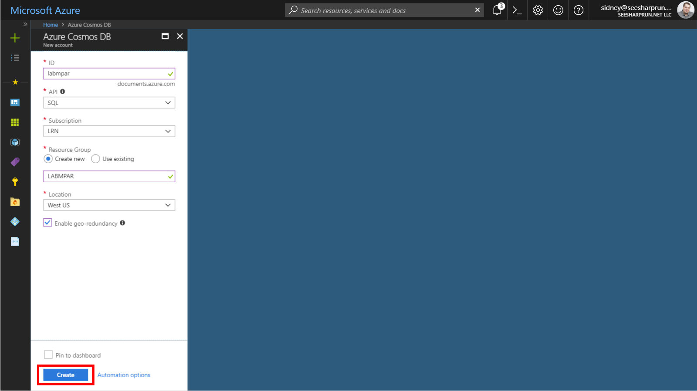

1. Wait for the creation task to complete before moving on with this lab.  

### Retrieve Account Credentials

*The .NET SDK requires credentials to connect to your Azure Cosmos DB account. You will collect and store these credentials for use throughout the lab.*

1. On the left side of the portal, click the **Resource groups** link.

    

1. In the **Resource groups** blade, locate and select the **LABQURY** *Resource Group*.

    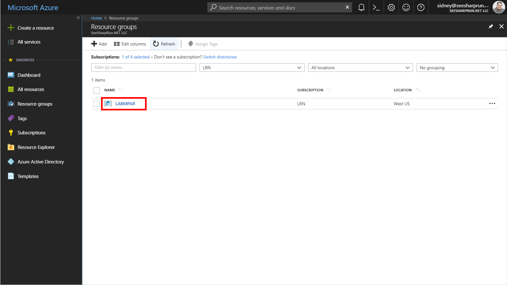

1. In the **LABQURY** blade, select the **Azure Cosmos DB** account you recently created.

    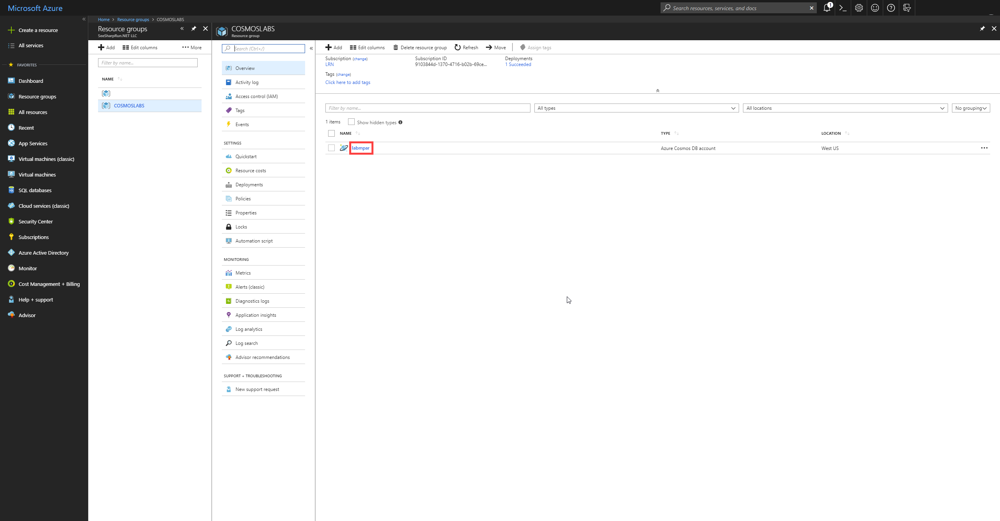

1. In the **Azure Cosmos DB** blade, locate the **Settings** section and click the **Keys** link.

    

1. In the **Keys** pane, record the values in the **URI** and **PRIMARY KEY** fields. You will use these values later in this lab.

    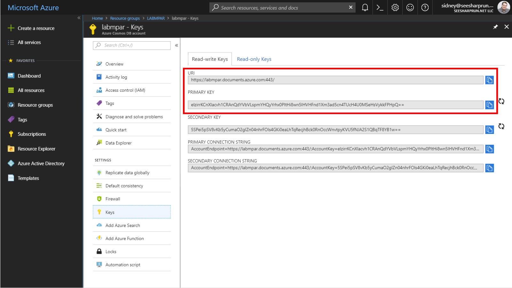

## Create Unlimited Container using the .NET SDK


### Create a .NET Core Project

**

1. On your local machine, create a new folder that will be used to contain the content of your .NET Core project.

1. In the new folder, right-click the folder and select the **Open with Code** menu option.

    

    > Alternatively, you can run a command prompt in your current directory and execute the ``code .`` command.

1. In the Visual Studio Code window that appears, right-click the **Explorer** pane and select the **Open in Command Prompt** menu option.

    

1. In the open terminal pane, enter and execute the following command:

    ```sh
    dotnet new console --output .
    ```

    > This command will create a new .NET Core 2.1 project. The project will be a **console** project and the project will be created in the current directly since you used the ``--output .`` option.

1. In the terminal pane, enter and execute the following command:

    ```sh
    dotnet add package Microsoft.Azure.DocumentDB.Core --version 1.9.1
    ```

    > This command will add the [Microsoft.Azure.DocumentDB.Core](https://www.nuget.org/packages/Microsoft.Azure.DocumentDB.Core/) NuGet package as a project dependency.

1. In the terminal pane, enter and execute the following command:

    ```sh
    dotnet add package Bogus --version 22.0.7
    ```

    > This command will add the [Bogus](https://www.nuget.org/packages/Bogus/) NuGet package as a project dependency.

1. In the terminal pane, enter and execute the following command:

    ```sh
    dotnet restore
    ```

    > This command will restore all packages specified as dependencies in the project.

1. In the terminal pane, enter and execute the following command:

    ```sh
    dotnet build
    ```

    > This command will build the project.

1. Click the **🗙** symbol to close the terminal pane.

1. Observe the **Program.cs** and **vscodetemple.csproj** files created by the .NET Core CLI.

    

1. Double-click the **Program.cs** link in the **Explorer** pane to open the file in the editor.

    

### Create DocumentClient Instance

**

1. Within the **Program.cs** editor tab, Add the following using blocks to the top of the editor:

    ```c#
    using System;
    using System.Collections.Generic;
    using System.Collections.ObjectModel;
    using System.Linq;
    using System.Net;
    using System.Threading.Tasks;
    using Microsoft.Azure.Documents;
    using Microsoft.Azure.Documents.Client;
    using Microsoft.Azure.Documents.Linq;
    ```

1. Locate the **Program** class and replace it with the following class:

    ```c#
    public class Program
    {
        public static void Main(string[] args)
        {         
        }

        private static async Task ExecuteLogic(DocumentClient client)
        {
        }
    }
    ```

1. Within the **Program** class, add the following lines of code to create variables for your connection information:

    ```c#
    private static readonly Uri _endpointUri = new Uri("");
    private static readonly string _primaryKey = "";
    ```

1. For the ``_endpointUri`` variable, replace the placeholder value with the **URI** value from your Azure Cosmos DB account that you recorded earlier in this lab: 

    > For example, if your **uri** is ``https://labmpar.documents.azure.com:443/``, your new variable assignment will look like this: ``private static readonly Uri _endpointUri = new Uri("https://labmpar.documents.azure.com:443/");``.

1. For the ``_primaryKey`` variable, replace the placeholder value with the **PRIMARY KEY** value from your Azure Cosmos DB account that you recorded earlier in this lab: 

    > For example, if your **primary key** is ``elzirrKCnXlacvh1CRAnQdYVbVLspmYHQyYrhx0PltHi8wn5lHVHFnd1Xm3ad5cn4TUcH4U0MSeHsVykkFPHpQ==``, your new variable assignment will look like this: ``private static readonly string _primaryKey = "elzirrKCnXlacvh1CRAnQdYVbVLspmYHQyYrhx0PltHi8wn5lHVHFnd1Xm3ad5cn4TUcH4U0MSeHsVykkFPHpQ==";``.
    
1. Locate the **Main** method:

    ```c#
    public static void Main(string[] args)
    { 
    }
    ```

1. Within the **Main** method, add the following lines of code to author a using block that creates and disposes a **DocumentClient** instance:

    ```c#
    using (DocumentClient client = new DocumentClient(endpointUri, primaryKey))
    {
        
    }
    ```

1. Within the *using* block, add the following line of code to call the static ``ExecuteLogic`` method passing in the ``DocumentClient`` instance and waiting for the asynchronous execution to complete.

    ```c#
    ExecuteLogic(client).Wait();
    ```

1. Locate the **ExecuteLogic** method:

    ```c#
    private static async Task ExecuteLogic(DocumentClient client)
    {       
    }
    ```

1. Within the **Main** method, add the following line of code to asynchronously open a connection:

    ```c#
    await client.OpenAsync();
    ```

1. Your ``Program`` class definition should now look like this:

    ```c#
    public class Program
    { 
        private static readonly Uri _endpointUri = new Uri("<your uri>");
        private static readonly string _primaryKey = "<your key>";

        public static void Main(string[] args)
        {    
            using (DocumentClient client = new DocumentClient(_endpointUri, _primaryKey))
            {
                ExecuteLogic(client).Wait();
            }
        }

        private static async Task ExecuteLogic(DocumentClient client)
        {  
            await client.OpenAsync();     
        }
    }
    ```

    > We will now execute build the application to make sure our code compiles successfully.

1. Save all of your open editor tabs.

1. In the Visual Studio Code window, right-click the **Explorer** pane and select the **Open in Command Prompt** menu option.

1. In the open terminal pane, enter and execute the following command:

    ```sh
    dotnet build
    ```

    > This command will build the console project.

1. Click the **🗙** symbol to close the terminal pane.

1. Close all open editor tabs.

### Create Database using the SDK

**

1. Locate the **ExecuteLogic** method and delete any existing code:

    ```c#
    private static async Task ExecuteLogic(DocumentClient client)
    {       
    }
    ```

1. Add the following code to the method to create an asynchronous connection:

    ```c#
    await client.OpenAsync();
    ```

1. Add the following code to the method to create a new ``Database`` instance:

    ```c#
    Database targetDatabase = new Database { Id = "EntertainmentDatabase" };
    ```

1. Add the following code to create a new database instance if one does not already exist:

    ```c#
    targetDatabase = await client.CreateDatabaseIfNotExistsAsync(targetDatabase);
    ```

    > This code will check to see if a database exists in your Azure Cosmos DB account that meets the specified parameters. If a database that matches does not exist, it will create a new database.

1. Add the following code to print out the self-link of the database:

    ```c#
    await Console.Out.WriteLineAsync($"Database Self-Link:\t{targetDatabase.SelfLink}");
    ```

    > The ``targetDatabase`` variable will have metadata about the database whether a new database is created or an existing one is read.

1. Save all of your open editor tabs.

1. In the Visual Studio Code window, right-click the **Explorer** pane and select the **Open in Command Prompt** menu option.

1. In the open terminal pane, enter and execute the following command:

    ```sh
    dotnet run
    ```

    > This command will build and execute the console project.

1. Observe the output of the running command.

1. In the open terminal pane, enter and execute the following command:

    ```sh
    dotnet run
    ```

    > This command will build and execute the console project.

1. Again, observe the output of the running command.

    > Since the database already exists, you will see the same self-link on both executions of the console application.

1. Click the **🗙** symbol to close the terminal pane.

### Create a Fixed Collection using the SDK

**

1. Locate the **ExecuteLogic** method and delete any existing code:

    ```c#
    private static async Task ExecuteLogic(DocumentClient client)
    {       
    }
    ```

1. Add the following code to the method to create an asynchronous connection:

    ```c#
    await client.OpenAsync();
    ```

1. Add the following code to the method to create a self-link to an existing database:

    ```c#
    Uri databaseSelfLink = UriFactory.CreateDatabaseUri("EntertainmentDatabase");
    ```

1. Add the following lines of code to create a new ``DocumentCollection`` instance where you only specify a value for the ``Id`` property:

    ```c#
    DocumentCollection defaultCollection = new DocumentCollection 
    { 
        Id = "DefaultCollection" 
    };
    ```

    > We are going to rely on the default values set for a collection created using the .NET SDK.

1. Add the following code to create a new collection instance if one does not already exist within your database:

    ```c#
    defaultCollection = await client.CreateDocumentCollectionIfNotExistsAsync(databaseSelfLink, defaultCollection);
    ```

    > This code will check to see if a collection exists in your database that meets the specified parameters. If a collection that matches does not exist, it will create a new collection.

1. Add the following code to print out the self-link of the database:

    ```c#
    await Console.Out.WriteLineAsync($"Default Collection Self-Link:\t{defaultCollection.SelfLink}"); 
    ```

    > The ``defaultCollection`` variable will have metadata about the collection whether a new collection is created or an existing one is read.

1. Save all of your open editor tabs.

1. In the Visual Studio Code window, right-click the **Explorer** pane and select the **Open in Command Prompt** menu option.

1. In the open terminal pane, enter and execute the following command:

    ```sh
    dotnet run
    ```

    > This command will build and execute the console project.

1. Observe the output of the running command.

1. Click the **🗙** symbol to close the terminal pane.

### Create an Unlimited Collection using the SDK

**

1. Locate the **ExecuteLogic** method and delete any existing code:

    ```c#
    private static async Task ExecuteLogic(DocumentClient client)
    {       
    }
    ```

1. Add the following code to the method to create an asynchronous connection:

    ```c#
    await client.OpenAsync();
    ```

1. Add the following code to the method to create a self-link to an existing database:

    ```c#
    Uri databaseSelfLink = UriFactory.CreateDatabaseUri("EntertainmentDatabase");
    ```

1. Add the following code to create a new ``IndexingPolicy`` instance with a custom indexing policy configured:

    ```c#
    IndexingPolicy indexingPolicy = new IndexingPolicy
    {
        IndexingMode = IndexingMode.Consistent,
        Automatic = true,
        IncludedPaths = new Collection<IncludedPath>
        {
            new IncludedPath
            {
                Path = "/*",
                Indexes = new Collection<Index>
                {
                    new RangeIndex(DataType.Number, -1),
                    new RangeIndex(DataType.String, -1)                           
                }
            }
        }
    };
    ```

    > This indexing policy is very similar to the default indexing policy created by the SDK but it implements a **Range** index on string types instead of a **Hash** index.

1. Add the following code to create a new ``PartitionKeyDefinition`` instance with a single partition key of ``/Type`` defined:

    ```c#
    PartitionKeyDefinition partitionKeyDefinition = new PartitionKeyDefinition
    {
        Paths = new Collection<string> { "/Type" }
    };
    ```

    > This definition will create a partition key on the ``/Type`` path. Partition keys are case-sensitive.

1. Add the following lines of code to create a new ``DocumentCollection`` instance where you specify values for multiple properties:

    ```c#
    DocumentCollection customCollection = new DocumentCollection
    {
        Id = "CustomCollection",
        PartitionKey = partitionKeyDefinition,
        IndexingPolicy = indexingPolicy
    };   
    ```

    > We are going to explicitly specify various values for a collection created using the .NET SDK.

1. Add the following code to create a new ``RequestOptions`` instance seting the **throughput** for the collection:

    ```c#
    RequestOptions requestOptions = new RequestOptions
    {
        OfferThroughput = 10000
    };
    ```

    > Here is where we can specify the RU/s allocated for the collection. If this is not specified, the SDK has a default value for RU/s assigned to a collection.

1. Add the following code to create a new collection instance if one does not already exist within your database:

    ```c#
    customCollection = await client.CreateDocumentCollectionIfNotExistsAsync(databaseSelfLink, customCollection, requestOptions);         
    ```

    > This code will check to see if a collection exists in your database that meets all of the specified parameters. If a collection that matches does not exist, it will create a new collection.

1. Add the following code to print out the self-link of the database:

    ```c#
    await Console.Out.WriteLineAsync($"Custom Collection Self-Link:\t{customCollection.SelfLink}");  
    ```

    > The ``customCollection`` variable will have metadata about the collection whether a new collection is created or an existing one is read.

1. Save all of your open editor tabs.

1. In the Visual Studio Code window, right-click the **Explorer** pane and select the **Open in Command Prompt** menu option.

1. In the open terminal pane, enter and execute the following command:

    ```sh
    dotnet run
    ```

    > This command will build and execute the console project.

1. Observe the output of the running command.

1. Click the **🗙** symbol to close the terminal pane.

1. Close all open editor tabs.

### Observe Newly Created Database and Collections in the Portal

**

1. In a new window, sign in to the **Azure Portal** (<http://portal.azure.com>).

1. On the left side of the portal, click the **Resource groups** link.

    

1. In the **Resource groups** blade, locate and select the **LABQURY** *Resource Group*.

    

1. In the **LABQURY** blade, select the **Azure Cosmos DB** account you recently created.

    

1. In the **Azure Cosmos DB** blade, observe the new collections and database displayed in the middle of the blade.

    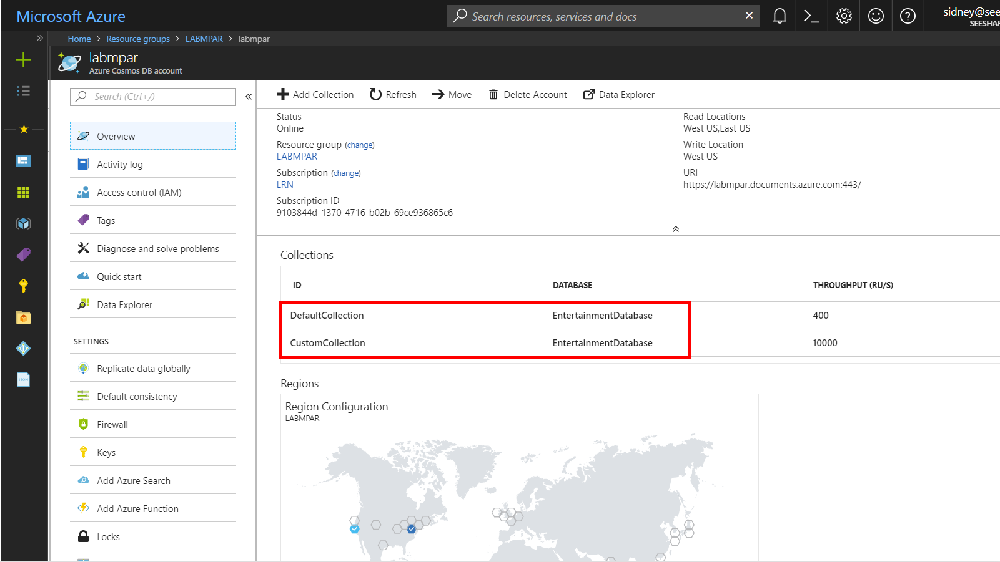

1. Locate and click the **Data Explorer** link on the left side of the blade.

    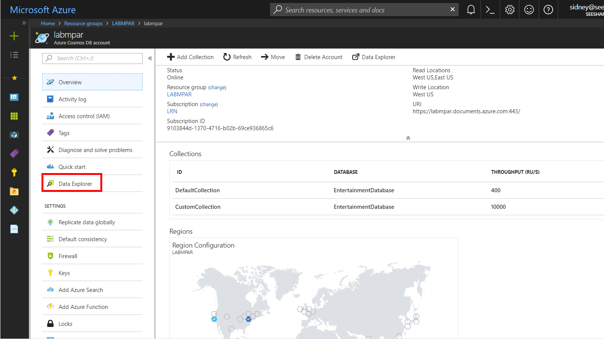

1. In the **Data Explorer** section, expand the **EntertainmentDatabase** database node and then observe the collection nodes. 

    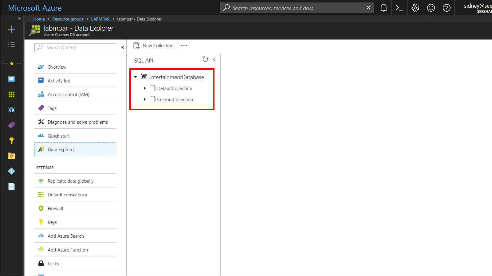

1. Expand the **DefaultCollection** node. Within the node, click the **Scale & Settings** link.

    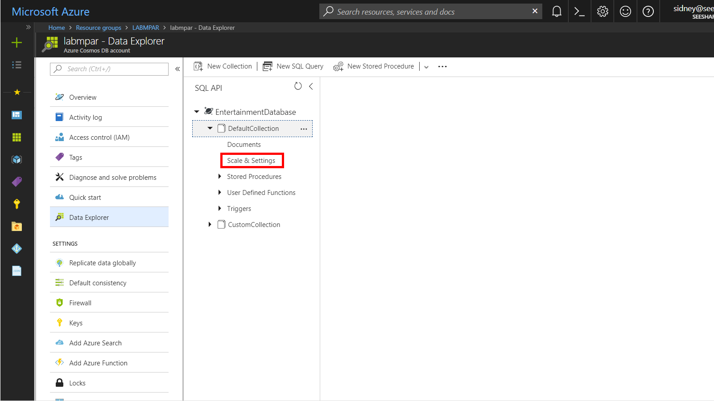

1. Observe the following properties of the collection:

    - Storage Capacity

    - Assigned Throughput

    - Indexing Policy

    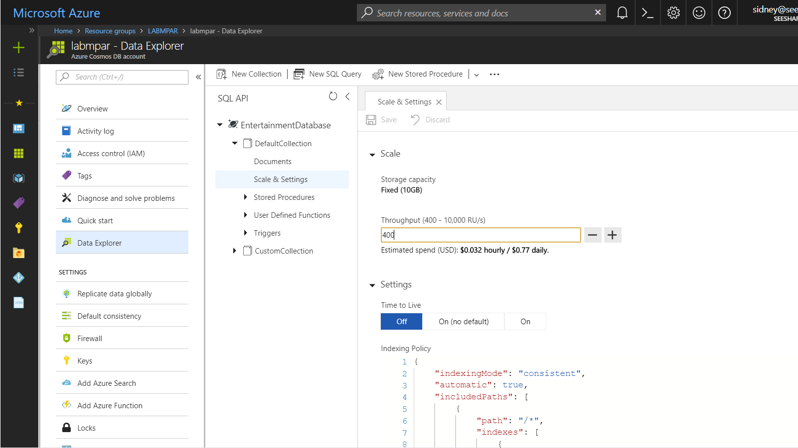

    > You will quickly notice that this is a fixed-size container that has a limited amount of RU/s. The indexing policy is also interesting as it implements a Hash index on string types and Range index on numeric types.

    ```js
    {
        "indexingMode": "consistent",
        "automatic": true,
        "includedPaths": [
            {
                "path": "/*",
                "indexes": [
                    {
                        "kind": "Range",
                        "dataType": "Number",
                        "precision": -1
                    },
                    {
                        "kind": "Hash",
                        "dataType": "String",
                        "precision": 3
                    }
                ]
            }
        ],
        "excludedPaths": []
    }
    ```

1. Back in the **Data Explorer** section, expand the **CustomCollection** node. Within the node, click the **Scale & Settings** link.

1. Observe the following properties of the collection and compare them to the last collection:

    - Storage Capacity

    - Assigned Throughput

    - Partition Key

    - Indexing Policy

    

    > You configured all of these values when you created this collection using the SDK. You should take time to look at the custom indexing policy you created using the SDK.

    ```js
    {
        "indexingMode": "consistent",
        "automatic": true,
        "includedPaths": [
            {
                "path": "/*",
                "indexes": [
                    {
                        "kind": "Range",
                        "dataType": "Number",
                        "precision": -1
                    },
                    {
                        "kind": "Range",
                        "dataType": "String",
                        "precision": -1
                    }
                ]
            }
        ],
        "excludedPaths": []
    }
    ```
    
1. Close your browser window displaying the Azure Portal.

## Populate a Collection with Documents using the SDK


### Create Test Data Classes

**

1. In the Visual Studio Code window, right-click the **Explorer** pane and select the **New File** menu option.

    

1. Name the new file **IInteraction.cs**. The editor tab will automatically open for the new file.

    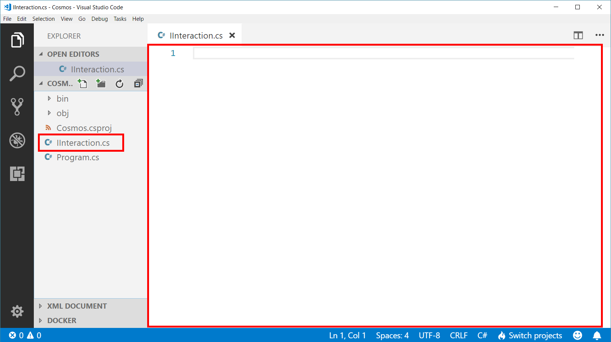

1. Paste in the following code for the ``IInteraction`` interface:

    ```c#
    public interface IInteraction
    {
        string type { get; }
    }
    ```

1. In the Visual Studio Code window, right-click the **Explorer** pane and select the **New File** menu option.

1. Name the new file **PurchaseFoodOrBeverage.cs**. The editor tab will automatically open for the new file.

1. Paste in the following code for the ``PurchaseFoodOrBeverage`` class:

    ```c#
    public class PurchaseFoodOrBeverage : IInteraction
    {
        public decimal unitPrice { get; set; }
        public decimal totalPrice { get; set; }
        public int quantity { get; set; }
        public string type { get; set; }
    }
    ```

1. In the Visual Studio Code window, right-click the **Explorer** pane and select the **New File** menu option.

1. Name the new file **ViewMap.cs**. The editor tab will automatically open for the new file.

1. Paste in the following code for the ``ViewMap`` class:

    ```c#
    public class ViewMap : IInteraction
    {	
        public int minutesViewed { get; set; }
        public string type { get; set; }
    }
    ```
    
1. In the Visual Studio Code window, right-click the **Explorer** pane and select the **New File** menu option.

1. Name the new file **WatchLiveTelevisionChannel.cs**. The editor tab will automatically open for the new file.

1. Paste in the following code for the ``WatchLiveTelevisionChannel`` class:

    ```c#
    public class WatchLiveTelevisionChannel : IInteraction
    {
        public string channelName { get; set; }
        public int minutesViewed { get; set; }
        public string type { get; set; }
    }
    ```

1. Observe your newly created files in the **Explorer** pane.

    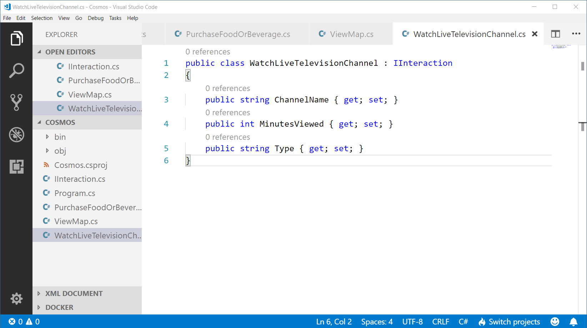

1. Save all of your open editor tabs.

1. In the Visual Studio Code window, right-click the **Explorer** pane and select the **Open in Command Prompt** menu option.

1. In the open terminal pane, enter and execute the following command:

    ```sh
    dotnet build
    ```

    > This command will build the console project.

1. Click the **🗙** symbol to close the terminal pane.

1. Close all open editor tabs.

### Populate Unlimited Collection with Test Data

**

1. Double-click the **Program.cs** link in the **Explorer** pane to open the file in the editor.

1. Locate the **ExecuteLogic** method and delete any existing code:

    ```c#
    private static async Task ExecuteLogic(DocumentClient client)
    {       
    }
    ```

1. Add the following code to the method to create an asynchronous connection:

    ```c#
    await client.OpenAsync();
    ```

1. Add the following code to the method to create a self-link to an existing collection:

    ```c#
    Uri collectionSelfLink = UriFactory.CreateDocumentCollectionUri("EntertainmentDatabase", "CustomCollection");
    ```

1. Observe the code in the **ExecuteLogic** method.

    > For the next few instructions, we will use the **Bogus** library to create test data. This library allows you to create a collection of objects with fake data set on each object's property. For this lab, our intent is to **focus on Azure Cosmos DB** instead of this library. With that intent in mind, the next set of instructions will expedite the process of creating test data.

1. Add the following code to create a collection of ``PurchaseFoodOrBeverage`` instances:

    ```c#
    var foodInteractions = new Bogus.Faker<PurchaseFoodOrBeverage>()
        .RuleFor(i => i.type, (fake) => nameof(PurchaseFoodOrBeverage))
        .RuleFor(i => i.unitPrice, (fake) => Math.Round(fake.Random.Decimal(1.99m, 15.99m), 2))
        .RuleFor(i => i.quantity, (fake) => fake.Random.Number(1, 5))
        .RuleFor(i => i.totalPrice, (fake, user) => Math.Round(user.unitPrice * user.quantity, 2))
        .GenerateLazy(500);
    ```
    
1. Add the following foreach block to iterate over the ``PurchaseFoodOrBeverage`` instances:

    ```c#
    foreach(var interaction in foodInteractions)
    {
    }
    ```

1. Within the ``foreach`` block, add the following line of code to asynchronously create a document and save the result of the creation task to a variable:

    ```c#
    ResourceResponse<Document> result = await client.CreateDocumentAsync(collectionSelfLink, interaction);
    ```

    > The ``CreateDocumentAsync`` method of the ``DocumentClient`` class takes in a self-link for a collection and an object that you would like to serialize into JSON and store as a document within the specified collection.

1. Still within the ``foreach`` block, add the following line of code to write the value of the newly created resource's ``id`` property to the console:

    ```c#
    await Console.Out.WriteLineAsync($"Document Created\t{result.Resource.Id}");
    ```

    > The ``ResourceResponse`` type has a property named ``Resource`` that can give you access to interesting data about a document such as it's unique id, time-to-live value, self-link, ETag, timestamp,  and attachments.

1. Your **ExecuteLogic** method should look like this:

    ```c#
    private static async Task ExecuteLogic(DocumentClient client)
    {  
        await client.OpenAsync();
        Uri collectionSelfLink = UriFactory.CreateDocumentCollectionUri("EntertainmentDatabase", "CustomCollection");
        var foodInteractions = new Bogus.Faker<PurchaseFoodOrBeverage>()
            .RuleFor(i => i.type, (fake) => nameof(PurchaseFoodOrBeverage))
            .RuleFor(i => i.unitPrice, (fake) => Math.Round(fake.Random.Decimal(1.99m, 15.99m), 2))
            .RuleFor(i => i.quantity, (fake) => fake.Random.Number(1, 5))
            .RuleFor(i => i.totalPrice, (fake, user) => Math.Round(user.unitPrice * user.quantity, 2))
            .GenerateLazy(500);
        foreach(var interaction in foodInteractions)
        {
            ResourceResponse<Document> result = await client.CreateDocumentAsync(customCollection.SelfLink, interaction);
            await Console.Out.WriteLineAsync($"Document Created\t{result.Resource.Id}");
        }
    }
    ```

1. Save all of your open editor tabs.

1. In the Visual Studio Code window, right-click the **Explorer** pane and select the **Open in Command Prompt** menu option.

1. In the open terminal pane, enter and execute the following command:

    ```sh
    dotnet run
    ```

    > This command will build and execute the console project.

1. Observe the output of the console application.

    > You should see a list of document ids associated with new documents that are being created by this tool.

1. Click the **🗙** symbol to close the terminal pane.

### Populate Unlimited Collection with Data of Different Types

**

1. Locate the **ExecuteLogic** method and delete any existing code:

    ```c#
    private static async Task ExecuteLogic(DocumentClient client)
    {       
    }
    ```

1. Replace the **ExecuteLogic** method with the following implementation:

    ```c#
    private static async Task ExecuteLogic(DocumentClient client)
    {  
        await client.OpenAsync();
        Uri collectionSelfLink = UriFactory.CreateDocumentCollectionUri("EntertainmentDatabase", "CustomCollection");
        var tvInteractions = new Bogus.Faker<WatchLiveTelevisionChannel>()
            .RuleFor(i => i.type, (fake) => nameof(WatchLiveTelevisionChannel))
            .RuleFor(i => i.minutesViewed, (fake) => fake.Random.Number(1, 45))
            .RuleFor(i => i.channelName, (fake) => fake.PickRandom(new List<string> { "NEWS-6", "DRAMA-15", "ACTION-12", "DOCUMENTARY-4", "SPORTS-8" }))
            .GenerateLazy(500);
        foreach(var interaction in tvInteractions)
        {
            ResourceResponse<Document> result = await client.CreateDocumentAsync(collectionSelfLink, interaction);
            await Console.Out.WriteLineAsync($"Document Created\t{result.Resource.Id}");
        }
    }
    ```

1. Save all of your open editor tabs.

1. In the Visual Studio Code window, right-click the **Explorer** pane and select the **Open in Command Prompt** menu option.

1. In the open terminal pane, enter and execute the following command:

    ```sh
    dotnet run
    ```

    > This command will build and execute the console project.

1. Observe the output of the console application.

    > You should see a list of document ids associated with new documents that are being created.

1. Click the **🗙** symbol to close the terminal pane.

1. Locate the **ExecuteLogic** method and delete any existing code:

    ```c#
    private static async Task ExecuteLogic(DocumentClient client)
    {       
    }
    ```

1. Replace the **ExecuteLogic** method with the following implementation:

    ```c#
    private static async Task ExecuteLogic(DocumentClient client)
    {  
        await client.OpenAsync();
        Uri collectionSelfLink = UriFactory.CreateDocumentCollectionUri("EntertainmentDatabase", "CustomCollection");
        var mapInteractions = new Bogus.Faker<ViewMap>()
            .RuleFor(i => i.type, (fake) => nameof(ViewMap))
            .RuleFor(i => i.minutesViewed, (fake) => fake.Random.Number(1, 45))
            .GenerateLazy(500);
        foreach(var interaction in mapInteractions)
        {
            ResourceResponse<Document> result = await client.CreateDocumentAsync(collectionSelfLink, interaction);
            await Console.Out.WriteLineAsync($"Document Created\t{result.Resource.Id}");
        }
    }
    ```

1. Save all of your open editor tabs.

1. In the Visual Studio Code window, right-click the **Explorer** pane and select the **Open in Command Prompt** menu option.

1. In the open terminal pane, enter and execute the following command:

    ```sh
    dotnet run
    ```

    > This command will build and execute the console project.

1. Observe the output of the console application.

    > You should see a list of document ids associated with new documents that are being created.

1. Click the **🗙** symbol to close the terminal pane.

1. Close all open editor tabs.

## Implement Cross-Partition Queries


### Execute Single-Partition Query

**

1. In the Visual Studio Code window, right-click the **Explorer** pane and select the **New File** menu option.

1. Name the new file **GeneralInteraction.cs**. The editor tab will automatically open for the new file.

1. Paste in the following code for the ``GeneralInteraction`` class:

    ```c#
    public class GeneralInteraction : IInteraction
    {
        public string id { get; set; }

        public string type { get; set; }
    }
    ```

1. Back in the Visual Studio Code window, double-click the **Program.cs** file to open an editor tab for the file.

1. Within the **Program.cs** editor tab, locate the **ExecuteLogic** method and delete any existing code:

    ```c#
    private static async Task ExecuteLogic(DocumentClient client)
    {       
    }
    ```   

1. Within the **ExecuteLogic** method, add the following line of code to asynchronously open a connection:

    ```c#
    await client.OpenAsync();
    ```
    
1. Add the following line of code to create a variable named ``collectionLink`` that is a reference (self-link) to an existing collection:

    ```c#
    Uri collectionSelfLink = UriFactory.CreateDocumentCollectionUri("EntertainmentDatabase", "CustomCollection");
    ```

1. Add the following line of code to create a query that is filtered to a single partition key:

    ```c#
    IQueryable<GeneralInteraction> query = client.CreateDocumentQuery<GeneralInteraction>(collectionSelfLink, new FeedOptions { PartitionKey = new PartitionKey(nameof(ViewMap)) });
    ```

    > First we will restrict our query to a single partition key using the ``PartitionKey`` property of the ``FeedOptions`` class.

1. Add the following line of code to print out the results of your query:

    ```c#
    foreach(GeneralInteraction interaction in query)
    {
        Console.Out.WriteLine($"[{interaction.type}]\t{interaction.id}");
    }
    ```

    > We are using the C# string formatting features to print out two properties of our interactions.

1. Save all of your open editor tabs.

1. In the Visual Studio Code window, right-click the **Explorer** pane and select the **Open in Command Prompt** menu option.

1. In the open terminal pane, enter and execute the following command:

    ```sh
    dotnet run
    ```

    > This command will build and execute the console project.

1. Observe the results of the execution.

    > You should only see records from a single partition.

1. Click the **🗙** symbol to close the terminal pane.

### Execute Cross-Partition Query

**

1. Within the **ExecuteLogic** method, locate the following line of code: 

    ```c#
    IQueryable<GeneralInteraction> query = client.CreateDocumentQuery<GeneralInteraction>(collectionSelfLink, new FeedOptions { PartitionKey = new PartitionKey(nameof(ViewMap)) });
    ```

    Replace that code with the following code:

    ```c#
    IQueryable<GeneralInteraction> query = client.CreateDocumentQuery<GeneralInteraction>(collectionSelfLink, new FeedOptions { EnableCrossPartitionQuery = true });
    ```

    > We could ignore the partition keys and simply enable cross-partition queries using the ``EnableCrossPartitionQuery`` property of the ``FeedOptions`` class.

1. Save all of your open editor tabs.

1. In the Visual Studio Code window, right-click the **Explorer** pane and select the **Open in Command Prompt** menu option.

1. In the open terminal pane, enter and execute the following command:

    ```sh
    dotnet run
    ```

    > This command will build and execute the console project.

1. Observe the results of the execution.

    > You will notice that results are coming from more than one partition. You can observe this by looking at the values for ``type`` on the left-hand side of the output.

1. Click the **🗙** symbol to close the terminal pane.

1. Close all open editor tabs.

1. Close the Visual Studio Code application.

## Lab Cleanup

### Open Cloud Shell

1. At the top of the portal, click the **Cloud Shell** icon to open a new shell instance.

    > If this is your first time using the cloud shell, you may need to configure the default Storage account and SMB file share.

### Use Azure CLI to Delete Resource Group

1. In the **Cloud Shell** command prompt at the bottom of the portal, type in the following command and press **Enter** to list all resource groups in the subscription:

    ```
    az group list
    ```

1. Type in the following command and press **Enter** to delete the **LABMPAR** *Resource Group*:

    ```
    az group delete --name LABMPAR --no-wait --yes
    ```

1. Close the **Cloud Shell** prompt at the bottom of the portal.