# Querying An Azure Cosmos DB Database using the SQL API

**Required Software**

| Software | Download Link |
| --- | --- |
| .NET Core 2.1 (or greater) SDK | [/download.microsoft.com/dotnet-sdk-2.1](https://download.microsoft.com/download/E/2/6/E266C257-F7AF-4E79-8EA2-DF26031C84E2/dotnet-sdk-2.1.103-win-gs-x64.exe)
| Visual Studio Code | [/code.visualstudio.com/download](https://go.microsoft.com/fwlink/?Linkid=852157) |
| Azure Cosmos DB Data Migration Tool | [/cosmosdb-data-migration-tool](../files/cosmosdt.zip) |

## Setup

Before starting any lab in this workshop, you will need to create the various Azure resources necessary to complete the lab. In this exercise, you will create an Azure Cosmos DB account, database and collection and then populate the collection with a collection of JSON documents.

### Download Required Files

*A JSON file has been provided that will contain a collection 50,000 students. You will use this file later to import documents into your collection.*

1. Download the [students.json](../files/students.json) file and save it to your local machine.

### Create Azure Cosmos DB Assets

*You will now create an Azure Cosmos DB account to use in this lab.*

1. In a new window, sign in to the **Azure Portal** (<http://portal.azure.com>).

1. On the left side of the portal, click the **Create a resource** link.

    

1. At the top of the **New** blade, locate the **Search the Marketplace** field.

    

1. Enter the text **Cosmos** into the search field and press **Enter**.

1. In the **Everything** search results blade, select the **Azure Cosmos DB** result.

    

1. In the **Azure Cosmos DB** blade, click the **Create** button.

    

1. In the new **Azure Cosmos DB** blade, perform the following actions:

    1. In the **ID** field, enter a globally unique value.

    1. In the **API** list, select the **SQL** option.

    1. Leave the **Subscription** field set to its default value.

    1. In the **Resource group** section, select the **Create new** option.

    1. In the **Resource group** section, enter the value **LABQURY**  into the empty field.

    1. In the **Location** field, select the **West US** location.

    1. Click the **Create** button.

    

1. Wait for the creation task to complete before moving on with this lab.  

### Create Azure Cosmos DB Database and Collection

*You will now create a database and collection within your Azure Cosmos DB account.*

1. On the left side of the portal, click the **Resource groups** link.

    

1. In the **Resource groups** blade, locate and select the **LABQURY** *Resource Group*.

    

1. In the **LABQURY** blade, select the **Azure Cosmos DB** account you recently created.

    

1. In the **Azure Cosmos DB** blade, locate and click the **Overview** link on the left side of the blade.

    

1. At the top of the **Azure Cosmos DB** blade, click the **Add Collection** button.

    

1. In the **Add Collection** popup, perform the following actions:

    1. In the **Database id** field, enter the value **UniversityDatabase**.

    1. In the **Collection id** field, enter the value **StudentCollection**.

    1. In the **Storage capacity** section, select the **Unlimited** option.

    1. In the **Partition key** field, enter the value ``/enrollmentYear``.

    1. In the **Throughput** field, enter the value ``10000``.

    1. Click the **+ Add Unique Key** link.

    1. In the new **Unique Keys** field, enter the value ``/studentAlias``.

    1. Click the **OK** button.

    

1. Wait for the creation of the new **database** and **collection** to finish before moving on with this lab.

### Retrieve Account Credentials

*The Data Migration Tool and .NET SDKs both require credentials to connect to your Azure Cosmos DB account. You will collect and store these credentials for use throughout the lab.*

1. On the left side of the **Azure Cosmos DB** blade, locate the **Settings** section and click the **Keys** link.

    

1. In the **Keys** pane, record the values in the **URI** and **PRIMARY KEY** fields. You will use these values later in this lab.

    

### Import Lab Data Into Collection

*Finally, you will import the JSON documents contained in the **students.json** file you downloaded earlier in this lab.*

1. On your local machine, open the **Azure Cosmos DB Data Migration Tool**.

1. In the **Welcome** step of the tool, click the **Next** button to begin the migration wizard.

    

1. In the **Source Information** step of the tool, perform the following actions:

    1. In the **Import from** list, select the **JSON file(s)** option.

    1. Click the **Add Files** button.

    1. In the *Windows Explorer* dialog that opens, locate and select the **students.json** file you downloaded earlier in this lab. Click the **Open** button to add the file.

    1. Select the **Decompress data** checkbox.

    1. Click the **Next** button.

    

1. In the **Target Information** step of the tool, perform the following actions:

    1. In the **Export to** list, select the **Azure Cosmos DB - Sequential record import (partitioned collection)** option.

    1. In the **Connection String** field, enter a newly constructed connection string replacing the placeholders with values from your Azure Cosmos DB account recorded earlier in this lab: ```AccountEndpoint=[uri];AccountKey=[key];Database=[database name];```. *Make sure you replace the **[uri]**, **[key]**, and **[database name]** placeholders with the corresponding values from your Azure Cosmos DB account. For example, if your **uri** is ``https://labqury.documents.azure.com:443/``, your **key** is ``Get0qW1BrqxRUA9BskSRHti5HHzrp1cjTUJTBMIbxgCGXQgRWh5NZvhc0jIt4A5ZoljA2YiLxjNHtrfC6Bd2fA==`` and your **database's name** is ``UniversityDatabase``, then your connection string will look like this: ```AccountEndpoint=https://labqury.documents.azure.com:443/;AccountKey=Get0qW1BrqxRUA9BskSRHti5HHzrp1cjTUJTBMIbxgCGXQgRWh5NZvhc0jIt4A5ZoljA2YiLxjNHtrfC6Bd2fA==;Database=UniversityDatabase;```*

    1. Click the **Verify** button to validate your connection string.

    1. In the **Collection** field, enter the value **StudentCollection**.

    1. In the **Partition Key** field, enter the value ``/enrollmentYear``.

    1. In the **Collection Throughput** field, enter the value ``10000``.

    1. Click the **Advanced Options** button.

    1. In the **Number of Parallel Requests** field, increment the value from ``10`` to ``25``.

    1. Click the **Next** button.

    

1. In the **Advanced** step of the tool, leave the existing options set to their default values and click the **Next** button.

    

1. In the **Summary** step of the tool, review your options and then click the **Import** button.

    

1. Wait for the import process to complete.

    

    > You will know that the tool has run successfully once it has transferred 50000 records and the progress bar's animation ends. This step can take two to five minutes.

    

1. Once the import process has completed, close the Azure Cosmos DB Data Migration Tool.

## Executing Simple Queries

The Azure Cosmos DB Data Explorer allows you to view documents and run queries directly within the Azure Portal. In this exercise, you will use the Data Explorer to query the data stored in our collection.*

### Validate Imported Data

*First, you will validate that the data was successfully imported into your collection using the **Documents** view in the **Data Explorer**.*

1. Return to the **Azure Portal** (<http://portal.azure.com>).

1. On the left side of the portal, click the **Resource groups** link.

    

1. In the **Resource groups** blade, locate and select the **LABQURY** *Resource Group*.

    

1. In the **LABQURY** blade, select the **Azure Cosmos DB** account you recently created.

    

1. In the **Azure Cosmos DB** blade, locate and click the **Data Explorer** link on the left side of the blade.

    

1. In the **Data Explorer** section, expand the **UniversityDatabase** database node and then expand the **StudentCollection** collection node. 

    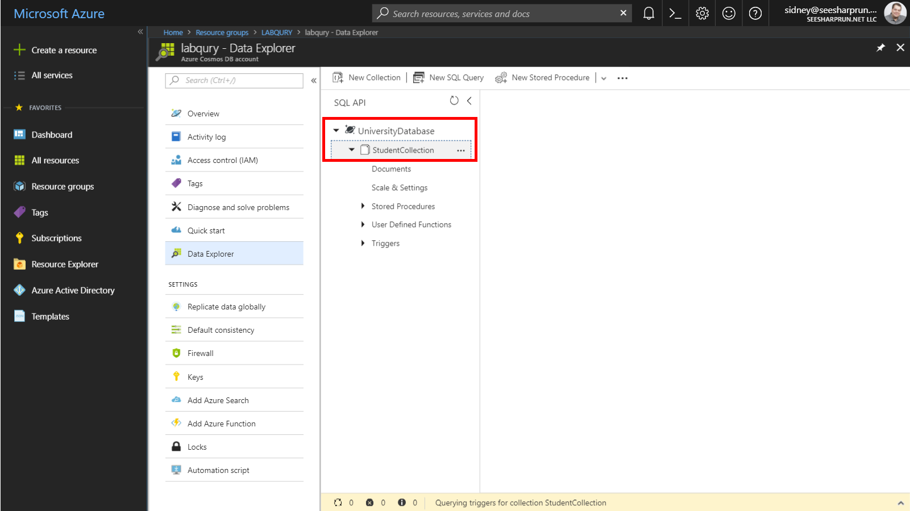

1. Within the **StudentCollection** node, click the **Documents** link to view a subset of the various documents in the collection. Select a few of the documents and observe the properties and structure of the documents.

    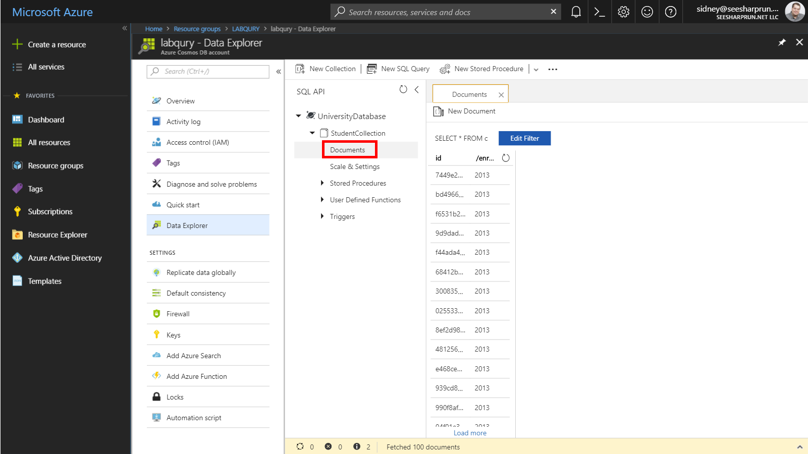

    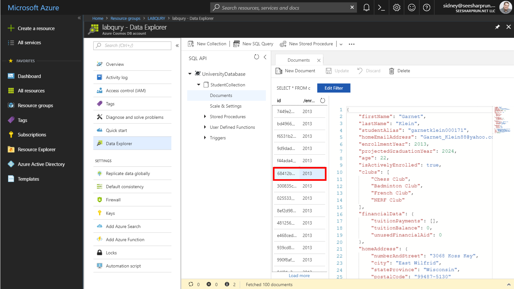

### Executing a Simple SELECT Queries

*You will now use the query editor in the **Data Explorer** to execute a few simple SELECT queries using SQL syntax.*

1. Click the **New SQL Query** button at the top of the **Data Explorer** section.

    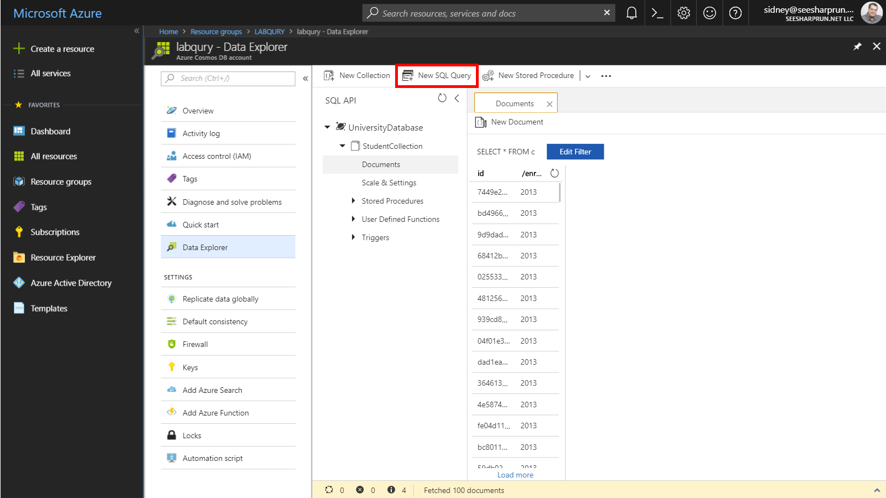

1. In the query tab, replace the contents of the *query editor* with the following SQL query:

    ```sql
    SELECT * FROM students s WHERE s.enrollmentYear = 2017
    ```

    > This first query will select all properties from all documents in the collection where the students where enrolled in 2017. You will notice that we are using the alias ``s`` to refer to the collection.

    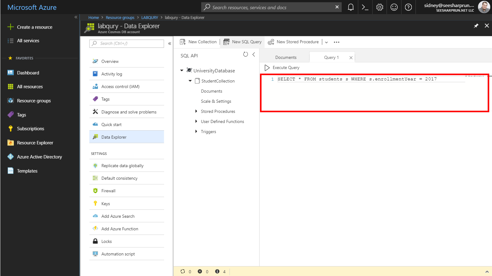

1. Click the **Execute Query** button in the query tab to run the query. 

    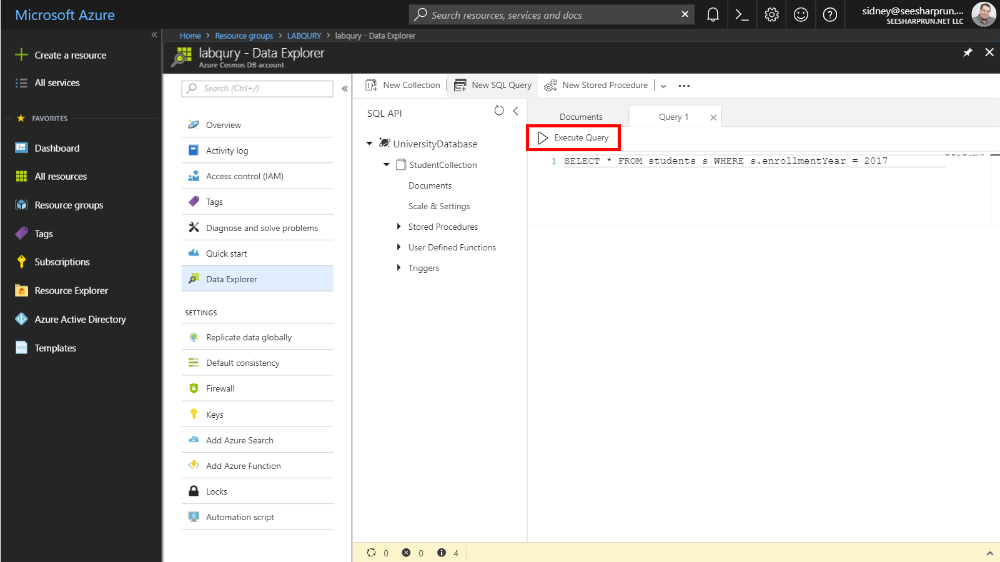

1. In the **Results** pane, observe the results of your query.

    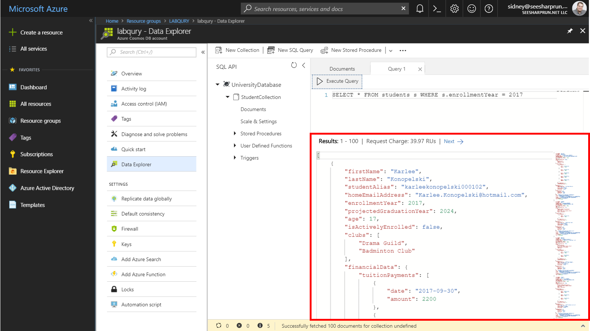

1. In the *query editor*, replace the current query with the following query:

    ```sql
    SELECT * FROM students WHERE students.enrollmentYear = 2017
    ```

    > In this query, we drop the ``s`` alias and use the ``students`` source. When we execute this query, we should see the same results as the previous query.

1. Click the **Execute Query** button in the query tab to run the query. In the **Results** pane, observe the results of your query.

1. In the *query editor*, replace the current query with the following query:

    ```sql
    SELECT * FROM arbitraryname WHERE arbitraryname.enrollmentYear = 2017
    ```

    > In this query, we will prove that the name used for the source can be any name you choose. We will use the name ``arbitraryname`` for the source. When we execute this query, we should see the same results as the previous query.

1. Click the **Execute Query** button in the query tab to run the query. In the **Results** pane, observe the results of your query.

1. In the *query editor*, replace the current query with the following query:

    ```sql
    SELECT s.studentAlias FROM students s WHERE s.enrollmentYear = 2017
    ```

    > Going back to ``s`` as an alias, we will now create a query where we only select the ``studentAlias`` property and return the value of that property in our result set.

1. Click the **Execute Query** button in the query tab to run the query. In the **Results** pane, observe the results of your query.

1. In the *query editor*, replace the current query with the following query:

    ```sql
    SELECT VALUE s.studentAlias FROM students s WHERE s.enrollmentYear = 2017
    ```

    > In some scenarios, you may need to return a flattened array as the result of your query. This query uses the ``VALUE`` keyword to flatten the array by taking the single returned (string) property and creating a string array.

1. Click the **Execute Query** button in the query tab to run the query. In the **Results** pane, observe the results of your query.

### Implicitly Executing a Cross-Partition Query

*The Data Explorer will allow you to create a cross-partition query without the need to manually configure any settings. You will now use the query editor in the Data Explorer to perform single or multi-partition queries*

1. Back in the query tab, replace the contents of the *query editor* with the following SQL query:

    ```sql
    SELECT * FROM students s WHERE s.enrollmentYear = 2016 
    ```

    > Since we know that our partition key is ``/enrollmentYear``, we know that any query that targets a single valid value for the ``enrollmentYear`` property will be a single partition query.

1. Click the **Execute Query** button in the query tab to run the query. In the **Results** pane, observe the results of your query.

    > Observe the Request Charge (in RU/s) for the executed query.

1. In the *query editor*, replace the current query with the following query:

    ```sql
    SELECT * FROM students s
    ```

    > If we want to execute a blanket query that will fan-out to all partitions, we simply can drop our ``WHERE`` clause that filters on a single valid value for our partition key path.

1. Click the **Execute Query** button in the query tab to run the query. In the **Results** pane, observe the results of your query.

    > Observe the Request Charge (in RU/s) for the executed query. You will notice that the charge is relatively greater for this query.

1. Back in the query tab, replace the contents of the *query editor* with the following SQL query:

    ```sql
    SELECT * FROM students s WHERE s.enrollmentYear IN (2015, 2016, 2017)
    ```

    > Observe the Request Charge (in RU/s) for the executed query. You will notice that the charge is greater than a single partition but far less than a fan-out across all partitions.

1. Click the **Execute Query** button in the query tab to run the query. In the **Results** pane, observe the results of your query.

    > Observe the Request Charge (in RU/s) for the executed query.

### Use Built-In Functions

*There are a large variety of built-in functions available in the SQL query syntax for the SQL API in Azure Cosmos DB. We will focus on a single function in this task but you can learn more about the others here: [https://docs.microsoft.com/azure/cosmos-db/sql-api-sql-query-reference](https://docs.microsoft.com/azure/cosmos-db/sql-api-sql-query-reference#bk_built_in_functions)*

1. In the *query editor*, replace the current query with the following query:

    ```sql
    SELECT s.studentAlias FROM students s WHERE s.enrollmentYear = 2015
    ```

    > Our goal is to get the school-issued e-mail address for all students who enrolled in 2015. We can issue a simple query to start that will return the login alias for each student.

1. Click the **Execute Query** button in the query tab to run the query. In the **Results** pane, observe the results of your query.

1. In the *query editor*, replace the current query with the following query:

    ```sql
    SELECT CONCAT(s.studentAlias, '@contoso.edu') AS email FROM students s WHERE s.enrollmentYear = 2015
    ```

    > To get the school-issued e-mail address, we will need to concatenate the ``@contoso.edu`` string to the end of each alias. We can perform this action using the ``CONCAT`` built-in function.

1. Click the **Execute Query** button in the query tab to run the query. In the **Results** pane, observe the results of your query.

1. In the *query editor*, replace the current query with the following query:

    ```sql
    SELECT VALUE CONCAT(s.studentAlias, '@contoso.edu') FROM students s WHERE s.enrollmentYear = 2015
    ```

    > In most client-side applications, you likely would only need an array of strings as opposed to an array of objects. We can use the ``VALUE`` keyword here to flatten our result set.

1. Click the **Execute Query** button in the query tab to run the query. In the **Results** pane, observe the results of your query.

### Projecting Query Results

*In some use cases, we may need to reshape the structure of our result JSON array to a structure that our libraries or third-party APIs can parse. We will focus on a single query and re-shape the results into various formats using the native JSON capabilities in the SQL query syntax.*

1. In the *query editor*, replace the current query with the following query:

    ```sql
    SELECT 
        CONCAT(s.firstName, " ", s.lastName), 
        s.academicStatus.warning, 
        s.academicStatus.suspension, 
        s.academicStatus.expulsion,
        s.enrollmentYear,
        s.projectedGraduationYear
    FROM students s WHERE s.enrollmentYear = 2014
    ```

    > In this first query, we want to determine the current status of every student who enrolled in 2014. Our goal here is to eventually have a flattened, simple-to-understand view of every student and their current academic status.

1. Click the **Execute Query** button in the query tab to run the query. In the **Results** pane, observe the results of your query.

    > You will quickly notice that the value representing the name of the student, using the ``CONCAT`` function, has a placeholder property name instead of a simple string.

1. In the *query editor*, replace the current query with the following query:

    ```sql
    SELECT 
        CONCAT(s.firstName, " ", s.lastName) AS name, 
        s.academicStatus.warning, 
        s.academicStatus.suspension, 
        s.academicStatus.expulsion,
        s.enrollmentYear,
        s.projectedGraduationYear
    FROM students s WHERE s.enrollmentYear = 2014
    ```

    > We will update our previous query by naming our property that uses a built-in function.

1. Click the **Execute Query** button in the query tab to run the query. In the **Results** pane, observe the results of your query.

1. In the *query editor*, replace the current query with the following query:

    ```sql
    SELECT {
        "name": CONCAT(s.firstName, " ", s.lastName), 
        "isWarned": s.academicStatus.warning, 
        "isSuspended": s.academicStatus.suspension, 
        "isExpelled": s.academicStatus.expulsion,
        "enrollment": {
            "start": s.enrollmentYear,
            "end": s.projectedGraduationYear
        }
    } AS studentStatus
    FROM students s WHERE s.enrollmentYear = 2014
    ```

    > Another alternative way to specify the structure of our JSON document is to use the curly braces from JSON. At this point, we are defining the structure of the JSON result directly in our query. 

1. Click the **Execute Query** button in the query tab to run the query. In the **Results** pane, observe the results of your query.

    > You should notice that our JSON object is still "wrapped" in another JSON object. Essentially, we have an array of the parent type with a property named ``studentStatus`` that contains the actual data we want.

1. In the *query editor*, replace the current query with the following query:

    ```sql
    SELECT VALUE {
        "name": CONCAT(s.firstName, " ", s.lastName), 
        "isWarned": s.academicStatus.warning, 
        "isSuspended": s.academicStatus.suspension, 
        "isExpelled": s.academicStatus.expulsion,
        "enrollment": {
            "start": s.enrollmentYear,
            "end": s.projectedGraduationYear
        }
    } FROM students s WHERE s.enrollmentYear = 2014
    ```

    > If we want to "unwrap" our JSON data and flatten to a simple array of like-structured objects, we need to use the ``VALUE`` keyword.

1. Click the **Execute Query** button in the query tab to run the query. In the **Results** pane, observe the results of your query.

## Use .NET SDK to Query Azure Cosmos DB


### Create a .NET Core Project

**

1. On your local machine, create a new folder that will be used to contain the content of your .NET Core project.

1. In the new folder, right-click the folder and select the **Open with Code** menu option.

    

    > Alternatively, you can run a command prompt in your current directory and execute the ``code .`` command.

1. In the Visual Studio Code window that appears, right-click the **Explorer** pane and select the **Open in Command Prompt** menu option.

    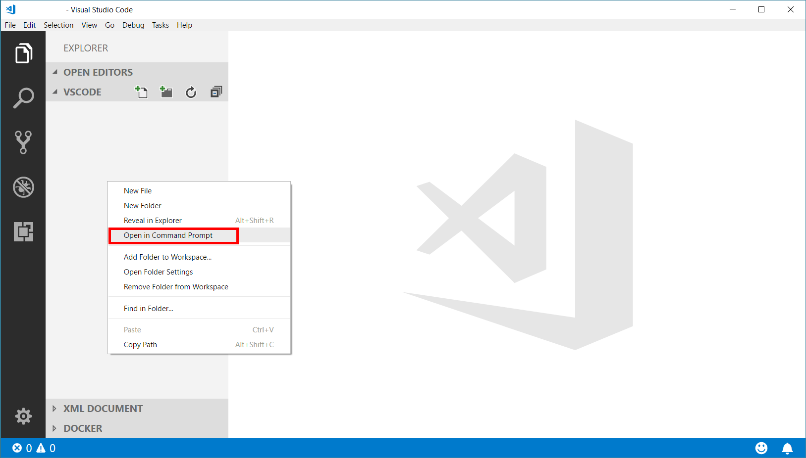

1. In the open terminal pane, enter and execute the following command:

    ```sh
    dotnet new console --output .
    ```

    > This command will create a new .NET Core 2.1 project. The project will be a **console** project and the project will be created in the current directly since you used the ``--output .`` option.

1. In the terminal pane, enter and execute the following command:

    ```sh
    dotnet add package Microsoft.Azure.DocumentDB.Core --version 1.9.1
    ```

    > This command will add the ``Microsoft.Azure.DocumentDB.Core`` NuGet package as a project dependency.

1. In the terminal pane, enter and execute the following command:

    ```sh
    dotnet restore
    ```

    > This command will restore all packages specified as dependencies in the project.

1. In the terminal pane, enter and execute the following command:

    ```sh
    dotnet build
    ```

    > This command will build the project.

1. Click the **🗙** symbol to close the terminal pane.

1. Observe the **Program.cs** and **vscodetemple.csproj** files created by the .NET Core CLI.

    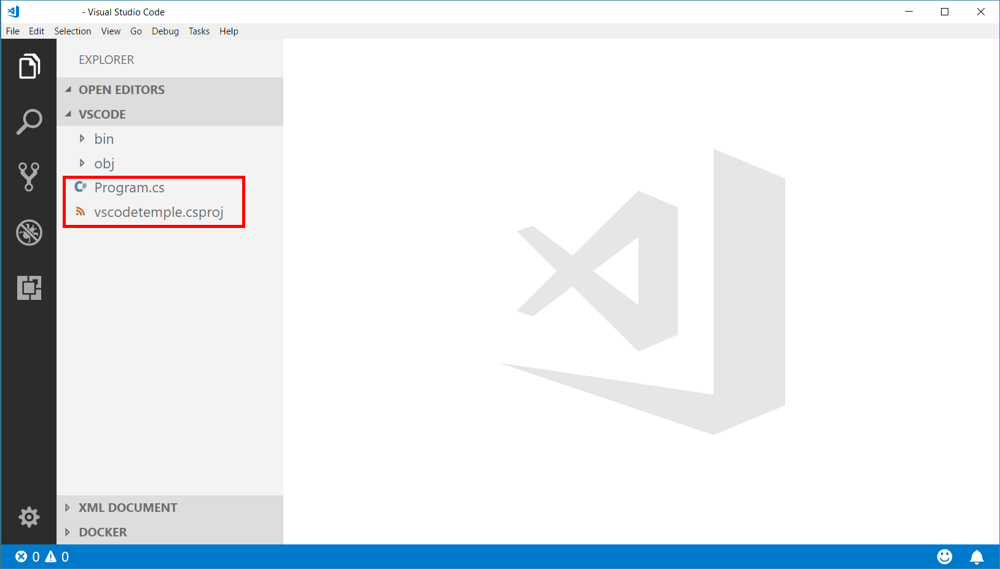

1. Double-click the **Program.cs** link in the **Explorer** pane to open the file in the editor.

    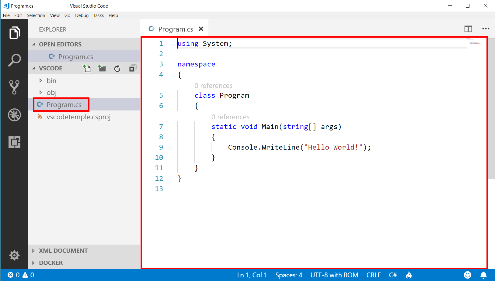

### Create DocumentClient Instance

**

1. Within the **Program.cs** editor tab, Add the following using blocks to the top of the editor:

    ```c#
    using System.Collections.Generic;
    using System.Linq;
    using System.Threading.Tasks;
    using Microsoft.Azure.Documents;
    using Microsoft.Azure.Documents.Client;
    using Microsoft.Azure.Documents.Linq;
    ```

1. Locate the **Program** class and replace it with the following class:

    ```c#
    public class Program
    {
        public static void Main(string[] args)
        {         
        }

        private static async Task ExecuteLogic(DocumentClient client)
        {
        }
    }
    ```

1. Within the **Program** class, add the following lines of code to create variables for your connection information:

    ```c#
    private static readonly Uri _endpointUri = new Uri("");
    private static readonly string _primaryKey = "";
    private static readonly string _databaseId = "UniversityDatabase";
    private static readonly string _collectionId = "StudentCollection";  
    ```

1. For the ``_endpointUri`` variable, replace the placeholder value with the **URI** value from your Azure Cosmos DB account that you recorded earlier in this lab: 

    > For example, if your **uri** is ``https://labqury.documents.azure.com:443/``, your new variable assignment will look like this: ``private static readonly Uri _endpointUri = new Uri("https://labqury.documents.azure.com:443/");``.

1. For the ``_primaryKey`` variable, replace the placeholder value with the **PRIMARY KEY** value from your Azure Cosmos DB account that you recorded earlier in this lab: 

    > For example, if your **primary key** is ``NAye14XRGsHFbhpOVUWB7CMG2MOTAigdei5eNjxHNHup7oaBbXyVYSLW2lkPGeKRlZrCkgMdFpCEnOjlHpz94g==``, your new variable assignment will look like this: ``private static readonly string _primaryKey = "NAye14XRGsHFbhpOVUWB7CMG2MOTAigdei5eNjxHNHup7oaBbXyVYSLW2lkPGeKRlZrCkgMdFpCEnOjlHpz94g==";``.
    
1. Locate the **Main** method:

    ```c#
    public static void Main(string[] args)
    { 
    }
    ```

1. Within the **Main** method, add the following lines of code to author a using block that creates and disposes a **DocumentClient** instance:

    ```c#
    using (DocumentClient client = new DocumentClient(endpointUri, primaryKey))
    {
        
    }
    ```

1. Within the *using* block, add the following line of code to call the static ``ExecuteLogic`` method passing in the ``DocumentClient`` instance and waiting for the asynchronous execution to complete.

    ```c#
    ExecuteLogic(client).Wait();
    ```

1. Your ``Program`` class definition should now look like this:

    ```c#
    public class Program
    { 
        private static readonly Uri _endpointUri = new Uri("<your uri>");
        private static readonly string _primaryKey = "<your key>";
        private static readonly string _databaseId = "UniversityDatabase";
        private static readonly string _collectionId = "StudentCollection";  

        public static void Main(string[] args)
        {    
            using (DocumentClient client = new DocumentClient(_endpointUri, _primaryKey))
            {
                ExecuteLogic(client).Wait();
            }
        }

        private static async Task ExecuteLogic(DocumentClient client)
        {       
        }
    }
    ```

    > We are now going to implement a sample query to make sure our client connection code works.

1. Locate the **ExecuteLogic** method:

    ```c#
    private static async Task ExecuteLogic(DocumentClient client)
    {       
    }

    ```    

1. Within the **ExecuteLogic** method, add the following line of code to create a variable named ``collectionLink`` that references the *self-link* Uri for the collection:

    ```c#
    Uri collectionLink = UriFactory.CreateDocumentCollectionUri(_databaseId, _collectionId);
    ```

1. Add the following line of code to create a string variable named ``sql`` that contains a sample SQL query:

    ```c#
    string sql = "SELECT TOP 5 VALUE s.studentAlias FROM coll s WHERE s.enrollmentYear = 2018 ORDER BY s.studentAlias";
    ```

    > This query will get the alias of the top 5 2018-enrollees in the collection sorted by their alias alphabetically

1. Add the following line of code to create a document query:

    ```c#
    IQueryable<string> query = client.CreateDocumentQuery<string>(collectionLink, new SqlQuerySpec(sql));
    ```

1. Add the following lines of code to enumerate over the results and print the strings to the console:

    ```c#
    foreach(string alias in query)
    {
        Console.Out.WriteLine(alias);
    }
    ```

1. Your **ExecuteLogic** method should now look like this:

    ```c#
    private static async Task ExecuteLogic(DocumentClient client)
    {       
        Uri collectionLink = UriFactory.CreateDocumentCollectionUri(_databaseId, _collectionId);

        string sql = "SELECT TOP 5 VALUE students.studentAlias FROM students WHERE students.enrollmentYear = 2018";

        IQueryable<string> query = client.CreateDocumentQuery<string>(collectionLink, new SqlQuerySpec(sql));
        
        foreach(string alias in query)
        {
            Console.Out.WriteLine(alias);
        }
    }
    ```

1. Save all of your open editor tabs.

1. In the Visual Studio Code window, right-click the **Explorer** pane and select the **Open in Command Prompt** menu option.

1. In the open terminal pane, enter and execute the following command:

    ```sh
    dotnet run
    ```

    > This command will build and execute the console project.

1. Observe the results of the console project.

    > You should see five aliases printed to the console window.

1. Click the **🗙** symbol to close the terminal pane.

1. Close all open editor tabs.

### Query Intra-document Array

**

1. In the Visual Studio Code window, right-click the **Explorer** pane and select the **New File** menu option.

    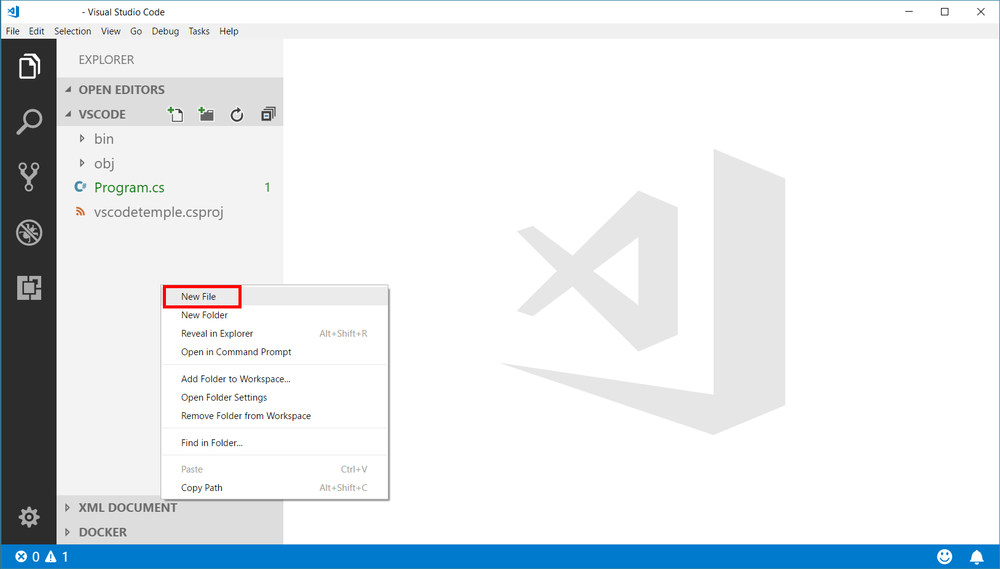

1. Name the new file **Student.cs**. The editor tab will automatically open for the new file.

    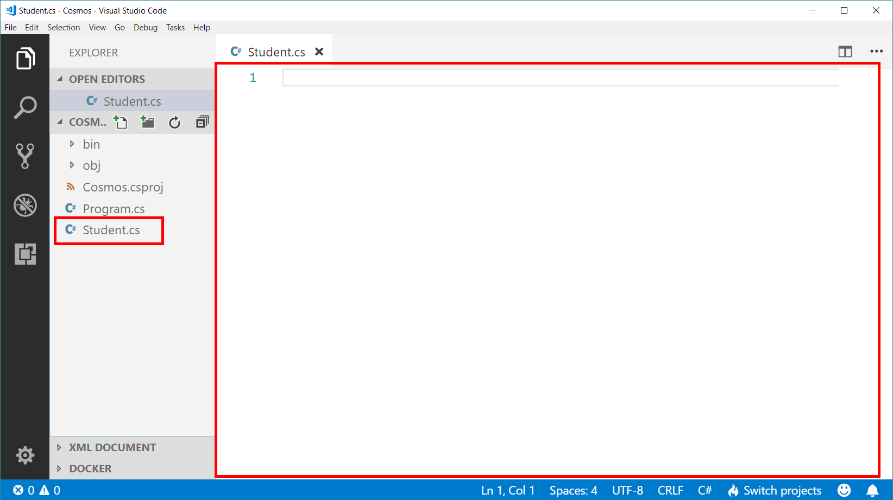

1. Paste in the following code for the ``Student`` class:

    ```c#
    public class Student
    {
        public string[] Clubs { get; set; }
    }
    ```

1. In the Visual Studio Code window, double-click the **Program.cs** file to open an editor tab for the file.

1. Within the **Program.cs** editor tab, locate the **ExecuteLogic** method.

1. Within the **ExecuteLogic** method, locate the following line of code: 

    ```c#
    string sql = "SELECT TOP 5 VALUE students.studentAlias FROM students WHERE students.enrollmentYear = 2018";
    ```

    Replace that line of code with the following code:

    ```c#
    string sql = "SELECT s.clubs FROM students s WHERE s.enrollmentYear = 2018";
    ```

    > This new query will select the **clubs** property for each student in the result set. The value of the **clubs** property is a string array.

1. Locate the following line of code: 

    ```c#
    IQueryable<string> query = client.CreateDocumentQuery<string>(collectionLink, new SqlQuerySpec(sql));
    ```

    Replace that line of code with the following code:

    ```c#
    IQueryable<Student> query = client.CreateDocumentQuery<Student>(collectionLink, new SqlQuerySpec(sql));
    ```

    > The query was updated to return a collection of student entities instead of string values.

1. Locate the following line of code: 

    ```c#
    foreach(string alias in query)
    {
        Console.Out.WriteLine(alias);
    }
    ```

    Replace that line of code with the following code:

    ```c#
    foreach(Student student in query)
    foreach(string club in student.Clubs)
    {
        Console.Out.WriteLine(club);
    }
    ```

    > Our new query will need to iterate twice. First, we will iterate the collection of students and then we will iterate the collection of clubs for each student instance.

1. Save all of your open editor tabs.

1. In the Visual Studio Code window, right-click the **Explorer** pane and select the **Open in Command Prompt** menu option.

1. In the open terminal pane, enter and execute the following command:

    ```sh
    dotnet run
    ```

    > This command will build and execute the console project.

1. Observe the results of the console project.

    > You should see multiple club names printed to the console window.

1. Click the **🗙** symbol to close the terminal pane.

    > Since we only really care about the list of clubs, we want to peform a self-join that applies a cross product across the **club** properties of each student in the result set.

1. In the Visual Studio Code window, right-click the **Explorer** pane and select the **New File** menu option.

1. Name the new file **StudentActivity.cs**. The editor tab will automatically open for the new file.

1. Paste in the following code for the ``StudentActivity`` class:

    ```c#
    public class StudentActivity
    {
        public string Activity { get; set; }
    }
    ```

1. In the Visual Studio Code window, double-click the **Program.cs** file to open an editor tab for the file.

1. Within the **Program.cs** editor tab, locate the **ExecuteLogic** method.

1. Within the **ExecuteLogic** method, locate the following line of code: 

    ```c#
    string sql = "SELECT s.clubs FROM students s WHERE s.enrollmentYear = 2018";    
    ```

    Replace that line of code with the following code:

    ```c#
    string sql = "SELECT activity FROM students s JOIN activity IN s.clubs WHERE s.enrollmentYear = 2018";
    ```

    > Here we are performing an intra-document JOIN to get a projection of all clubs across all matching students.

1. Locate the following line of code: 

    ```c#
    IQueryable<Student> query = client.CreateDocumentQuery<Student>(collectionLink, new SqlQuerySpec(sql));
    ```

    Replace that line of code with the following code:

    ```c#
    IQueryable<StudentActivity> query = client.CreateDocumentQuery<StudentActivity>(collectionLink, new SqlQuerySpec(sql));
    ```

1. Locate the following line of code: 

    ```c#
    foreach(Student student in query)
    foreach(string club in student.Clubs)
    {
        Console.Out.WriteLine(club);
    }
    ```

    Replace that line of code with the following code:

    ```c#
    foreach(StudentActivity studentActivity in studentActivities)
    {
        Console.Out.WriteLine(studentActivity.Activity);
    }
    ```

1. Save all of your open editor tabs.

1. In the Visual Studio Code window, right-click the **Explorer** pane and select the **Open in Command Prompt** menu option.

1. In the open terminal pane, enter and execute the following command:

    ```sh
    dotnet run
    ```

    > This command will build and execute the console project.

1. Observe the results of the console project.

    > You should see multiple club names printed to the console window.

1. Click the **🗙** symbol to close the terminal pane.

    > While we did get very useful information with our JOIN query, it would be more useful to get the raw array values instead of a wrapped value. It would also make our query easier to read if we could simply create an array of strings.

1. In the Visual Studio Code window, double-click the **Program.cs** file to open an editor tab for the file.

1. Within the **Program.cs** editor tab, locate the **ExecuteLogic** method.

1. Within the **ExecuteLogic** method, locate the following line of code: 

    ```c#
    string sql = "SELECT activity FROM students s JOIN activity IN s.clubs WHERE s.enrollmentYear = 2018";  
    ```

    Replace that line of code with the following code:

    ```c#
    string sql = "SELECT VALUE activity FROM students s JOIN activity IN s.clubs WHERE s.enrollmentYear = 2018";
    ```

    > Here we are using the ``VALUE`` keyword to flatten our query.

1. Locate the following line of code: 

    ```c#
    IQueryable<StudentActivity> query = client.CreateDocumentQuery<StudentActivity>(collectionLink, new SqlQuerySpec(sql));
    ```

    Replace that line of code with the following code:

    ```c#
    IQueryable<string> query = client.CreateDocumentQuery<string>(collectionLink, new SqlQuerySpec(sql));
    ```

1. Locate the following line of code: 

    ```c#
    foreach(StudentActivity studentActivity in query)
    {
        Console.Out.WriteLine(studentActivity.Activity);
    }
    ```

    Replace that line of code with the following code:

    ```c#
    foreach(string activity in query)
    {
        Console.Out.WriteLine(activity);
    }
    ```

1. Save all of your open editor tabs.

1. In the Visual Studio Code window, right-click the **Explorer** pane and select the **Open in Command Prompt** menu option.

1. In the open terminal pane, enter and execute the following command:

    ```sh
    dotnet run
    ```

    > This command will build and execute the console project.

1. Observe the results of the console project.

    > You should see multiple club names printed to the console window.

1. Click the **🗙** symbol to close the terminal pane.

1. Close all open editor tabs.

### Projecting Query Results

**

1. In the Visual Studio Code window, right-click the **Explorer** pane and select the **New File** menu option.

1. Name the new file **StudentProfile.cs**. The editor tab will automatically open for the new file.

1. Paste in the following code for the ``Student`` class:

    ```c#
    public class StudentProfile
    {
        public string Id { get; set; }
        public string Name { get; set; }
        public StudentProfileEmailInformation Email { get; set; }
    }

    public class StudentProfileEmailInformation
    {
        public string Home { get; set; }
        public string School { get; set; }
    }
    ```

1. In the Visual Studio Code window, double-click the **Program.cs** file to open an editor tab for the file.

1. Within the **Program.cs** editor tab, locate the **ExecuteLogic** method.

1. Within the **ExecuteLogic** method, locate the following line of code: 

    ```c#
    //string sql = "";
    ```

    Uncomment that line of code and replace it with the following code:

    ```c#
    string sql = "SELECT VALUE { 'id': s.id, 'name': CONCAT(s.firstName, ' ', s.lastName), 'email': { 'home': s.homeEmailAddress, 'school': CONCAT(s.studentAlias, '@contoso.edu') } } FROM students s WHERE s.enrollmentYear = 2018"; 
    ```

    > This query will get relevant information about a student and format it to a specific JSON structure that our application expects. For your information, here's the query that we are using:

    ```sql
    SELECT VALUE {
        "id": s.id,
        "name": CONCAT(s.firstName, " ", s.lastName),    
        "email": {
            "home": s.homeEmailAddress,
            "school": CONCAT(s.studentAlias, '@contoso.edu')
        }
    } FROM students s WHERE s.enrollmentYear = 2018
    ```

1. Locate the following line of code: 

    ```c#
    IQueryable<Student> query = client.CreateDocumentQuery<Student>(collectionLink, new FeedOptions { EnableCrossPartitionQuery = true}); 
    ```

    Replace that code with the following code:

    ```c#
    IQueryable<StudentProfile> query = client.CreateDocumentQuery<StudentProfile>(collectionLink, new SqlQuerySpec(sql));   
    ```

1. Locate the following line of code: 

    ```c#
    foreach(Student student in query)
    {
        Console.Out.WriteLine($"[enrollmentYear: {student.EnrollmentYear}]\talias: {student.StudentAlias}");
    }
    ```

    Replace that code with the following code:

    ```c#
    foreach(StudentProfile profile in query)
    {
        Console.Out.WriteLine($"[{profile.Id}]\t{profile.Name,-20}\t{profile.Email.School,-50}\t{profile.Email.Home}");
    }
    ```

    > This code uses the special alignment features of C# string formatting so you can see all properties of the ``StudentProfile`` instances.

1. Save all of your open editor tabs.

1. In the Visual Studio Code window, right-click the **Explorer** pane and select the **Open in Command Prompt** menu option.

1. In the open terminal pane, enter and execute the following command:

    ```sh
    dotnet run
    ```

    > This command will build and execute the console project.

1. Observe the results of the execution.

1. Click the **🗙** symbol to close the terminal pane.

1. Close all open editor tabs.

## Implement Pagination using the .NET SDK


### 

**

1. In the Visual Studio Code window, double-click the **Program.cs** file to open an editor tab for the file.

1. Within the **Program.cs** editor tab, locate the **ExecuteLogic** method.

1. Within the **ExecuteLogic** method, locate the following line of code: 

    ```c#
    IQueryable<StudentProfile> query = client.CreateDocumentQuery<StudentProfile>(collectionLink, new SqlQuerySpec(sql));  
    ```

    Replace that code with the following code:

    ```c#
    IDocumentQuery<StudentProfile> query = client.CreateDocumentQuery<StudentProfile>(collectionLink, new SqlQuerySpec(sql), new FeedOptions { MaxItemCount = 100 }).AsDocumentQuery();
    ```

    > The DocumentQuery class will allow us to determine if there are more results available and page through results.

1. Locate the following line of code:

    ```c#
    foreach(StudentProfile profile in query)
    {
        Console.Out.WriteLine($"[{profile.Id}]\t{profile.Name,-20}\t{profile.Email.School,-50}\t{profile.Email.Home}");
    }  
    ```

    Replace that code with the following code:

    ```c#
    int pageCount = 0;
    while(query.HasMoreResults)
    {
        Console.Out.WriteLine($"---Page #{++pageCount:0000}---");
        foreach(StudentProfile profile in await query.ExecuteNextAsync())
        {
            Console.Out.WriteLine($"\t[{profile.Id}]\t{profile.Name,-20}\t{profile.Email.School,-50}\t{profile.Email.Home}");
        }
    }
    ```

    > First we check if there are more results using the ``HasMoreResults`` property of the ``IDocumentQuery<>`` interface. If this value is set to true, we invoke the ``ExecuteNextAsync`` method to get the next batch of results and enumerate them using a ``foreach`` block.

1. Save all of your open editor tabs.

1. In the Visual Studio Code window, right-click the **Explorer** pane and select the **Open in Command Prompt** menu option.

1. In the open terminal pane, enter and execute the following command:

    ```sh
    dotnet run
    ```

    > This command will build and execute the console project.

1. Observe the results of the execution.

    > You can view the current page count by looking at the headers in the console output.

1. Click the **🗙** symbol to close the terminal pane.

1. Close all open editor tabs.

1. Close the Visual Studio Code application.

## Lab Cleanup

### Open Cloud Shell

1. At the top of the portal, click the **Cloud Shell** icon to open a new shell instance.

    > If this is your first time using the cloud shell, you may need to configure the default Storage account and SMB file share.

### Use Azure CLI to Delete Resource Group

1. In the **Cloud Shell** command prompt at the bottom of the portal, type in the following command and press **Enter** to list all resource groups in the subscription:

    ```
    az group list
    ```

1. Type in the following command and press **Enter** to delete the **LABQURY** *Resource Group*:

    ```
    az group delete --name LABQURY --no-wait --yes
    ```

1. Close the **Cloud Shell** prompt at the bottom of the portal.