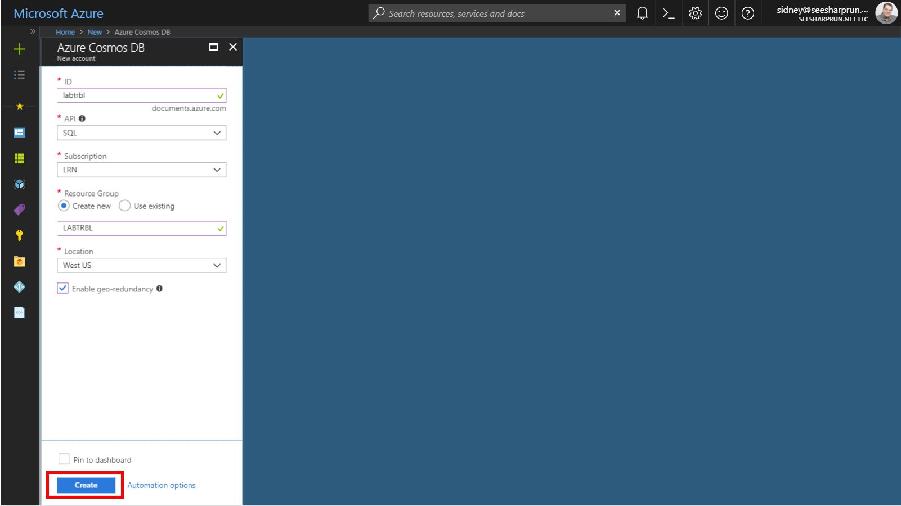

# Authoring Azure Cosmos DB Stored Procedures using JavaScript 

**Required Software**

| Software | Download Link |
| --- | --- |
| .NET Core 2.1 (or greater) SDK | [/download.microsoft.com/dotnet-sdk-2.1](https://download.microsoft.com/download/E/2/6/E266C257-F7AF-4E79-8EA2-DF26031C84E2/dotnet-sdk-2.1.103-win-gs-x64.exe)
| Visual Studio Code | [/code.visualstudio.com/download](https://go.microsoft.com/fwlink/?Linkid=852157) |
| Azure Cosmos DB Data Migration Tool | [/cosmosdb-data-migration-tool](../files/cosmosdt.zip) |

## Setup

Before starting any lab in this workshop, you will need to create the various Azure resources necessary to complete the lab. In this exercise, you will create an Azure Cosmos DB account, database and collection.

### Create Azure Cosmos DB Assets

*You will now create an Azure Cosmos DB account to use in this lab.*

1. In a new window, sign in to the **Azure Portal** (<http://portal.azure.com>).

1. On the left side of the portal, click the **Create a resource** link.

    

1. At the top of the **New** blade, locate the **Search the Marketplace** field.

    

1. Enter the text **Cosmos** into the search field and press **Enter**.

1. In the **Everything** search results blade, select the **Azure Cosmos DB** result.

    

1. In the **Azure Cosmos DB** blade, click the **Create** button.

    

1. In the new **Azure Cosmos DB** blade, perform the following actions:

    1. In the **ID** field, enter a globally unique value.

    1. In the **API** list, select the **SQL** option.

    1. Leave the **Subscription** field set to its default value.

    1. In the **Resource group** section, select the **Create new** option.

    1. In the **Resource group** section, enter the value **LABPROC**  into the empty field.

    1. In the **Location** field, select the **West US** location.

    1. Click the **Create** button.

    

1. Wait for the creation task to complete before moving on with this lab.  

### Retrieve Account Credentials

*The .NET SDK requires credentials to connect to your Azure Cosmos DB account. You will collect and store these credentials for use throughout the lab.*

1. On the left side of the portal, click the **Resource groups** link.

    

1. In the **Resource groups** blade, locate and select the **LABQURY** *Resource Group*.

    

1. In the **LABQURY** blade, select the **Azure Cosmos DB** account you recently created.

    

1. In the **Azure Cosmos DB** blade, locate the **Settings** section and click the **Keys** link.

    

1. In the **Keys** pane, record the values in the **URI** and **PRIMARY KEY** fields. You will use these values later in this lab.

    

## Author Simple Stored Procedure

### Open Data Explorer

1.

### Create Stored Procedure

1.

### Validate Stored Procedure

1.

## Use .NET SDK to Execute Stored Procedure

### Create a .NET Core Project

1.

### Create DocumentClient Instance

1.