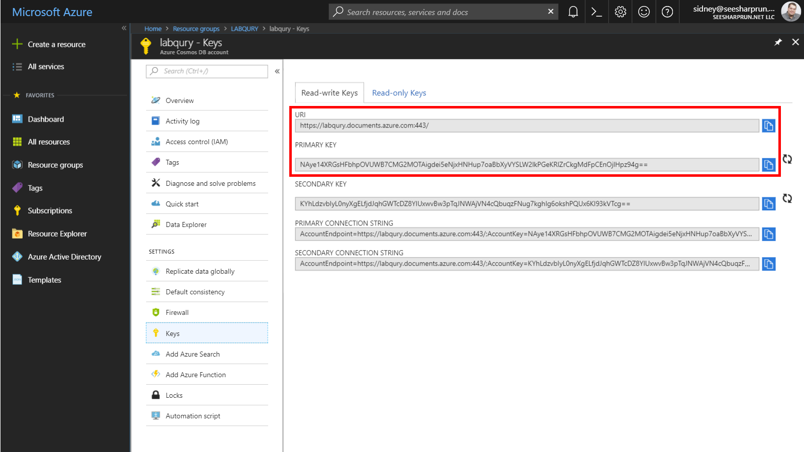

# Authoring Azure Cosmos DB Stored Procedures using JavaScript 

In this lab, you will author and execute multiple stored procedures within your Azure Cosmos DB instance. You will explore features unique to JavaScript stored procedures such as throwing errors for transaction rollback, logging using the JavaScript console and implementing a continuation model within a bounded execution enviornment.

## Setup

*Before you start this lab, you will need to create an Azure Cosmos DB database and collection that you will use throughout the lab.*

### Create Azure Cosmos DB Database and Collection

*You will now create a database and collection within your Azure Cosmos DB account.*

1. On the left side of the portal, click the **Resource groups** link.

    

1. In the **Resource groups** blade, locate and select the **COSMOSLABS** *Resource Group*.

1. In the **COSMOSLABS** blade, select the **Azure Cosmos DB** account you recently created.

1. In the **Azure Cosmos DB** blade, locate and click the **Overview** link on the left side of the blade.

1. At the top of the **Azure Cosmos DB** blade, click the **Add Collection** button.

1. In the **Add Collection** popup, perform the following actions:

    1. In the **Database id** field, enter the value **FinancialDatabase**.

    1. In the **Collection id** field, enter the value **InvestorCollection**.

    1. In the **Storage capacity** section, select the **Unlimited** option.

    1. In the **Partition key** field, enter the value ``/company``.

    1. In the **Throughput** field, enter the value ``1000``.

    1. Click the **OK** button.

1. Wait for the creation of the new **database** and **collection** to finish before moving on with this lab.

### Retrieve Account Credentials

*The Data Migration Tool and .NET SDKs both require credentials to connect to your Azure Cosmos DB account. You will collect and store these credentials for use throughout the lab.*

1. On the left side of the **Azure Cosmos DB** blade, locate the **Settings** section and click the **Keys** link.

1. In the **Keys** pane, record the values in the **URI** and **PRIMARY KEY** fields. You will use these values later in this lab.

    

## Author Simple Stored Procedures

*You will get started in this lab by authoring simple stored procedures that implement common server-side tasks such as adding one or more documents as part of a database transaction.*

### Open Data Explorer

1. In the **Azure Cosmos DB** blade, locate and click the **Data Explorer** link on the left side of the blade.

1. In the **Data Explorer** section, expand the **FinancialDatabase** database node and then expand the **InvestorCollection** collection node. 

1. Within the **InvestorCollection** node, click the **Documents** link.

### Create Simple Stored Procedure

1. Click the **New Stored Procedure** button at the top of the **Data Explorer** section.

1. In the stored procedure tab, locate the **Stored Procedure Id** field and enter the value: **greetCaller**.

1. Replace the contents of the *stored procedure editor* with the following JavaScript code:

    ```js
    function greetCaller(name) {
        var context = getContext();
        var response = context.getResponse();
        response.setBody("Hello " + name);
    }
    ```

    > This simple stored procedure will echo the input parameter string with the text ``Hello `` as a prefix.

1. Click the **Save** button at the top of the tab.

1. Click the **Execute** button at the top of the tab.

1. In the **Input parameters** popup that appears, perform the following actions:

    1. In the **Partition key value** field, enter the value: ``example``.
    
    1. Click the **Add New Param** button.

    1. In the new field that appears, enter the value: ``Person``.

    1. Click the **Execute** button.

1. In the **Result** pane at the bottom of the tab, observe the results of the stored procedure's execution.

    > The output should be ``"Hello Person"``.

### Create Stored Procedure with Nested Callbacks

1. Click the **New Stored Procedure** button at the top of the **Data Explorer** section.

1. In the stored procedure tab, locate the **Stored Procedure Id** field and enter the value: **createDocument**.

1. Replace the contents of the *stored procedure editor* with the following JavaScript code:

    ```js
    function createDocument(doc) {
        var context = getContext();
        var collection = context.getCollection();
        var accepted = collection.createDocument(
            collection.getSelfLink(),
            doc,
            function (err, newDoc) {
                if (err) throw new Error('Error' + err.message);
                context.getResponse().setBody(newDoc);
            }
        );
        if (!accepted) return;
    }
    ```

    > This stored procedures creates a new document and uses a nested callback function to returnt he document as the body of the response.

1. Click the **Save** button at the top of the tab.

1. Click the **Execute** button at the top of the tab.

1. In the **Input parameters** popup that appears, perform the following actions:

    1. In the **Partition key value** field, enter the value: ``contosoairlines``.
    
    1. Click the **Add New Param** button.

    1. In the new field that appears, enter the value: ``{ "company": "contosoairlines", "industry": "travel" }``.

    1. Click the **Execute** button.

1. In the **Result** pane at the bottom of the tab, observe the results of the stored procedure's execution.

    > You should see a new document in your collection. Azure Cosmos DB has assigned additional fields to the document such as ``id`` and ``_etag``.

1. Click the **New SQL Query** button at the top of the **Data Explorer** section.

1. In the query tab, replace the contents of the *query editor* with the following SQL query:

    ```sql
    SELECT * FROM investors WHERE investors.company = "contosoairlines" AND investors.industry = "travel"
    ```

    > This query will retrieve the document you have just created.

1. Click the **Execute Query** button in the query tab to run the query. 

1. In the **Results** pane, observe the results of your query.

1. Close the **Query** tab.

### Create Stored Procedure with Logging

1. Click the **New Stored Procedure** button at the top of the **Data Explorer** section.

1. In the stored procedure tab, locate the **Stored Procedure Id** field and enter the value: **createDocumentWithLogging**.

1. Replace the contents of the *stored procedure editor* with the following JavaScript code:

    ```js
    function createDocumentWithLogging(doc) {
        console.log("procedural-start ");
        var context = getContext();
        var collection = context.getCollection();
        console.log("metadata-retrieved ");
        var accepted = collection.createDocument(
            collection.getSelfLink(),
            doc,
            function (err, newDoc) {
                console.log("callback-started ");
                if (err) throw new Error('Error' + err.message);
                context.getResponse().setBody(newDoc.id);
            }
        );
        console.log("async-doc-creation-started ");
        if (!accepted) return;
        console.log("procedural-end");
    }
    ```

    > This stored procedure will use the **console.log** feature that's normally used in browser-based JavaScript to write output to the console. In the context of Azure Cosmos DB, this feature can be used to capture diagnostics logging information that can be returned after the stored procedure is executed.

1. Click the **Save** button at the top of the tab.

1. Click the **Execute** button at the top of the tab.

1. In the **Input parameters** popup that appears, perform the following actions:

    1. In the **Partition key value** field, enter the value: ``contosoairlines``.
    
    1. Click the **Add New Param** button.

    1. In the new field that appears, enter the value: ``{ "company": "contosoairlines" }``.

    1. Click the **Execute** button.

1. In the **Result** pane at the bottom of the tab, observe the results of the stored procedure's execution.

    > You should see the unique id of a new document in your collection.

1. Click the *console.log* link in the **Result** pane to view the log data for your stored procedure execution.

    > You can see that the procedural components of the stored procedure finished first and then the callback function was executed once the document was created. This can help you understand the asynchronous nature of JavaScript callbacks.

### Create Stored Procedure with Callback Functions

1. Click the **New Stored Procedure** button at the top of the **Data Explorer** section.

1. In the stored procedure tab, locate the **Stored Procedure Id** field and enter the value: **createDocumentWithFunction**.

1. Replace the contents of the *stored procedure editor* with the following JavaScript code:

    ```js
    function createDocumentWithFunction(document) {
        var context = getContext();
        var collection = context.getCollection();
        if (!collection.createDocument(collection.getSelfLink(), document, documentCreated))
            return;
        function documentCreated(error, newDocument) {
            if (error) throw new Error('Error' + error.message);
            context.getResponse().setBody(newDocument);
        }
    }
    ```

    > This is the same stored procedure as you created previously but it is using a named function instead of an implicit callback function inline.

1. Click the **Save** button at the top of the tab.

1. Click the **Execute** button at the top of the tab.

1. In the **Input parameters** popup that appears, perform the following actions:

    1. In the **Partition key value** field, enter the value: ``adventureworks``.
    
    1. Click the **Add New Param** button.

    1. In the new field that appears, enter the value: ``{ "company": "contosoairlines" }``.

    1. Click the **Execute** button.

1. In the **Result** pane at the bottom of the tab, observe that the stored procedure execution has failed.

    > Stored procedures are bound to a specific partition key. You are not able to create or manipulate documents across partition keys within a stored procedure.

1. Click the **Execute** button at the top of the tab.

1. In the **Input parameters** popup that appears, perform the following actions:

    1. In the **Partition key value** field, enter the value: ``adventureworks``.
    
    1. Click the **Add New Param** button.

    1. In the new field that appears, enter the value: ``{ "company": "adventureworks" }``.

    1. Click the **Execute** button.

1. In the **Result** pane at the bottom of the tab, observe the results of the stored procedure's execution.

    > You should see a new document in your collection. Azure Cosmos DB has assigned additional fields to the document such as ``id`` and ``_etag``.

1. Click the **New SQL Query** button at the top of the **Data Explorer** section.

1. In the query tab, replace the contents of the *query editor* with the following SQL query:

    ```sql
    SELECT * FROM investors WHERE investors.company = "adventureworks"
    ```

    > This query will retrieve the document you have just created.

1. Click the **Execute Query** button in the query tab to run the query. 

1. In the **Results** pane, observe the results of your query.

1. Close the **Query** tab.

### Create Stored Procedure with Error Handling

1. Click the **New Stored Procedure** button at the top of the **Data Explorer** section.

1. In the stored procedure tab, locate the **Stored Procedure Id** field and enter the value: **createTwoDocuments**.

1. Replace the contents of the *stored procedure editor* with the following JavaScript code:

    ```js
    function createTwoDocuments(companyName, industry, taxRate) {
        var context = getContext();
        var collection = context.getCollection();
        var firstDocument = {
            company: companyName,
            industry: industry
        };
        var secondDocument = {
            company: companyName,
            tax: {
                exempt: false,
                rate: taxRate
            }
        };
        var firstAccepted = collection.createDocument(collection.getSelfLink(), firstDocument, 
            function (firstError, newFirstDocument) {
                if (firstError) throw new Error('Error' + firstError.message);
                var secondAccepted = collection.createDocument(collection.getSelfLink(), secondDocument,
                    function (secondError, newSecondDocument) {
                        if (secondError) throw new Error('Error' + secondError.message);      
                        context.getResponse().setBody({
                            companyRecord: newFirstDocument,
                            taxRecord: newSecondDocument
                        });
                    }
                );
                if (!secondAccepted) return;    
            }
        );
        if (!firstAccepted) return;    
    }
    ```

    > This stored procedure uses nested callbacks to create two seperate documents. You may have scenarios where your data is split across multiple JSON documents and you will need to add or modify multiple documents in a single stored procedure.

1. Click the **Save** button at the top of the tab.

1. Click the **Execute** button at the top of the tab.

1. In the **Input parameters** popup that appears, perform the following actions:

    1. In the **Partition key value** field, enter the value: ``abcairways``.
    
    1. Click the **Add New Param** button three times.

    1. In the first field that appears, enter the value: ``abcairways``.

    1. In the second field that appears, enter the value: ``travel``.

    1. In the third field that appears, enter the value: ``1.05``.

    1. Click the **Execute** button.

1. In the **Result** pane at the bottom of the tab, observe the results of the stored procedure's execution.

    > You should see a new document in your collection. Azure Cosmos DB has assigned additional fields to the document such as ``id`` and ``_etag``.

1. Replace the contents of the *stored procedure editor* with the following JavaScript code:

    ```js
    function createTwoDocuments(companyName, industry, taxRate) {
        var context = getContext();
        var collection = context.getCollection();
        var firstDocument = {
            company: companyName,
            industry: industry
        };
        var secondDocument = {
            company: companyName + "_taxprofile",
            tax: {
                exempt: false,
                rate: taxRate
            }
        };
        var firstAccepted = collection.createDocument(collection.getSelfLink(), firstDocument, 
            function (firstError, newFirstDocument) {
                if (firstError) throw new Error('Error' + firstError.message);
                console.log('Created: ' + newFirstDocument.id);
                var secondAccepted = collection.createDocument(collection.getSelfLink(), secondDocument,
                    function (secondError, newSecondDocument) {
                        if (secondError) throw new Error('Error' + secondError.message); 
                        console.log('Created: ' + newSecondDocument.id);                   
                        context.getResponse().setBody({
                            companyRecord: newFirstDocument,
                            taxRecord: newSecondDocument
                        });
                    }
                );
                if (!secondAccepted) return;    
            }
        );
        if (!firstAccepted) return;    
    }
    ```

    > We are going to change the stored procedure to put in a different company name for the second document. This should cause the stored procedure to fail since the second document uses a different partition key. The first document will create successfully but will be rolled back when the transaction is rolled back.

1. Click the **Update** button at the top of the tab.

1. Click the **Execute** button at the top of the tab.

1. In the **Input parameters** popup that appears, perform the following actions:

    1. In the **Partition key value** field, enter the value: ``jetsonairways``.
    
    1. Click the **Add New Param** button three times.

    1. In the first field that appears, enter the value: ``jetsonairways``.

    1. In the second field that appears, enter the value: ``travel``.

    1. In the third field that appears, enter the value: ``1.15``.

    1. Click the **Execute** button.

1. In the **Result** pane at the bottom of the tab, observe that the stored procedure execution has failed.

    > This stored procedure failed to create the second document so the entire transaction was rolled back.

1. Click the **New SQL Query** button at the top of the **Data Explorer** section.

1. In the query tab, replace the contents of the *query editor* with the following SQL query:

    ```sql
    SELECT * FROM investors WHERE investors.company = "jetsonairways"
    ```

    > This query won't retrieve any documents since the transaction was rolled back.

1. Click the **Execute Query** button in the query tab to run the query. 

1. In the **Results** pane, observe the results of your query.

1. Close the **Query** tab.

## Author Stored Procedures using the Continuation Model

*You will now implement stored procedures that may execute longer than the bounded execution limits on the server. You will implement the continuation model so that the stored procedures can "pick up where they left off" after they ran out of time in a previous execution.*

### Create Bulk Upload and Bulk Delete Stored Procedures

1. Click the **New Stored Procedure** button at the top of the **Data Explorer** section.

1. In the stored procedure tab, locate the **Stored Procedure Id** field and enter the value: **bulkUpload**.

1. Replace the contents of the *stored procedure editor* with the following JavaScript code:

    ```js
    function bulkUpload(docs) {
        var collection = getContext().getCollection();
        var collectionLink = collection.getSelfLink();
        var count = 0;
        if (!docs) throw new Error("The array is undefined or null.");
        var docsLength = docs.length;
        if (docsLength == 0) {
            getContext().getResponse().setBody(0);
            return;
        }
        tryCreate(docs[count], callback);
        function tryCreate(doc, callback) {
            var isAccepted = collection.createDocument(collectionLink, doc, callback);
            if (!isAccepted) getContext().getResponse().setBody(count);
        }
        function callback(err, doc, options) {
            if (err) throw err;
            count++;
            if (count >= docsLength) {
                getContext().getResponse().setBody(count);
            } else {
                tryCreate(docs[count], callback);
            }
        }
    }
    ```

    > This stored procedure uploads an array of documents in one batch. If the entire batch is not completed, the stored procedure will set the response body to the number of documents that were imported. Your client-side code is expected to call this stored procedure multiple times until all documents are imported.

    If you are having trouble copying the stored procedure above, the full source code for this stored procedure is located here: [bulk_upload.js](../solutions/05-authoring_stored_procedures/bulk_upload.js)

1. Click the **Save** button at the top of the tab.

1. Click the **New Stored Procedure** button at the top of the **Data Explorer** section.

1. In the stored procedure tab, locate the **Stored Procedure Id** field and enter the value: **bulkDelete**.

1. Replace the contents of the *stored procedure editor* with the following JavaScript code:

    ```js
    function bulkDelete(query) {
        var collection = getContext().getCollection();
        var collectionLink = collection.getSelfLink();
        var response = getContext().getResponse();
        var responseBody = {
            deleted: 0,
            continuation: true
        };
        if (!query) throw new Error("The query is undefined or null.");
        tryQueryAndDelete();
        function tryQueryAndDelete(continuation) {
            var requestOptions = {continuation: continuation};
            var isAccepted = collection.queryDocuments(collectionLink, query, requestOptions, function (err, retrievedDocs, responseOptions) {
                if (err) throw err;
                if (retrievedDocs.length > 0) {
                    tryDelete(retrievedDocs);
                } else if (responseOptions.continuation) {
                    tryQueryAndDelete(responseOptions.continuation);
                } else {
                    responseBody.continuation = false;
                    response.setBody(responseBody);
                }
            });
            if (!isAccepted) {
                response.setBody(responseBody);
            }
        }
        function tryDelete(documents) {
            if (documents.length > 0) {
                var isAccepted = collection.deleteDocument(documents[0]._self, {}, function (err, responseOptions) {
                    if (err) throw err;
                    responseBody.deleted++;
                    documents.shift();
                    tryDelete(documents);
                });
                if (!isAccepted) {
                    response.setBody(responseBody);
                }
            } else {
                tryQueryAndDelete();
            }
        }
    }
    ```

    > This stored procedure iterates through all documents that match a specific query and deletes the documents. If the stored procedure is unable to delete all documents, it will return a continuation token. Your client-side code is expected to repeatedly call the stored procedure passing in a continuation token until the stored procedure does not return a continuation token.

    If you are having trouble copying the stored procedure above, the full source code for this stored procedure is located here: [bulk_delete.js](../solutions/05-authoring_stored_procedures/bulk_delete.js)

1. Click the **Save** button at the top of the tab.

### Create a .NET Core Project

1. On your local machine, create a new folder that will be used to contain the content of your .NET Core project.

1. In the new folder, right-click the folder and select the **Open with Code** menu option.

    

    > Alternatively, you can run a command prompt in your current directory and execute the ``code .`` command.

1. In the Visual Studio Code window that appears, right-click the **Explorer** pane and select the **Open in Command Prompt** menu option.

    

1. In the open terminal pane, enter and execute the following command:

    ```sh
    dotnet new console --output .
    ```

    > This command will create a new .NET Core 2.1 project. The project will be a **console** project and the project will be created in the current directly since you used the ``--output .`` option.

1. Visual Studio Code will most likely prompt you to install various extensions related to **.NET Core** or **Azure Cosmos DB** development. None of these extensions are required to complete the labs.

1. In the terminal pane, enter and execute the following command:

    ```sh
    dotnet add package Microsoft.Azure.DocumentDB.Core --version 1.9.1
    ```

    > This command will add the [Microsoft.Azure.DocumentDB.Core](https://www.nuget.org/packages/Microsoft.Azure.DocumentDB.Core/) NuGet package as a project dependency. The lab instructions have been tested using the ``1.9.1`` version of this NuGet package.

1. In the terminal pane, enter and execute the following command:

    ```sh
    dotnet add package Bogus --version 22.0.8
    ```

    > This command will add the [Bogus](https://www.nuget.org/packages/Bogus/) NuGet package as a project dependency. This library will allow us to quickly generate test data using a fluent syntax and minimal code. We will use this library to generate test documents to upload to our Azure Cosmos DB instance. The lab instructions have been tested using the ``22.0.8`` version of this NuGet package.

1. In the terminal pane, enter and execute the following command:

    ```sh
    dotnet restore
    ```

    > This command will restore all packages specified as dependencies in the project.

1. In the terminal pane, enter and execute the following command:

    ```sh
    dotnet build
    ```

    > This command will build the project.

1. Click the **🗙** symbol to close the terminal pane.

1. Observe the **Program.cs** and **[folder name].csproj** files created by the .NET Core CLI.

1. Double-click the **[folder name].csproj** link in the **Explorer** pane to open the file in the editor.

1. Add a new **PropertyGroup** XML element to the project configuration within the **Project** element:

    ```xml
    <PropertyGroup>
        <LangVersion>latest</LangVersion>
    </PropertyGroup>
    ```

1. Your new XML should look like this:

    ```xml
    <Project Sdk="Microsoft.NET.Sdk">
        <PropertyGroup>
            <LangVersion>latest</LangVersion>
        </PropertyGroup>
        <PropertyGroup>
            <OutputType>Exe</OutputType>
            <TargetFramework>netcoreapp2.0</TargetFramework>
        </PropertyGroup>
        <ItemGroup>
            <PackageReference Include="Bogus" Version="22.0.7" />
            <PackageReference Include="Microsoft.Azure.DocumentDB.Core" Version="1.9.1" />
        </ItemGroup>
    </Project>
    ```

1. Double-click the **Program.cs** link in the **Explorer** pane to open the file in the editor.

### Create DocumentClient Instance

*The DocumentClient class is the main "entry point" to using the SQL API in Azure Cosmos DB. We are going to create an instance of the **DocumentClient** class by passing in connection metadata as parameters of the class' constructor. We will then use this class instance throughout the lab.*

1. Within the **Program.cs** editor tab, Add the following using blocks to the top of the editor:

    ```csharp
    using System.Threading.Tasks;
    using Microsoft.Azure.Documents;
    using Microsoft.Azure.Documents.Client;
    using System.Collections.Generic;
    using System.Linq;
    ```

1. Locate the **Program** class and replace it with the following class:

    ```csharp
    public class Program
    {
        public static async Task Main(string[] args)
        {         
        }
    }
    ```

1. Within the **Program** class, add the following lines of code to create variables for your connection information:

    ```csharp
    private static readonly Uri _endpointUri = new Uri("");
    private static readonly string _primaryKey = "";
    ```

1. For the ``_endpointUri`` variable, replace the placeholder value with the **URI** value from your Azure Cosmos DB account that you recorded earlier in this lab: 

    > For example, if your **uri** is ``https://cosmosacct.documents.azure.com:443/``, your new variable assignment will look like this: ``private static readonly Uri _endpointUri = new Uri("https://cosmosacct.documents.azure.com:443/");``.

1. For the ``_primaryKey`` variable, replace the placeholder value with the **PRIMARY KEY** value from your Azure Cosmos DB account that you recorded earlier in this lab: 

    > For example, if your **primary key** is ``elzirrKCnXlacvh1CRAnQdYVbVLspmYHQyYrhx0PltHi8wn5lHVHFnd1Xm3ad5cn4TUcH4U0MSeHsVykkFPHpQ==``, your new variable assignment will look like this: ``private static readonly string _primaryKey = "elzirrKCnXlacvh1CRAnQdYVbVLspmYHQyYrhx0PltHi8wn5lHVHFnd1Xm3ad5cn4TUcH4U0MSeHsVykkFPHpQ==";``.
    
1. Locate the **Main** method:

    ```csharp
    public static async Task Main(string[] args)
    { 
    }
    ```

1. Within the **Main** method, add the following lines of code to author a using block that creates and disposes a **DocumentClient** instance:

    ```csharp
    using (DocumentClient client = new DocumentClient(_endpointUri, _primaryKey))
    {
        
    }
    ```

1. Within the using block, add the following code to the method to open a connection asynchronously:

    ```csharp
    await client.OpenAsync();
    ```

1. Your ``Program`` class definition should now look like this:

    ```csharp
    public class Program
    { 
        private static readonly Uri _endpointUri = new Uri("<your uri>");
        private static readonly string _primaryKey = "<your key>";

        public static async Task Main(string[] args)
        {    
            using (DocumentClient client = new DocumentClient(_endpointUri, _primaryKey))
            {
                await client.OpenAsync();
            }     
        }
    }
    ```

    > We will now execute a build of the application to make sure our code compiles successfully.

1. Save all of your open editor tabs.

1. In the Visual Studio Code window, right-click the **Explorer** pane and select the **Open in Command Prompt** menu option.

1. In the open terminal pane, enter and execute the following command:

    ```sh
    dotnet build
    ```

    > This command will build the console project.

1. Click the **🗙** symbol to close the terminal pane.

1. Close all open editor tabs.

### Execute Bulk Upload Stored Procedure from .NET Core SDK

1. In the Visual Studio Code window, right-click the **Explorer** pane and select the **New File** menu option.

1. Name the new file **Person.cs** . The editor tab will automatically open for the new file.

1. Paste in the following code for the ``Person`` class:

    ```csharp
    public class Person
    {
        public string firstName { get; set; }
        public string lastName { get; set; }
        public string company { get; set; }
    }
    ```

1. Save all of your open editor tabs.

1. Double-click the **Program.cs** link in the **Explorer** pane to open the file in the editor.

1. Locate the **Main** method within the **Program** class:

    ```csharp
    public static async Task Main(string[] args)
    ```

1. Within the **using** block, add the following line of code to create a variable named ``collectionLink`` that references the *self-link* Uri for the collection:

    ```csharp
    Uri sprocLink = UriFactory.CreateStoredProcedureUri("FinancialDatabase", "InvestorCollection", "bulkUpload");
    ``` 

1. Still within the **using** block, add the following block of code to create a collection of 25,000 "fake" instances of the **Person** class.

    ```csharp
    List<Person> people = new Faker<Person>()
        .RuleFor(p => p.firstName, f => f.Name.FirstName())
        .RuleFor(p => p.lastName, f => f.Name.LastName())
        .RuleFor(p => p.company, f => "contosofinancial")
        .Generate(25000);
    ```

    > As a reminder, the Bogus library generates a set of test data. In this example, you are creating 25,000 items using the Bogus library and the rules listed above. The **Generate** method tells the Bogus library to use the rules to create the specified number of entities and store them in a generic **List<T>**.

1. Still within the **using** block, add the following line of code to create a variable named **pointer** with a default value of **zero**.

    ```csharp
    int pointer = 0;
    ```

    > We are going to use this variable to determine how many documents were uploaded by our stored procedure.

1. Still within the **using** block, add the following **while** block to continue to iterate code as long as the value of the **pointer** field is *less than* the amount of items in the **people** collection:

    ```js
    while(pointer < people.Count)
    {
    }
    ```

    > We are going to create a while loop that will keep uploading documents until the pointer's value greater than or equal to the amount of people in our object set.

1. Within the **while** block, add the following lines of code to create an object of type **RequestOptions** that specified **contosofinancial** as the partition key for the request:

    ```csharp
    RequestOptions options = new RequestOptions { PartitionKey = new PartitionKey("contosofinancial") };
    ```

    > If you are executing a stored procedure in an unlimited container, you must specify the partition key to use as the context of the stored procedure's execution.

1. Still within the **while** block, add the following lines of code to execute the stored procedure:

    ```csharp
    StoredProcedureResponse<int> result = await client.ExecuteStoredProcedureAsync<int>(sprocLink, options, people.Skip(pointer));
    ```

    > This line of code will execute the stored procedure using three parameters; a self-link to the stored procedure to execute, an instance of the RequestOptions class, and then a dynamic list of parameters for the stored procedure. In this example, we are passing in an array of objects as the first parameter for the stored procedure.

1. Still within the **while** block, add the following line of code to store the number returned by the stored procedure in the **pointer** variable:

    ```csharp
    pointer += result.Response;
    ```

    > Everytime the stored procedure returns how many documents were processed, we will increment the counter.

1. Still within the **while** block, add the following line of code to print out the amount of documents uploaded in the current iteration:

    ```csharp
    await Console.Out.WriteLineAsync($"{pointer} Total Documents\t{result.Response} Documents Uploaded in this Iteration");
    ```

1. Your **Main** method should now look like this:

    ```chsarp
    public static async Task Main(string[] args)
    {    
        using (DocumentClient client = new DocumentClient(_endpointUri, _primaryKey))
        {
            await client.OpenAsync();
            Uri sprocLink = UriFactory.CreateStoredProcedureUri("FinancialDatabase", "InvestorCollection", "bulkUpload");
            List<Person> people = new Faker<Person>()
                .RuleFor(p => p.firstName, f => f.Name.FirstName())
                .RuleFor(p => p.lastName, f => f.Name.LastName())
                .RuleFor(p => p.company, f => "contosofinancial")
                .Generate(25000);
            int pointer = 0;
            while(pointer < people.Count)
            {
                RequestOptions options = new RequestOptions { PartitionKey = new PartitionKey("contosofinancial") };
                StoredProcedureResponse<int> result = await client.ExecuteStoredProcedureAsync<int>(sprocLink, options, people.Skip(pointer));
                pointer += result.Response;
                await Console.Out.WriteLineAsync($"{pointer} Total Documents\t{result.Response} Documents Uploaded in this Iteration");
            }
        }   
    }
    ```

    > You will notice that our C# code using the **Skip** method of the LINQ library to submit only the subset of our documents that are not yet uploaded. On the first execution of the while loop, we will skip **0** documents and attempt to upload all documents. When the stored procedure has finished executing, we will get a response indicating how many documents were uploaded. As an example, let's say **5000** documents were uploaded. The pointer will now be incremented to a value of **5000**. On the next check of the while loop's condition, **5000** will be evaluated to be less than **25000** causing another execution of the code in the while loop. The LINQ method will now skip **5000** documents and send the remaining **20000** documents to the stored procedure to upload. This loop will continue until all documents are uploaded.

1. Save all of your open editor tabs.

1. In the Visual Studio Code window, right-click the **Explorer** pane and select the **Open in Command Prompt** menu option.

1. In the open terminal pane, enter and execute the following command:

    ```sh
    dotnet run
    ```

    > This command will build and execute the console project.

1. Observe the results of the console project.

    > This stored procedure will batch upload 25,000 documents to your collection within the specified partition key.

1. Click the **🗙** symbol to close the terminal pane.

### Observe the Uploaded Documents in the Azure Portal

1. Return to the **Azure Portal** (<http://portal.azure.com>).

1. On the left side of the portal, click the **Resource groups** link.

1. In the **Resource groups** blade, locate and select the **COSMOSLABS** *Resource Group*.

1. In the **COSMOSLABS** blade, select the **Azure Cosmos DB** account you recently created.

1. In the **Azure Cosmos DB** blade, locate and click the **Data Explorer** link on the left side of the blade.

1. In the **Data Explorer** section, expand the **FinancialDatabase** database node and then observe select the **InvestorCollection** node.

1. Click the **New SQL Query** button at the top of the **Data Explorer** section.

1. In the query tab, replace the contents of the *query editor* with the following SQL query:

    ```sql
    SELECT * FROM investors i WHERE i.company = "contosofinancial"
    ```

    > To validate that our documents were uploaded, we will issue a query to select all documents with the partition key we used earlier for the stored procedure's execution.

1. Click the **Execute Query** button in the query tab to run the query. 

1. In the **Results** pane, observe the results of your query.

1. In the query tab, replace the contents of the *query editor* with the following SQL query:

    ```sql
    SELECT COUNT(1) FROM investors i WHERE i.company = "contosofinancial"
    ```

    > This query will return a count of the documents that are in the **contosofinancial** partition key.

1. Click the **Execute Query** button in the query tab to run the query. 

1. In the **Results** pane, observe the results of your query.

### Execute Bulk Delete Stored Procedure from .NET Core SDK

1. In the Visual Studio Code window, right-click the **Explorer** pane and select the **New File** menu option.

1. Name the new file **DeleteStatus.cs** . The editor tab will automatically open for the new file.

1. Paste in the following code for the ``DeleteStatus`` class:

    ```csharp
    public class DeleteStatus
    {
        public int Deleted { get; set; }
        public bool Continuation { get; set; }
    }
    ```

    > The next stored procedure returns a complex JSON object instead of a simple typed value. We will need to create a C# class to deserialize the JSON object so we can use it's data in our C# code.

1. Save all of your open editor tabs.

1. Double-click the **Program.cs** link in the **Explorer** pane to open the file in the editor.

1. Locate the **Main** method and delete any existing code:

    ```csharp
    public static async Task Main(string[] args)
    {    
                        
    }
    ```

1. Replace the **Main** method with the following implementation:

    ```csharp
    public static async Task Main(string[] args)
    {    
        using (DocumentClient client = new DocumentClient(_endpointUri, _primaryKey))
        {
            await client.OpenAsync();
            Uri sprocLink = UriFactory.CreateStoredProcedureUri("FinancialDatabase", "InvestorCollection", "bulkDelete");

            bool resume = true;
            do
            {
                RequestOptions options = new RequestOptions { PartitionKey = new PartitionKey("contosofinancial") };
                string query = "SELECT * FROM investors i WHERE i.company = 'contosofinancial'";
                StoredProcedureResponse<DeleteStatus> result = await client.ExecuteStoredProcedureAsync<DeleteStatus>(sprocLink, options, query);
                await Console.Out.WriteLineAsync($"Batch Delete Completed.\tDeleted: {result.Response.Deleted}\tContinue: {result.Response.Continuation}");
                resume = result.Response.Continuation;
            }
            while(resume);
        }   
    }
    ```

    > This code will execute the stored procedure that deletes documents as long as the **resume** variable is set to true. The stored procedure itself always returns an object, serialized as **DeleteStatus**, that has a boolean indicating whether we should continue deleting documents and a number indicating how many documents were deleted as part of this execution. Within the do-while loop, we simply store the value of the boolean returned from the stored procedure in our **resume** variable and continue executing the stored procedure until it returns a false value indicating that all documents were deleted.

1. Save all of your open editor tabs.

1. In the Visual Studio Code window, right-click the **Explorer** pane and select the **Open in Command Prompt** menu option.

1. In the open terminal pane, enter and execute the following command:

    ```sh
    dotnet run
    ```

    > This command will build and execute the console project.

1. Observe the results of the console project.

    > This stored procedure will delete all of the documents associated with the specified partition key. In this demo, this means we will delete the documents we batch uploaded earlier.

1. Click the **🗙** symbol to close the terminal pane.

1. Close all open editor tabs.

1. Close the Visual Studio Code application.

### Query for Documents Within a Partition Key in the Azure Portal

1. Return to the **Azure Portal** (<http://portal.azure.com>).

1. On the left side of the portal, click the **Resource groups** link.

1. In the **Resource groups** blade, locate and select the **COSMOSLABS** *Resource Group*.

1. In the **COSMOSLABS** blade, select the **Azure Cosmos DB** account you recently created.

1. In the **Azure Cosmos DB** blade, locate and click the **Data Explorer** link on the left side of the blade.

1. In the **Data Explorer** section, expand the **FinancialDatabase** database node and then observe select the **InvestorCollection** node.

1. Click the **New SQL Query** button at the top of the **Data Explorer** section.

1. In the query tab, replace the contents of the *query editor* with the following SQL query:

    ```sql
    SELECT COUNT(1) FROM investors i WHERE i.company = "contosofinancial"
    ```

    > This query will return a count of the documents that are in the **contosofinancial** partition key. This count should verify that all documents were deleted.

1. Click the **Execute Query** button in the query tab to run the query. 

1. In the **Results** pane, observe the results of your query.

1. Close your browser application.
