# Troubleshooting Failed and Throttled Azure Cosmos DB Requests 

**Required Software**

| Software | Download Link |
| --- | --- |
| .NET Core 2.1 (or greater) SDK | [/download.microsoft.com/dotnet-sdk-2.1](https://download.microsoft.com/download/E/2/6/E266C257-F7AF-4E79-8EA2-DF26031C84E2/dotnet-sdk-2.1.103-win-gs-x64.exe)
| Visual Studio Code | [/code.visualstudio.com/download](https://go.microsoft.com/fwlink/?Linkid=852157) |
| Azure Cosmos DB Data Migration Tool | [/cosmosdb-data-migration-tool](../files/cosmosdt.zip) |

## Setup

Before starting any lab in this workshop, you will need to create the various Azure resources necessary to complete the lab. In this exercise, you will create an Azure Cosmos DB account, database and collection and then populate the collection with a collection of JSON documents.

### Download Required Files

*A JSON file has been provided that will contain a collection 50,000 students. You will use this file later to import documents into your collection.*

1. Download the [incidents.json](../files/incidents.json) file and save it to your local machine.

### Create Azure Cosmos DB Assets

*You will now create an Azure Cosmos DB account to use in this lab.*

1. In a new window, sign in to the **Azure Portal** (<http://portal.azure.com>).

1. On the left side of the portal, click the **Create a resource** link.

    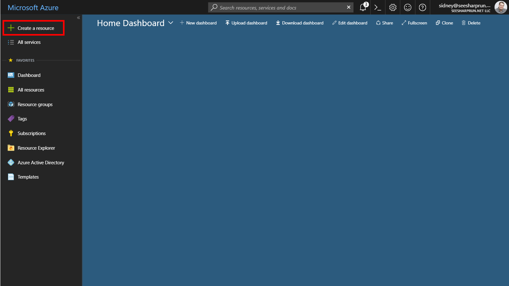

1. At the top of the **New** blade, locate the **Search the Marketplace** field.

    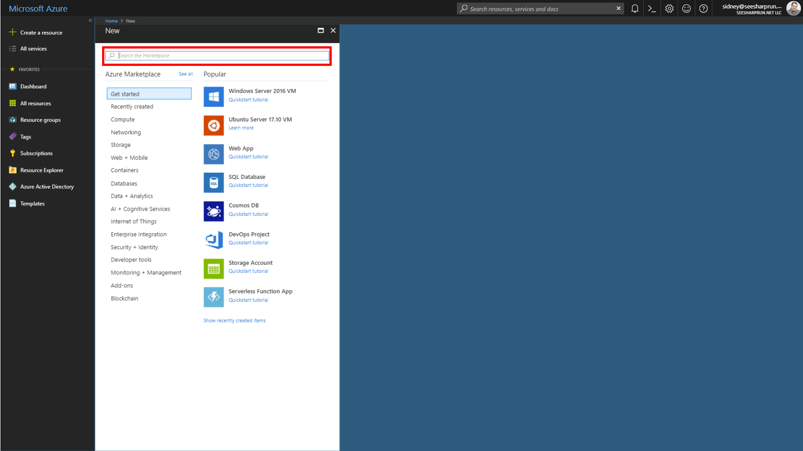

1. Enter the text **Cosmos** into the search field and press **Enter**.

1. In the **Everything** search results blade, select the **Azure Cosmos DB** result.

    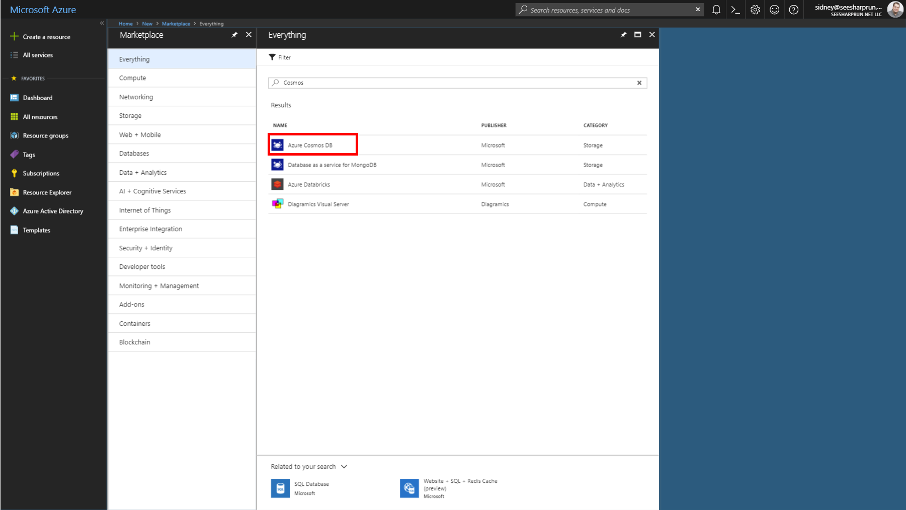

1. In the **Azure Cosmos DB** blade, click the **Create** button.

    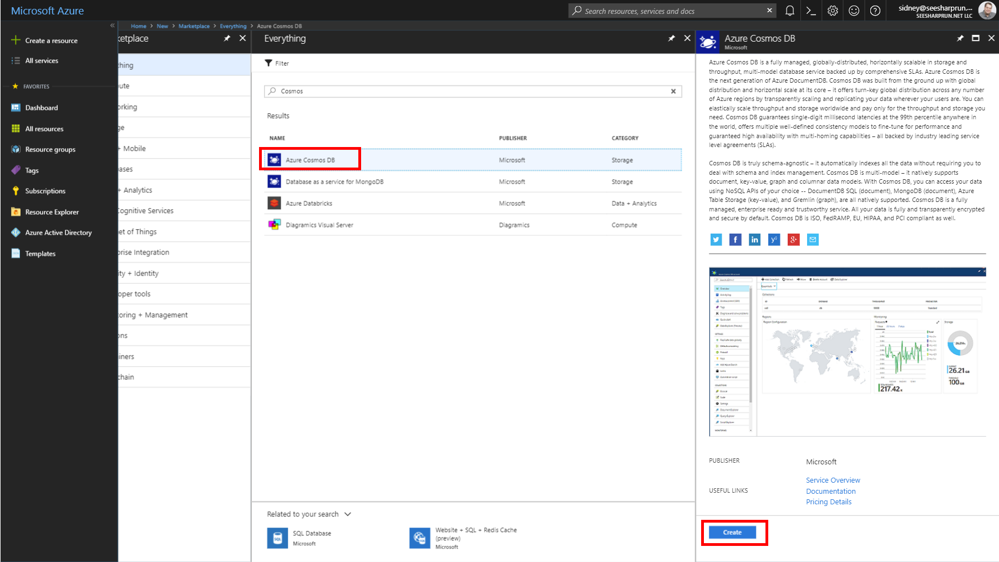

1. In the new **Azure Cosmos DB** blade, perform the following actions:

    1. In the **ID** field, enter a globally unique value.

    1. In the **API** list, select the **SQL** option.

    1. Leave the **Subscription** field set to its default value.

    1. In the **Resource group** section, select the **Create new** option.

    1. In the **Resource group** section, enter the value **LABQURY**  into the empty field.

    1. In the **Location** field, select the **West US** location.

    1. Click the **Create** button.

    

1. Wait for the creation task to complete before moving on with this lab.  

### Create Azure Cosmos DB Database and Collection

*You will now create a database and collection within your Azure Cosmos DB account.*

1. On the left side of the portal, click the **Resource groups** link.

    

1. In the **Resource groups** blade, locate and select the **LABTRBL** *Resource Group*.

    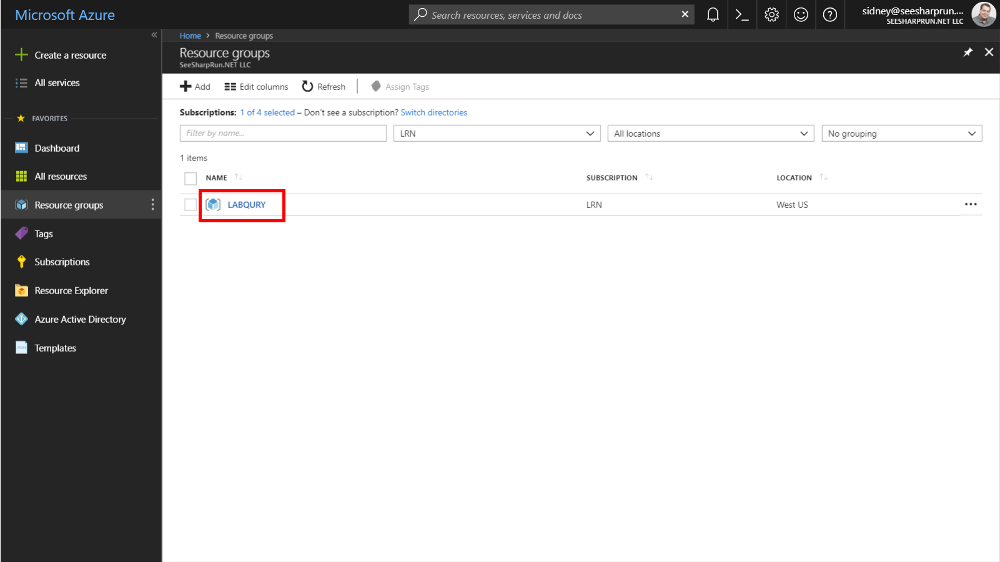

1. In the **LABQURY** blade, select the **Azure Cosmos DB** account you recently created.

    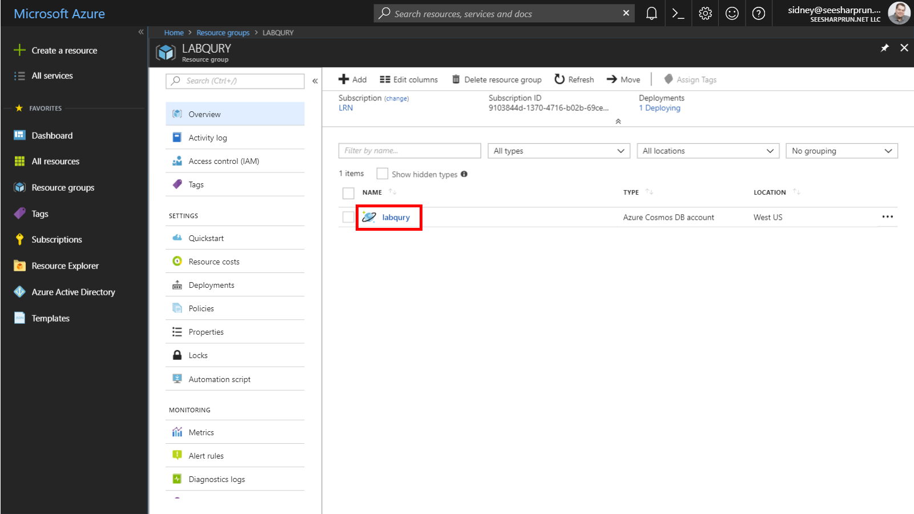

1. In the **Azure Cosmos DB** blade, locate and click the **Overview** link on the left side of the blade.

    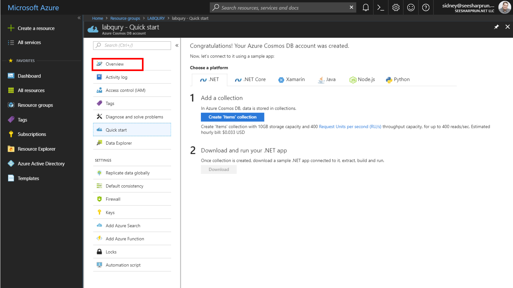

1. At the top of the **Azure Cosmos DB** blade, click the **Add Collection** button.

    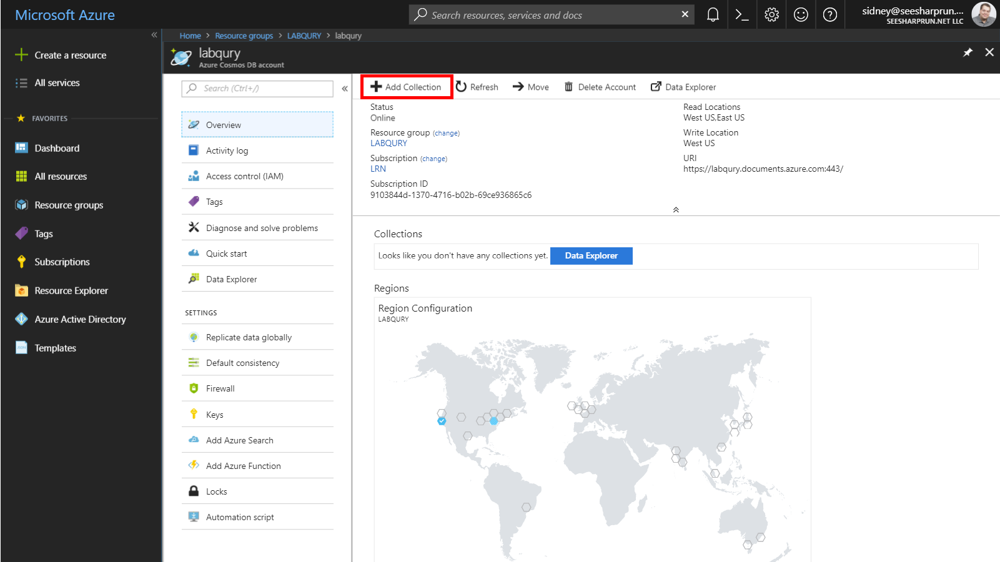

1. In the **Add Collection** popup, perform the following actions:

    1. In the **Database id** field, enter the value **UniversityDatabase**.

    1. In the **Collection id** field, enter the value **StudentCollection**.

    1. In the **Storage capacity** section, select the **Unlimited** option.

    1. In the **Partition key** field, enter the value ``/enrollmentYear``.

    1. In the **Throughput** field, enter the value ``10000``.

    1. Click the **+ Add Unique Key** link.

    1. In the new **Unique Keys** field, enter the value ``/studentAlias``.

    1. Click the **OK** button.

    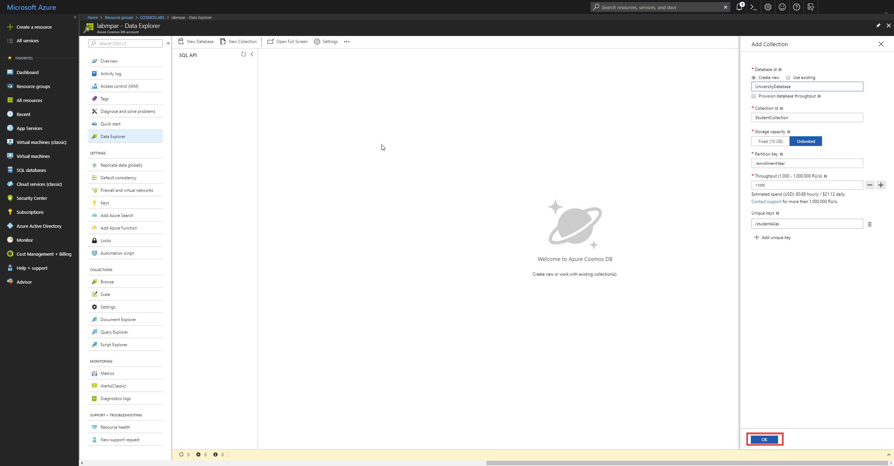

1. Wait for the creation of the new **database** and **collection** to finish before moving on with this lab.

### Retrieve Account Credentials

*The Data Migration Tool and .NET SDKs both require credentials to connect to your Azure Cosmos DB account. You will collect and store these credentials for use throughout the lab.*

1. On the left side of the **Azure Cosmos DB** blade, locate the **Settings** section and click the **Keys** link.

    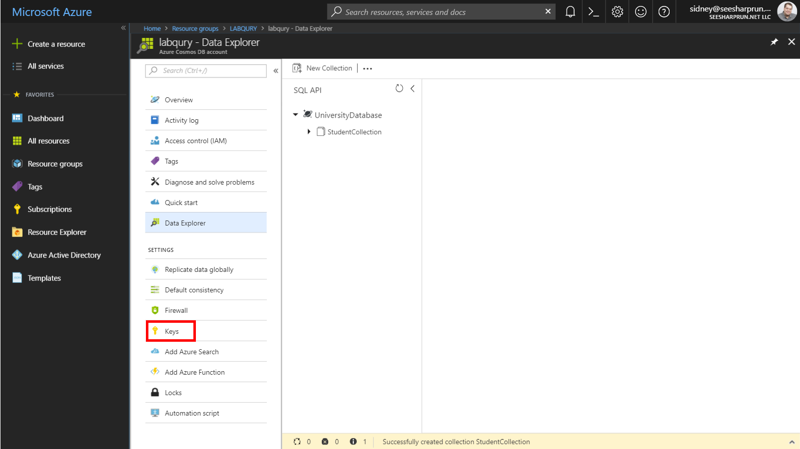

1. In the **Keys** pane, record the values in the **URI** and **PRIMARY KEY** fields. You will use these values later in this lab.

    

### Import Lab Data Into Collection

*Finally, you will import the JSON documents contained in the **students.json** file you downloaded earlier in this lab.*

1. On your local machine, open the **Azure Cosmos DB Data Migration Tool**.

1. In the **Welcome** step of the tool, click the **Next** button to begin the migration wizard.

    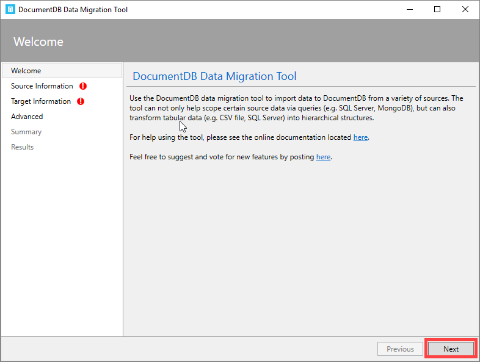

1. In the **Source Information** step of the tool, perform the following actions:

    1. In the **Import from** list, select the **JSON file(s)** option.

    1. Click the **Add Files** button.

    1. In the *Windows Explorer* dialog that opens, locate and select the **incidents.json** file you downloaded earlier in this lab. Click the **Open** button to add the file.

    1. Select the **Decompress data** checkbox.

    1. Click the **Next** button.

    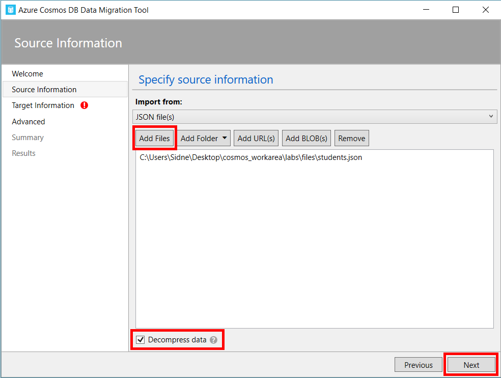

1. In the **Target Information** step of the tool, perform the following actions:

    1. In the **Export to** list, select the **Azure Cosmos DB - Sequential record import (partitioned collection)** option.

    1. In the **Connection String** field, enter a newly constructed connection string replacing the placeholders with values from your Azure Cosmos DB account recorded earlier in this lab: ```AccountEndpoint=[uri];AccountKey=[key];Database=[database name];```. *Make sure you replace the **[uri]**, **[key]**, and **[database name]** placeholders with the corresponding values from your Azure Cosmos DB account. For example, if your **uri** is ``https://labqury.documents.azure.com:443/``, your **key** is ``Get0qW1BrqxRUA9BskSRHti5HHzrp1cjTUJTBMIbxgCGXQgRWh5NZvhc0jIt4A5ZoljA2YiLxjNHtrfC6Bd2fA==`` and your **database's name** is ``UniversityDatabase``, then your connection string will look like this: ```AccountEndpoint=https://labqury.documents.azure.com:443/;AccountKey=Get0qW1BrqxRUA9BskSRHti5HHzrp1cjTUJTBMIbxgCGXQgRWh5NZvhc0jIt4A5ZoljA2YiLxjNHtrfC6Bd2fA==;Database=UniversityDatabase;```*

    1. Click the **Verify** button to validate your connection string.

    1. In the **Collection** field, enter the value **StudentCollection**.

    1. In the **Partition Key** field, enter the value ``/enrollmentYear``.

    1. In the **Collection Throughput** field, enter the value ``10000``.

    1. Click the **Advanced Options** button.

    1. In the **Number of Parallel Requests** field, increment the value from ``10`` to ``25``.

    1. Click the **Next** button.

    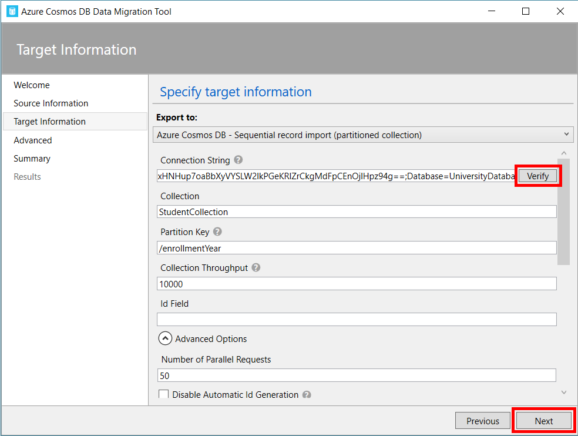

1. In the **Advanced** step of the tool, leave the existing options set to their default values and click the **Next** button.

    

1. In the **Summary** step of the tool, review your options and then click the **Import** button.

    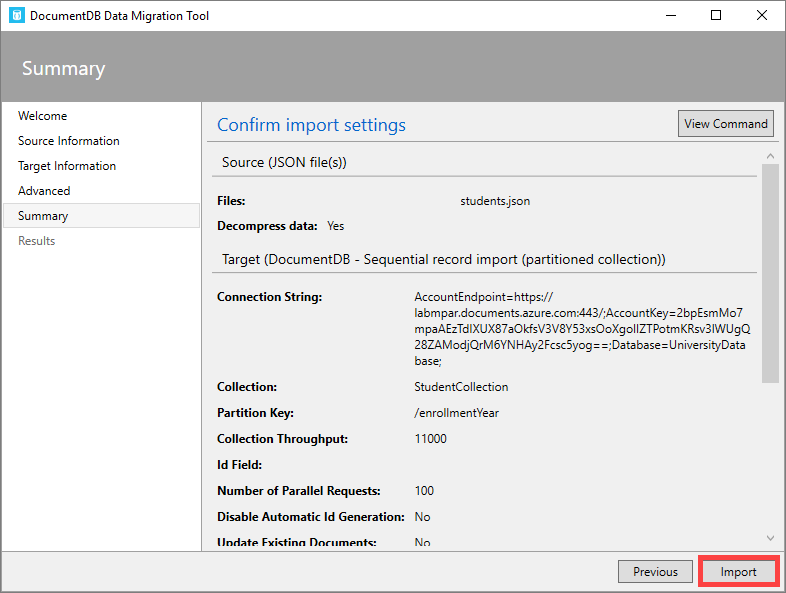

1. Wait for the import process to complete.

    

    > You will know that the tool has run successfully once it has transferred 50000 records and the progress bar's animation ends. This step can take two to five minutes.

    

1. Once the import process has completed, close the Azure Cosmos DB Data Migration Tool.

## Exercise

1.