# Troubleshooting and Tuning Azure Cosmos DB Requests 

In this lab, you will use the .NET SDK to tune an Azure Cosmos DB request to optimize performance of your application.

## Setup

*Before you start this lab, you will need to create an Azure Cosmos DB database and collection that you will use throughout the lab. You will also use the **Data Migration Tool** to import existing data into your collection.*

### Download Required Files

*A JSON file has been provided that will contain a collection 50,000 students. You will use this file later to import documents into your collection.*

1. Download the [transactions.json](../files/transactions.json) file and save it to your local machine.

### Create Azure Cosmos DB Database and Collection

*You will now create a database and collection within your Azure Cosmos DB account.*

1. On the left side of the portal, click the **Resource groups** link.

    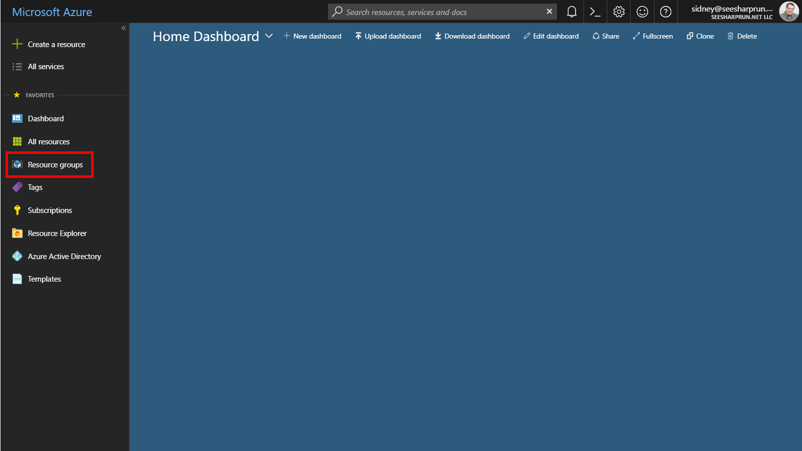

1. In the **Resource groups** blade, locate and select the **LABTRBL** *Resource Group*.

    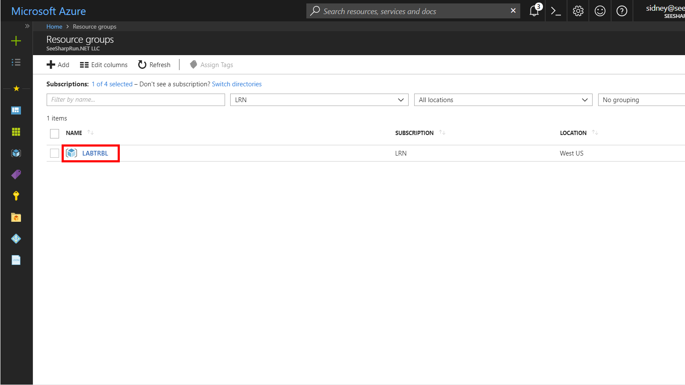

1. In the **LABQURY** blade, select the **Azure Cosmos DB** account you recently created.

    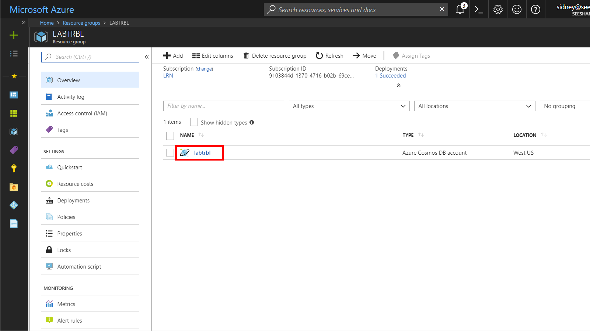

1. In the **Azure Cosmos DB** blade, locate and click the **Overview** link on the left side of the blade.

    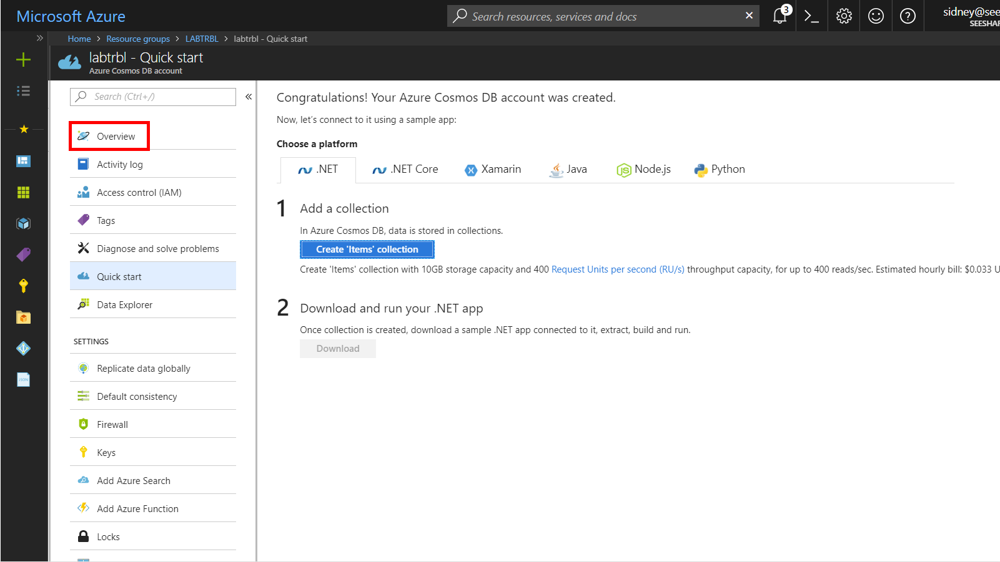

1. At the top of the **Azure Cosmos DB** blade, click the **Add Collection** button.

    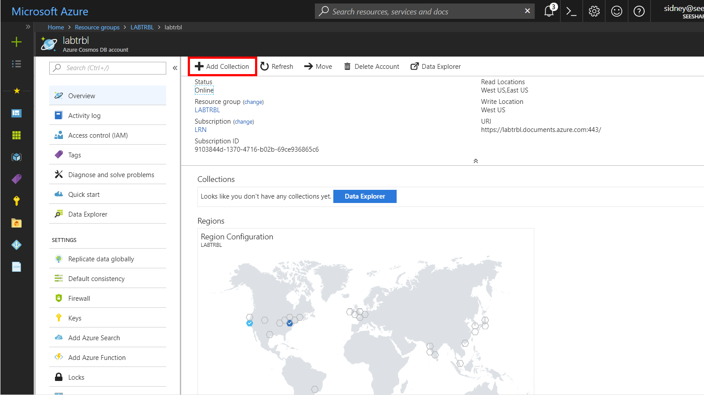

1. In the **Add Collection** popup, perform the following actions:

    1. In the **Database id** field, enter the value **FinancialDatabase**.

    1. In the **Collection id** field, enter the value **TransactionCollection**.

    1. In the **Storage capacity** section, select the **Fixed-Size** option.

    1. In the **Throughput** field, enter the value ``10000``.

    1. Click the **OK** button.

1. Wait for the creation of the new **database** and **collection** to finish before moving on with this lab.

### Retrieve Account Credentials

*The Data Migration Tool and .NET SDKs both require credentials to connect to your Azure Cosmos DB account. You will collect and store these credentials for use throughout the lab.*

1. On the left side of the **Azure Cosmos DB** blade, locate the **Settings** section and click the **Keys** link.

    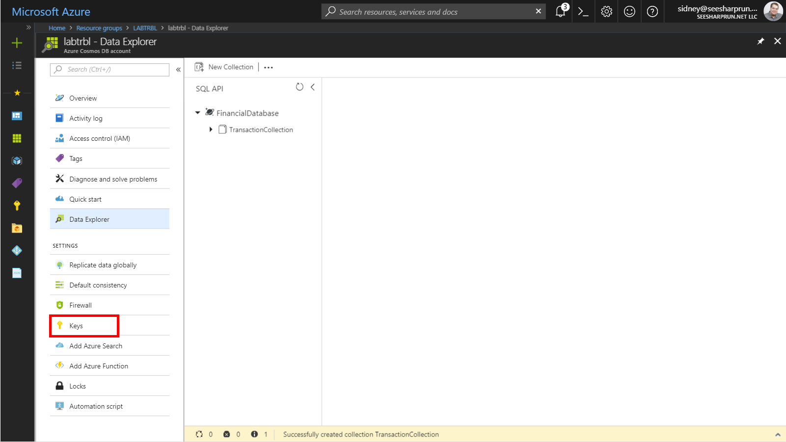

1. In the **Keys** pane, record the values in the **URI** and **PRIMARY KEY** fields. You will use these values later in this lab.

    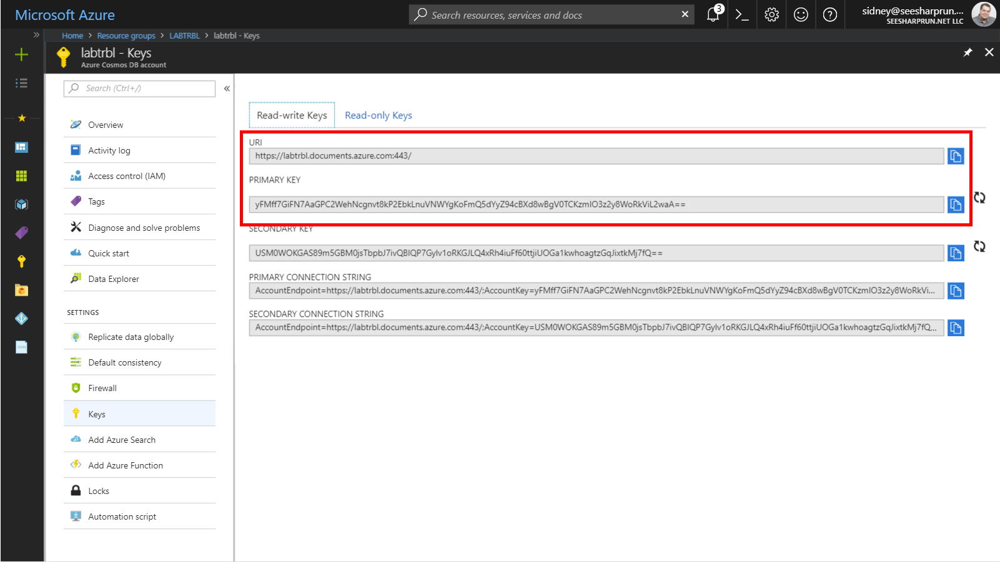

### Import Lab Data Into Collection

*Finally, you will import the JSON documents contained in the **transactions.json** file you downloaded earlier in this lab. You will use the **Data Migration Tool** to import the JSON array stored in the **transactions.json** file from your local machine to your Azure Cosmos DB collection.

1. On your local machine, open the **Azure Cosmos DB Data Migration Tool**.

1. In the **Welcome** step of the tool, click the **Next** button to begin the migration wizard.

    

1. In the **Source Information** step of the tool, perform the following actions:

    1. In the **Import from** list, select the **JSON file(s)** option.

    1. Click the **Add Files** button.

    1. In the *Windows Explorer* dialog that opens, locate and select the **transactions.json** file you downloaded earlier in this lab. Click the **Open** button to add the file.

    1. Select the **Decompress data** checkbox.

    1. Click the **Next** button.

    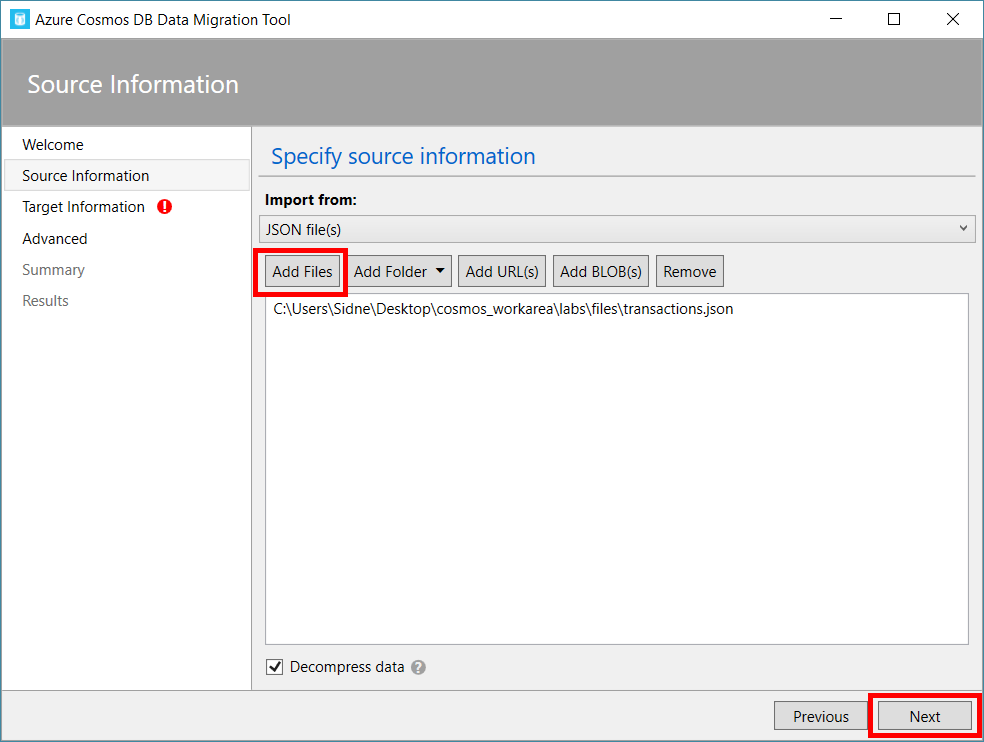

1. In the **Target Information** step of the tool, perform the following actions:

    1. In the **Export to** list, select the **Azure Cosmos DB - Sequential record import (partitioned collection)** option.

    1. In the **Connection String** field, enter a newly constructed connection string replacing the placeholders with values from your Azure Cosmos DB account recorded earlier in this lab: ```AccountEndpoint=[uri];AccountKey=[key];Database=[database name];```. *Make sure you replace the **[uri]**, **[key]**, and **[database name]** placeholders with the corresponding values from your Azure Cosmos DB account. For example, if your **uri** is ``https://cosmosacct.documents.azure.com:443/``, your **key** is ``yFMff7GiFN7AaGPC2WehNcgnvt8kP2EbkLnuVNWYgKoFmQ5dYyZ94cBXd8wBgV0TCKzmIO3z2y8WoRkViL2waA==`` and your **database's name** is ``FinancialDatabase``, then your connection string will look like this: ```AccountEndpoint=https://cosmosacct.documents.azure.com:443/;AccountKey=yFMff7GiFN7AaGPC2WehNcgnvt8kP2EbkLnuVNWYgKoFmQ5dYyZ94cBXd8wBgV0TCKzmIO3z2y8WoRkViL2waA==;Database=FinancialDatabase;```*

    1. Click the **Verify** button to validate your connection string.

    1. In the **Collection** field, enter the value **TransactionCollection**.

    1. In the **Partition Key** field, enter the value ``/costCenter``.

    1. In the **Collection Throughput** field, enter the value ``1000``.

    1. Click the **Next** button.

    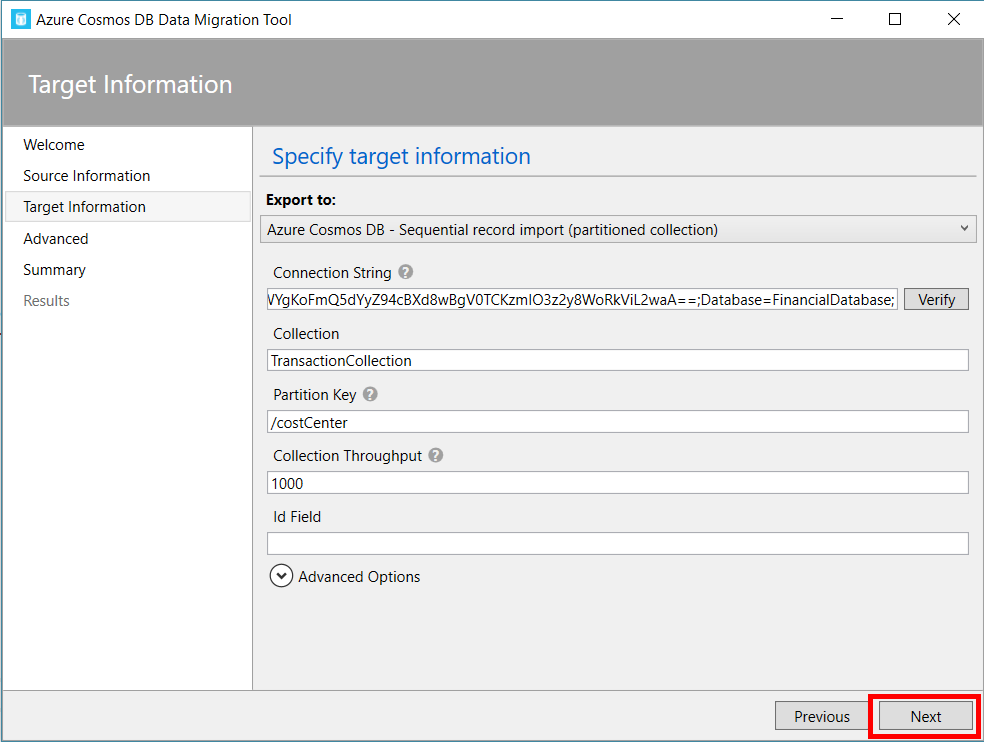

1. In the **Advanced** step of the tool, leave the existing options set to their default values and click the **Next** button.

    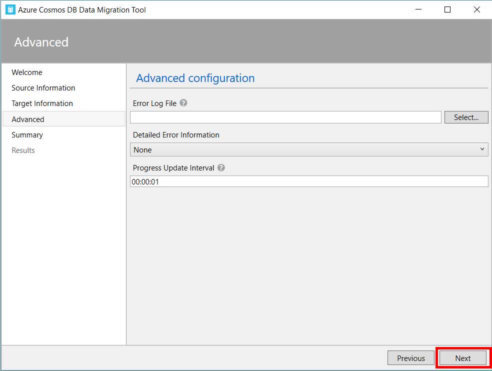

1. In the **Summary** step of the tool, review your options and then click the **Import** button.

    

1. Wait for the import process to complete.

    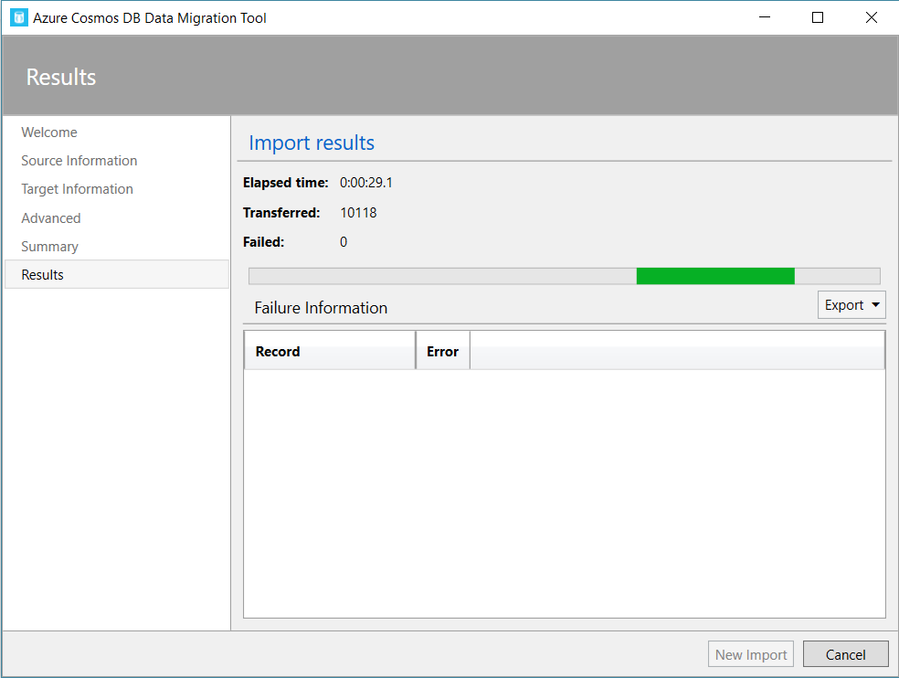

    > You will know that the tool has run successfully once it has transferred 50000 records and the progress bar's animation ends. This step can take two to five minutes.

    

1. Once the import process has completed, close the Azure Cosmos DB Data Migration Tool.

### Create a .NET Core Project

1. On your local machine, create a new folder that will be used to contain the content of your .NET Core project.

1. In the new folder, right-click the folder and select the **Open with Code** menu option.

    

    > Alternatively, you can run a command prompt in your current directory and execute the ``code .`` command.

1. In the Visual Studio Code window that appears, right-click the **Explorer** pane and select the **Open in Command Prompt** menu option.

    

1. In the open terminal pane, enter and execute the following command:

    ```sh
    dotnet new console --output .
    ```

    > This command will create a new .NET Core 2.1 project. The project will be a **console** project and the project will be created in the current directly since you used the ``--output .`` option.

1. Visual Studio Code will most likely prompt you to install various extensions related to **.NET Core** or **Azure Cosmos DB** development. None of these extensions are required to complete the labs.

1. In the terminal pane, enter and execute the following command:

    ```sh
    dotnet add package Microsoft.Azure.DocumentDB.Core --version 1.9.1
    ```

    > This command will add the [Microsoft.Azure.DocumentDB.Core](https://www.nuget.org/packages/Microsoft.Azure.DocumentDB.Core/) NuGet package as a project dependency. The lab instructions have been tested using the ``1.9.1`` version of this NuGet package.

1. In the terminal pane, enter and execute the following command:

    ```sh
    dotnet add package Bogus --version 22.0.8
    ```

    > This command will add the [Bogus](https://www.nuget.org/packages/Bogus/) NuGet package as a project dependency. This library will allow us to quickly generate test data using a fluent syntax and minimal code. We will use this library to generate test documents to upload to our Azure Cosmos DB instance. The lab instructions have been tested using the ``22.0.8`` version of this NuGet package.

1. In the terminal pane, enter and execute the following command:

    ```sh
    dotnet restore
    ```

    > This command will restore all packages specified as dependencies in the project.

1. In the terminal pane, enter and execute the following command:

    ```sh
    dotnet build
    ```

    > This command will build the project.

1. Click the **🗙** symbol to close the terminal pane.

1. Observe the **Program.cs** and **[folder name].csproj** files created by the .NET Core CLI.

    

1. Double-click the **Program.cs** link in the **Explorer** pane to open the file in the editor.

    

### Create DocumentClient Instance

*The DocumentClient class is the main "entry point" to using the SQL API in Azure Cosmos DB. We are going to create an instance of the **DocumentClient** class by passing in connection metadata as parameters of the class' constructor. We will then use this class instance throughout the lab.*

1. Within the **Program.cs** editor tab, Add the following using blocks to the top of the editor:

    ```csharp
    using System.Collections.Generic;
    using System.Collections.ObjectModel;
    using System.Linq;
    using System.Net;
    using System.Threading.Tasks;
    using Microsoft.Azure.Documents;
    using Microsoft.Azure.Documents.Client;
    using Microsoft.Azure.Documents.Linq;
    ```

1. Locate the **Program** class and replace it with the following class:

    ```csharp
    public class Program
    {
        public static void Main(string[] args)
        {         
        }

        private static async Task ExecuteLogic(DocumentClient client)
        {
        }
    }
    ```

1. Within the **Program** class, add the following lines of code to create variables for your connection information:

    ```csharp
    private static readonly Uri _endpointUri = new Uri("");
    private static readonly string _primaryKey = "";
    ```

1. For the ``_endpointUri`` variable, replace the placeholder value with the **URI** value from your Azure Cosmos DB account that you recorded earlier in this lab: 

    > For example, if your **uri** is ``https://cosmosacct.documents.azure.com:443/``, your new variable assignment will look like this: ``private static readonly Uri _endpointUri = new Uri("https://cosmosacct.documents.azure.com:443/");``.

1. For the ``_primaryKey`` variable, replace the placeholder value with the **PRIMARY KEY** value from your Azure Cosmos DB account that you recorded earlier in this lab: 

    > For example, if your **primary key** is ``yFMff7GiFN7AaGPC2WehNcgnvt8kP2EbkLnuVNWYgKoFmQ5dYyZ94cBXd8wBgV0TCKzmIO3z2y8WoRkViL2waA==``, your new variable assignment will look like this: ``private static readonly string _primaryKey = "yFMff7GiFN7AaGPC2WehNcgnvt8kP2EbkLnuVNWYgKoFmQ5dYyZ94cBXd8wBgV0TCKzmIO3z2y8WoRkViL2waA==";``.
    
1. Locate the **Main** method:

    ```csharp
    public static void Main(string[] args)
    { 
    }
    ```

1. Within the **Main** method, add the following lines of code to author a using block that creates and disposes a **DocumentClient** instance:

    ```csharp
    using (DocumentClient client = new DocumentClient(endpointUri, primaryKey))
    {
        
    }
    ```

1. Within the *using* block, add the following line of code to call the static ``ExecuteLogic`` method passing in the ``DocumentClient`` instance and waiting for the asynchronous execution to complete.

    ```csharp
    ExecuteLogic(client).Wait();
    ```

1. Locate the **ExecuteLogic** method:

    ```csharp
    private static async Task ExecuteLogic(DocumentClient client)
    {       
    }
    ```

1. Within the **ExecuteLogic** method, add the following line of code to asynchronously open a connection:

    ```csharp
    await client.OpenAsync();
    ```

1. Your ``Program`` class definition should now look like this:

    ```csharp
    public class Program
    { 
        private static readonly Uri _endpointUri = new Uri("<your uri>");
        private static readonly string _primaryKey = "<your key>";

        public static void Main(string[] args)
        {    
            using (DocumentClient client = new DocumentClient(_endpointUri, _primaryKey))
            {
                ExecuteLogic(client).Wait();
            }
        }

        private static async Task ExecuteLogic(DocumentClient client)
        {  
            await client.OpenAsync();     
        }
    }
    ```

    > We will now execute build the application to make sure our code compiles successfully.

1. Save all of your open editor tabs.

1. In the Visual Studio Code window, right-click the **Explorer** pane and select the **Open in Command Prompt** menu option.

1. In the open terminal pane, enter and execute the following command:

    ```sh
    dotnet build
    ```

    > This command will build the console project.

1. Click the **🗙** symbol to close the terminal pane.

1. Close all open editor tabs.

## Troubleshooting Requests

*First, you will use the .NET SDK to issue request beyond the assigned capacity for a container. You will then observe the throttling of your requests directly in an example application.*

### Reducing R/U Throughput for a Collection

1.

### Observing Throttling (HTTP 429)

1. In the Visual Studio Code window, right-click the **Explorer** pane and select the **New File** menu option.

    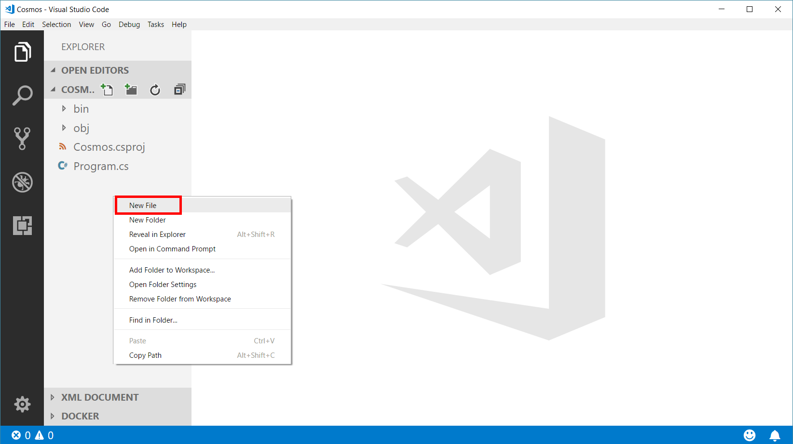

1. Name the new file **Transaction.cs** . The editor tab will automatically open for the new file.

1. Paste in the following code for the ``IInteraction`` interface:

    ```csharp
    public class Transaction
    {
        public double amount { get; set; }
        public bool processed { get; set; }
        public string paidBy { get; set; }
        public string costCenter { get; set; }
    }
    ```

1. Save all of your open editor tabs.

1. In the Visual Studio Code window, right-click the **Explorer** pane and select the **Open in Command Prompt** menu option.

1. In the open terminal pane, enter and execute the following command:

    ```sh
    dotnet build
    ```

    > This command will build the console project.

1. Click the **🗙** symbol to close the terminal pane.

1. Close all open editor tabs.

1. Double-click the **Program.cs** link in the **Explorer** pane to open the file in the editor.

1. Locate the **ExecuteLogic** method and delete any existing code:

    ```csharp
    private static async Task ExecuteLogic(DocumentClient client)
    {       
    }
    ```

1. Add the following code to the method to create an asynchronous connection:

    ```csharp
    await client.OpenAsync();
    ```
    
1. Add the following line of code to create a variable named ``collectionLink`` that is a reference (self-link) to an existing collection:

    ```csharp
    Uri collectionSelfLink = UriFactory.CreateDocumentCollectionUri("FinancialDatabase", "TransactionCollection");
    ```

1. Observe the code in the **ExecuteLogic** method.

    > For the next few instructions, we will use the **Bogus** library to create test data. This library allows you to create a collection of objects with fake data set on each object's property. For this lab, our intent is to **focus on Azure Cosmos DB** instead of this library. With that intent in mind, the next set of instructions will expedite the process of creating test data.

1. Add the following code to create a collection of ``Transaction`` instances:

    ```csharp
    var transactions = new Bogus.Faker<Transaction>()
        .RuleFor(t => t.amount, (fake) => Math.Round(fake.Random.Double(5, 500), 2))
        .RuleFor(t => t.processed, (fake) => fake.Random.Bool(0.6f))
        .RuleFor(t => t.paidBy, (fake) => $"{fake.Name.FirstName().ToLower()}.{fake.Name.LastName().ToLower()}")
        .RuleFor(t => t.costCenter, (fake) => fake.Commerce.Department(1).ToLower())
        .GenerateLazy(1000);
    ```

    > As a reminder, the Bogus library generates a set of test data. In this example, you are creating 1000 items using the Bogus library and the rules listed above. The **GenerateLazy** method tells the Bogus library to prepare for a request of 1000 items by returning a variable of type **IEnumerable<Transaction>**. Since LINQ uses deferred execution by default, the items aren't actually created until the collection is iterated.
    
1. Add the following foreach block to iterate over the ``PurchaseFoodOrBeverage`` instances:

    ```csharp
    foreach(var transaction in transactions)
    {
    }
    ```

1. Within the ``foreach`` block, add the following line of code to asynchronously create a document and save the result of the creation task to a variable:

    ```csharp
    ResourceResponse<Document> result = await client.CreateDocumentAsync(collectionSelfLink, transaction);
    ```

    > The ``CreateDocumentAsync`` method of the ``DocumentClient`` class takes in a self-link for a collection and an object that you would like to serialize into JSON and store as a document within the specified collection.

1. Still within the ``foreach`` block, add the following line of code to write the value of the newly created resource's ``id`` property to the console:

    ```csharp
    await Console.Out.WriteLineAsync($"Document Created\t{result.Resource.Id}");
    ```

    > The ``ResourceResponse`` type has a property named ``Resource`` that can give you access to interesting data about a document such as it's unique id, time-to-live value, self-link, ETag, timestamp,  and attachments.

1. Your **ExecuteLogic** method should look like this:

    ```csharp
    private static async Task ExecuteLogic(DocumentClient client)
    {
        await client.OpenAsync();  
        Uri collectionSelfLink = UriFactory.CreateDocumentCollectionUri("FinancialDatabase", "TransactionCollection");
        var transactions = new Bogus.Faker<Transaction>()
            .RuleFor(t => t.amount, (fake) => Math.Round(fake.Random.Double(5, 500), 2))
            .RuleFor(t => t.processed, (fake) => fake.Random.Bool(0.6f))
            .RuleFor(t => t.paidBy, (fake) => $"{fake.Name.FirstName().ToLower()}.{fake.Name.LastName().ToLower()}")
            .RuleFor(t => t.costCenter, (fake) => fake.Commerce.Department(1).ToLower())
            .GenerateLazy(500);
        foreach(var transaction in transactions)
        {
            ResourceResponse<Document> result = await client.CreateDocumentAsync(collectionSelfLink, transaction);
            await Console.Out.WriteLineAsync($"Document Created\t{result.Resource.Id}");
        }            
    }
    ```

    > As a reminder, the Bogus library generates a set of test data. In this example, you are creating 1000 items using the Bogus library and the rules listed above. The **GenerateLazy** method tells the Bogus library to prepare for a request of 500 items by returning a variable of type **IEnumerable<Transaction>**. Since LINQ uses deferred execution by default, the items aren't actually created until the collection is iterated. The **foreach** loop at the end of this code block iterates over the collection and creates documents in Azure Cosmos DB.

1. Save all of your open editor tabs.

1. In the Visual Studio Code window, right-click the **Explorer** pane and select the **Open in Command Prompt** menu option.

1. In the open terminal pane, enter and execute the following command:

    ```sh
    dotnet run
    ```

    > This command will build and execute the console project.

1. Observe the output of the console application.

    > You should see a list of document ids associated with new documents that are being created by this tool.

1. Click the **🗙** symbol to close the terminal pane.

1. Back in the code editor tab, locate the following lines of code:

    ```csharp
    foreach(var transaction in transactions)
    {
        ResourceResponse<Document> result = await client.CreateDocumentAsync(collectionSelfLink, transaction);
        await Console.Out.WriteLineAsync($"Document Created\t{result.Resource.Id}");
    } 
    ```

    Replace those lines of code with the following code:

    ```csharp
    List<Task<ResourceResponse<Document>>> tasks = new List<Task<ResourceResponse<Document>>>();
    foreach(var transaction in transactions)
    {
        Task<ResourceResponse<Document>> resultTask = client.CreateDocumentAsync(collectionSelfLink, transaction);
        tasks.Add(resultTask);
    }    
    Task.WaitAll(tasks.ToArray());
    foreach(var task in tasks)
    {
        await Console.Out.WriteLineAsync($"Document Created\t{task.Result.Resource.Id}");
    }  
    ```

    > We are going to attempt to run as many of these creation tasks in parallel as possible. Remember, our collection is configured at 1,000 RU/s.

1. Your **ExecuteLogic** method should look like this:

    ```csharp
    private static async Task ExecuteLogic(DocumentClient client)
    {
        await client.OpenAsync();  
        Uri collectionSelfLink = UriFactory.CreateDocumentCollectionUri("FinancialDatabase", "TransactionCollection");
        var transactions = new Bogus.Faker<Transaction>()
            .RuleFor(t => t.amount, (fake) => Math.Round(fake.Random.Double(5, 500), 2))
            .RuleFor(t => t.processed, (fake) => fake.Random.Bool(0.6f))
            .RuleFor(t => t.paidBy, (fake) => $"{fake.Name.FirstName().ToLower()}.{fake.Name.LastName().ToLower()}")
            .RuleFor(t => t.costCenter, (fake) => fake.Commerce.Department(1).ToLower())
            .GenerateLazy(500);
        List<Task<ResourceResponse<Document>>> tasks = new List<Task<ResourceResponse<Document>>>();
        foreach(var transaction in transactions)
        {
            Task<ResourceResponse<Document>> resultTask = client.CreateDocumentAsync(collectionSelfLink, transaction);
            tasks.Add(resultTask);
        }    
        Task.WaitAll(tasks.ToArray());
        foreach(var task in tasks)
        {
            await Console.Out.WriteLineAsync($"Document Created\t{task.Result.Resource.Id}");
        }             
    }
    ```

    > As a reminder, the Bogus library generates a set of test data. In this example, you are creating 1000 items using the Bogus library and the rules listed above. The **GenerateLazy** method tells the Bogus library to prepare for a request of 500 items by returning a variable of type **IEnumerable<Transaction>**. Since LINQ uses deferred execution by default, the items aren't actually created until the collection is iterated. The **foreach** loops at the end of this code block iterates over the collection and creates asynchronous tasks. Each asynchronous task will issue a request to Azure Cosmos DB. These requests are issued in parallel and should cause an exceptional scenario since your collection does not have enough assigned throughput to handle the volume of requests.

1. Save all of your open editor tabs.

1. In the Visual Studio Code window, right-click the **Explorer** pane and select the **Open in Command Prompt** menu option.

1. In the open terminal pane, enter and execute the following command:

    ```sh
    dotnet run
    ```

    > This command will build and execute the console project.

1. Observe the output of the console application.

    > This query should execute successfully. We are only creating 500 documents and we most likely will not run into any throughput issues here.

1. Click the **🗙** symbol to close the terminal pane.

1. Back in the code editor tab, locate the following line of code:

    ```csharp
    .GenerateLazy(500);
    ```

    Replace that line of code with the following code:

    ```csharp
    .GenerateLazy(5000);
    ```

    > We are going to try and create 5000 documents in parallel to see if we can hit out throughput limit.

1. Save all of your open editor tabs.

1. In the Visual Studio Code window, right-click the **Explorer** pane and select the **Open in Command Prompt** menu option.

1. In the open terminal pane, enter and execute the following command:

    ```sh
    dotnet run
    ```

    > This command will build and execute the console project.

1. Observe that the application will crash.

    > This query will most likely hit our throughput limit. You will see multiple error messages indicating that specific requests have failed.

1. Click the **🗙** symbol to close the terminal pane.

## Use .NET SDK to Tune Request Performance

*You will now tune your requests to Azure Cosmos DB by manipulating properties of the **FeedOptions** class in the .NET SDK.*

### Measuing RU Charge

1. Locate the **ExecuteLogic** method and delete any existing code:

    ```csharp
    private static async Task ExecuteLogic(DocumentClient client)
    {       
    }
    ```

1. Add the following code to the method to create an asynchronous connection:

    ```csharp
    await client.OpenAsync();
    ```

1. Add the following code to the method to create a self-link to an existing collection:

    ```csharp
    Uri collectionSelfLink = UriFactory.CreateDocumentCollectionUri("FinancialDatabase", "TransactionCollection");
    ```

1. Add the following lines of code to configure options for a query:

    ```csharp
    FeedOptions options = new FeedOptions
    {
        EnableCrossPartitionQuery = true,
        PopulateQueryMetrics = true
    };
    ```

1. Add the following line of code that will store a SQL query in a string variable:

    ```csharp
    string sql = "SELECT TOP 1000 * FROM c WHERE c.processed = true ORDER BY c.amount DESC";
    ```

    > This query will perform a cross-partition ORDER BY and only return the top 1000 out of 50000 documents.

1. Add the following line of code to create a document query instance:

    ```csharp
    IDocumentQuery<Document> query = client.CreateDocumentQuery<Document>(collectionSelfLink, sql, options).AsDocumentQuery();
    ```

1. Add the following line of code to get the first "page" of results:

    ```csharp
    var result = await query.ExecuteNextAsync();
    ```

    > We will not enumerate the full result set. We are only interested in the metrics for the first page of results.

1. Add the following lines of code to print out all of the query metrics to the console:

    ```csharp
    foreach(string key in result.QueryMetrics.Keys)
    {
        await Console.Out.WriteLineAsync($"{key}\t{result.QueryMetrics[key]}");
    }
    ```

1. Save all of your open editor tabs.

1. In the Visual Studio Code window, right-click the **Explorer** pane and select the **Open in Command Prompt** menu option.

1. In the open terminal pane, enter and execute the following command:

    ```sh
    dotnet run
    ```

    > This command will build and execute the console project.

1. Observe the output of the console application.

    > You should see multiple metrics printed out in your console window. Pay close attention to the **Total Query Execution Time**, **Request Charge** and **Retrieved Document Size** metrics.

1. Click the **🗙** symbol to close the terminal pane.

1. Back in the code editor tab, locate the following line of code:

    ```csharp
    string sql = "SELECT TOP 1000 * FROM c WHERE c.processed = true ORDER BY c.amount DESC";
    ```

    Replace that line of code with the following code:

    ```csharp
    string sql = "SELECT * FROM c WHERE c.processed = true";
    ```

    > This new query does not perform a cross-partition ORDER BY.

1. Save all of your open editor tabs.

1. In the Visual Studio Code window, right-click the **Explorer** pane and select the **Open in Command Prompt** menu option.

1. In the open terminal pane, enter and execute the following command:

    ```sh
    dotnet run
    ```

    > This command will build and execute the console project.

1. Observe the output of the console application.

    > You should see a reduction in both the **Request Charge** and **Total Query Execution Time** values.

1. Back in the code editor tab, locate the following line of code:

    ```csharp
    string sql = "SELECT * FROM c WHERE c.processed = true";
    ```

    Replace that line of code with the following code:

    ```csharp
    string sql = "SELECT * FROM c";
    ```

    > This new query does not filter the result set.

1. Save all of your open editor tabs.

1. In the Visual Studio Code window, right-click the **Explorer** pane and select the **Open in Command Prompt** menu option.

1. In the open terminal pane, enter and execute the following command:

    ```sh
    dotnet run
    ```

    > This command will build and execute the console project.

1. Observe the output of the console application.

    > Observe the slight differences in the various metric values.

1. Back in the code editor tab, locate the following line of code:

    ```csharp
    string sql = "SELECT * FROM c";
    ```

    Replace that line of code with the following code:

    ```csharp
    string sql = "SELECT c.id FROM c";
    ```

    > This new query does not filter the result set.

1. Save all of your open editor tabs.

1. In the Visual Studio Code window, right-click the **Explorer** pane and select the **Open in Command Prompt** menu option.

1. In the open terminal pane, enter and execute the following command:

    ```sh
    dotnet run
    ```

    > This command will build and execute the console project.

1. Observe the output of the console application.

    > Observe the slight differences in the various metric values.

### Managing SDK Query Options

1. Locate the **ExecuteLogic** method and delete any existing code:

    ```csharp
    private static async Task ExecuteLogic(DocumentClient client)
    {       
    }
    ```

1. Add the following code to the method to create an asynchronous connection:

    ```csharp
    await client.OpenAsync();
    ```

1. Add the following code to the method to create a self-link to an existing collection:

    ```csharp
    Uri collectionSelfLink = UriFactory.CreateDocumentCollectionUri("FinancialDatabase", "TransactionCollection");
    ```

1. Add the following line of code to create a high-precision timer:

    ```csharp
    Stopwatch timer = new Stopwatch();
    ```

1. Add the following lines of code to configure options for a query:

    ```csharp
    FeedOptions options = new FeedOptions
    {
        EnableCrossPartitionQuery = true,
        MaxItemCount = 100,
        MaxDegreeOfParallelism = 0,
        MaxBufferedItemCount = 0
    }; 
    ```

1. Add the following lines of code to write various values to the console window:

    ```csharp
    await Console.Out.WriteLineAsync($"MaxItemCount:\t{options.MaxItemCount}");
    await Console.Out.WriteLineAsync($"MaxDegreeOfParallelism:\t{options.MaxDegreeOfParallelism}");
    await Console.Out.WriteLineAsync($"MaxBufferedItemCount:\t{options.MaxBufferedItemCount}");
    ```

1. Add the following line of code that will store a SQL query in a string variable:

    ```csharp
    string sql = "SELECT * FROM c WHERE c.processed = true ORDER BY c.amount DESC";
    ```

    > This query will perform a cross-partition ORDER BY on a filtered result set.

1. Add the following line of code to start the timer:

    ```csharp
    timer.Start();
    ```

1. Add the following line of code to create a document query instance:

    ```csharp
    IDocumentQuery<Document> query = client.CreateDocumentQuery<Document>(collectionSelfLink, sql, options).AsDocumentQuery();
    ```

1. Add the following lines of code to enumerate the result set.

    ```csharp
    while (query.HasMoreResults)  
    {
        var result = await query.ExecuteNextAsync<Document>();
    }
    ```

    > Since the results are paged, we will need to call the ``ExecuteNextAsync`` method multiple times in a while loop.

1. Add the following line of code stop the timer:

    ```csharp
    timer.Stop();
    ```

1. Add the following line of code to write the timer's results to the console window:

    ```csharp
    await Console.Out.WriteLineAsync($"Elapsed Time:\t{timer.Elapsed.TotalSeconds}");
    ```

1. Save all of your open editor tabs.

1. In the Visual Studio Code window, right-click the **Explorer** pane and select the **Open in Command Prompt** menu option.

1. In the open terminal pane, enter and execute the following command:

    ```sh
    dotnet run
    ```

    > This command will build and execute the console project.

1. Observe the output of the console application.

    > This initial query should take an unexpectedly long amount of time. This will require us to optimize our SDK options.

1. Back in the code editor tab, locate the following line of code:

    ```csharp
    FeedOptions options = new FeedOptions
    {
        EnableCrossPartitionQuery = true,
        MaxItemCount = 100,
        MaxDegreeOfParallelism = 0,
        MaxBufferedItemCount = 0
    }; 
    ```

    Replace that line of code with the following code:

    ```csharp
    FeedOptions options = new FeedOptions
    {
        EnableCrossPartitionQuery = true,
        MaxItemCount = 100,
        MaxDegreeOfParallelism = -1,
        MaxBufferedItemCount = -1
    };   
    ```

    > Setting the ``MaxDegreeOfParallelism`` and ``MaxBufferedItemCount`` properties to a value of ``-1`` effectively tells the SDK to manage these settings.

1. Save all of your open editor tabs.

1. In the Visual Studio Code window, right-click the **Explorer** pane and select the **Open in Command Prompt** menu option.

1. In the open terminal pane, enter and execute the following command:

    ```sh
    dotnet run
    ```

    > This command will build and execute the console project.

1. Observe the output of the console application.

    > Depending on your system, the elapsed time may be unchanged.

1. Back in the code editor tab, locate the following line of code:

    ```csharp
    FeedOptions options = new FeedOptions
    {
        EnableCrossPartitionQuery = true,
        MaxItemCount = 100,
        MaxDegreeOfParallelism = -1,
        MaxBufferedItemCount = -1
    };     
    ```

    Replace that line of code with the following code:

    ```csharp
    FeedOptions options = new FeedOptions
    {
        EnableCrossPartitionQuery = true,
        MaxItemCount = 500,
        MaxDegreeOfParallelism = -1,
        MaxBufferedItemCount = -1
    };   
    ```

    > We are increasing the amount of items returned per "page" in an attempt to improve the performance of the query.

1. Save all of your open editor tabs.

1. In the Visual Studio Code window, right-click the **Explorer** pane and select the **Open in Command Prompt** menu option.

1. In the open terminal pane, enter and execute the following command:

    ```sh
    dotnet run
    ```

    > This command will build and execute the console project.

1. Observe the output of the console application.

    > You will notice that the query performance improved dramatically. This may be an indicator that our query was bottlenecked by the client computer.

1. Back in the code editor tab, locate the following line of code:

    ```csharp
    FeedOptions options = new FeedOptions
    {
        EnableCrossPartitionQuery = true,
        MaxItemCount = 500,
        MaxDegreeOfParallelism = -1,
        MaxBufferedItemCount = -1
    };   
    ```

    Replace that line of code with the following code:

    ```csharp
    FeedOptions options = new FeedOptions
    {
        EnableCrossPartitionQuery = true,
        MaxItemCount = 1000,
        MaxDegreeOfParallelism = -1,
        MaxBufferedItemCount = -1
    }; 
    ```

    > For large queries, it is recommended that you increase the page size up to a value of 1000.

1. Save all of your open editor tabs.

1. In the Visual Studio Code window, right-click the **Explorer** pane and select the **Open in Command Prompt** menu option.

1. In the open terminal pane, enter and execute the following command:

    ```sh
    dotnet run
    ```

    > This command will build and execute the console project.

1. Observe the output of the console application.

    > By increasing the page size, you have sped up the query even more.

1. Back in the code editor tab, locate the following line of code:

    ```csharp
    FeedOptions options = new FeedOptions
    {
        EnableCrossPartitionQuery = true,
        MaxItemCount = 1000,
        MaxDegreeOfParallelism = -1,
        MaxBufferedItemCount = -1
    }; 
    ```

    Replace that line of code with the following code:

    ```csharp
    FeedOptions options = new FeedOptions
    {
        EnableCrossPartitionQuery = true,
        MaxItemCount = 1000,
        MaxDegreeOfParallelism = -1,
        MaxBufferedItemCount = 50000
    };  
    ```

    > Setting MaxBufferedItemCount to the expected number of results returned (or a higher number) allows the query to receive maximum benefit from pre-fetching.

1. Save all of your open editor tabs.

1. In the Visual Studio Code window, right-click the **Explorer** pane and select the **Open in Command Prompt** menu option.

1. In the open terminal pane, enter and execute the following command:

    ```sh
    dotnet run
    ```

    > This command will build and execute the console project.

1. Observe the output of the console application.

    > This change should have decreased your query time by a small amount.

1. Click the **🗙** symbol to close the terminal pane.

1. Close all open editor tabs.

1. Close the Visual Studio Code application.

1. Close your browser application.